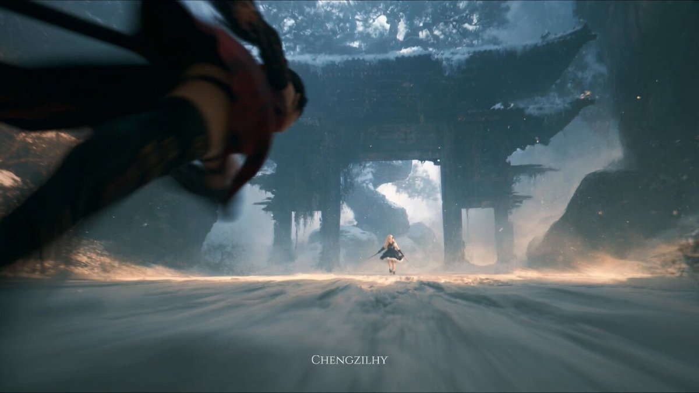

# Seedance 2.5 · Prompt Library · Leadde.ai

[](README.md) [](README_zh.md) [](README_zh-TW.md) [](README_ja-JP.md) [](README_ko-KR.md) [](README_th-TH.md) [](README_vi-VN.md) [](README_hi-IN.md) [](README_es-ES.md) [-lightgrey)](README_es-419.md) [](README_de-DE.md) [](README_fr-FR.md) [](README_it-IT.md) [-lightgrey)](README_pt-BR.md) [](README_pt-PT.md) [](README_tr-TR.md)

**Best for:** Seedance prompts for motion, camera language, cinematic scenes, product videos, and short-form creative.

For PDF, PPT, SOP, training, and multilingual video workflows:
[Awesome Document-to-Video](https://github.com/LeaddeOpenLab/awesome-document-to-video)

> **High-quality prompts, curated daily**

Discover complete prompts for AI images, videos and 3D creation. Browse by style, explore multilingual editions and credit the original creators.

[Explore Leadde.ai →](https://leadde.ai/?utm_source=github&utm_medium=readme&utm_campaign=prompt-library&utm_content=seedance2.5)

## Meet Leadde.ai

Leadde.ai helps teams turn documents, slides and text into AI business videos for training, onboarding and marketing.

Star this repository to follow our daily prompt curation and find fresh creative ideas.

**47** Prompts · Latest addition: **2026-09-11**

<a name="catalog"></a>

## Browse by Category

[Photography](#category-photography) · [Cinematic / Film Still](#category-cinematic-film-still) · [3D Render](#category-3d-render) · [Cyberpunk / Sci-Fi](#category-cyberpunk-sci-fi) · [Other](#category-other)

<a name="all-prompts"></a>

<a name="category-photography"></a>

## Photography

<a name="prompt-2097837460910956650"></a>

### A university classroom scene shot from a first-person smartphone perspective, where a student holding the camera uses reference images on a foreground phone to remotely change a female professor's outfits in real time, accompanied by spoken dialogue and physical reactions.

Author：[@john87445528](https://x.com/john87445528) · [Source](https://x.com/john87445528/status/2097837460910956650)

Photography · Character · Fashion Item · Published

**Summary:** A university classroom scene shot from a first-person smartphone perspective, where a student holding the camera uses reference images on a foreground phone to remotely change a female professor's outfits in real time, accompanied by spoken dialogue and physical reactions.


**Prompt**

```text
Scene Prefix (Shared between both parts; the second part only adds a continuation sentence)
Presented in the style of raw, unedited handheld footage shot with an iPhone primary camera in vertical orientation; all camera settings are on automatic, with no post-color grading, no cinematic camera movements, and no extreme background bokeh. 9:16 aspect ratio. The cameraperson sits in an aisle seat in the second row of an ordinary university classroom, featuring adult students and an adult female professor. The right hand holds the recording smartphone below chest level, while the left hand holds up another smartphone displaying clothing references. The lower-right corner of the frame is continuously and partially occupied by this reference phone: its screen faces toward the recording lens with moderate brightness and slightly blurred edges, yet the full-body silhouette and color scheme of the current preset remain clearly identifiable. The composition is a covert, first-person seat perspective: in the foreground on the left, a student is taking notes; in the front row on the right, a student looks at the whiteboard while their desk partner looks down at a textbook; the shoulders and backs of front-row students occasionally cut into the lower edge of the frame without blocking the professor or the whiteboard. Because both hands are holding phones, the footage carries constant slight hand tremors, breathing fluctuations, and brief tilts caused by thumb swiping/tapping. Autofocus repeatedly hunts between the nearby reference screen, the distant professor's clothing, and the writing on the whiteboard, briefly losing focus before locking on. Auto white balance drifts slightly between cool and slightly warm following the natural light from the window and the classroom ceiling lights. Retains brief window-light overexposure, chromatic aberration (purple/green fringing) along the edges, and realistic motion blur. In-frame ambient sound only: close-mic breath sounds and system notifications, lecturing sound from a few meters away with classroom reverberation, and persistent sounds of ventilation, writing, turning pages, and subtle chair creaks. The purple-white scan is the only surreal element.

Part 1 | 0–12 Seconds
Presented in the style of raw, unedited handheld footage shot with an iPhone primary camera in vertical orientation; all camera settings are on automatic, with no post-color grading, no cinematic camera movements, and no extreme background bokeh. Generate a 12-second, 9:16 vertical, realistic smartphone video-style fictional classroom outfit-change short video. The location is an ordinary university classroom; both the professor and students are adults. Mixed illumination from natural window light and classroom ceiling lights. An adult female professor lectures beside the whiteboard on "Correlation and Causation"; "相关 ≠ 因果" and a simple scatter plot are pre-written on the whiteboard, with the text and diagrams remaining completely stable throughout, neither drifting nor being redrawn. The professor wears the initial outfit from the opening frame; her face, facial features, hairstyle, figure, and identity remain consistent throughout. The camera angle comes from a student seated in the second row by the aisle, holding the recording device below chest level with the right hand and holding another phone in the left hand. This second phone continuously appears in the lower-right corner of the frame, screen facing the lens, currently displaying the full-body reference for Preset #1. The screen brightness is moderate, style and color scheme are recognizable, without excessive blur. In the foreground left, a student takes notes; in the front row right, a student watches the whiteboard while their desk partner looks down at a textbook. Character positions are fixed. Normal playback speed, slight handheld swaying, no background music.
At 0 seconds, the professor turns sideways to look at the whiteboard, gesturing toward "相关 ≠ 因果" with her free right hand, then turns back toward the students. Autofocus pauses for half a beat on the foreground reference screen before pulling to the professor's upper body and the whiteboard text; the frame gently rises and falls with seated breathing, slightly tilting to the right. Ventilation hum and writing sounds enter the microphone simultaneously.
At 1.5 seconds, the professor naturally says: "Just because two phenomena appear together doesn't mean one caused the other." Her tone is calm, featuring natural pauses of everyday lecturing, her gaze sweeping across the front row without staring at the camera. The student on the left continues taking notes; the student on the right glances at the whiteboard before looking back down at their book. The foreground phone steadily displays Preset #1. Her lecturing voice comes from a few meters away, carrying classroom reverb.
At 3.5 seconds, the student holding the camera gently taps the screen with their left thumb; the tap causes both the reference phone and the recording phone to jolt slightly together. A brief electronic notification chime sounds close to the mic; a restrained purple-white scanning beam sweeps downward starting from the professor's shoulders, seamlessly replacing the initial outfit with Preset #1 in a single fluid transition, without naked intermediate frames or extraneous unprovided accessories. The professor first glances toward the front row, then feels the fabric change; her speech cuts off, she looks down at herself, gently pinches the fabric at her side, and lets out a puzzled: "Huh?" The lighting effect dissipates immediately without obscuring her face. During the scan, window highlights cause the frame to brighten slightly, and auto exposure compensates down; autofocus is momentarily pulled away by the light beam and fabric texture, locking back onto the professor after half a second.
At 5 seconds, the professor raises her eyes and pauses for a moment, seemingly wanting to finish the lecture first, gesturing toward the whiteboard again: "Let's continue looking at... there are other factors." Midway through speaking, she briefly looks down at her clothes again, then turns her gaze back to the class, struggling to maintain the lecture. The student taking notes on the left looks up half a beat late, pen tip resting on the paper; their desk partner follows their gaze, softly asking: "What's wrong?" Other students continue reading their books for now. The cameraperson's breath hitches; the lens sinks slightly and then levels out, without changing camera elevation.
At 8 seconds, the professor naturally rests both hands in front of her waist, preparing to continue explaining. The foreground thumb swipes once; the phone clearly switches to Preset #2 and stays steady. During the swipe, the frame briefly tilts to the right; autofocus is stolen by the new reference image, causing the professor to become momentarily blurry. The student on the right looks at the professor, then turns their head slightly to look at their desk partner with a slight furrow of the brow, without an exaggerated open mouth. At this moment, the professor is still wearing Preset #1.
At 9.5 seconds, a second electronic chime sounds; the purple-white scanning light completely replaces Preset #1 with Preset #2, leaving behind no accessories from the previous outfit. The professor looks down, her hands moving slightly away from the clothes, shoulders tensing, as she blurts out: "Wait a second..." The student in the front row on the right sits up straight, their chair producing a very soft scraping sound. After the scan finishes, focus settles once again on the professor's face and the fabric of Preset #2.
At 11 seconds, the professor is still standing beside the whiteboard, looking down at Preset #2 on her body, her right hand gently pressing against the fabric at her waist, left hand resting in front of her. The foreground phone still displays Preset #2. The lens maintains its original height and framing, slight hand tremor remains, with no cut to black, no transition, and no push-in. The sound of writing pauses for a beat while the ventilation hum continues. This segment ends directly on this continuous state.
Realism and Mandatory Constraints: Continuous single take within this segment. Across the three transformations, this segment only completes "Initial Outfit → #1 → #2". Strictly forbidden: nude transitions, transparent clothing, body close-ups, exaggerated bright scanning flashes, slow motion, background music, synchronized head-turning by the whole class, camera moving away from the seat, reference images skipping numbers, whiteboard text redrawing, and limb deformities.
The footage must display an authentic, unedited handheld video texture with documentary-grade natural imperfections, free of any post-grading or artificial CGI effects. All camera behavior must conform to the physical properties of automatic iPhone/smartphone shooting.

Part 2 | 12–24 Seconds
Presented in the style of raw, unedited handheld footage shot with an iPhone primary camera in vertical orientation; all camera settings are on automatic, with no post-color grading, no cinematic camera movements, and no extreme background bokeh. This segment strictly continues from the very last frame of the previous segment: the professor still stands beside the whiteboard, already dressed in Preset #2, her right hand gently pressing the waist fabric and left hand resting in front of her; the foreground reference phone still displays Preset #2; the student on the left has their pen resting on paper, their desk partner is already looking at the professor, and the student on the right is sitting upright. No restarting the scene, no resetting the outfit, no putting the professor back into her initial lecturing pose. 9:16 aspect ratio, first-person perspective from the exact same seat, right hand holding the recording phone below chest level, left hand holding the reference phone continuously occupying the lower-right corner of the frame. The "相关 ≠ 因果" text and scatter plot on the whiteboard remain unchanged in position. Mixed lighting from window daylight and ceiling fixtures, normal speed, no background music.
At 12 seconds, the professor shifts her gaze from looking down at her clothes up toward the front row, looking bewildered, her tone uncertain: "Did you see that too?" Due to her head-raising movement, the camera gently shakes with the subtle upper-body motion of the cameraperson; autofocus pulls from the waist fabric to the professor's face, softening briefly before sharpening.
At 13 seconds, the student on the left nods slightly and replies softly: "Professor, your clothes changed." The voice is close and hushed. Their desk partner closes a half-open textbook, eyes fixed on the professor's face. Brief whispering comes from the back rows at very low volume, not drowning out this dialogue. The microphone captures the close reply more clearly, while distant whispers remain muffled.
At 14.5 seconds, the professor takes a breath, attempting to compose herself, her gaze sweeping from the front row toward the aisle, without starting any new lesson content. The foreground thumb swipes; the phone switches to Preset #3 and clearly stays there. The professor is still wearing Preset #2 at this moment. The swiping causes a brief tilt in the frame, and autofocus locks onto the new reference image for about half a second. The desk partner looks first at the screen, then at the professor, their expression gradually realizing the two are connected.
At 16 seconds, the student taps the screen; a third electronic chime sounds close to the microphone, and a restrained purple-white scan precisely replaces Preset #2 with Preset #3, leaving behind no elements from #1 or #2. The professor's face, hairstyle, standing position, and body proportions remain unchanged; occlusion relationships between arms and fabric are natural, with no nude intermediate frames. The professor's shoulders pull in, she takes a sharp breath, and looks down to check. Once the light effect vanishes, no further outfit changes occur; the phone consistently stays on Preset #3. During the scan, exposure slightly rises and then settles back down.
At 17.5 seconds, the professor crosses one forearm defensively across the outside of her chest clothing, while her other hand presses down the front hem of her skirt; if Preset #3 consists of trousers or a jumpsuit, she covers her lower abdomen instead, without generating non-existent skirts. The clothing remains completely covering at all times. She takes a small step toward the side-rear of the podium, shoulders hunched inward. To keep up with her sideways shift, the cameraperson's wrist instinctively adjusts, causing the frame to slightly sway along while firmly staying in the original seat perspective; her lower body gradually becomes partially obscured by the podium.
At 18.5 seconds, the student on the right immediately looks away, looking down at their desk; the student on the left puts down their pen, looking at her with concern. The desk partner turns toward the cameraperson and whispers in a low voice: "Stop doing that." Background whispers diminish accordingly; no burst of laughter or collective gawking occurs. The nearby "Stop doing that" is close to the mic, and the rustle of the professor's clothing is audible.
At 20 seconds, the professor stops behind the side of the podium, which blocks part of her lower body. Still shielding her chest and hemline, her cheeks slightly flushed, she raises her eyes and notices the recording device, her voice anxious: "Please don't film right now, okay?" After speaking, she presses her lips together slightly and lowers her gaze, remaining flustered and embarrassed, without dramatic crying. Autofocus locks onto her face as she looks up toward the lens; the foreground reference phone continues to display #3 in the lower-right corner, competing slightly for depth of field but not blurring out the professor.
At 22 seconds, hearing the professor's words, the cameraperson's wrist drops, and the lens tilts continuously downward without an abrupt cut. The upper portion of the frame briefly retains the professor's posture with tightened shoulders shielded behind full clothing, while the lower portion gradually reveals the desk surface and open notebook. The foreground reference phone lowers alongside the left hand, still displaying Preset #3. Autofocus shifts from the professor onto the notebook paper, the handwriting starting blurry before becoming slightly clearer. The segment ends with the subtle rustle of clothing sleeves, without raising the camera back up to sneak footage or adding close-up shots.
Realism and Mandatory Constraints: Continuous single take within this segment, seamlessly linking head-to-tail with the previous part. This segment only completes "#2 → #3" and changes no further afterward. Strictly forbidden: skipping numbers, mismatched hybrids, a fourth outfit change, nude transitions, transparent clothing, partial body close-ups, exaggerated bright scanning flashes, slow motion, background music, synchronized whole-class acting, camera leaving the original seat, switching reference images mid-way, arms clipping through clothing, and limb deformities.
The footage must display an authentic, unedited handheld video texture with documentary-grade natural imperfections, free of any post-grading or artificial CGI effects. All camera behavior must conform to the physical properties of automatic iPhone/smartphone shooting.
```

[↑ Back to categories](#catalog)

---

<a name="prompt-2096930655615758734"></a>

### 30-second ultra-realistic UGC video prompt: A young Korean woman handheld filming a daily vlog in her bedroom, showcasing her newly purchased camera and chatting naturally.

Author：[@AIwithkhan](https://x.com/AIwithkhan) · [Source](https://x.com/AIwithkhan/status/2096930655615758734)

Photography · Character · Published

**Summary:** 30-second ultra-realistic UGC video prompt: A young Korean woman handheld filming a daily vlog in her bedroom, showcasing her newly purchased camera and chatting naturally.


**Prompt**

```text
Create a 30-second, 1080p ultra-realistic UGC video of a young Korean woman in her own bedroom, casually talking to the camera about the new camera she recently bought.
MAIN SUBJECT
Young Korean woman in her early 20s, naturally beautiful, realistic skin texture, minimal makeup, black wavy hair loosely tied into a messy side ponytail with a few loose strands around her face. Wearing a fitted pastel-blue short top, loose cream pajama-style pants and a simple silver necklace.
Maintain her exact facial identity, hairstyle, outfit, body proportions and overall appearance consistently throughout the entire video.
SETTING
Her own cozy bedroom in a normal Korean apartment on a warm Monday morning. She is sitting comfortably on her bed with slightly rumpled white bedding, a pillow behind her, a small bedside table, a few everyday personal items and soft natural sunlight coming through the window.
The room should feel lived-in and authentic, not staged or luxurious.
UGC STYLE
She is holding the camera herself or it is casually propped up on the bed in front of her. The framing is slightly imperfect, with natural handheld movement, small autofocus adjustments and occasional exposure changes.
The video should feel like a genuine personal vlog recorded for her followers, not a polished advertisement.
ACTION / DIALOGUE
She sits cross-legged on the bed, looks into the lens and smiles.
She says naturally:
“Okay, I finally got this camera I’ve been talking about.”
She laughs softly and picks up the camera to show it briefly.
“I’ve only had it for like two days, but I already bring it everywhere.”
She sets it back down and leans against the pillow.
“I wanted something that feels a little more personal than just using my phone.”
She looks around her room, then back at the lens.
“The footage has this old-school look that I really love. It kind of feels like I’m recording memories instead of just posting videos.”
She smiles and tucks a loose strand of hair behind her ear.
Near the end she glances at the clock, laughs and says:
“Anyway, it’s Monday, I should probably get out of bed.”
She reaches toward the camera as if to stop recording, smiling naturally, and the video cuts off mid-motion.
CAMERA / VISUAL LOOK
Authentic UGC with a subtle early-2000s DV-inspired feel: soft digital detail, mild image noise, slight autofocus hunting, natural skin texture and warm morning light. No dramatic lighting or cinematic camera moves.
AUDIO
Only natural bedroom ambience, her voice, subtle fabric movement, distant neighborhood sounds and slight camera handling noise. No music, no narration.
FINAL FEEL
Relaxed Korean lifestyle creator content. Warm, feminine, intimate and believable, like a casual Monday-morning vlog filmed in her own room.
NEGATIVE
No commercial acting, no perfect studio lighting, no staged influencer poses, no identity drift, no outfit changes, no distorted hands, no extra fingers, no subtitles, logos, watermarks or AI artifacts.
```

[↑ Back to categories](#catalog)

---

<a name="prompt-2096931238460178592"></a>

### Create a 30-second, 1080p, 16:9 ultra-realistic early-2000s DV home video of a young Korean woman experiencing an ordinary yet memorable summer evening in an older Seoul neighborhood, featuring detailed timeline actions, handheld camera flaws, and ambient audio.

Author：[@SimplyAnnisa](https://x.com/SimplyAnnisa) · [Source](https://x.com/SimplyAnnisa/status/2096931238460178592)

Photography · Character · Published

**Summary:** Create a 30-second, 1080p, 16:9 ultra-realistic early-2000s DV home video of a young Korean woman experiencing an ordinary yet memorable summer evening in an older Seoul neighborhood, featuring detailed timeline actions, handheld camera flaws, and ambient audio.


**Prompt**

```text
Create a 30-second, 1080p, 16:9 ultra-realistic early-2000s DV home video of a young Korean woman having an ordinary but unexpectedly memorable summer evening in an older Seoul neighborhood.

A naturally pretty Korean woman in her early 20s, realistic skin, minimal makeup, long black slightly wavy hair, pale-blue knit top, loose cream trousers, white sneakers, brown crossbody bag, and silver watch. Keep her identity, face, outfit, hairstyle, and proportions perfectly consistent.

SETTING

A quiet older Seoul residential street with concrete lanes, apartment buildings, potted plants, bicycles, utility poles, leafy trees, and a tiny neighborhood convenience shop. Lived-in and authentic. No brands, logos, advertisements, or tourist locations.

CAMERA STYLE

Raw footage from a cheap early-2000s DV camcorder: shaky handheld movement, imperfect framing, autofocus hunting, exposure shifts, faded colors, soft detail, mild tape noise, accidental zooms, and natural camera mistakes. No stabilization or cinematic shots.

00:00–00:06 — THE MYSTERY

She walks down the street holding a small plastic bag when she suddenly hears a faint jingling sound behind her.

She stops and looks around.

The camera quickly zooms toward her confused face.

She says:

“Did you hear that?”

00:06–00:12 — THE LITTLE DISCOVERY

She follows the sound and finds a small old bicycle with a tiny bell stuck slightly open.

She gently taps the bell.

Ding.

She looks at the camera and laughs.

Then she notices a small handwritten-looking paper tag hanging from the bicycle, but the writing is too unclear to read.

00:12–00:18 — THE WIND

A sudden breeze blows several dry leaves across the street.

One lands directly on her head.

She doesn't notice.

The camera operator laughs.

She looks confused, then realizes and removes the leaf.

She gives the camera an embarrassed stare.

00:18–00:24 — THE SMALL CHALLENGE

She places the leaf on the bicycle seat and tries to balance it there.

The wind immediately blows it away.

She tries again.

It falls again.

She laughs and finally gives up.

00:24–00:30 — THE MEMORY

She picks up the leaf, puts it into her small bag, and starts walking home.

After a few steps, she turns toward the camera and says:

“Okay, that was pointless.”

She smiles and keeps walking.

The camera follows her for a few seconds before abruptly cutting to black.

AUDIO

Natural location sound only: footsteps, distant traffic, bicycle bell, summer insects, leaves, wind, neighborhood ambience, and natural laughter.

No music, narration, subtitles, captions, logos, watermarks, or on-screen text.

REALISM

Natural human reactions, imperfect timing, realistic physics, consistent objects, authentic Korean neighborhood details, and believable DV-camera imperfections. No CGI look, distorted hands, extra fingers, duplicated people, identity drift, or outfit changes.

16:9 aspect ratio.
```

[↑ Back to categories](#catalog)

---

<a name="prompt-2097181982924984513"></a>

### Authentic Indonesian woman in an early-2000s DV-camcorder home-video aesthetic with detailed chronological scene timestamps in a quiet neighborhood.

Author：[@QAiStudio](https://x.com/QAiStudio) · [Source](https://x.com/QAiStudio/status/2097181982924984513)

Photography · Character · Published

**Summary:** Authentic Indonesian woman in an early-2000s DV-camcorder home-video aesthetic with detailed chronological scene timestamps in a quiet neighborhood.


**Prompt**

```text
Authentic Indonesian woman, early-2000s Indonesian home-video aesthetic. Preserve her exact face, identity, hairstyle, facial features, skin tone, body proportions, natural underarm hair, olive-green faded sleeveless crop top, loose high-waist light-blue jeans, black canvas sneakers, black cord necklace, black wavy hair, side-swept bangs, messy tied ponytail. Ordinary quiet Indonesian residential neighborhood: narrow concrete alley, simple single-story homes, small terraces, low walls, potted plants, parked motorcycles, large trees, tangled overhead cables. No shops or commercial activity. 00:00–00:03: She sits on a terrace floor doodling in a notebook; handheld camera hovers from above/side. 00:03–00:07: She taps the pen on her chin, smiles faintly, then continues drawing; camera wanders between her face and hands. 00:07–00:10: She lies on a mat watching ants crawl along the concrete. 00:10–00:13: She gently pokes near the ants and laughs softly. 00:13–00:17: She walks to a low wall, hops up, and swings her legs. 00:17–00:20: She casually eats chips while looking at the quiet street. 00:20–00:24: She sits on the steps with a towel around her shoulders, damp hair, slowly combing it. 00:24–00:27: Close handheld shot of her combing wet hair, water droplets visible. 00:27–00:30: She finishes, tosses her damp hair back, looks toward camera, and smiles naturally. Abrupt cut to black. Extremely raw handheld DV-camcorder realism: heavy movement, micro-shakes, accidental framing, off-center composition, occasional face cropping, autofocus hunting, exposure fluctuations, motion blur, rolling shutter, faded/desaturated colors, digital noise and compression artifacts. No posing, stabilization, cinematic look, fashion-commercial styling, modern grading, or music. Natural morning ambience only: birds, breeze, distant motorcycles, neighborhood chatter, paper scratching, chip packet, leaves, comb. 16:9.
```

[↑ Back to categories](#catalog)

---

<a name="prompt-2097185861259727263"></a>

### Photorealistic prompt for a 30-second Korean seaside travel vlog capturing an evening journey from sunset fish markets and coastal walks to a midnight seawall.

Author：[@nawalsehar](https://x.com/nawalsehar) · [Source](https://x.com/nawalsehar/status/2097185861259727263)

Photography · Landscape / Nature · Published

**Summary:** Photorealistic prompt for a 30-second Korean seaside travel vlog capturing an evening journey from sunset fish markets and coastal walks to a midnight seawall.


**Prompt**

```text
Create a 30-second photorealistic live-action Korean seaside travel vlog following a young Korean woman through one evening in a peaceful coastal village. Start at a lively seafood market with fresh seafood, wet floors and sunset light. She checks into a cozy traditional guesthouse, then walks barefoot along the beach as waves reach her feet during golden hour.\n\nTransition into a warm nighttime seafood market where she enjoys freshly grilled seafood and interacts naturally with the surroundings. End at midnight beside a quiet seawall, looking over the dark ocean with distant fishing lights and waves crashing below.\n\nAuthentic 2026 smartphone/cinema-camera vlog style, natural Korean environment, realistic skin, hair, clothing, water, food, smoke, waves and human movement. Handheld camera, natural autofocus, exposure changes and realistic motion blur. English dialogue only, natural environmental audio, no background music or narration. Strong emphasis on believable physics, lighting, fluid motion and spontaneous expressions. No CGI, animation, subtitles, logos or watermark.
```

[↑ Back to categories](#catalog)

---

<a name="prompt-2097186378861953475"></a>

### Create a 30-second photorealistic Japanese mountain-town travel vlog following a young woman exploring a quiet village after missing her bus, featuring natural lighting and handheld camera style.

Author：[@aiwithaly](https://x.com/aiwithaly) · [Source](https://x.com/aiwithaly/status/2097186378861953475)

Photography · Character · Landscape / Nature · Published

**Summary:** Create a 30-second photorealistic Japanese mountain-town travel vlog following a young woman exploring a quiet village after missing her bus, featuring natural lighting and handheld camera style.


**Prompt**

```text
Create a 30-second photorealistic Japanese mountain-town travel vlog following a young Japanese woman who misses her bus and spends 25 minutes exploring the quiet town. Show her running after the departing bus → checking the timetable → walking through peaceful streets and across a red bridge → discovering a traditional tea shop → enjoying warm green tea → watching the golden-hour mountain view → hearing the next bus arrive and returning to the stop.

Authentic 2026 travel footage, natural Japanese scenery, realistic walking and human movement, wind-reactive hair and clothing, flowing stream, steaming tea, believable bus physics and golden-hour lighting. Handheld smartphone/cinema-camera style with natural autofocus, exposure changes and subtle motion blur. English dialogue only, realistic village ambience and no background music. No CGI, animation, VHS aesthetic, subtitles, logos or watermark.
```

[↑ Back to categories](#catalog)

---

<a name="prompt-2097097582262825180"></a>

### A 15-second first-person POV video prompt for a flirty comedy scene in a pool hall, featuring detailed timestamps, character interactions, camera motion, pool shot trajectories, audio cues, and negative constraints.

Author：[@john87445528](https://x.com/john87445528) · [Source](https://x.com/john87445528/status/2097097582262825180)

Comic / Storyboard · Photography · Character · Published

**Summary:** A 15-second first-person POV video prompt for a flirty comedy scene in a pool hall, featuring detailed timestamps, character interactions, camera motion, pool shot trajectories, audio cues, and negative constraints.


**Prompt**

```text
| 15 seconds | Male Protagonist First-Person POV | Siren-Style Flirtatious Comedy

【Plot Lock】
The adult female protagonist #1 notices the male lead preparing to take a shot, deliberately walks into his field of vision, proactively sits sideways on the pool table cushion, flexes one leg so that the original cut of designated outfit #2 naturally reveals her thigh line, using a siren-like gaze and posture to disrupt his aim. The male lead pauses his cue and looks up; she thinks her little ploy has succeeded. Instead, the male lead impatiently flips the cue stick around and uses the thick rubber butt end to lightly tap the side of her hip through her clothes, urging her to get off the table. Having been seen through, she playfully yet helplessly steps aside. The male lead immediately resumes his shot; the cue ball strikes the target ball, and the target ball drops into the pocket.
The sequence must fully depict "her standing initially — proactively climbing onto the table — deliberately showing off her leg line while observing his reaction." Knowing it disrupts the game, she actively tests him; the scene cannot open with her already seated, nor can it be framed as an accidental obstruction.

【Characters & Wardrobe】
The only visible character on screen is the adult female protagonist #1, maintaining consistent face, hairstyle, and body shape. #1 is fully dressed in designated #2 screenshot_31-8-2026_22160_jimeng.jianying.com outfit, wearing decorative glasses, including the specified stockings and accessories; #2 is solely an outfit code, absolutely no second character is generated. Leg presentation must adhere to the original length, openings, and hosiery of #2 itself; cuts cannot be altered, stockings cannot be removed, and clothing cannot be shortened out of nowhere just to expose leg. 
The adult male protagonist provides only the first-person point of view, a single cue stick, and one off-camera line of dialogue. His face, body, arms, hands, shadow, and reflection do not appear on screen. No other people or character clones appear throughout the entire video.

【Visuals & Cinematography】
9:16 vertical screen, 1080×1920, 30fps, approximately 26–28mm equivalent field of view. The male lead wears a lightweight eye-level head-mounted camera, preserving the look and feel of unprocessed raw smartphone footage. Looking down at the ball, looking up at the person, and straightening the body all drive realistic camera movement. The male lead does not need to hold photographic equipment and operates the cue normally; the grip hand and bridge hand always remain below the bottom edge of the frame.
Continuous first-person throughout, no cuts to the male lead's front, third-person, or external wide shots. Subtle breathing undulations, head swaying, and imperfect reframing; a slight focus hesitation is permitted when shifting gaze from the cue ball to #1. Cool white overhead lighting, skin tones and fabric textures preserved, minor phone sensor noise in dark areas; rapid cue adjustments have appropriate motion blur, but must not blur out the end-to-end swap. No beauty filters, skin smoothing, cinematic color grading, or gimbal stabilization.
Framing prioritizes character action readability: climbing onto the table captures her hand on the rail, seating position, and leg movement; testing captures her face and leg line simultaneously in frame; moving her away captures both her expression and the thick butt end of the cue; finally returning to the full trajectory of cue ball, red ball, and middle pocket. The camera does not linger on a single body part for long, nor does it crop out the climbing or cue-flipping actions just to focus on the face.

【Pool Hall Environment】
A standard indoor pool hall featuring green felt cloth, reddish-brown wooden rails, black table body, silver edging, and white mesh pockets. The background consists of dark gray and brown vertical wall paneling, light-colored blinds, and dark green waiting chairs. Overhead lights illuminate the tabletop brighter than the background. Another unoccupied pool table is visible in the distance; the setting is modest, bearing traces of real use, with the overall space and lighting remaining unchanged throughout.
No bar lights, pink hearts, neon decor, luxury tufting, or studio backdrops. Within the frame, no other patrons, staff, portrait posters, or mirror reflections appear.

【Spatial & Game Setup】
The male lead is positioned at the center of the near long rail, while #1 begins standing opposite at the far long rail, on the right side of the frame. The two face each other across the table width of about 1.3 meters; it cannot be altered to the length of the pool table. The opposite middle pocket is located in the upper center of the frame, serving as a clear pocketing target throughout.
There are four balls on the table at the start: one white cue ball, one red solid object ball, one blue ball, and one yellow ball. The cue ball sits in the center of the near half of the table; the red ball is approximately 25 cm in front of the opposite middle pocket. The cue ball, red ball, and middle pocket form an easily legible straight line. The blue ball and yellow ball rest on the far left and right away from the shot line, remaining completely stationary throughout.
#1 sits on the rail to the right of the opposite middle pocket, her body angled toward the camera; one bent leg rests lightly on the right edge of the table surface, while the other leg hangs over the outside of the table. Her legs and upper body enter the male lead's aiming field of view, but she does not step on, press, or straddle any ball. She must get off the table before the male lead shoots.
Before she sits down, the line from the cue ball to the red ball, and the red ball to the middle pocket, is established at the beginning; after she sits down, her bent leg is to the right of this trajectory, entering his field of vision and causing a distraction, but the actual shot path is not blocked by her body. While retracting her legs and sliding off the table, she must not touch or move any ball. Ball positions remain constant from the start until the stroke is made, allowing the audience to clearly understand which ball the male lead has intended to shoot all along using the same set of positions.

【Siren Style & Ending Expression】
Sitting posture forms a natural S-curve: body slightly angled, shoulders dropped, neck elongated, chin tilted gently sideways, waist and hips shifted slightly to one side. The bent leg and hanging leg are staggered front-to-back, with the thigh line naturally visible in her overall silhouette; her left hand supports on the rail, while her right hand tidies a strand of hair only once. Heavy-lidded, cool-toned gaze directed straight at the male lead, with only a very subtle teasing smirk at the corners of her mouth.
The first half is cold, glamorous, restrained, and distant; the second half allows for a playful, helpless smile as the plot dictates. Upon being seen through, she shows no panic, anger, or clumsy shrieking; instead, her smile pauses for half a beat, followed by a sidelong glance, a pressed-lip smirk, and a subtle head shake, as if saying with her expression, "Fine, all you care about is pool." This line is not spoken aloud and has no subtitles.
The flirtatious tension must be conveyed through mutual observation: after each posture adjustment, she glances at the cue tip, showing satisfaction only when seeing the cue stop; the male lead's camera repeatedly cuts from her back to the red ball, leaving clues that he actually cares more about the game. The leg display in the first half and the playful smile in the second half are lighthearted banter between adults, staying natural and composed without exaggerated expressions substituting for plot.

【Cue Stick Continuity】
A single pool cue, approximately 145 cm long: light wood slender shaft, small blue leather tip, dark thick grip, and black rubber bumper cap at the butt. The slender tip is used for shooting, while the thick rubber end is used for a single gentle nudging action.
The flip is an end-to-end 180-degree rotation. The following must be continuously visible: the slender tip leaves the cue ball and retracts; the same cue shaft sweeps diagonally across the foreground of the frame; the slender tip rotates toward the lower side, while the dark grip and black bumper cap emerge from the other side; finally, the thick black end points at #1. The grip point can be hidden below the lower frame edge; the cue cannot vanish entirely from the frame only to reappear suddenly flipped, nor can it simply rotate along its longitudinal axis.
When flipping the cue, the shaft passes in front of the character and must maintain a distinct foreground-background distance from her, never brushing against her hair, face, or shoulders. The rubber bumper approaches her hip side, makes brief contact once, and immediately pulls away; subsequently, #1 supports herself on the rail, draws back her leg, and slides down. Her body movement and fabric shifts synchronize with the sequence of contact; she cannot dismount the table first before a retrofitted poke action is filmed.

【Strict Chronological Storyboard】
→ 0–3s: First-person top-down view of the pool table. Cue ball, red ball, middle pocket, and stationary blue and yellow balls on either side are established simultaneously; the slender cue tip is test-aiming behind the cue ball.
#1, initially standing to the right of the opposite long rail, first glances toward the cue stick, then looks at the camera. She proactively grips the rail, turns sideways to sit on it, bends one leg onto the edge of the tabletop, and lets the other leg dangle outside the table. The continuous process of sitting down, lifting her leg, and fabric naturally wrinkling is visible, with #2's original tailoring presenting the thigh line. The camera follows the male lead looking up, shifting from the shot trajectory to her full seated posture.
→ 3–5.5s: Medium shot keeping #1's face, upper body, and legs in frame. Her shoulders relax and drop, neck elongates, body forms an S-curve, fingertips tidy a strand of hair, heavy-lidded eyes look into the camera, then briefly shift to the cue stick to check if the male lead has stopped.
The cue stops test-aiming. The camera lowers slightly to look at the ball, then looks back up at her face. Seeing this reaction, a confident smirk slowly curls at the corners of #1's mouth, and she slightly adjusts her bent knee outward to make the thigh line more prominent. The action is an obvious deliberate distraction, but without pulling at her hemline.
→ 5.5–7s: The cue approaches the cue ball once more, yet does not strike. The male lead exhales a short breath, and the camera rises as he straightens his body, letting out an adult male voice laced with slight irritation and impatience: "Move, move." 
#1 does not immediately move; she merely tilts her head slightly, gazing at him under heavy lids, the corner of her lips still holding the smirk of assuming she succeeded.
→ 7–8.5s: Complete demonstration of flipping the cue stick. The light wood slender tip first retracts from behind the cue ball, the same shaft traverses diagonally across the foreground, and the slender tip rotates toward the lower side; the dark thick handle and black rubber bumper rotate to the front from the other side, completing an end-to-end half-turn flip.
The camera has subtle head shake, but always keeps part of the cue shaft in frame. Finally, the thick black rubber end clearly appears in the lower part of the frame pointing toward #1, with the slender tip already directed toward the male lead's side.
→ 8.5–10s: The male lead extends the thick end across the table, through her complete #2 outfit, giving a brief light tap to the outer side of #1's hip facing the table, then promptly pulls back. The medium shot establishes her face, posture, rail, and contact action simultaneously, without cutting to a localized close-up.
#1 glances down at the black cue butt, the confident smirk on her lips freezing for half a beat. Realizing the male lead is entirely unwilling to play along with her teasing, she proactively places both hands on the rail, draws her bent leg off the tabletop, and smoothly slides down outside the table. The movement is powered by her own support, without being knocked back or falling.
→ 10–11s: After her feet touch the ground, #1 steps half a pace aside toward the right of the frame, the sound of her soles landing audible. She glances sideways at the male lead, pursing her lips against a suppressed smile, shaking her head once gently with a touch of playful helplessness that says "you saw right through me."
Her body angles slightly again, neck line elongated, maintaining the cool, glamorous tone; it is not an expression of panic, anger, grievance, or humiliation.
→ 11–12s: The thick butt end of the cue is retracted and flipped end-to-end in the reverse direction: the black bumper turns toward the bottom edge, while the light wood shaft and small blue leather tip point back toward the cue ball. The camera tilts down with the male lead back to the shot line; the slender tip rests behind the cue ball, with #1 having fully cleared the line of sight.
→ 12–14s: The male lead makes a steady stroke; the small leather tip makes actual contact with the cue ball with a crisp "clack." The cue ball rolls forward, striking the red ball; the red ball rolls in a straight line toward the opposite middle pocket, crosses the pocket lip, and drops into the white mesh pocket, producing an authentic pocketing sound.
The cue ball remains on the table after collision, slowing to a stop; the blue and yellow balls remain untouched. After pocketing, only the white, blue, and yellow balls remain on the table; the red ball must not reappear on the surface.
→ 14–15s: The camera tilts up slightly from the emptied middle pocket to the right. #1 stands by the table, her gaze first sweeping past the pocket location, then returning to the male lead, glancing sidelong with heavy lids, a restrained playful smirk at the corners of her mouth, letting out a soft sigh.
She maintains a natural S-curve with staggered legs, looking like someone whose little scheme failed yet who is helpless against him. The male lead does not reply, and the video ends on her reaction of a helpless, pursed-lip smile.

【Audio】
Synchronous on-set sound: ventilation equipment, distant indistinct voices, fabric friction from sitting on the rail, light clatter of the cue stick turning, soles hitting the floor, cue strike, ball collision, and pocketing sound. The sole line of dialogue comes from the adult male lead behind the camera: "Move, move." #1 reacts purely with expressions. No background music, voiceover narration, explanatory dialogue, or canned laughter.

【Negative Constraints】
Do not omit proactively climbing onto the table and deliberate distraction; do not film her already seated from the start; do not crop thighs out of frame; do not use upskirt angles or slow panning shots of legs/hips; do not alter outfit #2 or reveal underwear; do not duplicate characters, limbs, balls, or cues; do not show the male lead or a second #1; do not skip the cue flip by having the cue leave the frame to swap ends; do not poke with the slender tip, do not poke repeatedly, and do not cause injury or falls; do not give #1 reactions of panic, rage, or feeling wronged; do not omit the cue ball hitting the red ball and the red ball genuinely dropping into the pocket; do not substitute the cue ball scratching for the red ball pocketing, and do not let the target ball vanish into thin air; do not include subtitles, watermarks, platform UI, heart stickers, slow motion, or cinematic filters.
```

[↑ Back to categories](#catalog)

---

<a name="category-cinematic-film-still"></a>

## Cinematic / Film Still

<a name="prompt-2098290630179057858"></a>

### Cinematic sci-fi sequence depicting a woman boarding a midnight train that travels through space to an abandoned lunar station.

Author：[@Strength04\_X](https://x.com/Strength04_X) · [Source](https://x.com/Strength04_X/status/2098290630179057858)

Cinematic / Film Still · Cyberpunk / Sci-Fi · Character · Vehicle · Published

Source：[@Strength04\_X](https://x.com/Strength04_X) · [Source](https://x.com/Strength04_X/status/2098256490238755226)

**Summary:** Cinematic sci-fi sequence depicting a woman boarding a midnight train that travels through space to an abandoned lunar station.


**Prompt**

```text
REFERENCE: Use the provided character reference image as the exact visual identity of the protagonist. Keep her face, hairstyle, clothing, body proportions and visual details unchanged throughout the entire sequence. 0–5 SEC An abandoned underground railway station sits completely empty at midnight. Dust floats through flickering lights. A young woman waits alone on the platform when an old train suddenly arrives without making any sound. Its windows reveal a star-filled sky instead of passengers. 5–10 SEC The train doors open by themselves. She steps inside. Camera follows behind her as the doors close → the train accelerates through the dark tunnel → walls of the tunnel begin transforming into galaxies and distant planets. 10–16 SEC The train bursts out of the tunnel and travels through open space on invisible railway tracks. Earth appears far below. She looks through the window as enormous pieces of a shattered moon drift past the train. 16–22 SEC The train approaches a gigantic abandoned lunar station built across the surface of the moon. Suddenly every dead light on the station turns on one by one. Camera moves beside the train as thousands of empty platforms stretch into the distance. 22–27 SEC The train stops. She steps outside onto the moon. In front of her stands an enormous mysterious structure shaped like a doorway, slowly opening toward Earth. A beam of warm sunlight passes through it and illuminates her face. 27–30 SEC Camera pulls rapidly backward from the lunar station → the entire moon comes into view → the train begins leaving along its impossible track toward Earth → final shot shows the tiny glowing train crossing space beneath a massive blue planet. VISUAL STYLE: Ultra-realistic cinematic science-fantasy, photorealistic character, realistic lunar environment, physically believable space lighting, detailed abandoned architecture, volumetric light, subtle lens effects, massive scale, premium Hollywood cinematography, IMAX composition. CAMERA: Slow suspenseful opening, smooth tracking shots, dynamic acceleration during space transition, wide orbital shots, controlled final pullback. NEGATIVE: cartoon, anime, low-quality CGI, face morphing, character inconsistency, costume changes, distorted anatomy, unrealistic reflections, excessive camera shake, text, subtitles, logos, watermark.
```

[↑ Back to categories](#catalog)

---

<a name="prompt-2098261249913970732"></a>

### 15-second shot-by-shot video prompt of a football player dropping to one knee to propose to a female referee showing a red card.

Author：[@bmx\_ai13](https://x.com/bmx_ai13) · [Source](https://x.com/bmx_ai13/status/2098261249913970732)

Comic / Storyboard · Cinematic / Film Still · Published

**Summary:** 15-second shot-by-shot video prompt of a football player dropping to one knee to propose to a female referee showing a red card.


**Prompt**

```text
Create a 15-second photorealistic football stadium video for Seedance 2.5. Aspect ratio: 16:9 landscape. Authentic spectator footage, subtle handheld movement, natural daylight, realistic skin, vivid green grass, and crowded stands. One continuous shot with a gradual zoom.

An adult male footballer with short dark hair wears a plain navy-blue kit. An adult female referee with dark hair in a tight bun wears a plain black referee uniform, black socks, wristwatch, and whistle. All clothing and equipment are unbranded.

0–2 seconds: Wide landscape view from the front row beside the touchline. Position the footballer on the left and the referee on the right, with the pitch and stadium crowd stretching behind them. Spectators’ hands and phones partially frame the lower corners. She holds a plain red card overhead as he begins lowering himself onto one knee.

2–4 seconds: Slowly zoom toward the pair as his knee touches the grass. He lifts a small black ring box and opens it toward her. Keep the raised red card, open box, and both characters clearly visible within the horizontal frame.

4–6 seconds: Settle into a medium two-shot, showing the kneeling player in three-quarter profile and the referee’s face clearly. She notices the ring. Her stern expression becomes surprise: eyebrows lift, lips part, and her raised arm stays momentarily frozen.

6–8 seconds: Move slightly closer while retaining both faces. She looks from the ring to his eyes and breaks into a warm, overwhelmed smile. He remains on one knee, smiling and holding the box steadily.

8–10 seconds: She laughs and slowly lowers the red card to her side. Her shoulders relax. Spectators along the edges lift their phones as the crowd’s excitement grows.

10–12 seconds: She gives a happy nod and reaches toward him with her free hand. He closes the ring box, holds it securely, and rises naturally. Gently tilt upward to keep both heads comfortably framed.

12–15 seconds: They step together and embrace warmly beside the touchline. Keep the couple centered, with teammates approaching and applauding across the background. Hold on the hug with subtle handheld sway.

Audio: Natural stadium ambience, rising cheers, applause, and happy laughter. No intelligible dialogue or voiceover.

Visual constraints: Consistent faces, clothing, realistic hands, natural movement, and stable object continuity. Full-frame 16:9 composition, no black bars. No text, captions, subtitles, logos, watermarks, jersey names or numbers, sponsor marks, readable signs, emojis, or graphic overlays.
```

[↑ Back to categories](#catalog)

---

<a name="prompt-2098265557237989841"></a>

### Multi-segment video generation prompt for 1990s Manhattan street cinematic realism.

Author：[@AiwithBloodline](https://x.com/AiwithBloodline) · [Source](https://x.com/AiwithBloodline/status/2098265557237989841)

Photography · Cinematic / Film Still · Cityscape / Street · Published

**Summary:** Multi-segment video generation prompt for 1990s Manhattan street cinematic realism.


**Prompt**

```text
{
  "format": "16:9, 30s, native audio on, cinematic realism, no text overlay, no on-screen subtitles",
  "style": "1990s Manhattan street cinematography, warm Kodak film-stock emulation, fine grain, soft haze, anamorphic lens flare",
  "subject_and_action": {
    "0-6s": "Wide handheld shot drifting forward through a dense Midtown Manhattan sidewalk crowd. Foreground man in a navy suit glances at his wristwatch mid-stride. A woman with curly auburn hair in a beige blazer walks beside him. Steam rises from a hot dog cart with blue-and-yellow striped umbrellas center-frame. Yellow taxis crawl past on the street.",
    "6-14s": "Camera holds medium-wide as a woman in a bright floral-print top exchanges a glance and smile with a man in a tan-and-white outfit near the food cart. Behind them a man in a gray suit and burgundy tie walks toward camera. Crowd density remains high, all in business attire, natural staggered walking pace.",
    "14-20s": "Cut to a lower, closer angle at a storefront corner marked 'W 34th St.' Two young men in casual streetwear (backpack, jeans, polo shirts) walk laughing in the opposite direction, foreground, as a yellow taxi speeds through the lower frame in motion blur. Clothing-store mannequins and a neon 'OPEN' sign visible in the window behind them.",
    "20-30s": "Camera settles at a crosswalk intersection, slightly elevated. A large crowd of office workers crosses on the white-striped crosswalk toward camera, yellow cabs idling in traffic beside them, second hot dog cart with striped umbrellas at right. Camera holds steady as the crowd thins slightly at the end, pulling focus toward the hazy skyline in the deep background."
  },
  "environment": "Dense Midtown Manhattan intersection, tall office towers fading into atmospheric haze, street vendor carts, painted crosswalks, period-accurate signage (kept intentionally generic/non-legible), classic boxy yellow taxi cabs",
  "camera": "Handheld walking camera, eye-level, slow forward dolly with natural sway; one hard cut at 14s to a secondary angle; deep focus foreground, soft falloff on background towers",
  "lighting_and_color": "Bright midday sun, warm amber key light, soft shadow edges, slightly desaturated background with punchy yellow/blue saturation on cabs and umbrellas",
  "audio": "Ambient city traffic hum, overlapping crowd murmur and footsteps, distant car horns, brief bus engine rumble under the 14s cut, no dialogue, no music",
  "continuity": "Same crowd density, same taxi model/color, same food-cart umbrella design, and same warm color grade held across all four segments",
  "constraints": "No legible or readable text on any signage, no modern phones or vehicles, no anachronistic clothing, no visible logos, no distorted or duplicated faces"
}
```

[↑ Back to categories](#catalog)

---

<a name="prompt-2098264877248987394"></a>

### A 30-second cinematic music video prompt featuring three singers performing on a neon-lit wet city street.

Author：[@ChillaiKalan\_\_](https://x.com/ChillaiKalan__) · [Source](https://x.com/ChillaiKalan__/status/2098264877248987394)

Cinematic / Film Still · Cityscape / Street · Published

**Summary:** A 30-second cinematic music video prompt featuring three singers performing on a neon-lit wet city street.


**Prompt**

```text
Create a 30-second ultra-realistic cinematic music video featuring three young adult singers performing an emotional modern song in a neon-lit city at night. The video should look like a high-budget professional music video with realistic humans, precise lip-sync, expressive performances, atmospheric lighting, and sophisticated cinematography.\n\nCHARACTERS\n\nCharacter 1 — Female Lead:\nYoung adult woman, early 20s, long black hair, expressive eyes, elegant black-and-silver outfit, confident yet emotional personality.\n\nCharacter 2 — Male Lead:\nYoung adult man, early 20s, dark textured hair, stylish black jacket and white shirt, charismatic and emotionally expressive.\n\nCharacter 3 — Female Vocalist:\nYoung adult woman, early 20s, shoulder-length dark hair, fashionable deep-red outfit, energetic but natural stage presence.\n\nKeep their faces, clothing, hairstyles, body proportions, and identities perfectly consistent throughout the video.\n\nENVIRONMENT\n\nA futuristic downtown street at night after light rain. Wet pavement reflecting colorful neon signs, glowing storefronts, subtle fog, distant traffic, cinematic bokeh, atmospheric city lights and realistic reflections.\n\nSHOT-BY-SHOT\n\n0–4 sec — Opening\nExtreme close-up of Character 1's eyes. Neon reflections visible in her eyes. Camera slowly pulls back as she begins singing. Rain droplets sparkle in the background.\n\n4–8 sec — Lead Performance\nCharacter 1 walks slowly down the wet street while singing directly toward the camera. Smooth backward tracking shot. Her hair moves naturally in the night breeze.\n\n8–12 sec — Male Verse\nCut to Character 2 leaning against a neon-lit building. He begins singing his section. Slow cinematic camera orbit around him, with colorful city lights blurred behind him.\n\n12–16 sec — Female Vocalist\nCharacter 3 appears walking through the neon street. She sings while looking toward the camera. Smooth side-tracking shot transitions into a close-up.\n\n16–22 sec — Trio Performance\nAll three characters meet in a wide city intersection and perform together. Camera slowly circles around them while they sing. Natural interaction, subtle gestures, believable chemistry.\n\n22–27 sec — Emotional Chorus\nRapid but elegant sequence of close-ups: Character 1 singing, Character 2 joining, Character 3 harmonizing. Every mouth movement precisely follows the provided audio.\n\n27–30 sec — Final Shot\nThe three singers stand together in the middle of the wet street. Camera rises slowly upward and pulls away, revealing the glowing city around them. They finish the final lyric together exactly on the beat. End on a dramatic cinematic wide shot.\n\nCINEMATOGRAPHY\n\nHigh-end music-video cinematography, anamorphic lens look, shallow depth of field, smooth gimbal tracking, slow-motion accents, cinematic close-ups, controlled camera movement, realistic lens flares, natural motion blur, beautiful bokeh and dynamic composition.\n\nAUDIO & PERFORMANCE\n\nUse the provided song/audio as the exact soundtrack. The characters must visibly sing the correct lyrics with accurate phoneme-level lip-sync. Expressions, eye movements and gestures should match the emotion and rhythm of the song. No speaking unrelated dialogue.\n\nQUALITY\n\nUltra-realistic, photorealistic humans, natural skin texture, realistic eyes and teeth, physically accurate lighting, realistic wet surfaces, detailed hair strands, realistic fabric movement, HDR, cinematic contrast, professional color grading, 4K detail, premium music-video aesthetic.\n\nNEGATIVE: face morphing, identity changes, inconsistent clothing, extra people, duplicate characters, distorted hands, deformed faces, unnatural walking, robotic movements, incorrect lip-sync, random talking, flickering, frame interpolation artifacts, text, subtitles, logos, watermarks.
```

[↑ Back to categories](#catalog)

---

<a name="prompt-2098257195347616210"></a>

### Generate cinematic shot-switching instructions featuring 20 different camera setups, rapid hard cuts, and consistent subjects based on a reference image.

Author：[@0xkyne](https://x.com/0xkyne) · [Source](https://x.com/0xkyne/status/2098257195347616210)

Photography · Cinematic / Film Still · Published

Source：[@Framer\_X](https://x.com/Framer_X) · [Source](https://x.com/Framer_X/status/2097866934725583101)

**Summary:** Generate cinematic shot-switching instructions featuring 20 different camera setups, rapid hard cuts, and consistent subjects based on a reference image.


**Prompt**

```text
Create a fast-cutting cinematic camera angle showcase for the reference image

Total number of shots: 20

Keep the character, environment, clothing, lighting, action, and overall scene completely consistent throughout the entire video. Do not change locations or introduce new elements.

Use 20 distinctly different shot setups, including:

extreme wide shot, wide establishing shot, medium wide shot, medium shot, medium close-up, close-up, extreme close-up, low angle, extreme low angle, high angle, overhead shot, top-down shot, ground-level shot, eye-level shot, Dutch tilt angle, profile shot, three-quarter angle, straight-on front shot, rear angle, over-the-shoulder shot, reverse over-the-shoulder shot, side angle, foreground framed shot, telephoto lens shot, wide-angle close-up, symmetrical framing, off-center framing, tracking angle, orbit angle, and dramatic perspective angle.

Important notes:

- Use hard cuts between every two shots.

- No camera angle should last longer than 1 second.

- Do not repeat any camera angle or framing.

- Do not create long continuous camera movements between angles.

- Action should remain continuous across all cuts.

- Only change camera position, camera angle, lens, and framing.

- The subject and scene must remain visually consistent.
```

[↑ Back to categories](#catalog)

---

<a name="prompt-2097961776969109709"></a>

### Create a 30-second realistic cinematic suspense short film depicting a covert confrontation and pursuit among three people in an aging apartment elevator and corridor.

Author：[@bmx\_ai13](https://x.com/bmx_ai13) · [Source](https://x.com/bmx_ai13/status/2097961776969109709)

Photography · Cinematic / Film Still · Architecture / Interior · Published

**Summary:** Create a 30-second realistic cinematic suspense short film depicting a covert confrontation and pursuit among three people in an aging apartment elevator and corridor.


**Prompt**

```text
Create a 30-second photorealistic cinematic suspense thriller in 16:9 widescreen. Premium theatrical cinematography, grounded performances, carefully motivated camera movement, believable physical action, and tightly controlled tension.

SETTING AND CHARACTERS:
An aging Hong Kong apartment building: cramped elevator with honey-colored wood panels, scratched brass fittings, and warm overhead lighting; outside, narrow corridors with green-and-ochre tiles, metal security gates, exposed pipes, and cold fluorescent lights.
Maintain three consistent characters throughout:
— A young adult East Asian woman with a straight black bob, red-and-gray plaid overshirt, white over-ear headphones, and a black crossbody bag.
— A middle-aged East Asian protector with short dark hair, rectangular glasses, charcoal utility vest, and dark polo shirt. His apparently ordinary manner conceals constant vigilance.
— An elderly East Asian pursuer with a weathered face, brown flat cap, round glasses, dark cardigan, and patterned neck scarf. Almost motionless, quietly threatening.

00:00–00:04 — THE HIDDEN THREAT
Begin immediately on an extreme close-up of the elderly man’s hand concealing a closed folding knife beside his cardigan. A restrained metallic click. Cut to a wide interior elevator composition: the woman stands foreground left wearing headphones; the elderly man waits behind her, right. Amber light, oppressive stillness. Slowly push forward as the elevator doors begin closing.
00:04–00:08 — THE INTERRUPTION
A hand catches the closing doors. They reopen, revealing the bespectacled protector against the cold green corridor. He enters calmly and positions himself between the woman and the elderly man. In a close two-shot, he gestures for her to lower her headphones. She does, initially irritated, then notices his serious expression. His eyes briefly track the concealed hand.
00:08–00:12 — THE SILENT CONFRONTATION
Controlled lateral camera movement reveals all three faces in layered depth. The protector casually offers a red apple, using the gesture to turn toward the pursuer. Cut to the elderly man’s eyes beneath his cap; then his fingers tightening around the concealed knife. The woman watches their exchange, beginning to understand. Restrained acting, no exaggerated reactions.
00:12–00:15 — SOMEONE IS WATCHING
Hard cut to a dim surveillance room illuminated by cool blue monitors. A headset-wearing operator leans toward a screen showing the elderly man inside the same elevator. Push toward the monitor, then match-cut from his surveillance image to his face in the elevator. The low musical pulse accelerates.

00:15–00:20 — THE EXIT
An elevator chime interrupts the tension. Doors open onto the green-tiled corridor. The protector guides the woman out with a small, urgent gesture while maintaining an ordinary expression. Track backward ahead of them. Behind their shoulders, the elderly man remains centered inside the amber elevator, staring. The doors begin closing around him.
00:20–00:25 — THE LOCK
Follow the pair along the narrow apartment walkway in one smooth tracking shot. They stop at a worn metal apartment door. Tight insert: the protector tries a key; it catches without turning. His composure slips for the first time. The woman looks back down the corridor. Rack focus from her anxious profile to the distant elevator as its doors reopen.

00:25–00:30 — THE CLIFFHANGER
The elderly pursuer steps into the corridor, now closer than expected. Low, measured footsteps. Intercut once with the protector finally turning the key. The apartment door opens and he ushers the woman inside. From inside the apartment, the camera holds on the narrowing doorway as the pursuer approaches. The door slams just before he reaches it. Cut to black at 00:29. Hold black for the final second with one quiet metallic click.
VISUAL DIRECTION:
Compose natively for 16:9, using the horizontal space for foreground obstruction, threatening background figures, and clear character relationships. Natural skin texture, detailed fabric, subtle film grain, rich blacks with visible shadow detail. Warm amber elevator light contrasted with cool green corridors and blue surveillance screens. Use 35mm framing for spatial tension, 85mm close-ups for eyes and hands. Realistic motion blur, restrained handheld movement only during the final escape. Preserve screen direction, wardrobe, faces, prop placement, and architectural continuity.

SOUND DIRECTION:
Elevator motor hum, faint headphone music that fades when the headphones are lowered, clothing rustle, subtle knife click, fluorescent buzz, elevator chime, measured footsteps, resistant key mechanism, and a heavy final door slam. Minimal low strings and a gradually accelerating bass pulse. No dialogue or voiceover.
AVOID:
On-screen captions, subtitles, titles, watermarks, logos, exaggerated combat, gore, artificial skin, distorted hands, changing faces, duplicated characters, impossible camera passes through walls, random slow motion, excessive lens flares, or frantic montage. Build suspense through glances, blocking, sound, and timing.
```

[↑ Back to categories](#catalog)

---

<a name="prompt-2097942616415568240"></a>

### Sci-fi prompt featuring a woman in a futuristic city beneath an overhead ocean with swimming whales.

Author：[@IsabelWhite24](https://x.com/IsabelWhite24) · [Source](https://x.com/IsabelWhite24/status/2097942616415568240)

Cinematic / Film Still · Cyberpunk / Sci-Fi · Character · Landscape / Nature · Published

**Summary:** Sci-fi prompt featuring a woman in a futuristic city beneath an overhead ocean with swimming whales.


**Prompt**

```text
Create a 10-second ultra-realistic cinematic sci-fi fantasy video in vertical 9:16 format.

MAIN CHARACTER

A beautiful young adult woman in her 20s walks alone through a futuristic city at night. She has long, naturally flowing dark hair and a calm, slightly curious expression.

She is wearing an elegant floor-length flowing gown made from lightweight, ethereal fabric. The gown is sophisticated and cinematic, with long flowing layers that gently move with the wind as she walks. The fabric catches reflections from the city’s lights. No revealing clothing.

Keep her appearance, hairstyle, face, gown, and proportions consistent throughout the entire video.

ENVIRONMENT

The city is enormous, futuristic, and almost completely silent. Towering glass skyscrapers disappear into the clouds, covered with subtle neon lights and glowing windows. The streets are wet from recent rain, creating beautiful reflections.

There is a light mist in the air, tiny floating particles, distant flying vehicles, and soft atmospheric fog.

The overall atmosphere should feel mysterious, beautiful, surreal, peaceful, and slightly eerie.

0–2 SECONDS

Start with a cinematic medium-wide tracking shot from behind the woman.

She walks slowly down a quiet futuristic street, her long gown trailing naturally behind her.

The camera smoothly follows her at walking height. Her footsteps create tiny ripples in shallow rainwater on the pavement.

She suddenly slows down.

The ambient city lights reflect across the wet street.

2–4 SECONDS

The woman gradually looks upward.

The camera slowly tilts up with her gaze.

Reveal an enormous ocean floating impossibly above the city, suspended in the night sky between the skyscrapers.

The ocean appears like a gigantic transparent body of water held in the sky, with sunlight-like blue illumination filtering through its depths.

Inside the floating ocean, massive whales slowly swim above the skyscrapers.

Their enormous silhouettes pass through the glowing blue water overhead.

Make the whales realistic and majestic, moving naturally and slowly.

The woman remains completely still for a moment, staring upward in silent amazement.

4–6 SECONDS

Cut to a closer cinematic shot of the woman looking upward.

Suddenly, tiny droplets of water begin appearing above the wet pavement.

Instead of falling down, the droplets rise upward against gravity.

Hundreds of tiny droplets lift from puddles and the streets and float toward the enormous ocean above.

The droplets should move smoothly and physically naturally, leaving subtle trails of reflected city light.

The woman slowly raises one hand and watches the water droplets pass her fingers.

6–8 SECONDS

The phenomenon becomes much larger.

Water begins rising from fountains, puddles, rooftops, and streets throughout the city.

The camera pulls backward and upward into a wide establishing shot.

The entire futuristic city begins to slowly rise with the ascending water.

Buildings gently lift from the ground, remaining structurally intact.

Lights flicker softly across the skyscrapers.

Flying vehicles hover in confusion while the city slowly becomes weightless.

The woman’s gown and hair float slightly upward as gravity begins to disappear.

8–10 SECONDS

Finish with a breathtaking wide aerial cinematic shot.

The entire futuristic city is now slowly ascending toward the enormous floating ocean.

The woman stands on a rooftop or elevated street below, appearing tiny against the gigantic spectacle.

Whales glide peacefully through the ocean above her.

Thousands of glowing water droplets rise around the city like stars.

The camera slowly pulls farther away, revealing the impossible scale of the scene.

End on a beautiful surreal image of the woman, the floating city, the enormous ocean, and whales swimming overhead, all suspended between the night sky and the glowing city.
```

[↑ Back to categories](#catalog)

---

<a name="prompt-2097901351049294063"></a>

### Prompt for a 30-second realistic vlog video of a woman at a rural county fair on a summer evening.

Author：[@nawalsehar](https://x.com/nawalsehar) · [Source](https://x.com/nawalsehar/status/2097901351049294063)

Cinematic / Film Still · Character · Published

**Summary:** Prompt for a 30-second realistic vlog video of a woman at a rural county fair on a summer evening.


**Prompt**

```text
Create a 30-second ultra-photorealistic cinematic American county-fair vlog following a young American woman through a warm summer evening. Start with her entering a small rural fair as golden light fades, then riding the Ferris wheel, sharing a fresh funnel cake, trying a ring-toss game, wandering through families and local vendors, listening to a live country band, and watching fireworks light up the night.\n\nMake the fair feel genuinely local and lived-in, with dusty paths, pickup trucks, food stalls, wooden booths, string lights, children, families, farmland and glowing carnival rides. Maintain identical character appearance and clothing throughout.\n\nUse realistic handheld 2026 vlog cinematography, natural expressions, subtle camera movement, authentic evening lighting, realistic crowd behavior and physically accurate motion. Capture detailed food, snow-like powdered sugar, ride mechanics, thrown rings, fireworks, drifting smoke, wind and reflections.\n\nUse only natural fairground audio and live music with short, synchronized American English dialogue. No narration, subtitles, CGI, animation, fake crowds, impossible physics, floating camera, logos or watermark.
```

[↑ Back to categories](#catalog)

---

<a name="prompt-2097502400961761425"></a>

### 3D animated cinematic scene of a toddler boy and a pearly white baby dragon playing in a tropical flower valley.

Author：[@Zarnab\_with\_Ai](https://x.com/Zarnab_with_Ai) · [Source](https://x.com/Zarnab_with_Ai/status/2097502400961761425)

Cinematic / Film Still · 3D Render · Character · Animal / Creature · Published

**Summary:** 3D animated cinematic scene of a toddler boy and a pearly white baby dragon playing in a tropical flower valley.


**Prompt**

```text
Create a high-quality 3D animated fantasy scene in a colorful, cinematic style.\n\nA cute little toddler boy with messy black hair and a simple beige cloth outfit is sitting and playing among a field of beautiful flowers beside a friendly baby dragon. The dragon is large, adorable, pearly white with light blue accents, small horns, expressive bright blue eyes, soft feather-like scales around its head and neck, and a long elegant tail.\n\nThe scene takes place in a magical tropical valley surrounded by lush green mountains, crystal-clear turquoise water, tropical trees, and a bright blue sky with soft white clouds.\n\nStart with a close-up shot of the sleeping baby dragon peacefully resting among vibrant pink-red flowers while the little boy sits nearby. The dragon slowly opens its eyes, looks around curiously, and makes a cute playful expression.\n\nTransition to a wider shot where the dragon and child are surrounded by a field of beautiful blue flowers near the water. The dragon playfully rolls backward through the flowers while the child watches and laughs.\n\nShow a cinematic aerial wide shot revealing the beautiful island-like landscape, flowering fields, tropical trees, mountains, and turquoise water. Colorful small birds fly and hop around a nearby tree while the child and dragon play together below.\n\nThen return to a close-up of the child sitting on the dragon's back. The dragon makes funny, playful facial expressions as the child laughs happily.\n\nEnd with the child and the adorable dragon lying peacefully together in a huge colorful flower meadow, smiling and enjoying the magical moment.\n\nUse smooth character animation, expressive facial emotions, natural body movement, cinematic camera transitions, shallow depth of field, soft volumetric lighting, vibrant colors, detailed 3D textures, magical family-friendly atmosphere, polished animated-movie quality, and a warm heartwarming tone.\n\nNo text, no subtitles, no watermark.\nAspect ratio: 16:9.\nDuration: approximately 15 seconds.
```

[↑ Back to categories](#catalog)

---

<a name="prompt-2096826123330138410"></a>

### Cinematic fashion shot of a blonde woman in a cream faux-fur coat carrying white skis on a snowy alpine slope at golden hour.

Author：[@noorlewisx](https://x.com/noorlewisx) · [Source](https://x.com/noorlewisx/status/2096826123330138410)

Cinematic / Film Still · Character · Fashion Item · Published

**Summary:** Cinematic fashion shot of a blonde woman in a cream faux-fur coat carrying white skis on a snowy alpine slope at golden hour.


**Prompt**

```text
Cinematic fashion film still, low-angle shot of a beautiful young woman with wavy dirty-blonde hair and brown eyes walking toward camera on a sunlit snowy alpine mountain slope at golden hour. She wears an oversized cream faux-fur coat over a white ribbed crop top and matching white shorts, white fuzzy ski boots and white gloves. She carries a pair of sleek white skis with black bindings slung over one shoulder. Sparkling crystalline snow in extreme foreground with shallow depth of field and bokeh, snow-capped peaks and clear blue-to-dusk sky in background, dramatic rim lighting, high-fashion editorial photography, 35mm film grain, ultra-realistic, photorealistic, 8k
```

[↑ Back to categories](#catalog)

---

<a name="prompt-2097303258171949530"></a>

### A 30-second cinematic fashion-travel music video prompt set in New Zealand featuring a young woman traveling from rainy Auckland to coastal scenes and a black-sand beach, with detailed shots, styling, and audio cues.

Author：[@Strength04\_X](https://x.com/Strength04_X) · [Source](https://x.com/Strength04_X/status/2097303258171949530)

Cinematic / Film Still · Character · Fashion Item · Published

Source：[@Strength04\_X](https://x.com/Strength04_X) · [Source](https://x.com/Strength04_X/status/2097272589387546831)

**Summary:** A 30-second cinematic fashion-travel music video prompt set in New Zealand featuring a young woman traveling from rainy Auckland to coastal scenes and a black-sand beach, with detailed shots, styling, and audio cues.


**Prompt**

```text
[GENERATION GOAL]
30-second cinematic fashion-travel music video following one beautiful sweet slim young woman across New Zealand — starting on a rainy Auckland street, moving through a coastal train journey, green countryside and finally a dramatic black-sand beach where she dances with a friend. She listens to music through white wired earphones and carries a Sony compact camera. Photoreal live-action, energetic editorial pacing, hard cuts only.

[CORE LOOK]
Premium outdoor fashion commercial meets cinematic road-trip film.
Cool blue rain, emerald greens, volcanic black sand, warm sunset skin tones.
Natural film grain, subtle lens bloom, realistic moisture and atmospheric perspective.
24fps, 180-degree shutter.
No artificial CGI look, no beauty smoothing, no warped faces, no duplicated people, no random text, no watermarks.

[LEAD]
Generate a new original beautiful sweet slim woman in her early 20s.
Heart-shaped face, bright hazel-brown eyes, long dark wavy hair, soft straight brows, subtle brown eyeliner, naturally glossy peach lips, fair warm skin with realistic freckles across nose and cheeks, slim athletic figure, delicate hands, short glossy pale-pink nails.
She has an innocent sweet smile and playful personality.
No glasses.
She never speaks.

White wired earphones in both ears whenever she appears. Cable remains visible.

[FRIEND]
Appears from 22s onward.
Young East-Asian woman, early 20s, short dark bob haircut, oversized pale-yellow sweatshirt, loose denim trousers, white sneakers.
No earphones.

[FASHION / PRODUCT]
LOOK A 0–6.5s:
Royal-blue Nike windbreaker, black straight-leg pants, white sneakers, small black shoulder bag. Sony RX100-style compact camera in hand.

LOOK B 6.5–15.5s:
Cream Nike cropped fleece jacket, forest-green cargo skirt over black leggings, silver watch, cream mini backpack.

LOOK C 15.5–30s:
Graphite Nike lightweight track jacket, loose black trousers, white sneakers, small silver hoop earrings.

No Adidas. No Puma. Nike branding stays physically correct and understated.

[LOCATIONS]
LOC 1 — Auckland rainy street:
Glass towers, wet pavement, neon reflections, green trees, moving pedestrians and buses.

LOC 2 — Historic railway platform:
Dark green station canopy, old benches, rain droplets, passengers waiting naturally.

LOC 3 — Coastal train:
Large window, ocean cliffs outside, woman seated beside window.

LOC 4 — Train reflection:
Close-up of her face reflected in rain-covered glass, city disappearing behind.

LOC 5 — Countryside station:
Wooden platform, green hills, sheep pasture in distance.

LOC 6 — Mountain road:
Long winding road through emerald hills.

LOC 7 — Waterfall trail:
Wet wooden walkway, huge waterfall behind mist.

LOC 8 — Black-sand beach:
Wide volcanic beach, dark rocks, crashing turquoise-grey ocean.

LOC 9 — Cliff path:
Grass-covered cliff edge, strong ocean wind.

LOC 10 — Beach café:
Small wooden café, surfboards, warm interior lights.

LOC 11 — Coastal overlook:
Two wooden benches facing ocean.

LOC 12 — Final beach plaza:
Open black-sand area with distant cliffs and sea.

[30-SECOND TIMELINE]

0.0–2.2s
SHOT 1 — RAIN OPEN
50mm handheld close-up. Woman walks beneath light rain in LOOK A. Drops collect on blue jacket. She smiles while listening to music.

2.2–3.8s
SHOT 2 — CAMERA DETAIL
85mm ECU. Her fingers switch Sony camera mode. White earphone cable crosses jacket naturally.

3.8–6.5s
SHOT 3 — STREET CROSS
35mm tracking shot. She crosses wet street, turns toward camera with a small smile. Bus passes behind, creating natural foreground wipe.

6.5–8.6s
SHOT 4 — PLATFORM CUT
Hard cut on bus wipe. LOOK B. She walks onto railway platform holding camera and cream backpack.

8.6–10.4s
SHOT 5 — TRAIN ARRIVAL
24mm. Train enters frame, wind moves her hair and fleece. She looks toward it.

10.4–12.6s
SHOT 6 — WINDOW
50mm inside train. She sits beside window, earphones visible, cheek against glass, watching countryside.

12.6–14.2s
SHOT 7 — REFLECTION
85mm close. Her face reflected in rain-streaked window. She closes eyes for a second and smiles.

14.2–16.0s
SHOT 8 — TITLE
Hard cut to countryside station.
She steps down from train.
Huge yellow condensed text:
【NEW ZEALAND】
appears vertically beside her as she walks forward.

16.0–18.0s
SHOT 9 — GREEN HILLS
24mm wide. LOOK C begins. She walks through a grassy mountain road, camera tracking sideways. Clouds move across distant hills.

18.0–19.8s
SHOT 10 — WATERFALL
Wide 24mm. She stands near wet wooden trail, turns toward massive waterfall and laughs.

19.8–21.6s
SHOT 11 — OCEAN REVEAL
Hard cut. She walks over grassy cliff path. Camera starts behind her and gently moves beside her, revealing black-sand beach below.

21.6–23.2s
SHOT 12 — FRIEND ARRIVAL
Friend enters from frame right holding two takeaway drinks. Lead turns and laughs.

23.2–25.0s
SHOT 13 — BEACH WALK
35mm two-shot. Both walk barefoot along black sand, shoes in hands, laughing naturally. Wind moves their clothes.

25.0–26.4s
SHOT 14 — CAMERA SNAP
85mm. Friend takes Sony camera from lead and quickly photographs her. Lead laughs and covers face playfully.

26.4–28.0s
SHOT 15 — RUN TO WATER
Wide 24mm. Both run toward shallow waves, jackets and hair moving naturally.

28.0–30.0s
SHOT 16 — DANCE + TITLE
Wide-to-medium. They stop near beach café and dance freely to music, no choreography.
At 28.6s bold yellow condensed text hits:
【KEEP MOVING】
Then at 29.3s:
【KEEP DREAMING】
Both stacked over the dancing pair.
Lead throws one arm upward and laughs.
Hard cut to black.

[CAMERA / MOVEMENT]
Rain shots: handheld 50mm.
Train: locked and intimate 50–85mm.
Landscape: 24mm with natural atmospheric depth.
Beach: low 24mm and gentle lateral tracking.
No drone orbit.
No crash zoom.
No artificial slow motion.
Hard cuts motivated by movement.

[PHYSICS]
Rain beads remain physically attached to fabric.
Wet pavement reflects real light.
Hair reacts to wind and moisture.
Earphone cable never vanishes.
Camera has realistic weight.
Fleece and nylon wrinkle naturally.
Ocean spray moves independently.
Footsteps disturb wet sand realistically.

[LIGHTING]
Auckland: cool cloudy daylight and practical city reflections.
Train: soft window light.
Countryside: diffused cloud light.
Waterfall: cool mist bounce.
Beach: overcast coastal light transitioning into warm late-day glow.
Faces retain realistic skin texture and eye catchlights.

[AUDIO]
Rain hitting jacket.
Street traffic.
Train brakes and rail vibration.
Camera shutter.
Distant waterfall.
Ocean wind.
Footsteps on wet sand.
Small natural laughs.
No dialogue.
No voiceover.
No lyrics.
Only two specified English title cards.

[FINAL CONSISTENCY]
One original lead throughout.
Friend only from 21.6s.
White wired earphones remain visible.
Nike is the only fashion-sports brand.
Sony compact camera remains consistent.
Photoreal premium live-action.
No anime, no 3D, no plastic skin.
```

[↑ Back to categories](#catalog)

---

<a name="prompt-2096984350055436729"></a>

### 15-second vertical continuous single-take documentary prompt: Helicopter hovering over volcanic crater dropping a giant ice block into a lava pool, triggering a violent white steam column eruption.

Author：[@TanLuAI](https://x.com/TanLuAI) · [Source](https://x.com/TanLuAI/status/2096984350055436729)

Cinematic / Film Still · Published

**Summary:** 15-second vertical continuous single-take documentary prompt: Helicopter hovering over volcanic crater dropping a giant ice block into a lava pool, triggering a violent white steam column eruption.


**Prompt**

```text
【Style】 Live-action realism, vertical extreme adventure documentary short video, handheld smartphone wide-angle photography texture. Real person, authentic cabin interior, refraction and internal fractures of transparent ice, black volcanic rock and orange-red lava. Retain handheld micro-jitters, flight vibrations, natural motion blur, and exposure shifts. Dark interior cabin, bright sky outside, lava casting orange-red reflections upward onto the person's arms, the ice block, and the door threshold. The final eruption utilizes realistic cinematic visual effects, with a three-dimensional, volumetric white steam column with curling details.
【Duration】 15 seconds, 9:16 vertical screen, one continuous take throughout. Real-time action, no cuts, no slow motion, no cutaways to other angles.
【Scene】 A helicopter hovers above a volcanic lava zone with its side door completely open. The camera is located inside the cabin, near the open door, shooting toward the person in the doorway and the exterior. The dark door frame and inner cabin wall are visible on the left and top; below is dark gray anti-slip textured flooring, a metal threshold, and tie-down hardware. Outside and below stretches a vast expanse of dark gray-black solidified lava crust, covered with winding, glowing orange-red fissures. The fissures surround a nearly circular bright lava pond, where golden-yellow and orange-red molten material slowly churns, locally forming bubbles, bright spots, and broken dark floating crust. Thin gray smoke drifts along the surface. The circular lava pond is positioned directly below the cabin door, serving as the single impact point for both the falling ice and the subsequent steam eruption.
【Character】 An adult East Asian woman, long brown hair tied in a ponytail, wearing a technical shell jacket, gray-green cargo pants, dark boots, a black safety harness around her body, and aviation headphones with a boom mic. Her hair is continuously blown toward the side and back by the strong wind outside the door. She starts with a relaxed expression, first smiling at the camera, then turning her attention outside; at the end, startled by the rising white steam column, she quickly bends down and retreats back into the cabin. The character remains inside the cabin at all times, only extending her arms and the ice block outside the door, never jumping out of the helicopter.
【Core Prop】 A single massive transparent rectangular ice block, roughly extending from the woman's chest down to her knees, with a width close to her torso width. The ice block is heavy and solid, featuring defined top, front, side faces, and depth, with slightly melted edges, milky-white interior ice haze, fine air bubbles, and irregular fracture lines, wet on its surface. The woman grips the left and right sides of the ice with both hands, forearms clamping and supporting it to convey its heavy weight. The ice stays vertical while held; after being pushed out the door, it tilts and falls, tumbling only slightly, never turning into thin glass, plastic bags, liquid, or multiple fragments.
【Camera】 Opens with a close-up handheld medium shot; the woman is on the left side of the frame, the giant ice block is centered-right, and the bright space outside the door is in the right background. The camera is about one meter away from the woman, capturing her head, torso, bent legs, and the entire ice block simultaneously. After the ice is released, the camera tilts down and to the right, peering over the threshold to continuously track the falling ice. The camera stays by the cabin door at all times, never flying out with the ice. It then maintains a high-angle overhead view of the lava pond, finally quickly pulling back into the cabin as the steam column approaches.
[00:00–00:01.30] Camera Action 1: Holding giant ice, smiling toward camera. The woman stands sideways by the open cabin door, feet staggered, knees slightly bent. The massive rectangular ice block stands in front of her chest and abdomen, its bottom suspended above the floor. She grips both sides with her hands, elbows bent, clamping the ice securely before her. She looks at the camera with the corners of her mouth curved upward, briefly showing an excited, relaxed smile. The wind blows her ponytail and loose hair to the back left. The ice block sways slightly with her arms and the helicopter's vibration, yet maintains its complete shape. The ice surface reflects the bright sky, and the internal white fractures are clearly visible. The camera maintains a close-up medium shot with slight handheld shake; the gray-black volcanic landscape outside is visible on the right. Audio: Continuous helicopter rotor thrum, cabin vibration, and wind blowing through the door.
[00:01.30–00:02.30] Camera Action 2: Turning head to look at drop point, bending knees and shifting center of gravity. The woman shifts her gaze away from the camera, first looking right toward the exterior, then looking down at the lava pond below. Her shoulders and torso rotate toward the door, legs bending further as her center of gravity lowers. She shifts the ice outward from against her chest, arms gradually extending, bringing the bottom of the ice near the metal threshold. Instead of a sudden throw, she conveys clear physical strain, slowly and continuously extending the entire ice block out the door. The side of the ice facing the lava gradually catches orange-red reflections, while the side facing away remains cold, white, and transparent. The camera begins to tilt slightly right and downward, bringing the ice block and threshold into focus. Audio: Continued rotor sound, rustle of clothing and safety harness, short, strained exhale from the character.
[00:02.30–00:03.10] Camera Action 3: Pushing over the threshold, fingers releasing. Bending her knees and leaning forward, the woman continues extending her arms out the door, moving the ice's center of gravity past the threshold. The ice remains nearly upright at first, then its top tilts outward, the bottom clearing the doorway area. She straightens her arms, releasing her fingers sequentially to let the ice go completely. Her palms linger briefly in the air before pulling back. The ice begins to fall downward and outward, its top rotating slightly, remaining the same solid, heavy rectangular block. The camera immediately tilts downward following the ice's trajectory; the woman's face leaves the frame, with only her arms briefly remaining in the upper-left; the threshold and anti-slip floor stay in the lower foreground. Audio: Wind intensifies, low-frequency rotor hum continues, no glass-shattering sounds.
[00:03.10–00:04.60] Camera Action 4: Ice moving away, overhead tracking toward drop point. The ice quickly transitions from a close-up outside the door to a small rectangular block far below, following a continuous downward arc toward the circular lava pond. The ice tilts and tumbles slightly, its top and sides alternating reflections, the downward-facing side illuminated in pink-orange by the lava, while its edges remain translucent cold white. The camera keeps tilting downward, centering the bright circular lava pond in the frame. An angled metal threshold remains in the lower-left corner to establish that the camera is still on the helicopter. As the distance increases, the ice shrinks into a pale speck above the glowing lava area, submerged by bright light and molten material upon touching the churning surface. No massive steam explosion immediately upon contact; the subsequent waiting period must be preserved. Audio: Rotor noise, high-altitude wind, and low-frequency volcanic ambient rumble.
[00:04.60–00:08.20] Camera Action 5: Maintaining top-down view, churning lava, delayed reaction. The ice has vanished from sight. The camera maintains a continuous overhead view of the same circular lava pond, slightly tightening toward the center, the foreground threshold gradually exiting the frame, leaving only the ground surface and lava. The orange-red molten mass inside the pond slowly rolls, bright yellow streaks constantly shifting shape; thin dark floating crusts tear apart to form irregular bright cracks, with small ripples occasionally swelling along the edge. The surrounding black crust and dense red fissures stay in place as thin gray smoke drifts slowly past. This section must convey a distinct wait: the impact point churns continuously, but no tall eruption column appears yet. The camera does not cut away or pan back to the character, sustaining suspense with subtle handheld vibration. Audio: Continuous rotor sound, deep bubbling and rolling of lava, no loud explosion yet.
[00:08.20–00:11.50] Camera Action 6: Small white steam puff appears, intermittently rising and building momentum. At the impact point slightly above the center of the lava pond, a tiny white cloud of steam appears. The white steam begins as a pale dot clinging to the surface, turns into a loose puff, briefly expands, disperses, and rises again from the exact same spot. The lava around the steam becomes more turbulent, golden-orange molten rock parting outward, swelling and collapsing locally. The puff of white steam gradually grows denser, but remains close to the lava surface during this stage, without obscuring the entire pond prematurely. The camera stays locked onto the exact same impact point, maintaining a nearly vertical top-down angle. The black volcanic crust and glowing fissures still frame the lava pond, providing scale. Audio: Gradually intensifying hissing, bubbling lava, and low-end rumble, with rotors still present.
[00:11.50–00:12.40] Camera Action 7: Steam suddenly expands, vertical steam column shoots up. The white steam mass at the same impact point abruptly accelerates in expansion, bursting from a small bulge into a thick, massive white eruption column. The base of the column stays anchored in the lava pond, while its top rapidly surges upward toward the high camera. The white steam column consists of continuously curling vapor masses, exhibiting internal light-and-dark textures and billowy, irregular billowing edges. Newly ejected steam continuously drives upward from the base, forming stacked volumetric layers. The base of the column is tinted pale orange-pink by the lava, the upper portion is brilliant white, and backlit areas are grayish-white. Lava churns violently around the base of the column, without blowing up the entire terrain. The focal point is the thick white column surging suddenly upward, quickly eclipsing the visual scale of the original lava pond. Audio: Sudden burst of roaring jet-like hiss and dull concussive impact sound.
[00:12.40–00:13.60] Camera Action 8: Steam column nears lens, camera panics and retreats. The white steam column continues rolling upward, its top and sides expanding rapidly to dominate the upper half of the frame before spilling outward. The once-visible lava pond is reduced to an orange-red glow below, which is soon obscured by thick white-gray vapor. The camera executes a noticeable startled jolt, pulling back quickly while pivoting slightly to the left. The dark cabin door frame re-enters from the left, and the metal threshold appears as an angled line below. The retreat is continuous with brief motion blur, not a camera cut. The steam column creates authentic volumetric fog obscuration, not a uniform fade-to-white overlay across the entire frame. Audio: Intense rushing airflow roar, wind buffeting the microphone, subtle clatter inside the cabin.
[00:13.60–00:15.00] Camera Action 9: Woman grabs door frame and shrinks back, dense fog swallows frame, camera shakes violently. The woman's hand grips the inner structure of the dark cabin door; she quickly drops her knees, ducks her head, pulls in her shoulders, turns inward toward the cabin interior, and recoils backward along the door edge, her ponytail whipped sideways by strong drafts. The camera retreats into the cabin alongside her. Gray-white vapor billows in through the open doorway, first cloaking the exterior lava, then rolling over the door frame, and finally filling most of the frame. The woman's distinct jacket and black harness blur into a shadowy silhouette within the thick fog. The video ends on a faint view of the woman's bent back retreating and a hint of the dark cabin structure in continuous motion, never cutting to the ground, introducing exterior helicopter shots, or starting new plot points. Audio: Heavy rushing air, the character's rapid breathing, rotor noise partially muffled beneath the roar inside the fog.
【Continuity and Constraints】 Strictly follow the sequence of actions: holding ice smiling, turning head to look outside, bending knees and leaning forward, pushing arms out, releasing fingers, ice dropping away, vanishing into lava, delayed emergence of small white steam puff, sudden vertical growth into a giant steam column, camera pulling back, character recoiling into cabin, dense fog engulfing frame to conclude. Only one main woman and one ice block appear. The ice remains in contact with her hands until released; once let go, it does not return to her arms, duplicate, or float. The camera stays near the helicopter door throughout, never plunging into the volcano or cutting to a ground-level shot. The eruption originates strictly from the same drop point, growing from bottom to top. Retain the suspenseful wait and build-up; do not trigger an immediate explosion upon ice contact. Full 15 seconds, 9:16 vertical ratio, continuous handheld single take, no subtitles, no watermarks, no logos, no voiceover, no cartoon effects, no facial or limb distortions.
```

[↑ Back to categories](#catalog)

---

<a name="prompt-2097249504986644872"></a>

### 30-second beat-synced trendy toy blind box unboxing and live-action transformation video generation prompt, detailing global settings, multi-shot breakdown actions, dialogues, and negative prompts.

Author：[@johnAGI168](https://x.com/johnAGI168) · [Source](https://x.com/johnAGI168/status/2097249504986644872)

Comic / Storyboard · Cinematic / Film Still · Published

**Summary:** 30-second beat-synced trendy toy blind box unboxing and live-action transformation video generation prompt, detailing global settings, multi-shot breakdown actions, dialogues, and negative prompts.


**Prompt**

```text
Duration: 30 seconds
Aspect ratio: 
Character reference: ​ 
Language: Mandarin Chinese
Audio: Throughout the entire video there are only two lines of female voice; the middle section features only trendy electronic music and transition sound effects; no other voiceover, no other dialogue, no subtitles
Style: Realistic smartphone unboxing vlog + high-end designer toy fashion transformation show, fast-paced beat-synced editing

GLOBAL CONTINUITY

Female Lead:
Throughout the entire video, there is only one adult female lead, Image 1, maintaining consistent facial features and body type. Opening hairstyle and outfit follow the reference image; only changing into the matching blind box outfit after triggering the transformation.

Original Blind Box Design:
Blue-purple nebula secret chase edition. Packaged in a black-and-silver polyhedron blind box with a blue-purple aurora gradient on the surface, a transparent star-shaped window on the front, and no brand text.

Figurine:
The figurine's facial features are modeled after Image 1, with exquisite designer toy proportions. Hair split-dyed down the middle: electric blue on screen left, nebula purple on screen right, neat bangs, two gradient long braids. Wearing a silver-white asymmetrical short skirt, sheer blue-purple shawl, star waist chain, and silver platform ankle boots.

Live-Action Transformation Look:
Completely recreates the figurine's half-blue half-purple hair, makeup, outfit, and accessories, but retains realistic adult female proportions without turning into a cartoon body.

SHOT 1 (00:00-00:04.00) Unboxing Her Own Secret Chase

Scene:
Cozy modern bedroom, the female lead sits at a desk, with only one blue-purple nebula blind box on the table.

Action:
-00:01.50: The female lead tears open the shrink wrap, opens the polyhedron box lid, and pulls out the silver foil bag from inside.
00:01.50-00:02.50: She tears open the foil bag and tips the figurine out onto her left palm.
00:02.50-00:04.00: She looks down and clearly sees the figurine's face, her eyes suddenly widening; she looks up at the camera, then looks back at the figurine.

Voice Content ①:
"我去，这么帅！"

Tone:
Rapid, surprised, sincere; character opens mouth naturally, accurate Chinese lip sync.

Camera:
Starts with a straight-on medium shot; quickly pushes in when the figurine appears, keeping both the female lead's surprised expression and the figurine in hand clearly in focus.

SHOT 2 (00:04.00-00:09.00) Figurine Display and Transformation

Action:
00:04.00-00:05.50: Figurine standalone product close-up; camera circles around showing the half-blue half-purple hair, sheer shawl, star waist chain, and platform boots.
00:05.50-00:07.50: Female lead places the figurine beside her face, comparing both faces, raising an eyebrow and pursing her lips with an amused expression.
00:07.50-00:09.00: Female lead reaches out to make a small finger heart in front of the figurine; the star ornament on the figurine's chest lights up. A blue-purple flash rapidly covers the screen, completing a match cut masked by the finger heart.

Sound:
Only music, faint packaging rustle, starlight activation sound, and transformation impact whoosh; no speech.

SHOT 3 (00:09.00-00:26.00) Live-Action Secret Chase Beat-Synced Showcase

Transformation Result:
After the flash fades, the female lead is already wearing the figurine's matching look, hair strictly blue on the left and purple on the right. Facial features remain Image 1.

00:09.00-00:11.50:
Ice blue solid background, full-body front view. Female lead opens both arms outward, body slightly angled, displaying the complete outfit; camera tracks horizontally slightly.

00:11.50-00:13.50:
Deep purple background, female lead quickly shifts to a pose facing the other side, blue-purple long braids swinging with the turn; movement hits right on the music downbeat.

00:13.50-00:15.50:
Extreme face close-up. Female lead places one hand beside her face, showing off blue-purple gradient nail art, star ring, and two-tone bangs; gently arches an eyebrow.

00:15.50-00:17.50:
Green background, female lead winks at the camera, flashing a peace sign next to her eye; camera pushes in rapidly.

00:17.50-00:20.00:
Magenta background, low-angle shot. Female lead steps one silver platform ankle boot forward toward the camera, the shoe sole approaching the lens without obscuring her face, then steps back.

00:20.00-00:22.50:
Lavender grid background, female lead sits sideways on the ground, one leg bent and one leg naturally extended, supporting herself with her palm on the ground, looking coolly at the camera.

00:22.50-00:24.50:
Orange-blue gradient background, full-body standing pose. Female lead holds her head with one hand and places the other on her hip, completing a freeze-frame pose like a figurine box illustration.

00:24.50-00:26.00:
Black starry background, female lead crouches halfway toward the camera with a playful smile; a blue-purple flash sweeps upward from bottom to top, transitioning back to the real-world scene.

Sound:
No voiceover, no dialogue throughout the entire segment. Only electronic music, beat accents, flash sounds, footsteps, and fabric rustle.

Camera Style:
Rapid cuts between full body, low angle, extreme close-up, and side angles. Each shot features clean, concise movement, around 2 seconds per pose. No English words or any text appear on the background.

SHOT 4 (00:26.00-00:30.00) Secret Chase Outro

Scene:
Clean, light-colored background. Female lead still maintains the blue-purple secret chase live-action styling, holding the figurine identical to her look in her hand.

Action:
00:26.00-00:27.50: Female lead first looks down at the figurine in her hand, then slowly brings her face closer to the figurine.
00:27.50-00:29.50: She faces the camera together with the figurine, subtly raises an eyebrow, showing a playful and confident smile.
00:29.50-00:30.00: She holds the figurine up toward the camera, winking behind it, freezing the frame to end.

Voice Content ②:
"谁是你的隐藏款？"

Tone:
Relaxed, playful, slightly mysterious; moderate speaking speed, accurate Chinese lip sync.

CONSTRAINTS

- Strictly only two lines of voice content throughout the entire video: "我去，这么帅！" and "谁是你的隐藏款？"
- No voiceover or dialogue of any kind is allowed between 00:04 and 00:27.50.
- Story contains only: unboxing, discovering figurine, triggering transformation, styling showcase, ending holding figurine.
- Do not add instruction manuals, secret rules, a second figurine, shrinking, or horror twists.
- Figurine and live-action must share the exact same character design.
- Hair must always remain blue on the left and purple on the right, colors cannot swap.
- No subtitles, no background text, no brand logos.

NEGATIVE

additional voiceover, continuous commentary, extra dialogue, third line of dialogue, mouth moving during voiceover, character shrinking, live person turning into tabletop figurine, second figurine, horror twist, copying original pink-black hair color, copying original blue motorcycle jacket, large English text background, hair colors swapped, two-tone hair blended into single color, figurine face turning into a stranger, identity drift, outfit drift, figurine scale change, extra people, warped faces, melting features, extra limbs, fused fingers, robotic delivery, lip-sync drift, silent mouth movement, double mouth, subtitles, Chinese text, English text, watermarks, logos
```

[↑ Back to categories](#catalog)

---

<a name="prompt-2096948259059085379"></a>

### Cinematic Wuxia martial arts duel in an autumn maple forest with slow-motion swordplay, ink-wash visuals, and volumetric lighting.

Author：[@aiwithlumi](https://x.com/aiwithlumi) · [Source](https://x.com/aiwithlumi/status/2096948259059085379)

Cinematic / Film Still · Landscape / Nature · Published

**Summary:** Cinematic Wuxia martial arts duel in an autumn maple forest with slow-motion swordplay, ink-wash visuals, and volumetric lighting.


**Prompt**

```text
Cinematic Wuxia sequence in an autumn maple forest: two martial artists, a female warrior in flowing pink-and-white silk Hanfu and a male warrior in blue robes, face off on wet mossy river rocks as golden sunbeams pierce mist and red maple leaves fall. She leaps into the air, draws her steel Jian, and glides toward him in dramatic slow motion before their blades clash with a burst of glowing sparks. She lands gracefully, splashing water around her, while a black sumi-e ink-wash effect spreads across the frame. End with a perfectly symmetrical wide shot of both warriors holding swords above their heads in synchronized guard stance, framed by red maples and radiant backlight, with hyper-detailed textures, cinematic 24fps motion, and atmospheric volumetric lighting.
```

[↑ Back to categories](#catalog)

---

<a name="prompt-2096815972560835061"></a>

### A 30-second cinematic 3D cartoon adventure prompt featuring two young friends exploring a countryside village and discovering a hidden magical door behind a waterfall.

Author：[@iamrealsnow](https://x.com/iamrealsnow) · [Source](https://x.com/iamrealsnow/status/2096815972560835061)

Cinematic / Film Still · Illustration · 3D Render · Published

**Summary:** A 30-second cinematic 3D cartoon adventure prompt featuring two young friends exploring a countryside village and discovering a hidden magical door behind a waterfall.


**Prompt**

```text
Create a charming 30-second cinematic 3D cartoon adventure in a beautiful countryside village, 16:9 landscape.\n\nScene 1 — 0–5 sec:\nEarly morning in a colorful little village surrounded by green hills, wooden cottages, vegetable gardens, and a sparkling river. Two adorable original cartoon friends, a curious little boy and a clever little girl, step outside their cottage carrying tiny adventure backpacks. Birds fly overhead and warm sunlight fills the village.\n\nScene 2 — 5–10 sec:\nThe two friends discover an old wooden map tucked beneath a large tree. Their eyes widen with excitement. The map shows a mysterious waterfall deep inside the nearby forest. They excitedly point toward the forest and begin their journey.\n\nScene 3 — 10–17 sec:\nThey run along a cheerful village path, cross a small wooden bridge, pass friendly farm animals, and enter a lush forest. Butterflies flutter around them while sunlight streams through the trees. Their expressions show excitement and curiosity.\n\nScene 4 — 17–24 sec:\nThey reach a hidden waterfall surrounded by glowing flowers and giant mossy rocks. Behind the waterfall they discover a tiny mysterious wooden door carved into the mountain. The boy slowly opens it while the girl looks over his shoulder.\n\nScene 5 — 24–30 sec:\nA magical golden light shines from inside the doorway, illuminating their amazed faces. They look at each other, smile, and step inside together. Camera pulls backward through the forest, revealing the beautiful village in the distance as the scene ends with a sense of a bigger adventure about to begin.\n\nStyle: cute high-quality 3D animated cartoon, expressive faces, playful character animation, vibrant countryside colors, cinematic lighting, soft volumetric sunlight, detailed environments, whimsical adventure atmosphere, smooth camera movement, family-friendly, original characters, no recognizable copyrighted characters, no text, no logos, 16:9.
```

[↑ Back to categories](#catalog)

---

<a name="prompt-2097182918368276602"></a>

### A 15-second cinematic video prompt detailing timed sequences of a Korean woman in Seoul snapping her fingers to freeze time, transforming outfits, and triggering a visual loop on an LED billboard.

Author：[@MissDelulu9](https://x.com/MissDelulu9) · [Source](https://x.com/MissDelulu9/status/2097182918368276602)

Cinematic / Film Still · Character · Fashion Item · Published

**Summary:** A 15-second cinematic video prompt detailing timed sequences of a Korean woman in Seoul snapping her fingers to freeze time, transforming outfits, and triggering a visual loop on an LED billboard.


**Prompt**

```text
Create a 15-second ultra-realistic cinematic 16:9 landscape video featuring a Korean woman in Seoul.

0–2 sec:
Extreme close-up of her face. She suddenly looks straight into the camera and says with a playful, confident expression: “Watch this.”

2–6 sec:
She snaps her fingers.

Instantly, her ordinary outfit transforms into a stunning futuristic Korean street-fashion look while the entire Seoul street freezes mid-motion around her.

6–11 sec:
She casually walks through the frozen crowd. As she passes each person, they suddenly unfreeze one by one, but their outfits transform into completely different high-fashion looks.

11–15 sec:
She reaches a giant LED billboard, looks at it, and the billboard suddenly displays a live video of HER walking toward it creating an impossible visual loop.

Fast-paced editing, extremely realistic Korean woman, natural Korean street environment, premium fashion styling, cinematic night lighting, realistic crowd movement, smooth transformation effects, detailed facial expressions, dynamic camera movement, strong visual hook, surprising ending, polished viral social-media aesthetic, no subtitles, no watermark.
```

[↑ Back to categories](#catalog)

---

<a name="prompt-2096906803967840616"></a>

### 30-second cinematic travel fashion MV prompt featuring a K-pop idol girl exploring Chongqing with wired earphones, including full timeline breakdown, camera angles, wardrobe, and negative prompts.

Author：[@ImaStudio\_ai](https://x.com/ImaStudio_ai) · [Source](https://x.com/ImaStudio_ai/status/2096906803967840616)

Photography · Cinematic / Film Still · Character · Fashion Item · Published

**Summary:** 30-second cinematic travel fashion MV prompt featuring a K-pop idol girl exploring Chongqing with wired earphones, including full timeline breakdown, camera angles, wardrobe, and negative prompts.


**Prompt**

```text
Create a 30-second, 16:9, 24fps photoreal cinematic travel fashion MV set in Chongqing, China.\nCORE CONCEPT:\nA fictional Korean K-pop-style young woman spends one day exploring Chongqing while listening to music through white wired earphones. The whole film feels like a stylish Korean travel vlog mixed with a youth music video — fresh, effortless, lively, and cinematic, never like a tourism commercial.\nCHARACTER LOCK:\nOne woman only, age 20–23, Korean idol visual: small refined face, fair natural skin, long black hair with soft wispy bangs, deep brown eyes, subtle aegyo-sal, thin eyeliner, glossy nude-pink lips, slim figure.\nKeep exactly the same face, hair, body proportions, makeup, and identity in every shot.\nWhite wired earphones remain visible throughout.\nNo dialogue. Emotion is shown through eye contact, small smiles, walking, turning back, laughing, and moving naturally to the music.\nWARDROBE:\nDay: cream cropped knit top, light-blue high-waisted jeans, silver earrings, black shoulder bag.\nSunset: fitted pale blue-gray top, black cropped jacket, jeans.\nNight: black camisole, oversized black jacket, silver jewelry.\nOutfit changes only on hard cuts.\nTIMELINE:\n0–3s: Extreme close selfie at a riverside viewpoint. Chongqing skyline and bridge softly blurred behind. She puts one earbud in, music starts, she smiles at camera.\n3–6s: Follow shot on a steep Chongqing hillside street. Layered buildings, slopes, trees, sunlight through leaves. Hair and earphone cable move naturally.\n6–9s: Liziba. Low angle as the monorail passes through the residential building. She looks up, then turns back and smiles.\n9–12s: Yangtze River Cableway. She stands near the window, looking over the river, bridges, towers, and steep city layers. Wind moves her hair and earphone cord.\n12–15s: Old hillside street / Shancheng Trail / Shibati. Stone stairs, old buildings, lanterns, small shops. She walks upward and glances back at camera.\n15–18s: Fast lifestyle montage: shoes on stone steps, hand on railing, buying a drink, hair in the wind, tall buildings framed between narrow streets.\n18–22s: Sunset overlook. Switch to LOOK 2. Wide skyline, river and bridges in warm orange light. Start from her back, then side profile. She closes her eyes briefly and listens.\n22–26s: Hongya Cave at night. Switch to LOOK 3. Warm golden lights, deep blue sky, real crowds. Shoot casually like a friend following her. She looks back, laughs, and keeps walking.\n26–30s: Riverside night near Qiansimen Bridge. A female friend joins. They casually bounce, turn, laugh and move to the beat — not formal choreography. The lead walks closer, removes one earbud, looks back at the glowing city.\nFinal text:\nCHONGQING\nFOLLOW THE SOUND.\nCAMERA:\n24mm city wides, 35–50mm portraits, 85mm details. Gentle handheld, walking follow, selfie framing, slow push-ins, natural low angles. Hard cuts motivated by action.\nREALISM:\nReal skin texture, natural hair physics, stable earphone cable, realistic Chongqing architecture, monorail, cableway, crowds, river and slopes.\nNEGATIVE:\nNo face drift, duplicate character, random wardrobe change, missing earphones, warped hands, plastic skin, cyberpunk Chongqing, Japanese or Korean streets replacing Chongqing, fake landmarks, random text, subtitles, watermark, excessive beauty filtering.\nFINAL FEEL:\nA Korean K-pop girl’s first day in Chongqing — music in her ears, the whole city moving like her own MV.
```

[↑ Back to categories](#catalog)

---

<a name="prompt-2096832969453543579"></a>

### Create a 30-second photorealistic American university romance vlog set during an afternoon rainstorm, following two students sharing an umbrella and visiting a café.

Author：[@nawalsehar](https://x.com/nawalsehar) · [Source](https://x.com/nawalsehar/status/2096832969453543579)

Photography · Cinematic / Film Still · Published

**Summary:** Create a 30-second photorealistic American university romance vlog set during an afternoon rainstorm, following two students sharing an umbrella and visiting a café.


**Prompt**

```text
Create a 30-second photorealistic live-action American university romance vlog set during a sudden afternoon rainstorm. A young female student gets caught in heavy rain without an umbrella, until a male student kindly shares his black umbrella. They walk together through a realistic U.S. college campus, joking and slowly becoming comfortable with each other.

They escape to a cozy campus café, share hot coffee beside a rain-covered window, and have a subtle moment of connection. As the rain stops, golden sunlight breaks through the clouds and they walk together across the wet campus.

Modern 2026 cinematic coming-of-age style, natural American English dialogue, realistic rain, wet hair and clothing, umbrella physics, puddle reflections, authentic student behavior, handheld smartphone-style camera, natural expressions and subtle romance. No exaggerated acting, CGI, animation, subtitles, music or watermark.
```

[↑ Back to categories](#catalog)

---

<a name="prompt-2097184908250845406"></a>

### A cinematic AI travel vlog of a stylish young woman exploring a vibrant European old town at sunset with detailed dialogue, lip-sync instructions, and cinematic travel-film aesthetics.

Author：[@CaliraVal](https://x.com/CaliraVal) · [Source](https://x.com/CaliraVal/status/2097184908250845406)

Cinematic / Film Still · Character · Landscape / Nature · Published

**Summary:** A cinematic AI travel vlog of a stylish young woman exploring a vibrant European old town at sunset with detailed dialogue, lip-sync instructions, and cinematic travel-film aesthetics.


**Prompt**

```text
A cinematic AI travel vlog of a stylish young woman exploring a vibrant European old town at sunset. She has long flowing dark hair and wears a white cropped top, lightweight oversized jacket and beige shorts. She walks confidently through narrow cobblestone streets surrounded by colorful historic buildings, cozy cafés, local shops and warm glowing street lights.

She looks naturally into the camera and speaks directly to the audience with a friendly, energetic personality. Add a natural young female English voiceover with clear pronunciation, realistic conversational tone and subtle emotion. Make her speech perfectly synchronized with her lip movements.

Voiceover dialogue:
“Hey everyone! I’m exploring this beautiful city today, and honestly, every street feels like a movie. The atmosphere here is incredible, and I can’t wait to show you what I find!”

Cut to her buying a local pastry from a small street bakery. She smiles and says:
“This looks absolutely delicious. I had to try it!”

Then she sits at an outdoor café enjoying coffee while watching people pass by:
“Sometimes the best part of traveling is simply slowing down and enjoying the moment.”

Final shot: she walks toward a beautiful viewpoint overlooking the city as the sun sets. She turns toward the camera and says:
“Okay, this view is definitely the highlight of my day. Would you come here?”

Natural facial expressions, accurate lip-sync, realistic female English voice, subtle breathing and pauses, natural hand gestures, realistic skin texture, subtle hair movement, authentic handheld vlog camera, smooth camera tracking, shallow depth of field, realistic background people, cinematic golden-hour lighting, soft lens flare, photorealistic, 4K, highly detailed, natural motion, premium travel-film aesthetic.
```

[↑ Back to categories](#catalog)

---

<a name="prompt-2097182529564365135"></a>

### A weathered lighthouse keeper on a foggy cliff at night surrounded by rising bioluminescent orbs, with a continuous cinematic push-in camera movement.

Author：[@SyntheSarah](https://x.com/SyntheSarah) · [Source](https://x.com/SyntheSarah/status/2097182529564365135)

Photography · Cinematic / Film Still · Architecture / Interior · Published

**Summary:** A weathered lighthouse keeper on a foggy cliff at night surrounded by rising bioluminescent orbs, with a continuous cinematic push-in camera movement.


**Prompt**

```text
A weathered old lighthouse keeper stands on a foggy cliff at night, wearing a thick wool coat, holding an old brass lantern. Below him, the ocean waves glow with soft bioluminescent blue light with each crash against the rocks. As he raises the lantern, dozens of floating glowing orbs (like fireflies) rise up from the water and drift past him into the misty air, swirling gently around his figure. Volumetric moonlight beams cut through the fog. Camera starts wide on the cliff, then does a slow cinematic push-in toward the keeper's face as the orbs surround him, ending on a close-up with orbs reflecting in his eyes. Teal and warm-amber color grade, hyper-realistic textures, shallow depth of field, film grain, atmospheric fog, 15 seconds, smooth continuous camera motion, no cuts.
```

[↑ Back to categories](#catalog)

---

<a name="prompt-2097225058439840092"></a>

### A detailed 30-second vertical video prompt detailing a timeline-based transformation from a gray Blender 3D clay blockout into a photorealistic futuristic desert city around a central observatory.

Author：[@Itswsm105f](https://x.com/Itswsm105f) · [Source](https://x.com/Itswsm105f/status/2097225058439840092)

Photography · Cinematic / Film Still · 3D Render · Cyberpunk / Sci-Fi · Published

**Summary:** A detailed 30-second vertical video prompt detailing a timeline-based transformation from a gray Blender 3D clay blockout into a photorealistic futuristic desert city around a central observatory.


**Prompt**

```text
Create a 30-second vertical 9:16 cinematic comparison video demonstrating how a simple Blender 3D blockout can be transformed into a highly detailed cinematic AI-generated scene.
CONCEPT: A futuristic desert city built around a massive ancient-looking circular observatory.
0–5 seconds — Blender Blockout:
Show a basic gray Blender clay render from an elevated cinematic camera angle. The scene contains simple geometric buildings, large cylindrical towers, rectangular platforms, a huge circular observatory structure in the center, basic roads and small placeholder vehicles. Everything is untextured gray clay with simple lighting, clearly looking like a 3D Blender blockout.
5–10 seconds — Camera Push-In:
Slowly move the camera toward the central observatory while maintaining the exact composition and geometry. Subtle Blender viewport/clay-render feeling. No textures, no realistic materials.
10–15 seconds — Transformation:
Begin a smooth visual transition from the gray Blender blockout into the finished cinematic environment. Geometry remains structurally consistent while realistic materials, textures, lighting, atmosphere and environmental details gradually appear.
15–25 seconds — Final AI Cinematic Scene:
Reveal a spectacular futuristic desert metropolis at golden hour. Massive sandstone-and-metal towers rise from golden dunes, connected by elevated bridges. The central circular observatory has intricate futuristic architecture, glowing windows and mechanical details. Small flying vehicles move naturally between buildings. Dust particles float through warm sunlight. Long shadows, volumetric lighting, realistic reflections, detailed surfaces, atmospheric depth and subtle heat haze. Make the environment feel enormous, believable and cinematic.
25–30 seconds — Final Reveal:
Pull the camera backward and upward to reveal the full city surrounded by endless desert dunes. The final frame should create a strong visual contrast between the simple Blender concept and the stunning finished AI-generated world.
STYLE: photorealistic cinematic sci-fi, AAA game environment quality, realistic materials, natural atmospheric perspective, volumetric sunlight, detailed architecture, physically realistic lighting, subtle camera movement, premium VFX, highly detailed environment.
IMPORTANT: The final scene must be completely original and must NOT reproduce the reference video's architecture, composition, Japanese temples, floating islands, army formations, or cloud setting. Preserve only the general Blender blockout → AI cinematic transformation concept.
NO: cartoon style, anime, distorted buildings, random geometry changes, excessive camera shake, text artifacts, duplicated vehicles, warped architecture, unrealistic physics.
```

[↑ Back to categories](#catalog)

---

<a name="prompt-2096837494000308685"></a>

### A 30-second photorealistic cinematic documentary prompt depicting the seamless evolution of the universe and life on Earth, from the Big Bang to modern humanity.

Author：[@RuzainaMeer](https://x.com/RuzainaMeer) · [Source](https://x.com/RuzainaMeer/status/2096837494000308685)

Photography · Cinematic / Film Still · Published

**Summary:** A 30-second photorealistic cinematic documentary prompt depicting the seamless evolution of the universe and life on Earth, from the Big Bang to modern humanity.


**Prompt**

```text
Create a 30-second ultra-photorealistic cinematic documentary showing the evolution of the universe and life on Earth in one seamless journey.\n\nBegin with the Big Bang and the expansion of space, then show matter forming, the first stars, galaxies, supernovae, and the birth of the Solar System and Earth. Transition to volcanic early Earth, cooling oceans, primitive single-celled life, complex marine organisms, life moving onto land, prehistoric forests, dinosaurs, early mammals, primates, hominins, and finally modern Homo sapiens.\n\nEnd with a modern human looking toward the horizon as the camera rapidly pulls back from Earth to the Moon, Solar System, and Milky Way, connecting humanity to the universe.\n\nUse continuous cinematic camera movement, seamless transitions through time and scale, realistic physics, scientifically inspired environments, natural motion, detailed animal anatomy, realistic lighting, HDR, and premium documentary cinematography.\n\n16:9, ultra-realistic, photorealistic, emotionally powerful, scientifically grounded. No text, labels, narration, fantasy, cyberpunk, neon, or futuristic elements.
```

[↑ Back to categories](#catalog)

---

<a name="prompt-2097185540391211470"></a>

### Ultra-realistic cinematic mountain hiking scene along a rugged trail in an alpine forest with golden-hour sunlight and majestic mountains.

Author：[@AIwithMinal](https://x.com/AIwithMinal) · [Source](https://x.com/AIwithMinal/status/2097185540391211470)

Cinematic / Film Still · Landscape / Nature · Published

**Summary:** Ultra-realistic cinematic mountain hiking scene along a rugged trail in an alpine forest with golden-hour sunlight and majestic mountains.


**Prompt**

```text
Ultra-realistic cinematic mountain hiking scene, a narrow rugged trail winding through a dense alpine forest, massive weathered rocks on both sides, tall trees casting dramatic shadows, warm golden-hour sunlight filtering through the branches, majestic layered mountains visible in the distance, soft atmospheric haze, natural earthy tones, immersive wilderness atmosphere, smooth cinematic camera movement, realistic textures, volumetric lighting, shallow depth of field, HDR, 8K, photorealistic, cinematic color grading, professional outdoor adventure cinematography, vertical 9:16.
```

[↑ Back to categories](#catalog)

---

<a name="prompt-2096791786807275583"></a>

### A 21-second vertical 9:16 cinematic stop-motion animation of a tiny humanoid figure made from beach stones dancing and collapsing in a shallow tidal pool.

Author：[@arsalannazir07](https://x.com/arsalannazir07) · [Source](https://x.com/arsalannazir07/status/2096791786807275583)

Cinematic / Film Still · Published

**Summary:** A 21-second vertical 9:16 cinematic stop-motion animation of a tiny humanoid figure made from beach stones dancing and collapsing in a shallow tidal pool.


**Prompt**

```text
Create a 21-second vertical 9:16 cinematic stop-motion animation. A tiny humanoid figure made entirely from naturally shaped smooth beach stones comes to life in a shallow tidal pool on a rocky seashore. Each body part is constructed from individual stones—large oval stone as the head, stacked rounded stones for the torso, smaller stones forming arms and legs.

The scene is filmed through a slightly out-of-focus chain-link fence, creating a natural foreground frame. Behind the character is a calm shoreline, shallow seawater, barnacle-covered rocks, seaweed, and a softly blurred forest under an overcast sky. Photorealistic textures, natural muted colors, shallow depth of field, realistic water reflections.

Animation: The stone figure slowly balances itself and begins moving like a playful little human. It shifts its weight, raises one leg, bends its knees, swings its stone arms, and performs a quirky little dance while carefully maintaining balance on the wet surface. Tiny ripples form beneath every footstep, and its reflection moves naturally in the water. The movements should feel hand-crafted stop-motion, slightly imperfect but believable, with realistic stone physics and weight.

Toward the final seconds, the figure loses its balance, stumbles, and collapses naturally, with the individual stones separating and tumbling onto the shallow wet ground. The character completely disassembles into ordinary stones. End with the camera holding on the scattered stones and their reflections.

Camera: locked-off smartphone-style vertical composition, subtle natural camera movement, medium-full shot, low angle close to water level, strong foreground bokeh from the fence, cinematic depth of field.

Lighting: soft diffused daylight, overcast coastal atmosphere, realistic reflections and wet stone highlights.

Style: ultra-realistic live-action environment + whimsical photorealistic stone stop-motion character, tactile stone textures, physically believable movement, cinematic macro photography, no CGI-looking surfaces, no text, no humans.

Negative prompt: cartoon, plastic-looking stones, exaggerated facial features, smooth CGI character, floating objects, unrealistic physics, extra limbs, changing environment, camera cuts, text, watermark, oversaturated colors.
```

[↑ Back to categories](#catalog)

---

<a name="prompt-2096840505355370629"></a>

### A 30-second cinematic tropical travel vlog montage featuring a 20-year-old East Asian woman exploring Bali across eight detailed scenes, with 35mm film aesthetics, handheld camera movement, warm vintage tones, and natural candid moments.

Author：[@eshal\_\_ai](https://x.com/eshal__ai) · [Source](https://x.com/eshal__ai/status/2096840505355370629)

Photography · Cinematic / Film Still · Retro / Vintage · Character · Published

**Summary:** A 30-second cinematic tropical travel vlog montage featuring a 20-year-old East Asian woman exploring Bali across eight detailed scenes, with 35mm film aesthetics, handheld camera movement, warm vintage tones, and natural candid moments.


**Prompt**

```text
A cinematic 30-second tropical travel vlog montage featuring a beautiful 20-year-old East Asian woman with dark hair exploring Bali during a dreamy summer getaway. Shot like an authentic luxury travel diary with handheld camera movement, candid moments, soft golden-hour sunlight, dreamy 35mm film aesthetics, warm vintage color grading, shallow depth of field, natural skin texture, atmospheric lighting, and cinematic storytelling. Maintain the same woman throughout every scene: dark hair, youthful appearance, natural makeup, elegant summer outfits, relaxed happy expression. Format: 4K cinematic video, 24fps, 35mm film grain, realistic handheld camera, soft focus, warm color palette, travel documentary style.

Scene 1 (0-4s) — Arrival & Village Street: A warm Balinese morning. The woman strolls down a narrow street lined with frangipani trees and stone shrines, wearing a linen wrap dress, sunglasses pushed up into her hair. Motorbikes pass softly blurred in the background, incense smoke drifts from a doorway offering. Camera trails her from behind, then swings into a close-up as she glances back over her shoulder and laughs, saying softly, "Okay, I think I already love it here."

Scene 2 (4-8s) — Cliffside Beach Discovery: She descends stone steps onto a narrow cliffside beach, turquoise water crashing against limestone cliffs behind her. She walks barefoot at the tideline, dress hem lifted slightly, waves curling over her feet. Low-angle shots of her footprints filling with foam, sunlight scattering across the water, jagged cliffs framing the horizon.

Scene 3 (8-12s) — Rice Terrace & Jungle Moments: A worm's-eye view looking up through banana leaves and bamboo, sunlight cutting through in warm shafts with soft lens flares. Cut to a close-up of her standing at the edge of an emerald rice terrace, wind lifting loose strands of hair as she looks out, quietly murmuring, "It's so green it doesn't look real."

Scene 4 (12-16s) — Warung Cafe & Slow Living: She sits alone at a small open-air warung overlooking the jungle, sipping fresh coconut water through a paper straw. Sunlight filters through woven bamboo shades. Close-up shots of her hands wrapped around the coconut, condensation beading on the shell, her contented half-smile as she watches the trees sway.

Scene 5 (16-20s) — Ocean Adventure: She paddles a wooden longboard through a calm turquoise lagoon, sunlight sparkling across the surface. Camera circles her at water level, capturing gentle ripples and distant green cliffs. She loses balance slightly, laughs out loud, and calls toward the camera, "Don't film this part — actually, keep filming it."

Scene 6 (20-24s) — Night Market Exploration: A glowing Balinese night market strung with paper lanterns, satay smoke curling into the air, vendors calling out prices. She weaves through the crowd sampling grilled skewers and mango sticky rice, her face lit by warm string lights and passing motorbike headlights. Cinematic close-ups of her eyes widening at the taste, lanterns blurred into soft bokeh behind her.

Scene 7 (24-27s) — Golden Sunset Ending: A wide silhouette shot of her standing at the shoreline as the sun sinks into the sea, sky burning orange and violet, reflections rippling across the wet sand. Waves wash gently around her ankles as she tilts her face toward the last light, one hand shielding her eyes.

Scene 8 (27-30s) — Hotel Night Reflection: A rooftop pool bar overlooking a glittering coastal skyline at night. She leans against the railing in a simple white dress, curtain of hair moving in the breeze, city lights reflected in her eyes. Final intimate close-up of her curled up on the hotel bed, propped on one elbow, looking directly into the lens with a soft, warm smile as she says, "Goodnight from Bali."

Camera Style: Authentic travel vlog cinematography, handheld camera shake, smooth cinematic transitions, slow push-ins, natural drifting movement, occasional POV shots, realistic autofocus hunting, subtle motion blur.

Visual Style: Dreamy Bali vacation film, boutique travel-brand aesthetic, soft golden sunlight, realistic skin texture, cinematic shallow depth of field, nostalgic 35mm film look, warm atmospheric tones, natural unscripted expressions, emotional storytelling.

Avoid: cartoon style, CGI look, plastic skin, unrealistic face, inconsistent character appearance, changing hairstyle, extra fingers, distorted body, artificial lighting, oversaturated colors, blurry face, unnatural movements, duplicate people.
```

[↑ Back to categories](#catalog)

---

<a name="category-3d-render"></a>

## 3D Render

<a name="prompt-2098326362801221835"></a>

### A 30-second semi-realistic 3D snowy wuxia chase and combat storyboard prompt, meticulously defining continuous offensive and defensive exchanges, camera movements, and sword aura visual effects between a black-haired and a blonde swordswoman weaving through a torii-like paifang arch and an ancient tree.

Author：[@Chengzilhy](https://x.com/Chengzilhy) · [Source](https://x.com/Chengzilhy/status/2098326362801221835)

Comic / Storyboard · Photography · 3D Render · Published

**Summary:** A 30-second semi-realistic 3D snowy wuxia chase and combat storyboard prompt, meticulously defining continuous offensive and defensive exchanges, camera movements, and sword aura visual effects between a black-haired and a blonde swordswoman weaving through a torii-like paifang arch and an ancient tree.



**Prompt**

```text
[Global Settings]
30 seconds, 16:9, 4K resolution target, 24fps, semi-realistic stylized 3D CG, bleak snowy fantasy wuxia cinematic aesthetic. Finely animated characters combined with physically realistic 3D textures: subsurface scattering on skin, fabric weave, worn leather, metallic reflections, distinct inertia in hair strands and clothing drape. Characters have realistic weight; slashes are driven by pushing off the ground, pivoting hips, and twisting the torso, with clothing and hair violently whipping during high-speed directional shifts. A blue-gray snowy landscape and cold white rim backlight unify the characters and environment, while dual-colored blade auras briefly illuminate faces, wooden pillars, and drifting snow.
Not a gentle back-and-forth exchange, not circling in place. Core combat loop: Explosive close-in → dense attack and defense → heavy strike forcing knockback → immediate pursuit → clashing again at a new landing point. A forces a breakthrough, B repeatedly contests positioning to cut off the route and counterattacks fiercely; the fight continuously cuts past boulders, a paifang archway, and tree roots. Ultimately, A wins the passage behind the gate while B remains in hot pursuit.

Non-stop high-speed combat from 0 to 30 seconds at normal time speed, free of slow motion, slow camera moves, bullet time, hit-stops, or freeze frames. Clashing already in the first frame, still trading slashes in rapid advance at the final frame. No independent skill activations, charging, magic arrays, or summons; every weapon swing inevitably carries a blade aura that unfurls along the edge; heavy impact camera shakes must occur after actual physical contact.

[Asset References and Lock-in]
@Image 1 : A, adult black-haired swordswoman, strictly following the facial identity, high ponytail, red hair ribbon, red-and-black short combat outfit, long bracers, leg armor, and black tall boots from the reference image. Wields the curved-blade single long saber from the reference image, unsheathed from the very first frame, right hand as primary grip with left hand providing support; empty scabbard strapped to the back. Vermilion fluid blade aura with an orange-gold blade edge. Combat style leans toward aggressive assault, breaking through defensive lines with lunging blade presses and returning heavy cuts.

@Image 2 : B, adult blonde swordswoman, strictly following the facial identity, long pale-blonde hair, blue hair ornament, blue-and-black patterned dress with white lace trim, wrist guards, white stockings, and black shoes from the reference image. Wields a curved-blade long saber in each hand from the reference image; cyan-silver fluid blade aura with a silver-white blade edge and a deep cyan outer contour. Combat style leans toward high-speed interception, parrying with one blade while immediately counter-cutting with the other, repositioning diagonally to re-block the route.
@Image 3 : A massive, weathered wooden paifang archway entwined with an ancient gnarled tree in a snow-covered canyon. Lock in the modeling, textures, and spatial relationships of the boulders, paifang, gate posts, tree canopy, thick exposed roots, and icicles beneath the eaves. Use only the environment; do not retain the distant small figures or the top/bottom black bars from the image.

Only A and B appear throughout the entire clip, with three blades in total. A always wields one blade, B always wields dual blades; no face swaps, no outfit changes, no weapon swapping, no duplicate clones, and no repeated asset references in the prompt body. Snow gradually accumulates on their shoe soles and hem skirts; subtle wear marks progressively appear on armor and blade surfaces, and battle damage does not reset.

[Scene and Spatial Trajectory]
Snow squalls sweep across a blue-gray canyon, where a colossal ancient tree twines around a dilapidated paifang. Thick branches are blanketed in snow, and icicles dangle under the wooden eaves. Distant cold mist is preserved, while the foreground combat zone remains crisp and clear, ensuring characters are never swallowed by the fog.

In the foreground lies an open snowfield; the inner flank of the boulder on the left connects to the left portal of the paifang. Fleshing out the space behind the mist in the reference image: behind the portal lies a wide root path extending along the left flank of the ancient tree, lined with low, step-able root shoulders; the end of this path bypasses a horizontal root, connecting to a gentle downhill snow slope behind the gate. Weathered low wooden railings stand along the gate's side, with snow-laden withered branches above the horizontal root, leaving the path unblocked.

The fight advances continuously along the route: "Foreground snowfield → inner flank of the left boulder → left portal of the paifang → root path along the ancient tree's left side → snow slope behind the gate", never looping back to the starting point. The paifang and ancient tree gradually shift from front to side, then recede behind them, serving as authentic spatial markers of displacement.
Destruction accumulates along the path: ice crusts shatter off boulder surfaces, side railings snap on impact, eaves icicles shatter and plummet, withered branches beside the root path snap, and continuous skid trenches carve into the ground. The main paifang structure and ancient tree trunk remain structurally sound; destroyed objects do not restore.

[VFX and Camera Work]
50% fluid + 25% particles + 25% snow/ice medium: Vermilion/orange-gold and cyan-silver fluid blade auras thickly envelop the cutting edges, bright particles spray along the direction of each swing, and snow powder, ice chips, and chilled mist erupt alongside footwork, blade paths, and collisions.

Horizontal sweeps form wide fan arcs, upward cuts form rising crescents, and heavy downward cleaves create thick wedge-shaped blade lights; visual effects tightly follow the authentic blade trajectory without homing or expanding into ranged ultimate abilities. Short strikes still exhibit clean blade auras; sparks merely accentuate impact rhythm without replacing blade light. Cyan-silver blade auras preserve deep cyan silhouettes so they do not blend into the white snow backdrop; the two colors briefly flare together only at intersection points, never tinting the entire screen.

Heavy strikes first show clear weapon contact, followed by a brief directional camera shake, immediately pulling back along the direction of the knockback; time does not stop, characters and debris keep moving. Light clashes produce no camera shake; no black-and-white impact frames. Motion blur is concentrated on the environment and moving edges, keeping key collision points, faces, and weapon grips sharp and readable.

Pseudo-one-shot technique, written in 3-second blocks with second-by-second descriptions; transitions achieved via rapid push-ins, whip pans, sudden rises/descents, and close passes by rocks and wooden pillars. Close-up combat sticks tight, rapid knockbacks immediately pull wide, and pursuits close the distance again at high velocity; no prolonged constant-speed side tracking, no arbitrary roll rotations. Wide shots must clearly show the origin, trajectory of the knockback, and new landing spot, never substituting background swaps for physical displacement.
Each short burst of engagement features a combined 8–10 tight, active moves between both fighters, rather than artificially squeezing ten weapon swings into long knockbacks and pursuits. Pure melee weapon combat without punches or kicks. After every impact-driven displacement, the pursuer instantly follows up, and the opponent counters immediately upon landing without waiting for the snow and smoke to settle.

[Shot 1 (0–3s) | Crashing Clash in the Snow]
t=1s: Camera skims low over the snow surface rushing forward at extreme speed; FS full-shot low-angle: A, at the front-left, is already bounding across the snow toward B at the back-right, driving a diagonal cleave into B's right blade. B's left blade immediately counters with a return slash; A parries it away and continues pressing forward. Vermilion and cyan-silver blade auras cross and unfurl, kicking twin sprays of snow powder outward from behind their heels.
t=2s: Camera whips tightly along the clash point toward the left boulder; MS medium shot: A's horizontal slash forces B's right blade to parry; A's upward flick clashes against B's downward pressing left blade, followed by a diagonal cleave forcing B to alternate guard blocks. Seizing an opening during A's recovery, B slashes toward A's weapon-holding side; A pulls back her shoulder, parries, and both sprint along a diagonal vector as dense sparks burst intermittently between thick blade arcs.
t=3s: Camera pulls back sharply into a wide full shot along B's retreat direction; A pushes off the ground, pivots her hips, and executes a two-handed heavy cleave slamming into B's crossed dual blades. Following contact, the camera shakes violently in the direction of the force; B's feet momentarily leave the snow as she flies back toward the inner edge of the boulder, carving deep skid troughs in the snow. A instantly pursues with another strike, treading on the still-airborne snow dust.

[Shot 2 (3–6s) | Pursuit to the Rock Base]
t=4s: Camera skims fast and low along the snow trough; FS full shot: B lands, bending her knees as she skids back, executing an upward slice with her right blade and a horizontal block with her left. A deflects the upward slash with an angled parry, strides toward the inner side of the rock, and cuts back; B catches it with her left blade, their dual-colored arcs churning the snow at the base of the rock into a low snow crest.
t=5s: Camera closes in quickly along the curved surface of the boulder; MS medium shot: B's diagonal cleave with the right blade forces A to raise her guard; B's left blade hooks back, forcing A to tuck her waist. A deflects the edge, advances with a horizontal slash, B blocks with her right blade and thrusts upward with her left; both circle the rock's outcrop, trading blows continuously as blade flashes graze the camera lens without occluding the point of contact.
t=6s: Tracking A's counter-slash, the camera whips forcefully from the rock face to the snow path in front of the gate; FS full shot: B tilts her head and dodges sideways; A's blade aura grazes the rock face, shearing off a large sheet of ice crust. Exploiting the gap, B presses in with successive dual-blade strikes; A parries repeatedly, driven toward the portal. Fighting their way through falling ice, the boulder shifts to their side and recedes behind them.

[Shot 3 (6–9s) | Contesting the Path, Shattering the Fence]
t=7s: Camera rapidly tracks backward at a low angle along the snow path before the gate; FS full shot: B cuts inside along a tighter line to intercept A, swinging her right blade horizontally to block the route and immediately following with a reverse cut from her left blade. A halts the horizontal slash with a vertical blade, turns her wrist to parry the left blade, and steps in with a diagonal press to close the distance again, their footprints and snow grooves carving a trail straight toward the left portal.
t=8s: Camera slingshots forward tightly alongside A's weapon side; MS medium shot: A shifts attack angles fluidly with a low cut, upward flick, and diagonal cleave; B presses down with her left blade, parries with her right, and flicks upward with her left. A twists her shoulders to evade and immediately slashes back; her wide red-gold arc pushes through the cyan-silver blade trajectory, forcing B's arms to one side.
t=9s: Camera pulls back rapidly from the clash toward the portal; FS full shot: A steps through with a two-handed heavy downward slash, crashing into B's hastily braced defense. A brief jolt follows contact; B flies backward, crashing through the weathered low wooden railing beside the gate. Splintered planks and snow chunks blast toward the portal along her knockback path, while A charges through the breach without breaking stride.

[Shot 4 (9–12s) | Slashing Through the Gate in Pursuit]
t=10s: Camera pushes through swirling wooden splinters; FS full shot: B lands inside the gate and skids back, her right blade already slashing back at the pursuing A. A ducks low, evades to the side, and delivers a return horizontal slice; B blocks with her left blade as both physically cross the threshold from outside, leaving the broken railing behind in the snow.
t=11s: Camera pulls in tight beside both fighters to an MS medium shot: A's upward strike clashes with B's downward right parry; A cuts back, forcing B's left blade into a horizontal guard; B draws back her right blade for a counter-cleave, and A meets it before immediately pressing a slash toward the inside of the gate post. Dense clashes erupt along their forward trajectory, the gate post rapidly sweeping past in the foreground.
t=12s: Tracking the final diagonal slash, the camera whips toward the root path behind the gate; FS full shot: B deflects A's blade tip, and the deflected red-gold arc shatters decayed wooden ornaments on the gate, dislodging hanging icicles from the eaves. Seizing the momentum, A cuts back and slams into B's guard again, driving her back toward the root path. Following contact, a brief jolt occurs as both fighters trade strikes while slicing through falling ice.

[Shot 5 (12–15s) | Dual Blades Counter-Pressure]
t=13s: Camera tracks backward at high speed along the root path to the left of the ancient tree; FS full shot: B abruptly delivers a low cut with her left blade, forcing A to parry downward, then charges in with a diagonal cleave from her right blade. Even as A brings up her guard, she is shoved sideways; the thick cyan-silver arc grinds along the red-gold blade body, carving a curved snow line from A's boot soles toward the root shoulder.
t=14s: Camera tracks A's sliding recovery, closing in fast; MS medium shot: B advances across the snow, her right horizontal slash slamming into A's vertical block, followed by an upward reverse flick with the left that forces A to roll her wrists and press down. A immediately counters toward B's weapon side; B pulls her right blade to meet it and slashes back with her left, their tight melee continuing deeper along the root path.
t=15s: Camera pulls sharply from the blade clash to the side of the root shoulder; FS full shot: B's heavy right slash crashes down on A's two-handed guard. A camera shake occurs upon contact; A is forced diagonally backward onto the low root shoulder, her boot crushing the ice crust. B's left blade is already pursuing along a rising arc; A charges forward while deflecting the blade back, her hem swept upward by the cyan-silver shockwave.

[Shot 6 (15–18s) | High-Angle Counter-Slash]
t=16s: Camera rises swiftly and swoops downward as A leaps off the root shoulder; FS full shot: Leveraging the height difference, A dips her shoulder and drives a diagonal cleave into B's guard. B catches the blow on layered dual blades as a vermilion wedge of blade light slams down along the physical edge; a brief camera shake follows contact. B sinks into her knees, feet sliding backward as the snow crust beside her feet blasts into a flat fan shape.
t=17s: Following A's landing, the camera rapidly pulls in to an MS medium shot: A stabilizes her footing and flows through a horizontal slice, upward flick, and downward chop; B counters with right parry, left deflection, right guard, and an instant left counter-cut. A pulls back her blade to meet the strike and steps in with a returning slash. Both race along the root path as sparks, ice splinters, and blade auras disperse in layers to either side.
t=18s: Tracking A's two-handed horizontal slash, the camera whips wide into an FS full shot: A strikes B's closed blades, blasting her off the outer edge of the root shoulder. B skids backward a short distance, crashing through withered branches beside the root path before landing in a snow trough ahead, knocking loose sheets of snow from the boughs. A immediately leaps over the snapped branches, chasing down the new landing position.

[Shot 7 (18–21s) | Circling Roots, Re-blocking the Way]
t=19s: Camera skims along the snow trough close to the horizontal root; FS full shot: The moment B lands, she counter-cuts with her right blade; A meets the strike and lunges forward. B's left blade slashes back to force A to veer, simultaneously cutting across the inner curve of the horizontal root to take the lead; A pursues swiftly along the outside edge, their circular path fully visible.
t=20s: Camera arcs along the edge of the horizontal root, tightening into an MS medium shot: B swings her right blade to cut off A's path; A flicks upward to parry and immediately cuts back. B blocks with her left blade and follows with a right reverse slice; A presses her blade edge, deflects it, and cleaves diagonally. Alternating blade arcs illuminate the coarse tree bark as both contest for the forward position along the root margin.
t=21s: Camera whips toward the tip of the horizontal root following B's downward press; FS full shot: A guards with both hands and leaps over the low root using the momentum of the impact; B vaults the root right behind her, slashing forward with her left blade, but A parries instantly upon landing. A brief shake follows the heavy clash, scraping thin ice off the root surface; both fighters press toward the exit along the root path without lingering beside the root.

[Shot 8 (21–24s) | Snow-Cleaving Pursuit Slash · Key Highlight]
t=22s: Camera closes in from behind A's flank toward the exit; MS medium shot: A's horizontal slash forces B's right blade outward; B's left blade immediately counters, but A raises her blade to meet it and presses down. The deflected blade aura severs a snow-laden twig, causing snow to cascade before the exit like a white curtain while both continue clashing forward.
t=23s: Camera pushes forward into the snow curtain, tracking A's blade; FS full shot: A charges through without pausing, cleaving the falling snow horizontally; her red-gold fan-shaped blade aura carves a brilliant tear through the drift. Across the breach, B parries with her right blade and counter-attacks with her left, while A parries in return, their silhouettes sharply delineated through the severed snow curtain.
t=24s: Camera bursts out of the snow curtain and tracks sideways into a wide FS full shot: A steps forward with a heavy two-handed slash striking B's crossed dual blades. Upon contact, the camera jolts briefly in the direction of the knockback; the arc of the blade aura blasts the falling snow into massive wings expanding outward on both sides. B is knocked clear of the passage onto the snow slope behind the gate, while A bursts through the cascading snow wings in immediate pursuit.

[Shot 9 (24–27s) | Continuous Exchanges and Position Contests on the Slope]
t=25s: Camera retreats at high speed at a low angle down the snow slope; FS full shot: B's boots skid down the slope to absorb the impact; her right blade hooks upward to halt A's pursuit, and her left sweeps horizontally to block the inside line. A deflects the upward slash, raises a vertical guard against the horizontal cut, and immediately steps in, the snow trench trailing all the way from the exit to their feet.
t=26s: Camera tightens into a two-character MS medium shot advancing down the slope: A's horizontal cut forces B's left block; A's upward flick clashes against B's downward right press, followed by an angled slash forcing B to cross-guard. B separates her blades to counter-cut; A withdraws her edge, deflects, and side-steps half a pace. The continuous blade trajectories shift angles at full sprint, hair and garments whipping wildly as they change direction abruptly.
t=27s: Camera arcs swiftly along A's inside flank, expanding into a full shot: A presses B's right blade down and lunges downhill into the forward position; B immediately sweeps her left blade horizontally to seal the gap. A meets the heavy clash with a two-handed guard; the camera shakes briefly upon impact. The fighters stagger their positions one behind the other, with B still attempting to cut diagonally back in front of A.

[Shot 10 (27–30s) | Heavy Slash Breakthrough · Relentless Pursuit]
t=28s: Camera tracks backward at high speed just ahead and to the side of both fighters; MS medium shot: B cuts back with her right blade and flicks upward with her left, trying repeatedly to reclaim the blocking position. A blocks downward, twists her wrist to parry, then steps forward with a horizontal sweep that forces B back into a dual-blade guard; vermilion and cyan-silver arcs overlap in dense succession as A persistently drives down the slope.
t=29s: Camera widens abruptly as A pivots her hips for a heavy cleave; FS full shot: A's two-handed diagonal strike crashes squarely into B's dual-blade guard. A violent directional shake erupts upon contact; B is knocked sideways off the snow slope, flying a short distance and plowing a wide snow furrow upon landing. The central path opens, and A charges into the breach along the momentum of her swing, leaving the paifang far behind them.
t=30s: Camera charges along A's breakthrough path at high speed; FS full shot: A sprints down the slope in the lead; B catches her footing and pursues from the side-rear, swinging her blade. Without breaking stride, A twists her torso and brings her blade back to parry the incoming strike. The dual-colored blade auras clash once more in full motion, blasting snow dust rearward. A maintains the lead as she passes through the clearing beyond the gate, while B pursues relentlessly with dual blades raised, ending abruptly at normal speed.

[Audio and Ending]
Rapid drumbeats match the furious pace; light clashes are crisp and metallic, while heavy slashes feature an initial metallic crash followed by a low-frequency rumble. Footfalls in snow, scraping against ice on landing, splintering railings, and shattering icicles synchronize precisely with the on-screen action. A fierce whooshing sound accompanies the cleaving of the snow curtain, with continuous winter wind and blizzard noise throughout. No dialogue, no on-screen text, no muting at the end, no freeze, and no sheathing of weapons.
A claims the path and achieves a breakthrough; B loses her blocking position but remains able to pursue; both survive and retain their respective weapons throughout. The final frame preserves A ahead and B to the side-rear in continuous motion, with no third characters, new enemies, or standalone spell abilities added.

[Negative Prompt]
Circling in place, gentle turn-based fencing, repeating the exact same four-slash four-parry sequence, heavy strikes causing only half-step recoil, sliding without distinct knockback, failing to pursue after knockback, waiting after landing, running without clashing, static standing beam attacks, sourceless explosions, swinging weapons without blade auras, only tiny sparks throughout, overly thin blade auras, cyan-silver blade aura blending into white snow, visual effects occluding collision points, full-screen white flashes, full-screen defocus, characters floating slowly, hovering, mid-air direction shifts without leverage, teleportation, swapping backgrounds to fake movement, repeatedly looping back to the starting point, slow motion, slow camera moves, bullet time, freeze frames, hit-stops, black-and-white impact frames, continuous erratic camera shaking, camera shaking before impact, unmotivated rolling camera angles, unarmed punches and kicks, charging up attacks, independent spell skills, magic circles, summoning, clones, flamethrowing, freezing magic, homing blade auras, weapon clipping through bodies or deforming, extra limbs, face swapping, abrupt costume changes, changing weapon count, A wielding dual blades, B losing a blade, floating scabbards, scene teleportation, destroyed structures resetting, skid marks vanishing, ancient tree falling without cause, blood, severed limbs, exposed viscera, standing stare-down ending, sheathing swords, victory celebration poses, third character, distant small figures from reference image, live-action photography style, flat 2D anime, chibi style, plastic figurine look, subtitles, watermarks, UI elements, letterboxing, black screen.
```

[↑ Back to categories](#catalog)

---

<a name="category-cyberpunk-sci-fi"></a>

## Cyberpunk / Sci-Fi

<a name="prompt-2097330853588402541"></a>

### Storyboard prompt for a cyber-wuxia rainy night showdown where a woman in red strikes the soul out of a mechanical giant's physical body.

Author：[@TanLuAI](https://x.com/TanLuAI) · [Source](https://x.com/TanLuAI/status/2097330853588402541)

Comic / Storyboard · Cyberpunk / Sci-Fi · Character · Published

Source：[@TanLuAI](https://x.com/TanLuAI) · [Source](https://x.com/TanLuAI/status/2096586474645004331)

**Summary:** Storyboard prompt for a cyber-wuxia rainy night showdown where a woman in red strikes the soul out of a mechanical giant's physical body.


**Prompt**

```text
Generate the follow-up plot for @36c7ae17-4706-44b8-a6bc-cf3fd46b7dd4: [Style] Live-action realistic cinematic style, a fusion of cyber-wuxia and neo-noir. Low-saturation cold-iron rainy night; texture contrast created between deep red fabric, damp black robes, and mechanical prosthetics. Torrential downpour, ground-level volumetric fog, wet flagstone reflections, with lighting featuring strong chiaroscuro depth. Internal energy (Neili) and the spirit body both utilize colorless transparent refraction, with no colored energy, glowing outlines, light orbs, or halos. Only ambient and action sound effects; no melodic background music, dialogue, or voiceover. [Duration] 15 seconds, 16:9 widescreen. 
[Characters & Setting] Red-clad woman @ca34fb78-722b-4e56-8e1f-bc4d2e0f5b56 wearing red short cloth shoes. A 2.5-meter giant @a92d0332-132f-4b88-864f-00f4dd75d724 with a topknot hair bun, beard, black long robe, and dual mechanical arms, imposing build, about three heads taller than the woman. Woman on the left, giant on the right, separated by an arm's length, leaving room behind the giant for the spirit separation. Throughout the entire sequence: the same street, the same intensity of rain, and stable architecture. 
[00:00—00:03 | Shot 01: Standoff in the Rain, Sinking Stance and Preparing the Palm] 65mm medium shot, slowly tracking horizontally from behind the red-clad woman's shoulder, revealing both profiles and their height difference. The mechanical umbrella canopy occupies the upper frame, with rain dripping in strings along the umbrella's edge. The giant is on the right, stepping half a pace closer, boot soles splashing through standing water, looking down intimidatingly at the woman; the mechanical hand at his hip slowly clenches, preparing to touch the woman's shoulder. The woman tosses the umbrella vertically high into the air; the umbrella leaves her hands and suspends motionlessly high up. Left foot forward bearing weight, right foot behind, knees slightly bent, center of gravity sinking softly; right hand opens into a palm at her waist, right elbow tucked close to her body. At the end of the shot, as the giant just begins raising his right mechanical arm, the ball of the woman's right foot simultaneously pushes off the ground, connecting to the next shot. Sound effects: dense rain, splashing footsteps, deep low-pitched friction of mechanical joints. 
[00:03—00:06 | Shot 02: Palm Strikes, Physical Body and Astral Body Begin to Misalign] Cut to a low-angle side-front shot, 40mm medium full shot, clearly capturing the woman's footwork, waist-hip turn, and the point of palm contact. The woman's rear foot pushes off the ground, right hip rotating forward, core driving the right shoulder and right elbow as the right palm thrusts violently from the hip along the shortest trajectory, the base of the palm accurately striking the center of the giant's sternum. First portray realistic force reception: the black robe at the chest caves inward, wrinkles radiating toward shoulders and waist; the giant's ribcage retreats, shoulders splay open, head tilts back with a slight delay, mechanical arm motion abruptly cut off. Both feet remain on the ground, soles merely sliding back a few centimeters, pushing aside shallow streaks of water. The woman's front leg firmly bears weight, right elbow slightly flexed, palm remaining against the chest for a brief beat, red sleeves and long hair carrying half a beat of forward swing. Rain streaks around the point of contact briefly bend, water droplets scatter sideways, and the background red pillars show localized transparent refraction, without flashes. Time briefly slows after the hit; the giant's physical eyes lose focus, and a transparent outline misalignment of a few centimeters appears behind his neck and shoulders, like another layer of his body continuing backward along the inertia of the impact. Sound effects: sleeve cutting through the wind, a solid and dull palm strike impact, rain sound suddenly muffled before gradually returning. 
[00:06—00:09 | Shot 03: Continuous Astral Separation, Hovering Behind] 50mm profile medium full shot, camera slowly tracking sideways and pulling back, viewing both the physical body and the spirit body simultaneously. The giant's physical body maintains a bent-knee backward lean with feet planted, while the spirit body continuously slides out from within him toward the upper rear: chest cavity and shoulder lines misalign first, head and facial features emerge next, two mechanical arms detach in sequence, and waist, abdomen, legs, and robe hem separate last. The spirit body fully inherits the giant's face, beard, topknot, black robe, and mechanical arm structure, possessing clear volume and detail, entirely colorless and translucent. Through the spirit body, one can see the subtly refracted inn and rain streaks—neither an abrupt duplicate clone nor white smoke. A colorless transparent membrane briefly stretches between the two, thinning and breaking as the distance increases, the refraction receding and fading along body contours. The spirit body slows and hovers roughly seventy centimeters behind the physical body and forty centimeters elevated, feet off the ground, robe hem and arms swinging for another half-beat. The woman pulls back her right palm; the umbrella remains hovering in midair. At the end of the shot, normal speed resumes; raindrops strike the physical body but pass straight through the spirit body. Sound effects: deep air compression, faint rustling of fabric and metal, normal rain sounds gradually restoring. 
[00:09—00:12 | Shot 04: Looking Down at Hands, Discovering the Physical Body Below] Cut to an 85mm medium close-up; the giant's physical head and shoulders are slightly out of focus in the lower-left foreground, while the spirit body is in the upper-right rear, focus locked onto the spirit body's eyes and hands. Background shows the same red pillars of the inn, hazy lanterns, and rain streaks. The spirit body's brow furrows tightly, raising both transparent mechanical hands to his chest, palms facing inward toward himself, mechanical knuckles slowly flexing and extending once. Internal hand structures are complete, yet the background is visible through the palms. He stares at his hands first, then glances down to see his own physical body below; his eyes widen abruptly, lips part slightly, expression transforming from confusion to pure shock. The spirit body drifts only slightly, without bouncing up or down. He then hesitatingly reaches his right hand out toward the back of the physical head, shoulder leaning forward, elbow unfolding gradually. At the shot's end, the transparent fingertips just graze the physical wet hair, generating a subtle colorless refraction at the point of contact. Sound effects: rainfall, dripping eaves, distant pipe steam hiss; no ghostly shrieks or music. 
[00:12—00:15 | Shot 05: Hand Passing Through Head, Realizing Out-of-Body Experience] Cut to a front-side close-up, maintaining physical body in lower front and spirit body in upper rear. Camera slightly tracks sideways, clearly depicting the spirit body's right hand entering from the back of the physical head, fingers and palm passing through sequentially without resistance, fingertips emerging beside the front cheek of the physical body. The physical hair and skin remain intact without holes or damage, showing no pain reaction. The penetration boundaries exhibit only close-fitting colorless refraction, sealing naturally as the hand moves. The spirit body's arm remains connected to the shoulder behind, without disconnection or dislocation. The spirit body stares at the hand emerging through, freezing briefly, slowly closing the mechanical fingers and reopening them, realizing he cannot touch himself. Focus pulls back from the transparent palm to his astonished eyes, his gaze turning toward the woman. Camera gently pulls back, bringing the woman's red sleeve and dripping umbrella edge into the left border; she remains completely calm. Ends on the tableau of 'dazed physical body, hovering spirit body, woman holding the umbrella'. Sound effects: gentle air disturbance, persistent rain, water dripping from the umbrella rim. 
[Visual Constraints] Astral separation occurs only after the palm strike lands; the physical body remains near the spot, with only the spirit body drifting toward the upper rear. Only one physical giant body and one corresponding spirit body throughout. All internal energy and spirit effects are colorless, transparent, and non-luminescent. Maintain consistency in character appearance, mechanical structures, clothing, scene, and light sources. No subtitles, no legible text, no watermarks, no colored special effects.
```

[↑ Back to categories](#catalog)

---

<a name="category-other"></a>

## Other

<a name="prompt-2098284373372018792"></a>

### A fantastical surreal scene of a tiny human walking across a pale cracked desert toward a gigantic sleeping white whale.

Author：[@AIwithMinal](https://x.com/AIwithMinal) · [Source](https://x.com/AIwithMinal/status/2098284373372018792)

Animal / Creature · Published

**Summary:** A fantastical surreal scene of a tiny human walking across a pale cracked desert toward a gigantic sleeping white whale.


**Prompt**

```text
Ultra-realistic cinematic scene of a tiny human figure walking across an endless pale, cracked desert landscape toward a gigantic mythical white whale-like creature resting peacefully on the ground. The enormous creature has detailed textured skin, massive fins, subtle eyes, and a surreal dreamlike presence. Soft fog surrounds the scene, creating a mysterious atmosphere. Wide-angle composition emphasizing the extreme scale difference between the human and the creature, muted monochromatic tones, soft diffused lighting, realistic shadows, atmospheric depth, highly detailed textures, cinematic photography, 8K, HDR, photorealistic, epic fantasy realism, vertical 9:16 composition.
```

[↑ Back to categories](#catalog)

---

<a name="prompt-2098273068317893063"></a>

### Prompt for a realistic comedic short video where a duo drops a giant ostrich egg and rice from a helicopter into volcanic lava, causing the crater to erupt a massive shower of egg fried rice that coats them completely, concluding with the man tasting it and praising its flavor.

Author：[@TanLuAI](https://x.com/TanLuAI) · [Source](https://x.com/TanLuAI/status/2098273068317893063)

Other · Published

**Summary:** Prompt for a realistic comedic short video where a duo drops a giant ostrich egg and rice from a helicopter into volcanic lava, causing the crater to erupt a massive shower of egg fried rice that coats them completely, concluding with the man tasting it and praising its flavor.


**Prompt**

```text
【Style】
Live-action realistic high-altitude spectacle comedic short video with the texture of handheld wide-angle mobile phone cinematography. Real people, helicopter interior, volcanic rock, and orange-red lava combined with cinematic surreal food visual effects. Natural lighting, authentic materials, slight flight vibrations, and motion blur, highlighting the stark contrast of giant props, dramatic altitude drop, a brief pause of anticipation, and an explosive aftermath.

Egg fried rice with authentic food texture: plump, distinct golden rice grains, fluffy irregular yellow scrambled egg bits, sparse green scallions, with a light glossy sheen of oil and rising steam. Erupting in both clumps of fried rice and scattered rice grains, bouncing, scattering, and piling up upon landing, not resembling foam, liquid, or yellow smoke.

【Duration】
15 seconds, 9:16 vertical format. Entire video is a single continuous handheld long take, normal speed, no cuts, no slow motion, no freeze frames. Pacing: Duo displaying ingredients → Dropping giant egg first, immediately followed by pouring rice → High-angle shot falling into lava → Brief build-up → Volcano erupts a massive quantity of egg fried rice → Duo showered in fried rice → Man picks fried rice off his clothes to taste, saying in Chinese “真香” ("Zhen xiang").

【Scene】
A helicopter with a wide side cargo door hovers directly above a volcanic crater, door fully open. The camera is located inside the cabin, maintaining a certain distance from the doorway, framing both characters and their ingredients simultaneously.

Cabin features dark gray non-slip flooring, metal door threshold, dark seats, safety harnesses, and interior wall panels. Below lies a massive nearly circular lava lake, orange-red molten matter churning continuously, surrounded by black volcanic crust and glowing fractures. Distant mountain ridges shrouded in gray mist. At the start, the cabin, people, and camera lens are clean with no food present.

【Characters】
Character A: Adult female explorer, brown ponytail, neon yellow short-sleeve shirt, gray-green cargo pants, dark boots, wearing black safety harness and aviation headset, responsible for holding and dropping the giant ostrich egg.

Character B: Adult male explorer, short hair, orange short-sleeve shirt, dark gray cargo pants, dark boots, wearing black safety harness and aviation headset, responsible for holding and pouring a large bag of rice.

Both positioned on either side of the wide door, leaning forward sequentially when dropping, without crowding each other. Safety tethers connected to cabin anchor points, keeping both inside the cabin throughout. Opening with knowing mischievous grins, authentic sense of physical weight during actions; ending with the man tasting the fried rice off his body while the woman observes and bursts out laughing.

【Props】
Giant ostrich egg: approx. 80 cm high, approx. 55 cm at its widest, complete oval egg shape, slightly narrower at one end and wider at the other, milky-white thick eggshell with delicate granular texture and slight natural speckles. The woman must embrace it with both arms, spanning from her chest to thighs, unable to hold it one-handed. Only this single giant egg appears in the entire film, remaining intact until impacting the lava surface.

Rice bag: A large transparent heavy-duty plastic bag nearly half the height of the man, filled with raw white rice, bulging with weight sagging at the bottom, densely packed rice grains clearly discernible inside. Top of the bag already open, man gripping the side of the opening with one hand and supporting the bottom with the other. Rice pours out continuously, bag gradually deflating, empty bag retrieved back into cabin by the man, not thrown into the volcano.

【Camera Angles】
Opening wide-angle medium shot, clearly showing both facial expressions, arms, giant egg, and rice bag. Camera tilts down following the ingredients, tracking the egg and rice falling towards the same lava patch, remaining at the cabin door without descending.

Maintains high-angle top-down perspective waiting after ingredients fall. When the egg fried rice erupts, camera pulls back and pans toward the duo, capturing the complete process of fried rice flying in from outside and showering over the characters and floor. Ending with a gentle push-in from the two-shot toward the man, clearly capturing the action of picking up rice grains, placing them in mouth, chewing, and speaking.

[00:00–00:01.40] Action Segment 1: Duo Showcase, One Giant Egg & A Large Bag of Rice
The woman stands on the left side of the frame, knees slightly bent, tightly cradling the giant ostrich egg with both arms, top edge near her chest, bottom edge near her thighs. The man stands on the right, holding the heavy transparent rice bag in front of his abdomen, controlling the opening and bottom with both hands.

Both first look at the camera showing the exaggerated ingredients, then glance at each other with knowing mischievous smiles. The woman steadies the giant egg against her chest, the man adjusts his hand beneath the bag, rice grains shifting inside, causing noticeable tension wrinkles on the plastic bag.

SFX: Helicopter rotors, high-altitude wind, plastic crinkling, and rustling of raw rice grains.

[00:01.40–00:02.80] Action Segment 2: Woman Pushes Egg, Man Prepares to Pour Rice
The woman turns toward the open air below, lowering her knees, bringing the bottom of the giant egg near the threshold. She extends her arms forward, tilting the egg from vertical toward the outside; once the center of gravity crosses the threshold, she releases her grip, letting the entire giant egg plummet. She immediately pulls her arms back, stepping half a pace rearward.

The man immediately leans forward, one hand controlling the opening, the other lifting the bottom, aiming the open bag downward outside. A small amount of white rice slides to the opening first, followed by a continuous stream of rice pouring out.

Camera tilts down and to the right, keeping both the falling egg and tilting rice bag visible, actions seamlessly synchronized.

SFX: Exertion exhalations, shoe soles scuffing floor, plastic bag compressing.

[00:02.80–00:04.60] Action Segment 3: Giant Egg Leads, Rice Waterfall Follows
Camera looks straight down from cabin. Giant ostrich egg rapidly recedes along its downward trajectory, spinning slowly, oval contour and milky-white shell remaining clear, continuously shrinking with distance.

A dense white waterfall of rice cascades from the top of the frame right behind it. Rice stream pours from the opening, initially concentrated into a column, then spread slightly by wind into an arc, chasing the egg toward the exact same lava pool. Distinct rice grains visible up close, fine white particulate stream in the distance.

Man raises the bottom of the bag, emptying remaining rice as the bag collapses completely. After the last trickle falls, he pulls the empty bag back, exiting the top of the frame. Angled metal threshold remains visible in bottom left corner, confirming camera remains inside the high-altitude cabin.

Giant egg hits the lava surface first, shell cracking open along the contact zone, translucent egg white and deep yellow yolk briefly spreading before being swallowed by surging lava; following rice rains into the exact same spot like dense white hail. Shell fragments sink into the impact point, no high-altitude debris.

SFX: Continuous rustling of pouring rice, rushing wind, distant muffled crack and impact splash.

[00:04.60–00:07.20] Action Segment 4: Lava Engulfs Ingredients, Brief Pause Then Stir-Frying Begins
Camera maintains top-down view, impact zone centered. Giant egg and white rice fully submerged by lava, surface briefly returning to churning orange-red molten state, creating a tense "as if nothing happened" pause.

Then fine bubbles and a small amount of white steam rise from the impact point, surrounding molten surface swirling toward the center, forming a broad, slowly spinning depression. Inside the depression, golden flecks appear, followed by increasingly distinct rice grains and fluffy scrambled egg bits, churning up and falling back in rotation, as if a giant stir-fry is underway inside the volcano.

Impact point transitions from orange-red to a golden granular mass, center beginning to swell upward. Surrounding black volcanic rock and outer lava remain stable and visible; the whole volcano does not suddenly turn into a cooking wok.

SFX: Deep churning lava rumbling layering with intensifying sizzling sounds, continuous rotor drone maintained.

[00:07.20–00:09.20] Action Segment 5: Volcano Violently Erupts Massive Egg Fried Rice
Central golden zone violently arches upward, followed by a massive geyser of egg fried rice erupting violently from the exact impact point, forming a thick golden food fountain.

Erupting mass distinctly recognizable as fried rice: abundant plump golden rice grains, various sizes of yellow scrambled egg chunks, and scattered scallions mixed together, enveloped in light white steam. Continuous surging from base, upper clumps breaking apart into countless individual grains, forming an expanding parabolic umbrella.

As fried rice approaches high altitude, foreground particles become larger and sharper. Camera tilts up slightly to track, then shakes in shock and retreats into the cabin. First few rice grains and egg bits cross the threshold, bouncing across the metal floor.

SFX: Short muffled explosive pop, dense pattering of colliding food particles, surprised gasps from the duo off-camera.

[00:09.20–00:11.50] Action Segment 6: Fried Rice Rain Pours In, Duo Showered Completely
Camera smoothly backs up and turns toward cabin interior, re-framing both individuals. Woman ducks her head and hunches her shoulders, raising hands before her face; man has discarded the empty bag, gripping an interior handle with one hand and blocking his forehead with his forearm. Both step backward simultaneously, clearing the doorway.

A torrent of egg fried rice rains in from outside the cargo door like dense granular hail. Rice grains and egg chunks strike their forearms, shoulders, and heads, tumbling down chests and pant legs. Grains cling to hair, headsets, fabric folds, and harness straps, piling a light layer on their shoulders, with soft egg bits stuck to hair and collars.

Fried rice simultaneously litters the floor and seats, scattering upon impact with cushions, bouncing repeatedly on the metal threshold. Floor rapidly gets covered in a layer of golden rice, seat crevices packed with grains. One or two grains stick to lens edge, central frame remaining clear.

Food geyser gradually subsides; both stand securely inside, lowering shielding arms, looking down at their messy state. Only egg fried rice enters the cabin, completely free of lava, flames, or volcanic rocks.

SFX: Dense pattering, clicking, and thumping of food impacts, short surprised laughter/exclamations, persistent low-frequency rotor thrum.

[00:11.50–00:15.00] Action Segment 7: Pinching Fried Rice Off Clothes, Tasting and Saying "Zhen Xiang"
Camera stabilizes in medium two-shot. Both have hair, headsets, shoulders, and shirts coated in golden rice grains and scrambled egg chunks; floor and seats behind them piled with fried rice.

Man looks down at his chest, pinching a few clumped rice grains off his shirt with thumb and forefinger, lifting them to eye level with a skeptical, curious expression. Woman stands beside him, tracking his hand with her eyes, holding back laughter.

Camera gently pushes toward the man. He puts the fried rice into his mouth, closes his lips, and chews gently twice. Eyebrows raise slightly, eyes light up, breaking into a satisfied smile. Swallowing, he looks straight into the camera lens and says clearly and naturally in Mandarin Chinese: “真香” ("Zhen xiang").

Mouth shapes for “真香” accurately synchronized with audio, delivered with a comedic, pleasantly surprised tone, speaking only after chewing. Hearing this, the woman bursts into laughter, and the man grins widely, a few grains on his shoulder dislodging with his laughter.

Ending on the man covered in fried rice smiling contentedly at the camera, woman still visible at side of frame. Fried rice on both people and cabin remains intact, not suddenly cleaned. 

SFX: Subtle fabric rustling, brief chewing sound, clear spoken Mandarin “真香”, followed by woman's laughter. Rotor volume dips slightly during speech, keeping cabin ambiance. No background music, no subtitles displayed.

【Continuity & Framing Constraints】
Woman strictly handles the giant ostrich egg; man strictly handles the rice bag, never swapping props. Egg dropped first, followed immediately by rice, both entering the exact same impact spot. Only one giant egg and one bag of rice appear; empty bag retrieved back into cabin.

Giant egg falls intact after release, cracking only upon lava impact. Rice pours as a continuous granular stream, bag gradually collapsing. Brief pause after ingredients land before churning and eruption begin; fried rice cannot materialize out of thin air inside cabin.

Egg fried rice consistently displays defined rice grains and scrambled egg chunks; erupting, flying, colliding, bouncing, and accumulating naturally, without turning into foam, yellow liquid, or smoke columns. Ending maintains fried rice on hair, headsets, shoulders, clothes, floor, and seats.

Man must pinch attached rice directly from his own clothes, put into mouth, chew, swallow, then face camera to say “真香”. No bowls, spoons, or extra food appear. The only spoken dialogue is the man's Mandarin phrase “真香”.

Preserve consistency in duo's appearance, clothing, safety gear, cabin structure, and volcano location. Continuous handheld shot throughout, no subtitles, no watermarks, no voiceover, no background music.
```

[↑ Back to categories](#catalog)

---

<a name="prompt-2098242830661792189"></a>

### An ostrich rides a pink toy car and escapes on a skateboard through a busy market.

Author：[@mrdejie](https://x.com/mrdejie) · [Source](https://x.com/mrdejie/status/2098242830661792189)

Vehicle · Published

**Summary:** An ostrich rides a pink toy car and escapes on a skateboard through a busy market.


**Prompt**

```text
Generate a continuous 30-second raw live Nigerian TV news helicopter shot of a chaotic market chase. A huge real ostrich rides a dirty, faded, old pink plastic toy car through a packed open-air market while local food vendors chase it like they want to catch it and cook it. The toy car crashes at a stall blockade. The ostrich kicks one vendor off his feet, then escapes on a skateboard. Unpolished live helicopter footage only: one high-altitude tracking shot, natural shake, real physics, bright daylight. No cinematic grade, no slow motion, no film look, no cuts.\n\nStart on a distant helicopter view of a packed Nigerian market in daylight: food stalls, umbrellas, basins, crates, hanging meat, grill smoke, shoppers, okada, and keke. The ostrich is already moving fast the wrong way on the tiny dirty pink toy car, legs almost hitting the ground. A vendor in a faded singlet and wrapper runs behind it with a long knife. The ostrich weaves between stalls. A bag of peppers drops. A keke brakes. A yam wheelbarrow tips. More vendors join — one with a metal basin, one with a giant ladle, one with a bag of charcoal, one with a suya skewer. They wear Ankara, singlets, rubber slippers, and stained aprons over street clothes. No chef uniforms.\n\nThe ostrich drives at a blockade of tables and a parked danfo. It swerves past a sliding keke. The plastic wheels lock and the toy car skids sideways into a table leg and stops hard. The ostrich jumps off, wings half-open. Vendors rush in from both sides.\n\nThe knife vendor grabs for its neck. The ostrich pecks his forehead. The basin vendor lunges. The ostrich plants one foot and kicks him in the chest — a real heavy ostrich kick — and he flies onto a pile of onions. The basin rolls. The ladle vendor slips in spilled oil. A gap opens.\n\nThe ostrich runs to a worn skateboard lying in the dirt beside a crate, steps on, wobbles, then pushes off with one long leg. It crouches low with wings out and rolls down the market lane between stalls and keke. Vendors chase on foot. The crashed pink toy car is left at the blockade. End on the ostrich already far down the road on the skateboard, vendors shrinking behind it, helicopter still tracking from distance.\n\nKeep the same ostrich, the same dirty pink toy car until the crash, and the skateboard for the escape. Realistic animal weight, kick, wobble, and market physics. Natural daylight. Local food sellers only.\n\nAudio: helicopter rotor, market noise, horns, shouting, clattering basins, strained toy-car motor, hard kick and body fall, skateboard wheels on dirt. No music. No subtitles. No voice-over.
```

[↑ Back to categories](#catalog)

---

<a name="prompt-2097936691273019608"></a>

### A 25-second video prompt in an early-2000s DV home video style, capturing an afternoon moment of a young woman buying a hair clip and meeting a friend in an old Seoul neighborhood.

Author：[@kingofdairyque](https://x.com/kingofdairyque) · [Source](https://x.com/kingofdairyque/status/2097936691273019608)

Character · Published

**Summary:** A 25-second video prompt in an early-2000s DV home video style, capturing an afternoon moment of a young woman buying a hair clip and meeting a friend in an old Seoul neighborhood.


**Prompt**

```text
25-second, 1080p, 16:9 ultra-realistic early-2000s DV home video of a young Korean woman having an unexpectedly memorable afternoon in an old Seoul neighborhood.

CHARACTER: Korean woman, early 20s, naturally pretty, realistic skin, long straight dark-brown hair with a small cream hair clip. Sage-green oversized polo, dark straight-leg jeans, white retro sneakers, burgundy shoulder bag, thin silver watch. Keep her face, hair, outfit, accessories, and proportions perfectly consistent.

VISUAL STYLE: Authentic cheap DV camcorder footage. Handheld shake, imperfect framing, autofocus hunting, faded colors, soft digital detail, exposure shifts, accidental zooms, natural motion blur. No cinematic polish or stabilization. It should feel like footage accidentally found on an old memory card.

SETTING: Quiet older Seoul streets, aging apartments, concrete alleys, potted plants, bicycles, utility poles, tiny neighborhood shops. Warm late-afternoon sunlight. No brands or logos.

STORY

00:00–00:05 — THE PLAN
She walks down a quiet alley with a small paper bag. She checks her shopping list, realizes she already finished everything, then looks directly into the camera.

“I came out for one thing.”

She shrugs and keeps walking.

00:05–00:10 — THE DISCOVERY
She spots a tiny stationery shop and finds a beautiful cream hair clip. She holds it beside her hair, checks her reflection, and smiles.

“Okay… this is better.”

The camera accidentally zooms way too close.

00:10–00:16 — THE MOMENT
Outside, she notices her reflection in a puddle. She fixes the clip and poses for half a second.

A bicycle suddenly rings its bell behind her. She jumps, turns around, then laughs at herself.

00:16–00:21 — THE FRIEND
She reaches a small courtyard where her friend is waiting with two cold drinks. They sit on a low wall, laugh, and casually talk.

Her friend notices the new clip and fixes it for her.

She looks at the camera:

“She thinks she’s my stylist.”

00:21–00:25 — THE MEMORY
She walks toward her apartment, turns back, smiles, and points at the hair clip.

“Worth leaving the house.”

She disappears inside.

The camera stays on the empty alley for one second before abruptly cutting to black.

AUDIO: Natural ambience only — footsteps, birds, distant traffic, bicycle bell, wind, shop sounds, paper movement, laughter, cold drink sounds. No music, subtitles, captions, logos, or narration.

REALISM: Natural reactions, imperfect timing, believable physics, consistent character and objects. No identity drift, distorted hands, extra fingers, duplicated people, teleportation, outfit changes, or CGI appearance.
```

[↑ Back to categories](#catalog)

---

<a name="prompt-2097904148360630318"></a>

### Realistic vertical video prompt of a young woman reviewing Bleu de Chanel perfume with spoken dialogue and natural gestures.

Author：[@CaliraVal](https://x.com/CaliraVal) · [Source](https://x.com/CaliraVal/status/2097904148360630318)

Character · Published

**Summary:** Realistic vertical video prompt of a young woman reviewing Bleu de Chanel perfume with spoken dialogue and natural gestures.


**Prompt**

```text
Create a realistic luxury perfume review video featuring a stylish young woman in an elegant modern setting.\n\nShe holds the Bleu de Chanel perfume bottle toward the camera, showing the bottle clearly. She then sprays a small amount on her wrist and neck, gently smells the fragrance, smiles naturally, and gives a genuine personal reaction.\n\nShe looks directly into the camera and speaks naturally in a warm, confident female English voice with perfect lip-sync:\n\n“I’ve been trying Bleu de Chanel, and honestly, I really love it. It smells fresh, clean, sophisticated, and very elegant. It’s perfect for everyday wear, but it also feels special enough for an evening out. Definitely a fragrance I’d recommend.”\n\nUse natural facial expressions, realistic hand gestures, accurate lip movement, and authentic influencer-style delivery. Keep her voice clear, smooth, friendly, and conversational—not robotic or overly commercial.\n\nUse soft flattering lighting, realistic skin texture, shallow depth of field, cinematic camera movement, natural perfume spray mist, realistic reflections, and a premium lifestyle background. Keep the perfume bottle consistent and recognizable throughout.\n\nPhotorealistic, luxury fragrance commercial, authentic product review, realistic physics, smooth motion, 4K, vertical . No distorted hands, no warped bottle, no changing face, no flickering, no incorrect text.
```

[↑ Back to categories](#catalog)

---

<a name="prompt-2097917075176178101"></a>

### Create a realistic 30-second American ranch lifestyle vlog tracking a ranch woman's daily routine from sunrise to sunset.

Author：[@aiwithaly](https://x.com/aiwithaly) · [Source](https://x.com/aiwithaly/status/2097917075176178101)

Character · Landscape / Nature · Published

**Summary:** Create a realistic 30-second American ranch lifestyle vlog tracking a ranch woman's daily routine from sunrise to sunset.


**Prompt**

```text
Create a 30-second ultra-photorealistic American ranch lifestyle vlog following the same young ranch woman through one authentic working day, from sunrise to sunset. Begin with her opening the barn and feeding horses, then repairing a wooden fence before saddling a horse and riding across open Western fields.\n\nShow a genuine working ranch with weathered barns, horse paddocks, hay, dirt paths, wooden fences, pickup trucks, green fields and distant hills. Keep the character, horse, clothing and ranch environment perfectly consistent.\n\nCapture realistic horse behavior, riding biomechanics, hoof impacts, dust, grass movement, leather tack, feed, wood, hammer strikes and natural sunlight. Use handheld 2026 documentary-vlog cinematography with close-ups, wide ranch views, realistic autofocus, subtle camera shake and a smooth golden-hour ride.\n\nNatural diegetic audio only: horses, birds, wind, barn sounds, hoofbeats, tools, leather and insects. Short synchronized American English dialogue. No music, narration, subtitles, CGI, artificial movement, impossible physics, logos or watermark.
```

[↑ Back to categories](#catalog)

---

<a name="prompt-2097908289619284300"></a>

### Multi-scene skincare commercial prompt for a lavender face mask with product close-ups, application, and tagline.

Author：[@AvelyrahnAI](https://x.com/AvelyrahnAI) · [Source](https://x.com/AvelyrahnAI/status/2097908289619284300)

Product · Published

**Summary:** Multi-scene skincare commercial prompt for a lavender face mask with product close-ups, application, and tagline.


**Prompt**

```text
A clean, minimalist commercial beauty video aesthetic with soft pastel purple and lavender theme and warm luxury lighting.

Scene 1: A close up cinematic shot of a dark purple skincare jar labeled Foxtale Skin Radiance Mask
placed on a minimalist white circular podium with an open lid revealing a smooth lavender clay mask and small purple flowers scattered around.

Scene 2: Macro shot zooming in on a white cosmetic spatula lifting a rich, creamy, whipped lavender purple texture from the jar.

Scene 3: A radiant young woman smilingly applying the smooth lavender face mask onto her cheekbone with the spatula and blending it effortlessly.

Scene 4: The jar resting on a stone block against a pastel purple background with elegant bold text on the right side reading  Detans & Brightens  Cleaner Pores  Clearer Skin  Natural Glow,
```

[↑ Back to categories](#catalog)

---

<a name="prompt-2097893690220085662"></a>

### An early-2000s DV-style slice-of-life clip of a Korean girl burning her hand while barbecuing, rinsing it with water, and buying ice cream in an old Seoul residential neighborhood.

Author：[@AIwithkhan](https://x.com/AIwithkhan) · [Source](https://x.com/AIwithkhan/status/2097893690220085662)

Character · Published

**Summary:** An early-2000s DV-style slice-of-life clip of a Korean girl burning her hand while barbecuing, rinsing it with water, and buying ice cream in an old Seoul residential neighborhood.


**Prompt**

```text
Create a 30-second, 1080p ultra-realistic personal home-video of a young Korean woman in her early 20s, long black messy side ponytail, pastel-blue fitted top, loose cream pajama pants, black sneakers, silver necklace, carrying a canvas tote bag; maintain identical appearance throughout.
Set it in a quiet older Seoul residential neighborhood on a warm summer afternoon: narrow concrete lanes, small houses, old walls, potted plants, bicycles, utility poles, overhead wires, laundry and a simple outdoor barbecue.
Use a raw early-2000s consumer DV camcorder aesthetic: strong handheld shake, imperfect framing, autofocus hunting, exposure shifts, motion blur, faded colors, soft digital detail, mild noise and accidental zooms; no polished cinematography.
She leaves her house with the tote bag, locks the door, adjusts her ponytail and walks casually down the lane as a light breeze moves her hair.
She spots her young Korean friend outside a small house, wearing a grey crop top, loose pajama-style pants and house slippers, preparing food on a simple charcoal barbecue.
She smiles, walks over and asks, “Need some help?” and her friend happily hands her the cooking tongs.
They chat and laugh while she carefully helps turn the food, but she accidentally touches the hot edge of the barbecue and immediately pulls her hand back, saying, “Ah! Hot!”
Her friend becomes concerned and points toward a nearby outdoor water tap, so she quickly walks over while holding her injured hand.
She turns on the tap and places her hand under the cool running water; close-up of water flowing naturally over her fingers while she takes a relieved breath.
After drying her hand, she notices a small neighborhood ice-cream cart, walks over and chooses a simple ice cream from the seller.
She takes coins from her canvas tote bag, counts them naturally and gives them to the seller, then walks away eating the ice cream with a small amused smile.
She walks back toward home through the same residential lane, looks at her hand and then at the ice cream, quietly says “Maybe this can help,” and disappears through her gate.
AUDIO: only natural diegetic sound—footsteps, birds, insects, scooters, bicycle bells, neighborhood voices, barbecue sizzling, charcoal crackling, dialogue, running water, ice-cream cart sounds, coins and camera-handling noise; no music or narration. Negative: no subtitles, captions, logos, watermarks, identity/outfit changes, duplicate people, distorted hands, gore, blood, excessive injury, CGI look, teleportation, object duplication or polished cinematic movement.
```

[↑ Back to categories](#catalog)

---

<a name="prompt-2097891120701480996"></a>

### A natural smartphone-style video prompt depicting a woman in a yukata buying takoyaki and strolling at an autumn festival.

Author：[@akiyoshisan](https://x.com/akiyoshisan) · [Source](https://x.com/akiyoshisan/status/2097891120701480996)

Character · Published

Source：[@akiyoshisan](https://x.com/akiyoshisan) · [Source](https://x.com/akiyoshisan/status/2097185065772138617)

**Summary:** A natural smartphone-style video prompt depicting a woman in a yukata buying takoyaki and strolling at an autumn festival.


**Prompt**

```text
Modern Japan, night on a shrine approach reminiscent of a mid-September autumn festival in Fukuoka. A friend naturally films a lovely Japanese woman in a yukata with a smartphone. Warm lights from festival food stalls, and a slightly bluish early autumn night air.\n\nThe woman spots a food stall and buys takoyaki. After receiving it, she holds the boat-shaped paper dish near her chest, picks up a single takoyaki with a toothpick, blows on it briefly just before bringing it to her mouth because it is hot, and then eats it naturally. The deliciousness is not exaggeratedly acted, just a slight softening of her eyes and mouth. Mindful of the sauce and bonito flakes, she lightly pats her mouth with a tissue.\n\nImmediately after, she starts walking, with locations and compositions shifting briskly every 2 to 3 seconds: the line of stalls, the crowd, the wider approach path, and the slightly quieter side of the shrine. Without lingering too long on her back view, the shot naturally alternates between profile, hands, diagonal rear view, and wide-angle walking. Toward the end, the stall lights recede into the distance, and the night breeze sways her bangs and yukata sleeves. Finally, while walking, the camera sweeps around to the side for a natural close-up of her face. It concludes leaving behind the lingering afterglow of enjoying the festival and the atmosphere of late summer transitioning into early autumn.\n\nNo dialogue, subtitles, BGM, or logos. No exaggerated acting, model-like behavior, or looking into the camera. Do not keep a fixed camera angle for long. Do not bite directly into the boat-shaped dish; takoyaki must be eaten with a toothpick. Maintain consistency in the person's face, yukata, obi sash, hairstyle, uchiwa fan, and boat-shaped dish.
```

[↑ Back to categories](#catalog)

---

<a name="prompt-2096903888813330826"></a>

### Commercial-style ASMR video prompt showcasing the cooking, bursting broth, and presentation of crispy shengjianbao.

Author：[@Lianaalane](https://x.com/Lianaalane) · [Source](https://x.com/Lianaalane/status/2096903888813330826)

Product Marketing · Food / Drink · Published

**Summary:** Commercial-style ASMR video prompt showcasing the cooking, bursting broth, and presentation of crispy shengjianbao.


**Prompt**

```text
Create a hyper-realistic cinematic 15-second food video in the exact glossy ultra-detailed commercial style of premium Asian street-food ASMR films, with creamy soft lighting, slow-motion juice drips, rising steam and mouth-watering close-ups. \nWooden chopsticks slowly lift a plump white shengjianbao from a black iron pan, black sesame seeds and green onion on top, dough shining under warm light. The bao is torn open in dramatic slow motion as thick golden broth and juicy minced meat filling burst out, sticky amber sauce stretching and cascading downward in long glossy strands while dense white steam swirls upward. Extreme close-up of the savory meatball-like filling as golden liquid continuously drips into a white ceramic spoon, forming perfect heavy droplets. Wide shot of a cast-iron skillet packed with perfectly pleated raw baozi on a gas stove as clear water is poured in, instantly creating thick clouds of steam. Tight shots show the bottoms crisping into golden lace-like crusts while a metal spatula flips them, revealing caramelized crunchy edges. Finished baozi stacked on a blue-and-white plate, one bitten open to reveal steaming pinkish meat and sauce, chopsticks dipping it into dark soy-sesame dipping sauce. Final wide shot of the steaming plate under a warm hanging lamp on a wooden table in a cozy night kitchen, soft steam rising against a dark window with distant city lights.
```

[↑ Back to categories](#catalog)

---

<a name="prompt-2097194787564658942"></a>

### 30-second luxury jewelry commercial featuring a morning bedroom unboxing and a sparkling blue gemstone set.

Author：[@ayzalnooor24521](https://x.com/ayzalnooor24521) · [Source](https://x.com/ayzalnooor24521/status/2097194787564658942)

Other · Published

**Summary:** 30-second luxury jewelry commercial featuring a morning bedroom unboxing and a sparkling blue gemstone set.


**Prompt**

```text
Created a 30-second cinematic luxury jewelry advertisement video in a warm and elegant style. The video opens with a beautifully decorated bedroom, soft morning sunlight, and a premium jewelry gift box placed on a wooden table. A woman gently picks up the elegant box, creating a delicate and emotional unboxing moment. The camera moves into cinematic close-up shots of her face and hands as she reveals the jewelry. A sparkling blue gemstone pendant is shown in detailed macro shots with soft golden lighting. She wears the necklace gracefully, highlighting its elegant design and luxurious shine. The scene continues with a peaceful morning moment near the window, holding a cup in warm sunlight. Close-up shots capture the pendant sparkling naturally against her skin with realistic shadows and reflections. The video ends with a premium jewelry box displaying the complete matching jewelry set. Soft cinematic lighting, warm golden tones, luxury commercial aesthetic, smooth camera movements, shallow depth of field, photorealistic details, 9:16 vertical format.
```

[↑ Back to categories](#catalog)

---

<a name="prompt-2097320255139795072"></a>

### Detailed storyboard prompt for a POV-perspective phone remotely controlling a girl's outfit changes.

Author：[@johnAGI168](https://x.com/johnAGI168) · [Source](https://x.com/johnAGI168/status/2097320255139795072)

Comic / Storyboard · Fashion Item · Published

Source：[@johnAGI168](https://x.com/johnAGI168) · [Source](https://x.com/johnAGI168/status/2077395194773672409)

**Summary:** Detailed storyboard prompt for a POV-perspective phone remotely controlling a girl's outfit changes.


**Prompt**

```text
Duration: 20 seconds
Aspect ratio: 9:16
Overall style: POV boyfriend first-person short drama, realistic handheld mobile phone with subtle breathing shake, transparent indoor natural light, instant outfit changes on phone swipe + click, upbeat sweet romance tempo, vertical screen

[Scene] Bright living room/bedroom, natural light from floor-to-ceiling windows, simple and warm background, clean floor without clutter
[Characters] Female lead (@Image 1, wearing the character's original outfit at the start); Male lead is POV perspective, face never shown throughout, only a male hand holding a smartphone appearing at the bottom of the frame
[Props] A modern full-screen smartphone, held vertically. The screen displays a clean and trendy fashion styling app: large preview image at the top, horizontally scrollable clothing cards below. Each swipe has touch-following inertia, and clicking a card triggers a subtle screen zoom + short haptic vibration feedback

SHOT 1 (00:00-00:03.5) Opening Showcase
Visual: POV, female lead stands in the center of the frame, happily spins half a circle in place to show off her outfit, gently lifting the hem of her clothes with both hands, bright eyes looking at the camera.
Dialogue: Female lead: "Hubby, how do I look today?"
Sound Effects: Indoor ambient noise, faint rustling of fabric.
Constraints: Full body of the female lead in frame, opening outfit = character's original outfit.

SHOT 2 (00:03.5-00:06.5) Taking Out the Phone + First Swipe
Visual: At the bottom of the frame, male lead's hand raises the phone into view, screen lights up displaying the fashion app. Thumb swipes from right to left across cards, stopping on the card for @Outfit 1, preview image enlarges.
Dialogue: Male lead (voiceover, lazy): "Not bad. Try this set."
Sound Effects: Faint friction sound of swiping the screen.
Constraints: Phone screen is clear and legible, card clearly identifiable as @Outfit 1; male lead only shows his hand, no face revealed.

SHOT 3 (00:06.5-00:09.5) First Click Instant Transformation
Visual: Thumb taps on the @Outfit 1 card, screen vibrates briefly. On the exact same frame of the click landing, the female lead's outfit instantly changes to @Outfit 1, with standing position, pose, and hairstyle completely continuous; she looks down at the clothes, eyes wide and mouth open, then looks up at the camera.
Dialogue: Female lead (surprised): "Eh?!"
Sound Effects: Crisp "beep" + outfit-change "ding", faint sound of fabric unfurling.
Constraints: Outfit change happens on the exact frame of the click, single-frame instant cut; a soft gentle shimmer sweeping down the body can be added; dissolve transitions, black flashes, and character position jumps are strictly prohibited.

SHOT 4 (00:09.5-00:13) Second Swipe + Click Instant Transformation
Visual: Thumb swipes left again, card stops at @Outfit 2, taps once. On the same frame, the female lead changes into @Outfit 2; this time she realizes what is happening, cheeks slightly flushed, fingers twisting in front of her, shyly wriggling her body slightly, eyes dodging yet unable to resist looking at the camera.
Dialogue: Male lead (voiceover): "This set works too."
Female lead (whispering): "You... are just tapping randomly."
Sound Effects: Swiping sound + "beep" + "ding", upbeat music gradually swells.
Constraints: Swipe must clearly show the transition from @Outfit 1 card to @Outfit 2; outfit change remains a hard cut on the exact frame of the click.

SHOT 5 (00:13-00:16.5) Third Swipe + Click Instant Transformation
Visual: Swipes again to @Outfit 3, taps once. On the same frame changes to @Outfit 3; female lead is now used to it, bites her lower lip slightly, raises her hand to adjust the collar/hemline of the new outfit, looking at the camera with a hint of pride.
Dialogue: Female lead: "This set... actually looks pretty nice."
Sound Effects: "Beep" + "ding", music tempo quickens by half a beat.
Constraints: Progressive three-stage reaction: surprised → shy → proud; subtle body language in each, no standing stiffly allowed.

SHOT 6 (00:16.5-00:20) Fourth Swipe + Click + Outro
Visual: Final swipe stops at @Outfit 4, thumb taps down. On the same frame, female lead instantly changes to @Outfit 4; she directly bursts into a smile, steps forward closer to the camera, narrowing her eyes mischievously. Phone remains held at the bottom of the frame, screen staying on the @Outfit 4 preview.
Dialogue: Male lead (voiceover, satisfied): "Decided, this is the one."
Female lead (smiling close-up, playfully chiding): "You're so bad—I love it!"
Sound Effects: "Beep" + "ding", music wraps up with a sweet downbeat at the end of the female lead's line.
Constraints: At the end, female lead steps closer but not excessively in-your-face; phone remains visible at the bottom of the frame throughout; outfit sequence locked: opening = original → @Outfit 1 → @Outfit 2 → @Outfit 3 → @Outfit 4, must not be disordered.

[Director's Ironclad Rules]
1. Outfit Change Iron Rule: Each outfit change occurs on the exact frame of the "click", a single-frame instant cut. The female lead's standing position, pose, hairstyle, and face shape remain completely continuous across the change frame, only the outfit changes.
2. POV Iron Rule: Camera = male lead's eyes, subtle handheld breathing shake throughout; male lead only shows his hand + voiceover, showing his face is prohibited.
3. Phone Iron Rule: Must swipe first then click each time, swiping follows the finger smoothly, card switching is clear; transforming out of thin air or transforming directly without looking at the screen is prohibited.
4. Outfit References: Opening = @Image 1 original clothes; 1st time = @Outfit 1; 2nd time = @Outfit 2; 3rd time = @Outfit 3; 4th time = @Outfit 4.
5. Dialogue lip sync must be clear and aligned with the rhythm of the clicks.

Negative: dissolve outfit change, black flash, white flash, smoke, spinning occlusion, character teleportation, discontinuous pose, face shape change, hairstyle change, random shoe changes (unless inherent to the outfit image), showing male lead's face, landscape mode, subtitles, watermark, logo, sudden background changes, multiple people in frame, loose loungewear unless specified by the outfit image, violent camera shake, blurry unreadable phone screen.
```

[↑ Back to categories](#catalog)

---

<a name="prompt-2097261787548615064"></a>

### A 3-scene high-end skincare commercial prompt showcasing COSRX snail mucin essence with macro shots, viscous dripping texture, and studio lighting.

Author：[@AvelyrahnAI](https://x.com/AvelyrahnAI) · [Source](https://x.com/AvelyrahnAI/status/2097261787548615064)

Other · Published

**Summary:** A 3-scene high-end skincare commercial prompt showcasing COSRX snail mucin essence with macro shots, viscous dripping texture, and studio lighting.


**Prompt**

```text
Scene 1: Cinematic macro shot of a COSRX Advanced Snail 96 Mucin Power Essence bottle standing on a sleek glass surface, surrounded by rolling ethereal white smoke and floating crystal-clear water droplets, warm beige and soft golden studio lighting, 4k resolution, photorealistic.\n\nScene 2: Dynamic close-up transition as thick, glossy, viscous snail mucin essence slowly drips and stretches from above onto the glass reflective surface next to the bottle, creating rippling micro-droplets, elegant and luxurious aesthetic, hyper-detailed textures.\n\nScene 3: Gentle camera push-in focusing sharply on the product label as soft light glints across the glass bottle and a final ripple settles in the pooling essence below, minimalist and high-end commercial look.
```

[↑ Back to categories](#catalog)

---

[Explore Leadde.ai →](https://leadde.ai/?utm_source=github&utm_medium=readme&utm_campaign=prompt-library&utm_content=seedance2.5)
