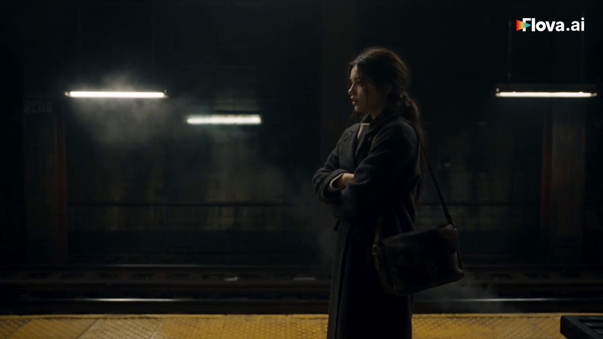
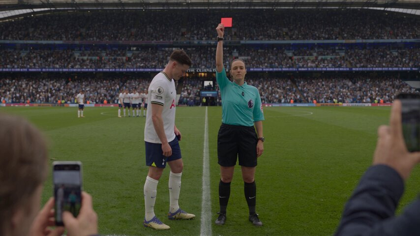
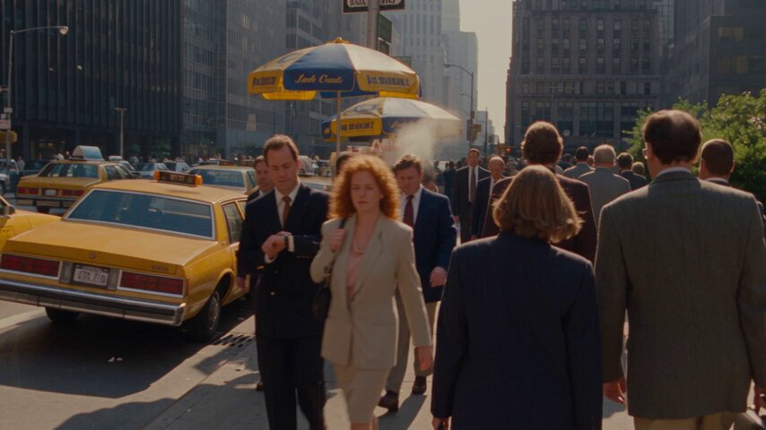
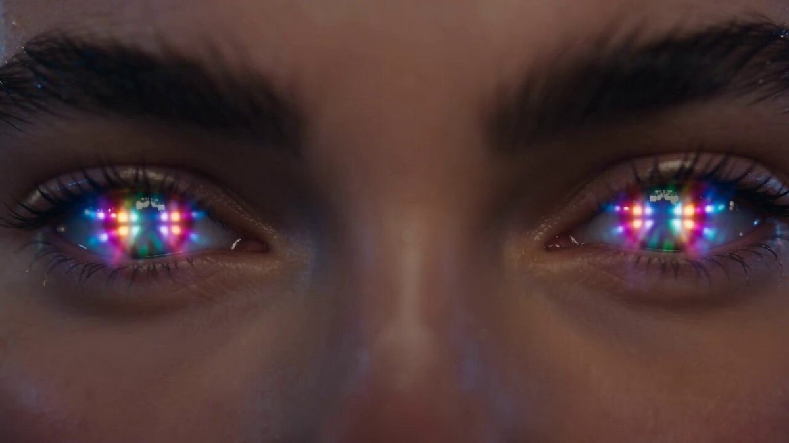
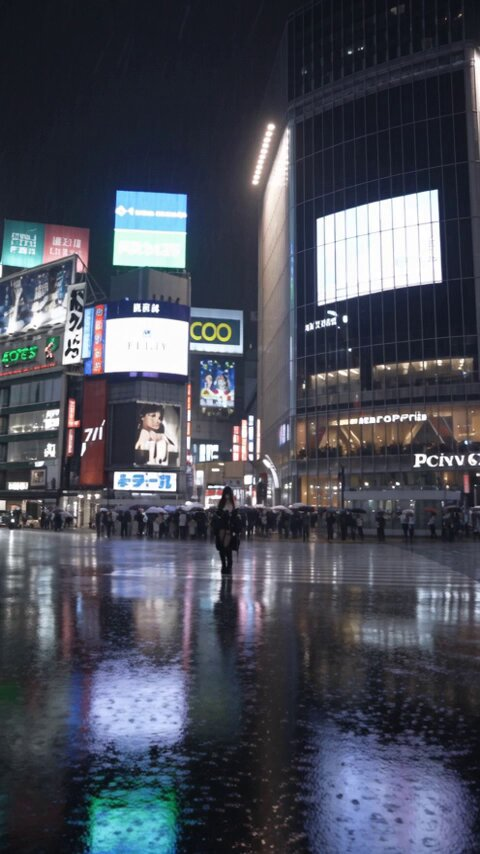
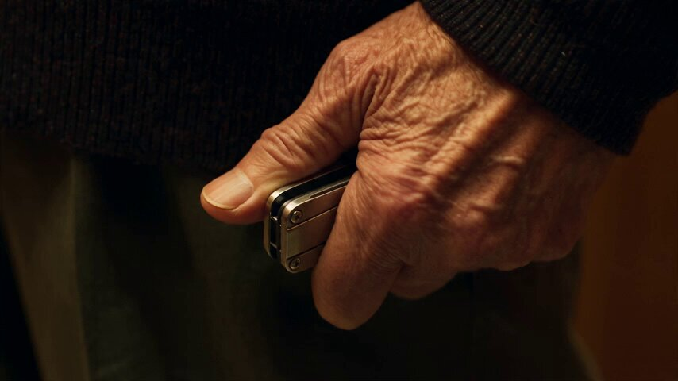
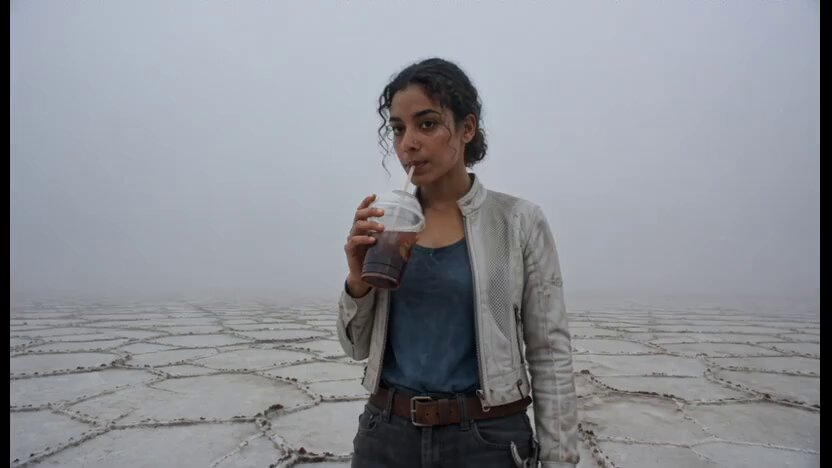
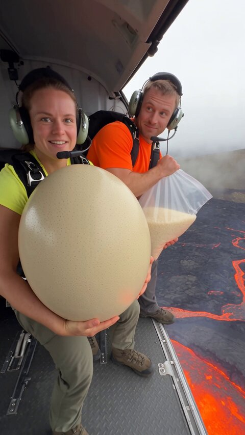
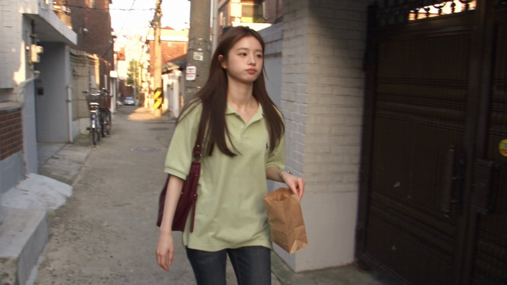

# Seedance 2.5 · Biblioteca de prompts · Leadde.ai

[](README.md) [](README_zh.md) [](README_zh-TW.md) [](README_ja-JP.md) [](README_ko-KR.md) [](README_th-TH.md) [](README_vi-VN.md) [](README_hi-IN.md) [](README_es-ES.md) [-brightgreen)](README_es-419.md) [](README_de-DE.md) [](README_fr-FR.md) [](README_it-IT.md) [-lightgrey)](README_pt-BR.md) [](README_pt-PT.md) [](README_tr-TR.md)

**Best for:** Seedance prompts for motion, camera language, cinematic scenes, product videos, and short-form creative.

For PDF, PPT, SOP, training, and multilingual video workflows:
[Awesome Document-to-Video](https://github.com/LeaddeOpenLab/awesome-document-to-video)

> **Prompts de calidad seleccionados cada día**

Descubre prompts completos para crear imágenes, videos y 3D con IA. Explora por estilo, consulta versiones multilingües y encuentra a los autores originales.

[Explora Leadde.ai →](https://leadde.ai/?utm_source=github&utm_medium=readme&utm_campaign=prompt-library&utm_content=seedance2.5)

## Conoce Leadde.ai

Leadde.ai ayuda a los equipos a convertir documentos, diapositivas y texto en videos empresariales con IA para capacitación, incorporación y marketing.

Dale una estrella a este repositorio para seguir nuestra selección diaria y descubrir nuevas ideas creativas.

**46** Prompts · Última incorporación: **2026-09-11**

<a name="catalog"></a>

## Explorar por categoría

[Fotografía](#category-photography) · [Cine / Fotograma](#category-cinematic-film-still) · [Cyberpunk / Ciencia ficción](#category-cyberpunk-sci-fi) · [Otros](#category-other)

<a name="all-prompts"></a>

<a name="category-photography"></a>

## Fotografía

<a name="prompt-2097837460910956650"></a>

### Traducción en curso

Autor：[@john87445528](https://x.com/john87445528) · [Publicación original](https://x.com/john87445528/status/2097837460910956650)

Fotografía · Personaje · Artículo de moda · Publicado

**Resumen:** Traducción en curso


**Prompt**

```text
Traducción en curso
```

[↑ Volver a categorías](#catalog)

---

<a name="prompt-2096930655615758734"></a>

### Prompt de video UGC ultrarrealista de 30 segundos: Joven mujer coreana graba un vlog diario con cámara en mano en su dormitorio, mostrando una cámara recién comprada y conversando de forma natural.

Autor：[@AIwithkhan](https://x.com/AIwithkhan) · [Publicación original](https://x.com/AIwithkhan/status/2096930655615758734)

Fotografía · Personaje · Publicado

**Resumen:** Prompt de video UGC ultrarrealista de 30 segundos: Joven mujer coreana graba un vlog diario con cámara en mano en su dormitorio, mostrando una cámara recién comprada y conversando de forma natural.


**Prompt**

```text
Crea un video UGC ultrarrealista de 30 segundos en 1080p de una joven mujer coreana en su propio dormitorio, hablando de manera casual a la cámara sobre la nueva cámara que compró recientemente.
SUJETO PRINCIPAL
Joven mujer coreana de poco más de 20 años, de belleza natural, textura de piel realista, maquillaje mínimo, cabello negro ondulado atado de forma suelta en una coleta lateral desenfadada con algunos mechones sueltos alrededor de su rostro. Viste un top corto ajustado color azul pastel, pantalones holgados estilo pijama color crema y un collar plateado simple.
Mantén exactamente su misma identidad facial, peinado, atuendo, proporciones corporales y apariencia general de manera consistente a lo largo de todo el video.
ESCENARIO
Su propio dormitorio acogedor en un departamento coreano normal en una cálida mañana de lunes. Está sentada cómodamente en su cama con ropa de cama blanca ligeramente desordenada, una almohada detrás de ella, una pequeña mesa de noche, algunos objetos personales de uso cotidiano y una suave luz solar natural que entra por la ventana.
La habitación debe sentirse habitada y auténtica, no montada ni lujosa.
ESTILO UGC
Ella misma sostiene la cámara o esta está apoyada casualmente sobre la cama frente a ella. El encuadre es ligeramente imperfecto, con un movimiento natural de cámara en mano, pequeños ajustes de enfoque automático y cambios ocasionales de exposición.
El video debe sentirse como un vlog personal genuino grabado para sus seguidores, no como un anuncio publicitario pulido.
ACCIÓN / DIÁLOGO
Se sienta con las piernas cruzadas en la cama, mira a la lente y sonríe.
Dice de forma natural:
“Okay, I finally got this camera I’ve been talking about.”
Se ríe suavemente y levanta la cámara para mostrarla brevemente.
“I’ve only had it for like two days, but I already bring it everywhere.”
La vuelve a colocar en su lugar y se apoya contra la almohada.
“I wanted something that feels a little more personal than just using my phone.”
Mira alrededor de su habitación, y luego regresa la mirada a la lente.
“The footage has this old-school look that I really love. It kind of feels like I’m recording memories instead of just posting videos.”
Sonríe y se coloca un mechón de cabello suelto detrás de la oreja.
Cerca del final mira el reloj, se ríe y dice:
“Anyway, it’s Monday, I should probably get out of bed.”
Extiende la mano hacia la cámara como para detener la grabación, sonriendo de forma natural, y el video se corta a mitad del movimiento.
CÁMARA / ASPECTO VISUAL
UGC auténtico con un toque sutil inspirado en las cámaras DV de principios de los 2000: detalle digital suave, ligero ruido de imagen, leve búsqueda de enfoque automático, textura de piel natural y cálida luz matutina. Sin iluminación dramática ni movimientos de cámara cinematográficos.
AUDIO
Únicamente el ambiente natural de la habitación, su voz, el sutil movimiento de la tela, sonidos distantes del vecindario y el leve ruido de manipular la cámara. Sin música, sin narración en off.
SENSACIÓN FINAL
Contenido relajado de creadora de estilo de vida coreano. Cálido, femenino, íntimo y creíble, como un vlog casual de lunes por la mañana filmado en su propia habitación.
NEGATIVO
Sin actuación comercial, sin iluminación perfecta de estudio, sin poses preparadas de influencer, sin variaciones de identidad, sin cambios de vestuario, sin manos distorsionadas, sin dedos adicionales, sin subtítulos, logotipos, marcas de agua ni artefactos de IA.
```

[↑ Volver a categorías](#catalog)

---

<a name="prompt-2096931238460178592"></a>

### Crea un video casero en formato DV de principios de los años 2000, ultrarrealista, de 30 segundos, a 1080p y en 16:9, de una joven coreana que vive una tarde de verano ordinaria pero memorable en un barrio antiguo de Seúl, con acciones detalladas en una línea de tiempo, defectos de cámara en mano y audio ambiental.

Autor：[@SimplyAnnisa](https://x.com/SimplyAnnisa) · [Publicación original](https://x.com/SimplyAnnisa/status/2096931238460178592)

Fotografía · Personaje · Publicado

**Resumen:** Crea un video casero en formato DV de principios de los años 2000, ultrarrealista, de 30 segundos, a 1080p y en 16:9, de una joven coreana que vive una tarde de verano ordinaria pero memorable en un barrio antiguo de Seúl, con acciones detalladas en una línea de tiempo, defectos de cámara en mano y audio ambiental.


**Prompt**

```text
Crea un video casero en formato DV de principios de los años 2000, ultrarrealista, de 30 segundos, a 1080p y en relación de aspecto 16:9, de una joven coreana que pasa una tarde de verano común pero inesperadamente memorable en un barrio antiguo de Seúl.

Una mujer coreana naturalmente bonita de veintipocos años, piel realista, maquillaje mínimo, cabello negro largo y ligeramente ondulado, top de punto azul pálido, pantalones holgados color crema, tenis blancos, bolso cruzado marrón y reloj plateado. Mantén su identidad, rostro, vestimenta, peinado y proporciones perfectamente consistentes.

ESCENARIO

Una calle residencial tranquila y antigua de Seúl con callejones de concreto, edificios de departamentos, plantas en macetas, bicicletas, postes de luz, árboles frondosos y una pequeña tienda de conveniencia de barrio. Concurrido, habitado y auténtico. Sin marcas, logotipos, anuncios ni lugares turísticos.

ESTILO DE CÁMARA

Metraje en bruto de una videocámara DV económica de principios de los años 2000: movimiento tembloroso de cámara en mano, encuadre imperfecto, búsqueda de enfoque automático, cambios de exposición, colores desvaídos, detalles suaves, leve ruido de cinta, zooms accidentales y errores naturales de cámara. Sin estabilización ni tomas cinematográficas.

00:00–00:06 — EL MISTERIO

Camina por la calle sosteniendo una pequeña bolsa de plástico cuando de repente escucha un leve tintineo detrás de ella.

Se detiene y mira a su alrededor.

La cámara hace un zoom rápido hacia su rostro confundido.

Ella dice:

“Did you hear that?”

00:06–00:12 — EL PEQUEÑO DESCUBRIMIENTO

Sigue el sonido y encuentra una pequeña bicicleta vieja con un timbre diminuto atorado ligeramente abierto.

Toca suavemente el timbre.

Ding.

Mira a la cámara y se ríe.

Luego nota una pequeña etiqueta de papel que parece escrita a mano colgando de la bicicleta, pero la letra es demasiado ilegible para leerla.

00:12–00:18 — EL VIENTO

Una ráfaga repentina de viento arrastra varias hojas secas por la calle.

Una cae directamente sobre su cabeza.

Ella no se da cuenta.

La persona que opera la cámara se ríe.

Ella parece confundida, luego se da cuenta y se quita la hoja.

Le lanza una mirada avergonzada a la cámara.

00:18–00:24 — EL PEQUEÑO DESAFÍO

Coloca la hoja en el asiento de la bicicleta e intenta mantenerla en equilibrio allí.

El viento se la lleva de inmediato.

Lo intenta de nuevo.

Se cae otra vez.

Se ríe y finalmente se rinde.

00:24–00:30 — EL RECUERDO

Recoge la hoja, la guarda en su pequeña bolsa y empieza a caminar hacia casa.

Después de unos pasos, se gira hacia la cámara y dice:

“Okay, that was pointless.”

Sonríe y sigue caminando.

La cámara la sigue durante unos segundos antes de cortar abruptamente a negro.

AUDIO

Únicamente sonido natural del lugar: pasos, tráfico distante, el timbre de la bicicleta, insectos de verano, hojas, viento, ambiente del vecindario y risas naturales.

Sin música, narración, subtítulos, letreros, logotipos, marcas de agua ni texto en pantalla.

REALISMO

Reacciones humanas naturales, ritmo imperfecto, física realista, objetos consistentes, detalles auténticos de un vecindario coreano e imperfecciones creíbles de cámara DV. Sin apariencia CGI, manos distorsionadas, dedos adicionales, personas duplicadas, alteraciones de identidad ni cambios de vestuario.

Relación de aspecto 16:9.
```

[↑ Volver a categorías](#catalog)

---

<a name="prompt-2097181982924984513"></a>

### Auténtica mujer indonesia con estética de video casero de videocámara DV de principios de los años 2000 con marcas de tiempo cronológicas detalladas de las escenas en un vecindario tranquilo.

Autor：[@QAiStudio](https://x.com/QAiStudio) · [Publicación original](https://x.com/QAiStudio/status/2097181982924984513)

Fotografía · Personaje · Publicado

**Resumen:** Auténtica mujer indonesia con estética de video casero de videocámara DV de principios de los años 2000 con marcas de tiempo cronológicas detalladas de las escenas en un vecindario tranquilo.


**Prompt**

```text
Auténtica mujer indonesia, estética de video casero indonesio de principios de los años 2000. Conservar su rostro exacto, identidad, peinado, rasgos faciales, tono de piel, proporciones corporales, vello axilar natural, top corto sin mangas color verde oliva descolorido, jeans holgados de tiro alto en azul claro, zapatillas de lona negras, collar de cordón negro, cabello ondulado negro, flequillo hacia un lado, coleta desordenada.

Barrio residencial indonesio común y tranquilo: callejón estrecho de concreto, casas sencillas de un solo piso, pequeñas terrazas, muros bajos, plantas en macetas, motocicletas estacionadas, árboles grandes, cables aéreos enredados. Sin tiendas ni actividad comercial.

00:00–00:03: Ella está sentada en el suelo de una terraza garabateando en un cuaderno; la cámara en mano sobrevuela desde arriba/un lado.
00:03–00:07: Se da toquecitos con el bolígrafo en la barbilla, sonríe levemente y luego sigue dibujando; la cámara deambula entre su rostro y sus manos.
00:07–00:10: Está recostada sobre un tapete observando a las hormigas desplazarse por el concreto.
00:10–00:13: Da toquecitos suaves cerca de las hormigas y se ríe suavemente.
00:13–00:17: Camina hacia un muro bajo, salta sobre él y balancea las piernas.
00:17–00:20: Come papas fritas despreocupadamente mientras mira hacia la calle tranquila.
00:20–00:24: Se sienta en los escalones con una toalla alrededor de los hombros, con el cabello húmedo, peinándolo lentamente.
00:24–00:27: Plano de cerca en mano mientras se peina el cabello mojado, gotas de agua visibles.
00:27–00:30: Termina, echa su cabello húmedo hacia atrás, mira hacia la cámara y sonríe de forma natural. Corte abrupto a negro.

Realismo de videocámara DV en mano extremadamente crudo: movimientos marcados, microtemblores, encuadre accidental, composición descentrada, recortes ocasionales del rostro, búsqueda de autoenfoque, fluctuaciones de exposición, desenfoque de movimiento, rolling shutter, colores desteñidos/desaturados, ruido digital y artefactos de compresión. Sin poses, estabilización, apariencia cinematográfica, estilo comercial de moda, gradación moderna ni música. Solo ambiente natural de la mañana: pájaros, brisa, motocicletas lejanas, charlas del vecindario, raspado de papel, bolsa de papas fritas, hojas, peine. 16:9.
```

[↑ Volver a categorías](#catalog)

---

<a name="prompt-2097185861259727263"></a>

### Prompt fotorrealista para un vlog de viajes costero coreano de 30 segundos que captura un recorrido vespertino desde los mercados de pescado al atardecer y paseos costeros hasta un malecón a medianoche.

Autor：[@nawalsehar](https://x.com/nawalsehar) · [Publicación original](https://x.com/nawalsehar/status/2097185861259727263)

Fotografía · Paisaje / Naturaleza · Publicado

**Resumen:** Prompt fotorrealista para un vlog de viajes costero coreano de 30 segundos que captura un recorrido vespertino desde los mercados de pescado al atardecer y paseos costeros hasta un malecón a medianoche.


**Prompt**

```text
Crea un vlog de viajes de acción real fotorrealista de 30 segundos junto al mar en Corea, siguiendo a una joven coreana durante una tarde en un tranquilo pueblo costero. Comienza en un animado mercado de mariscos con productos frescos del mar, suelos mojados y la luz del atardecer. Ella se registra en una acogedora casa de huéspedes tradicional y luego camina descalza por la playa mientras las olas le llegan a los pies durante la hora dorada. Haz una transición hacia un cálido mercado nocturno de mariscos donde disfruta de mariscos recién asados e interactúa de manera natural con el entorno. Termina a medianoche junto a un tranquilo malecón, contemplando el océano oscuro con luces de pesca lejanas y las olas rompiendo abajo. Auténtico estilo de vlog de 2026 grabado con smartphone/cámara de cine, entorno coreano natural, piel, cabello, ropa, agua, comida, humo, olas y movimiento humano realistas. Cámara en mano, enfoque automático natural, cambios de exposición y desenfoque de movimiento realista. Solo diálogo en inglés, audio ambiental natural, sin música de fondo ni narración. Gran énfasis en física creíble, iluminación, movimiento fluido y expresiones espontáneas. Sin CGI, animación, subtítulos, logotipos ni marcas de agua.
```

[↑ Volver a categorías](#catalog)

---

<a name="prompt-2097186378861953475"></a>

### Crea un videoblog de viajes fotorrealista de 30 segundos en un pueblo de montaña japonés siguiendo a una joven que explora un pueblo tranquilo tras perder su autobús, con iluminación natural y estilo de cámara en mano.

Autor：[@aiwithaly](https://x.com/aiwithaly) · [Publicación original](https://x.com/aiwithaly/status/2097186378861953475)

Fotografía · Personaje · Paisaje / Naturaleza · Publicado

**Resumen:** Crea un videoblog de viajes fotorrealista de 30 segundos en un pueblo de montaña japonés siguiendo a una joven que explora un pueblo tranquilo tras perder su autobús, con iluminación natural y estilo de cámara en mano.


**Prompt**

```text
Crea un videoblog de viajes fotorrealista de 30 segundos en un pueblo de montaña japonés, siguiendo a una joven japonesa que pierde su autobús y pasa 25 minutos explorando el tranquilo pueblo. Muestra cómo corre tras el autobús que se aleja → revisa el horario → camina por calles pacíficas y cruza un puente rojo → descubre una casa de té tradicional → disfruta de un té verde caliente → contempla la vista de las montañas durante la hora dorada → escucha llegar el siguiente autobús y regresa a la parada. Metraje de viajes auténtico de 2026, paisajes japoneses naturales, movimiento humano y al caminar realista, cabello y ropa que reaccionan al viento, arroyo fluyendo, té humeante, física verosímil del autobús e iluminación de hora dorada. Estilo de smartphone o cámara de cine en mano con enfoque automático natural, cambios de exposición y desenfoque de movimiento sutil. Diálogo únicamente en inglés, ambiente realista de pueblo y sin música de fondo. Sin CGI, animación, estética VHS, subtítulos, logotipos ni marcas de agua.
```

[↑ Volver a categorías](#catalog)

---

<a name="prompt-2097097582262825180"></a>

### 15秒第一人称视角的台球厅暧昧喜剧视频提示词，包含详细的分镜时间线、人物互动、运镜方式、台球局轨迹及音频与负面约束。

Autor：[@john87445528](https://x.com/john87445528) · [Publicación original](https://x.com/john87445528/status/2097097582262825180)

Cómic / Guion gráfico · Fotografía · Personaje · Publicado

**Resumen:** 15秒第一人称视角的台球厅暧昧喜剧视频提示词，包含详细的分镜时间线、人物互动、运镜方式、台球局轨迹及音频与负面约束。


**Prompt**

```text
｜15秒｜男主第一人称｜海妖风暧昧喜剧 【剧情锁定】 成年女主角#1发现男主准备击球，故意走进他的视野，主动侧坐上台球桌，屈起一条腿，让预定#2服装原有剪裁自然呈现大腿线条，以海妖风眼神和姿态干扰瞄准。男主停杆、抬头，她以为自己的小心思奏效；男主却不耐烦地倒转球杆，用橡胶粗端隔着衣服轻顶她臀侧一下，催她下桌。她被识破后调皮又无奈地让开，男主立即继续击球，母球撞中目标球，目标球落袋。 必须完整呈现“她先站着—主动上桌—故意展示腿部线条并观察他的反应”。她明知会干扰打球，仍主动试探；不能开场便让她已经坐好，也不能演成偶然挡路。 【人物与服装】 画面中唯一可见的人物是成年女主角#1
，面孔、发型、体型保持一致。#1完整穿着预定#2
屏幕截图_31-8-2026_22160_jimeng.jianying.com
服装，带着装饰眼镜
包括既定丝袜
和配饰；#2仅是服装编号，绝不生成第二个人物。腿部呈现服从#2本身的长度、开口和袜装，不能为了露腿改变剪裁、消除袜子或凭空缩短衣服。 成年男主只提供第一人称视点、唯一一支球杆和一句画外对白。脸、身体、手臂、双手、影子、倒影均不入画。全片不出现其他人或人物复制。 【影像与拍摄关系】 9:16竖屏，1080×1920，30fps，约26—28mm等效视角。男主佩戴贴近眼线的轻型头戴相机，保留未经处理的手机视频观感。低头看球、抬头看人、直起身体均带动真实镜头运动。男主无需手持摄影设备，可以正常操杆；握杆手和架杆手始终位于取景下缘之外。 全程连续第一人称，不切到男主正面、第三人称或外部全景。轻微呼吸起伏、头部晃动和不完美重新构图；从白球转看#1时，对焦允许短暂迟疑。冷白顶灯照明，肤色和衣料保留纹理，暗部带少量手机噪点；快速调杆有适量运动模糊，但不能糊掉端头交换。无美颜、磨皮、电影调色和稳定器运镜。 构图以能读懂人物动作为先：上桌时保留她扶库边的手、坐下的位置和两腿变化；试探时让脸与腿部线条同时在画面内；赶人时让表情和球杆粗端同时可见；最后回到白球、红球、中袋的完整路线。镜头不长时间追着某一处身体，也不能为了看脸把上桌和调杆动作裁掉。 【台球厅环境】 普通室内台球厅，绿色台呢、红棕色木质库边、黑色桌体、银色边框和白色网兜球袋。背景为深灰与棕色竖向墙板、浅色百叶窗、深绿色等候椅，顶灯将桌面照得比背景明亮。远处可见另一张无人使用的球桌，环境朴素、有实际使用痕迹，整体空间和光线全程不变。 没有酒吧灯光、粉色爱心、霓虹装饰、豪华软包或摄影棚布景。镜头范围内不出现其他顾客、工作人员、人像海报或镜面反射。 【空间与球局】 男主位于近侧长库边中央，#1开始站在对面长库边、画面右侧。两人隔着约1.3米的桌宽相对，不能改成隔着整张球桌的长度。对面中袋位于画面上方中央，始终是明确的落袋目标。 桌上起始共有四颗球：一颗白色母球、一颗红色实心目标球、一颗蓝球、一颗黄球。白球位于近半台中央；红球在对面中袋前约25厘米，白球、红球、中袋形成容易看清的直线。蓝球与黄球分别停在左右远离球路的位置，全程静止。 #1坐在对面中袋右侧的库边，身体斜向镜头；一条屈腿轻放在台面右侧边缘，另一条腿垂在桌外。她的腿部和上身进入男主瞄准视野，但不踩球、不压球、不把腿跨在两球之间。她必须下桌后男主才击球。 她坐下前，白球到红球、红球到中袋的路线已在开场建立；她坐下后，屈腿位于这条路线右侧，进入视野并分散注意，但实际球路没有被身体堵死。她收腿下桌的过程中不得碰动任何球。球位从开头直到出杆保持不变，观众能用同一组位置看懂男主始终想打哪一球。 【海妖风与结尾表情】 坐姿呈自然S曲线：身体微侧，肩部下沉，颈部拉长，下巴轻轻侧抬，腰胯略向一侧移。屈腿与垂腿前后错位，大腿线条在人物整体中自然可见；左手撑库边，右手只整理一次发丝。半垂眼冷感直视男主，嘴角仅有很淡的试探笑意。 前半段冷艳、克制、有距离感；后半段按剧情允许出现调皮、无奈的微笑。她被识破后不惊恐、不生气，也不狼狈尖叫，而是嘴角先停半拍，随后侧眼抿笑、小幅摇头，像在用表情说“行吧，你就知道打球”。这句话不实际说出，不加字幕。 暧昧必须通过相互观察表现：她每次调整坐姿后都会瞥一眼杆头，看到杆头停住才露出得意；男主的镜头则反复从她回到红球，留下他其实更在乎球局的线索。前半段的腿部展示、后半段的调皮笑都属于成年人的轻松玩笑，保持自然、从容，不用夸张表情代替剧情。 【球杆连续性】 唯一一支约145厘米的台球杆：浅木色细杆、细小蓝色皮头、深色粗握柄、尾部黑色橡胶保护帽。细头用于击球，橡胶粗端用于一次轻微赶人动作。 调头是端对端转过180度。必须连续看见：细头离开白球并撤回；同一杆身斜向扫过镜头前方；细头转向侧下方，粗握柄和黑色尾帽从另一侧绕出；最终黑色粗端指向#1。握持点可以藏在下缘，杆身不能整根退出后突然换成另一端，也不能只沿长轴自转。 翻杆时杆身经过人物前方，必须与她保持明显的前后距离，不扫到头发、面部或肩膀。橡胶尾帽靠近臀侧后仅短暂接触一次，随即离开；接下来由#1自己撑住库边、收腿、滑下。她的身体运动、衣料变化与接触顺序同步，不能先下桌再补拍顶人的动作。 【严格时间分镜】 → 0—3秒，第一人称俯看球桌。白球、红球、中袋与左右静止的蓝黄两球同时建立，细杆头正在白球后方试瞄。 原本站在对面长库边右侧的#1先看一眼球杆方向，再看向镜头。她主动扶住库边，侧身坐上去，屈起一条腿放到台面边缘，另一条腿垂在桌外。坐下、抬腿和衣料自然形成褶皱的过程连续可见，#2原有剪裁呈现大腿线条。镜头随男主抬头，从球路转向她的完整坐姿。 → 3—5.5秒，保持#1面部、上身和腿部同框的中景。她肩部放松下沉、颈部拉长，身体形成S曲线，指尖整理发丝，半垂眼看着镜头，随后把视线短暂移向球杆，确认男主是否停下。 球杆停止试瞄。镜头略低头看球，又抬回她脸上。#1看见这个反应，嘴角慢慢浮起一丝笃定笑意，屈起的膝盖略向侧面调整，使大腿线条更完整。动作明显带有故意干扰的试探，但不拉扯衣摆。 → 5.5—7秒，球杆再次靠近白球，却仍未击打。男主短促呼气，镜头随他直起身体升高，发出略带火气、不耐烦的成年男声：“让开，让开。” #1没有立刻移动，只轻轻侧头，半垂眼望着他，嘴角还保留着以为自己成功的笑意。 → 7—8.5秒，完整展示调转球杆。浅木色细头先从白球后方撤回，同一杆身斜贯画面前景，细头沿侧下方转走；深色粗柄与黑色橡胶尾帽从另一侧转到正前方，完成端对端半圈翻转。 相机有轻微头部晃动，但始终让杆身的一部分留在画面中。最终画面下方清楚出现朝向#1的黑色橡胶粗端，细头已经朝向男主一侧。 → 8.5—10秒，男主将粗端越过桌面，隔着完整#2服装，在#1靠台面一侧的臀部外侧短促轻顶一下，随即撤开。人物中景同时交代她的脸、姿态、库边和接触动作，不切局部特写。 #1低头看一眼黑色杆尾，嘴角原来的笃定笑意停住半拍。她明白男主完全没有配合自己的试探，主动双手撑库边，把屈起的腿收出台面，顺势向桌外滑下。动作由她自身支撑完成，不被顶飞，也不跌倒。 → 10—11秒，#1双脚落地后向画面右侧让开半步，鞋底落地声清楚。她侧眼看向男主，抿住忍不住扬起的嘴角，轻轻摇一次头，带一点“被你看穿了”的调皮无奈。 她身体重新微侧，颈线拉长，维持冷艳基调；不是慌张、恼怒、委屈或被羞辱的表情。 → 11—12秒，球杆粗端收回，按先前相反的路径端对端调转：黑色尾帽转向下缘，浅木色杆身和蓝色细皮头重新指向白球。镜头随男主低头回到球路，细头停在白球后方，#1已经完全让出观察方向。 → 12—14秒，男主平稳出杆一次，细皮头实际接触白球，发出清楚的“嗒”。白球先滚动，再撞上红球；红球沿直线滚向对面中袋，越过袋沿并落进白色网兜，发出真实的落袋声。 白球碰撞后留在台面，减速停下；蓝球和黄球原地不动。落袋后桌上剩白、蓝、黄三颗球，红球不能再次出现在桌面。 → 14—15秒，镜头从空出的中袋略抬向右侧。#1站在桌旁，目光先扫过落袋位置，再回到男主，半垂眼侧视，嘴角带着克制的调皮笑意，轻轻呼出一口气。 她保持自然S曲线和前后错位的双腿，一副小计策失败却又拿他没办法的模样。男主没有搭话，结尾停在她无奈抿笑的反应上。 【音频】 现场同期声：通风设备、远处模糊人声、坐上库边的衣料摩擦、球杆转动的轻响、鞋底落地、击球、球体碰撞与落袋声。唯一对白来自镜头后方成年男主：“让开，让开。”#1用表情完成反应。无背景音乐、旁白、解释性对白和罐头笑声。 【负面约束】 不得省略主动上桌和故意干扰；不得只拍她已经坐好的状态；不得把大腿裁出画面，也不得使用裙底角度或腿臀慢扫；不得改变#2服装或露出内衣；不得复制人物、肢体、球和球杆；不得出现男主或第二个#1；不得把翻杆省略成杆子退出后换端；不得用细头顶人、反复顶撞、造成受伤或摔落；不得让#1做惊恐、愤怒或委屈反应；不得省略白球撞红球和红球真实落袋；不得白球入袋代替红球，不得目标球凭空消失；不得出现字幕、水印、平台UI、爱心贴纸、慢动作或电影滤镜。
```

[↑ Volver a categorías](#catalog)

---

<a name="category-cinematic-film-still"></a>

## Cine / Fotograma

<a name="prompt-2098290630179057858"></a>

### Secuencia cinematográfica de ciencia ficción que representa a una mujer abordando un tren de medianoche que viaja por el espacio hacia una estación lunar abandonada.

Autor：[@Strength04\_X](https://x.com/Strength04_X) · [Publicación original](https://x.com/Strength04_X/status/2098290630179057858)

Cine / Fotograma · Cyberpunk / Ciencia ficción · Personaje · Vehículo · Publicado

Publicación original：[@Strength04\_X](https://x.com/Strength04_X) · [Publicación original](https://x.com/Strength04_X/status/2098256490238755226)

**Resumen:** Secuencia cinematográfica de ciencia ficción que representa a una mujer abordando un tren de medianoche que viaja por el espacio hacia una estación lunar abandonada.



**Prompt**

```text
REFERENCIA: Utiliza la imagen de referencia de personaje proporcionada como la identidad visual exacta de la protagonista. Mantén su rostro, peinado, vestimenta, proporciones corporales y detalles visuales sin cambios a lo largo de toda la secuencia. 0–5 SEG Una estación de tren subterránea abandonada se encuentra completamente vacía a medianoche. El polvo flota a través de luces parpadeantes. Una mujer joven espera sola en el andén cuando un tren antiguo llega repentinamente sin emitir ningún sonido. Sus ventanas revelan un cielo lleno de estrellas en lugar de pasajeros. 5–10 SEG Las puertas del tren se abren solas. Ella entra. La cámara la sigue por detrás mientras las puertas se cierran → el tren acelera por el túnel oscuro → las paredes del túnel comienzan a transformarse en galaxias y planetas distantes. 10–16 SEG El tren sale disparado del túnel y viaja a través del espacio abierto sobre vías de tren invisibles. La Tierra aparece muy abajo. Ella mira a través de la ventana mientras enormes pedazos de una luna destrozada flotan más allá del tren. 16–22 SEG El tren se aproxima a una gigantesca estación lunar abandonada construida a lo largo de la superficie de la luna. De repente, cada luz apagada de la estación se enciende una por una. La cámara se mueve al lado del tren mientras miles de andenes vacíos se extienden en la distancia. 22–27 SEG El tren se detiene. Ella baja a la luna. Frente a ella se alza una enorme estructura misteriosa con forma de portal, abriéndose lentamente hacia la Tierra. Un rayo de cálida luz solar la atraviesa e ilumina su rostro. 27–30 SEG La cámara retrocede rápidamente alejándose de la estación lunar → la luna entera aparece a la vista → el tren comienza a partir por su vía imposible hacia la Tierra → la toma final muestra el diminuto tren brillante cruzando el espacio bajo un masivo planeta azul. ESTILO VISUAL: Ciencia-fantasía cinematográfica ultrarrealista, personaje fotorrealista, entorno lunar realista, iluminación espacial físicamente creíble, arquitectura abandonada detallada, luz volumétrica, efectos sutiles de lente, escala masiva, cinematografía hollywoodense de primer nivel, composición IMAX. CÁMARA: Apertura lenta y llena de suspenso, tomas de seguimiento fluidas, aceleración dinámica durante la transición espacial, tomas orbitales amplias, alejamiento final controlado. NEGATIVO: dibujo animado, anime, CGI de baja calidad, transformación de rostros, inconsistencia del personaje, cambios de vestuario, anatomía distorsionada, reflejos poco realistas, movimiento excesivo de la cámara, texto, subtítulos, logotipos, marca de agua.
```

[↑ Volver a categorías](#catalog)

---

<a name="prompt-2098261249913970732"></a>

### Prompt de video con guion gráfico de 15 segundos de un futbolista que se arrodilla para proponerle matrimonio a una árbitra que le muestra la tarjeta roja.

Autor：[@bmx\_ai13](https://x.com/bmx_ai13) · [Publicación original](https://x.com/bmx_ai13/status/2098261249913970732)

Cómic / Guion gráfico · Cine / Fotograma · Publicado

**Resumen:** Prompt de video con guion gráfico de 15 segundos de un futbolista que se arrodilla para proponerle matrimonio a una árbitra que le muestra la tarjeta roja.



**Prompt**

```text
Crea un video fotorrealista de 15 segundos en un estadio de fútbol para Seedance 2.5. Relación de aspecto: horizontal 16:9. Grabación auténtica desde la tribuna, movimiento sutil de cámara en mano, luz natural diurna, piel realista, césped verde vívido y gradas llenas de gente. Una sola toma continua con un acercamiento gradual.

Un futbolista masculino adulto con cabello corto y oscuro viste un uniforme azul marino liso. Una árbitra adulta con cabello oscuro recogido en un moño apretado viste un uniforme de árbitro negro liso, medias negras, reloj de pulsera y silbato. Toda la indumentaria y el equipamiento no llevan marcas.

0–2 segundos: Vista panorámica amplia desde la primera fila junto a la línea de banda. Coloca al futbolista a la izquierda y a la árbitra a la derecha, con el campo y la multitud del estadio extendiéndose detrás de ellos. Las manos y los teléfonos de los espectadores enmarcan parcialmente las esquinas inferiores. Ella sostiene una tarjeta roja lisa en alto mientras él comienza a arrodillarse sobre una pierna.

2–4 segundos: Acércate lentamente hacia la pareja mientras su rodilla toca el césped. Él levanta una pequeña caja de anillo negra y la abre hacia ella. Mantén la tarjeta roja levantada, la caja abierta y a ambos personajes claramente visibles dentro del encuadre horizontal.

4–6 segundos: Pasa a un plano medio de dos personas, mostrando al jugador arrodillado en perfil de tres cuartos y el rostro de la árbitra con claridad. Ella nota el anillo. Su expresión severa se transforma en sorpresa: levanta las cejas, entreabre los labios y su brazo levantado permanece momentáneamente congelado.

6–8 segundos: Acércate un poco más manteniendo ambos rostros. Ella mira del anillo a los ojos de él y estalla en una sonrisa cálida y conmovida. Él permanece sobre una rodilla, sonriendo y sosteniendo la caja con firmeza.

8–10 segundos: Ella se ríe y baja lentamente la tarjeta roja hacia su costado. Sus hombros se relajan. Los espectadores a los lados levantan sus teléfonos mientras aumenta la emoción del público.

10–12 segundos: Ella asiente felizmente y extiende su mano libre hacia él. Él cierra la caja del anillo, la sujeta con seguridad y se levanta de manera natural. Inclina suavemente la cámara hacia arriba para mantener ambas cabezas cómodamente encuadradas.

12–15 segundos: Dan un paso hacia el otro y se abrazan cálidamente junto a la línea de banda. Mantén a la pareja centrada, con compañeros de equipo acercándose y aplaudiendo de fondo. Mantén el abrazo con un balanceo sutil de cámara en mano.

Audio: Ambiente natural de estadio, vítores crecientes, aplausos y risas alegres. Sin diálogos inteligibles ni voz en off.

Restricciones visuales: Rostros y vestimenta consistentes, manos realistas, movimiento natural y continuidad estable de los objetos. Composición a pantalla completa 16:9, sin barras negras. Sin texto, subtítulos, logos, marcas de agua, nombres o números en las camisetas, marcas de patrocinadores, carteles legibles, emojis o superposiciones gráficas.
```

[↑ Volver a categorías](#catalog)

---

<a name="prompt-2098265557237989841"></a>

### Prompt de generación de video de múltiples segmentos con realismo cinematográfico callejero de Manhattan en la década de 1990.

Autor：[@AiwithBloodline](https://x.com/AiwithBloodline) · [Publicación original](https://x.com/AiwithBloodline/status/2098265557237989841)

Fotografía · Cine / Fotograma · Paisaje urbano / Calle · Publicado

**Resumen:** Prompt de generación de video de múltiples segmentos con realismo cinematográfico callejero de Manhattan en la década de 1990.



**Prompt**

```text
{
  "format": "16:9, 30s, audio nativo activado, realismo cinematográfico, sin texto superpuesto, sin subtítulos en pantalla",
  "style": "Cinematografía callejera de Manhattan de la década de 1990, emulación de película Kodak cálida, grano fino, neblina suave, destello de lente anamórfica",
  "subject_and_action": {
    "0-6s": "Toma amplia cámara en mano avanzando a través de una densa multitud en la acera de Midtown Manhattan. En primer plano, un hombre con traje azul marino mira su reloj de pulsera a mitad de su paso. Una mujer con cabello castaño rojizo rizado en un blazer beige camina a su lado. Se eleva vapor de un carrito de hot dogs con sombrillas a rayas azules y amarillas en el centro del encuadre. Taxis amarillos avanzan lentamente por la calle.",
    "6-14s": "La cámara se mantiene en un plano medio amplio mientras una mujer con una blusa de estampado floral brillante intercambia una mirada y una sonrisa con un hombre con un atuendo en tono tostado y blanco cerca del carrito de comida. Detrás de ellos, un hombre con traje gris y corbata burdeos camina hacia la cámara. La densidad de la multitud sigue siendo alta, todos con vestimenta de negocios, ritmo de caminata natural y escalonado.",
    "14-20s": "Corte a un ángulo más bajo y cercano en la esquina de una tienda marcada como 'W 34th St.'. Dos hombres jóvenes con ropa informal urbana (mochila, jeans, camisas polo) caminan riendo en dirección contraria, en primer plano, mientras un taxi amarillo pasa velozmente por la parte inferior del encuadre con desenfoque de movimiento. Maniquíes de tienda de ropa y un letrero de neón 'OPEN' son visibles en la vitrina detrás de ellos.",
    "20-30s": "La cámara se asienta en la intersección de un cruce peatonal, ligeramente elevada. Una gran multitud de oficinistas cruza sobre el paso de cebra blanco hacia la cámara, con taxis amarillos esperando en el tráfico junto a ellos, y un segundo carrito de hot dogs con sombrillas a rayas a la derecha. La cámara se mantiene fija mientras la multitud se despeja levemente hacia el final, enfocando hacia el horizonte brumoso en el fondo profundo."
  },
  "environment": "Intersección densa de Midtown Manhattan, altas torres de oficinas desvaneciéndose en la neblina atmosférica, carritos de vendedores ambulantes, pasos peatonales pintados, señalización fiel a la época (mantenida intencionalmente genérica/ilegible), taxis amarillos clásicos de diseño cuadrado",
  "camera": "Cámara en mano a la altura de los ojos en movimiento de caminata, dolly lento hacia adelante con vaivén natural; un corte directo a los 14s hacia un ángulo secundario; enfoque profundo en primer plano, suave caída de nitidez en las torres de fondo",
  "lighting_and_color": "Sol brillante de mediodía, luz principal cálida en tono ámbar, bordes de sombra suaves, fondo ligeramente desaturado con saturación viva de amarillos y azules en taxis y sombrillas",
  "audio": "Zumbido del tráfico ambiental de la ciudad, murmullo superpuesto de la multitud y pisadas, bocinas de autos distantes, breve retumbo del motor de un autobús tras el corte a los 14s, sin diálogo, sin música",
  "continuity": "Misma densidad de multitud, mismo modelo/color de taxi, mismo diseño de sombrilla del carrito de comida y la misma gradación de color cálido mantenida en los cuatro segmentos",
  "constraints": "Sin texto legible ni descifrable en ninguna señalización, sin teléfonos ni vehículos modernos, sin ropa anacrónica, sin logotipos visibles, sin rostros distorsionados o duplicados"
}
```

[↑ Volver a categorías](#catalog)

---

<a name="prompt-2098264877248987394"></a>

### Un prompt para un video musical cinematográfico de 30 segundos con tres cantantes actuando en una calle mojada de la ciudad iluminada con neón.

Autor：[@ChillaiKalan\_\_](https://x.com/ChillaiKalan__) · [Publicación original](https://x.com/ChillaiKalan__/status/2098264877248987394)

Cine / Fotograma · Paisaje urbano / Calle · Publicado

**Resumen:** Un prompt para un video musical cinematográfico de 30 segundos con tres cantantes actuando en una calle mojada de la ciudad iluminada con neón.



**Prompt**

```text
Crea un video musical cinematográfico ultrarrealista de 30 segundos con tres cantantes adultos jóvenes interpretando una emotiva canción moderna en una ciudad iluminada por luces de neón por la noche. El video debe parecer un video musical profesional de alto presupuesto con personas realistas, sincronización labial precisa, interpretaciones expresivas, iluminación atmosférica y cinematografía sofisticada.

PERSONAJES

Personaje 1 — Voz principal femenina:
Mujer adulta joven, poco más de 20 años, cabello largo y negro, ojos expresivos, atuendo elegante en negro y plateado, personalidad segura pero emotiva.

Personaje 2 — Voz principal masculina:
Hombre adulto joven, poco más de 20 años, cabello oscuro y texturizado, elegante chaqueta negra y camisa blanca, carismático y emocionalmente expresivo.

Personaje 3 — Vocalista femenina:
Mujer adulta joven, poco más de 20 años, cabello oscuro a la altura de los hombros, atuendo moderno de color rojo intenso, presencia escénica enérgica pero natural.

Mantén sus rostros, vestimenta, peinados, proporciones corporales e identidades perfectamente consistentes a lo largo del video.

ENTORNO

Una calle céntrica y futurista por la noche tras una ligera lluvia. Pavimento mojado que refleja letreros de neón de colores, escaparates brillantes, niebla sutil, tráfico lejano, bokeh cinematográfico, luces atmosféricas de la ciudad y reflejos realistas.

PLANO A PLANO

0–4 seg — Apertura
Primerísimo primer plano de los ojos del Personaje 1. Reflejos de neón visibles en sus ojos. La cámara retrocede lentamente mientras comienza a cantar. Las gotas de lluvia brillan en el fondo.

4–8 seg — Interpretación principal
El Personaje 1 camina lentamente por la calle mojada mientras canta directamente hacia la cámara. Toma de seguimiento fluido hacia atrás. Su cabello se mueve naturalmente con la brisa nocturna.

8–12 seg — Verso masculino
Corte al Personaje 2 apoyado contra un edificio iluminado con neón. Comienza a cantar su sección. Órbita lenta y cinematográfica de la cámara a su alrededor, con las coloridas luces de la ciudad desenfocadas detrás de él.

12–16 seg — Vocalista femenina
El Personaje 3 aparece caminando por la calle de neón. Canta mientras mira hacia la cámara. Una toma de seguimiento lateral fluido hace una transición hacia un primer plano.

16–22 seg — Interpretación en trío
Los tres personajes se encuentran en una amplia intersección de la ciudad y actúan juntos. La cámara gira lentamente alrededor de ellos mientras cantan. Interacción natural, gestos sutiles, química creíble.

22–27 seg — Coro emotivo
Secuencia rápida pero elegante de primeros planos: el Personaje 1 cantando, el Personaje 2 uniéndose, el Personaje 3 armonizando. Cada movimiento de la boca sigue con precisión el audio proporcionado.

27–30 seg — Plano final
Los tres cantantes están juntos en medio de la calle mojada. La cámara se eleva lentamente hacia arriba y se aleja, revelando la brillante ciudad que los rodea. Terminan la letra final juntos exactamente al compás. Termina en un plano general dramático y cinematográfico.

CINEMATOGRAFÍA

Cinematografía de video musical de alta gama, aspecto de lente anamórfica, poca profundidad de campo, seguimiento suave con cardán, acentos en cámara lenta, primeros planos cinematográficos, movimiento de cámara controlado, destellos de lente realistas, desenfoque de movimiento natural, hermoso bokeh y composición dinámica.

AUDIO E INTERPRETACIÓN

Usa la canción/audio provisto como la banda sonora exacta. Los personajes deben cantar visiblemente la letra correcta con una sincronización labial precisa a nivel de fonemas. Las expresiones, los movimientos de los ojos y los gestos deben coincidir con la emoción y el ritmo de la canción. Nada de hablar diálogos que no correspondan.

CALIDAD

Ultrarrealista, humanos fotorrealistas, textura de piel natural, ojos y dientes realistas, iluminación físicamente precisa, superficies mojadas realistas, mechones de cabello detallados, movimiento de tela realista, HDR, contraste cinematográfico, gradación de color profesional, detalle en 4K, estética de video musical premium.

NEGATIVO: deformación de rostros, cambios de identidad, vestimenta inconsistente, personas adicionales, personajes duplicados, manos distorsionadas, rostros deformes, caminar antinatural, movimientos robóticos, sincronización labial incorrecta, hablar al azar, parpadeo, artefactos de interpolación de fotogramas, texto, subtítulos, logotipos, marcas de agua.
```

[↑ Volver a categorías](#catalog)

---

<a name="prompt-2098257195347616210"></a>

### Genera instrucciones para cambios de tomas cinematográficas con 20 posiciones de cámara distintas, cortes directos rápidos y coherencia del sujeto a partir de la imagen de referencia.

Autor：[@0xkyne](https://x.com/0xkyne) · [Publicación original](https://x.com/0xkyne/status/2098257195347616210)

Fotografía · Cine / Fotograma · Publicado

Publicación original：[@Framer\_X](https://x.com/Framer_X) · [Publicación original](https://x.com/Framer_X/status/2097866934725583101)

**Resumen:** Genera instrucciones para cambios de tomas cinematográficas con 20 posiciones de cámara distintas, cortes directos rápidos y coherencia del sujeto a partir de la imagen de referencia.



**Prompt**

```text
Crea una muestra cinematográfica de ángulos de cámara con cortes rápidos para la imagen de referencia\n\nNúmero total de tomas: 20\n\nMantén el personaje, el entorno, el vestuario, la iluminación, la acción y la escena general completamente consistentes a lo largo de todo el video. No cambies de ubicación ni introduzcas elementos nuevos.\n\nUtiliza 20 configuraciones de tomas claramente distintas, que incluyan:\n\nPlano general extremo, plano general de establecimiento, plano medio general, plano medio, plano medio corto, primer plano, primerísimo primer plano (plano detalle extremo), ángulo contrapicado (bajo), ángulo contrapicado extremo, ángulo picado (alto), toma cenital, toma cenital directa de arriba hacia abajo, toma a nivel del suelo, toma al nivel de los ojos, ángulo holandés inclinado, toma de perfil, ángulo de tres cuartos, toma frontal directa, ángulo posterior, toma sobre el hombro, toma sobre el hombro inversa, ángulo lateral contiguo, toma enmarcada en primer plano, toma con telefoto, primer plano con gran angular, composición simétrica, composición descentrada, ángulo de seguimiento, ángulo orbital y ángulo con perspectiva dramática.\n\nPuntos importantes:\n\n- Utiliza cortes directos (hard cuts) entre cada dos tomas.\n\n- Ningún ángulo de cámara debe durar más de 1 segundo.\n\n- No repitas ningún ángulo de cámara ni composición.\n\n- No crees movimientos de cámara continuos y prolongados entre los ángulos.\n\n- La acción debe ser continua a través de todos los cortes.\n\n- Modifica únicamente la posición de la cámara, el ángulo de la cámara, el lente y el encuadre.\n\n- El sujeto y la escena deben mantenerse visualmente consistentes.
```

[↑ Volver a categorías](#catalog)

---

<a name="prompt-2097961776969109709"></a>

### Crear un cortometraje de suspenso cinematográfico y realista de 30 segundos sobre una confrontación y persecución secreta entre tres personas en el ascensor y pasillo de un viejo edificio de departamentos.

Autor：[@bmx\_ai13](https://x.com/bmx_ai13) · [Publicación original](https://x.com/bmx_ai13/status/2097961776969109709)

Fotografía · Cine / Fotograma · Arquitectura / Interiores · Publicado

**Resumen:** Crear un cortometraje de suspenso cinematográfico y realista de 30 segundos sobre una confrontación y persecución secreta entre tres personas en el ascensor y pasillo de un viejo edificio de departamentos.



**Prompt**

```text
Crea un thriller de suspenso cinematográfico y fotorrealista de 30 segundos en formato panorámico 16:9. Cinematografía cinematográfica de primera calidad, actuaciones verosímiles, movimientos de cámara cuidadosamente justificados, acción física creíble y tensión estrictamente controlada.

ESCENARIO Y PERSONAJES:
Un edificio de departamentos antiguo en Hong Kong: un ascensor estrecho con paneles de madera de color miel, herrajes de latón rayados y una cálida iluminación cenital; en el exterior, pasillos estrechos con baldosas verdes y ocre, rejas metálicas de seguridad, tuberías expuestas y frías luces fluorescentes.
Mantener tres personajes constantes en todo momento:
— Una joven mujer de Asia oriental con un corte bob negro y lacio, sobrecamisa a cuadros rojos y grises, auriculares circumaurales blancos y una bolsa cruzada negra.
— Un protector de mediana edad de Asia oriental con pelo corto oscuro, anteojos rectangulares, chaleco utilitario color carbón y polo oscuro. Su actitud aparentemente ordinaria oculta una vigilancia constante.
— Un perseguidor de edad avanzada de Asia oriental con rostro curtido, boina marrón, anteojos redondos, cárdigan oscuro y bufanda estampada al cuello. Casi inmóvil, silenciosamente amenazante.

00:00–00:04 — LA AMENAZA OCULTA
Comenzar de inmediato con un plano detalle extremo de la mano del anciano ocultando una navaja plegable cerrada junto a su cárdigan. Un chasquido metálico sutil. Corte a una composición general del interior del ascensor: la mujer está de pie en primer plano a la izquierda con los auriculares puestos; el anciano espera detrás de ella, a la derecha. Luz ámbar, quietud opresiva. Avanzar lentamente hacia adelante mientras las puertas del ascensor comienzan a cerrarse.
00:04–00:08 — LA INTERRUPCIÓN
Una mano detiene las puertas que se cierran. Se vuelven a abrir, revelando al protector con anteojos recortado contra el frío pasillo verde. Entra con calma y se ubica entre la mujer y el anciano. En un plano medio de dos, le hace un gesto para que se baje los auriculares. Ella lo hace, inicialmente irritada, y luego nota su expresión seria. Los ojos de él registran brevemente la mano oculta.
00:08–00:12 — LA CONFRONTACIÓN SILENCIOSA
Un movimiento de cámara lateral controlado revela los tres rostros en una profundidad escalonada. El protector ofrece casualmente una manzana roja, usando el gesto para girar hacia el perseguidor. Corte a los ojos del anciano bajo su boina; luego a sus dedos apretando la navaja oculta. La mujer observa el intercambio, comenzando a entender. Actuación contenida, sin reacciones exageradas.
00:12–00:15 — ALGUIEN ESTÁ MIRANDO
Corte seco a una sala de vigilancia tenue iluminada por monitores de un azul frío. Un operador con auriculares se inclina hacia una pantalla que muestra al anciano dentro del mismo ascensor. Acercamiento hacia el monitor, luego un corte por raccord (match cut) de su imagen de vigilancia a su rostro en el ascensor. El pulso musical grave se acelera.

00:15–00:20 — LA SALIDA
El timbre de un ascensor interrumpe la tensión. Las puertas se abren hacia el pasillo de baldosas verdes. El protector guía a la mujer hacia afuera con un gesto breve y urgente mientras mantiene una expresión natural. Travelling de retroceso delante de ellos. Detrás de sus hombros, el anciano permanece centrado dentro del ascensor de luz ámbar, mirando fijamente. Las puertas comienzan a cerrarse a su alrededor.
00:20–00:25 — LA CERRADURA
Sigue a la pareja a lo largo del estrecho pasillo del edificio en un único y fluido plano de seguimiento. Se detienen ante una desgastada puerta metálica de un departamento. Detalle cerrado: el protector prueba una llave; se atora sin girar. Su compostura flaquea por primera vez. La mujer mira hacia atrás por el pasillo. Cambio de foco del perfil ansioso de ella al ascensor lejano mientras sus puertas se abren de nuevo.

00:25–00:30 — EL MOMENTO CULMINANTE
El anciano perseguidor sale al pasillo, ahora más cerca de lo esperado. Pasos lentos y calculados. Un plano intercalado con el protector finalmente logrando girar la llave. La puerta del departamento se abre y él hace entrar a la mujer. Desde el interior del departamento, la cámara se mantiene en la abertura de la puerta que se estrecha a medida que el perseguidor se acerca. La puerta se cierra de golpe justo antes de que él llegue a ella. Corte a negro en el 00:29. Mantener la pantalla en negro durante el segundo final con un único y tenue clic metálico.
DIRECCIÓN VISUAL:
Componer de forma nativa para 16:9, utilizando el espacio horizontal para obstrucciones en primer plano, figuras amenazantes en el fondo y relaciones claras entre los personajes. Textura de piel natural, telas detalladas, grano de película sutil, negros intensos con sombras detalladas y visibles. Luz cálida de tono ámbar en el ascensor contrastada con pasillos verde frío y pantallas de vigilancia azules. Usar encuadres de 35 mm para la tensión espacial y primeros planos de 85 mm para ojos y manos. Desenfoque de movimiento realista, cámara en mano contenida solo durante el escape final. Preservar la dirección en pantalla, el vestuario, los rostros, la colocación de los objetos y la continuidad arquitectónica.

DIRECCIÓN DE SONIDO:
Zumbido del motor del ascensor, música tenue de los auriculares que se desvanece al bajárselos, roce de ropa, sutil clic de navaja, zumbido de fluorescente, timbre del ascensor, pasos calculados, mecanismo de llave atascado y un pesado golpe final de puerta. Cuerdas graves mínimas y un pulso de bajo que se acelera gradualmente. Sin diálogos ni voces en off.
EVITAR:
Subtítulos en pantalla, rótulos, títulos, marcas de agua, logotipos, combates exagerados, sangre, piel artificial, manos deformadas, rostros cambiantes, personajes duplicados, movimientos de cámara imposibles a través de paredes, cámara lenta aleatoria, destellos de lente excesivos o montajes frenéticos. Construir el suspenso a través de miradas, bloqueo escénico, sonido y ritmo.
```

[↑ Volver a categorías](#catalog)

---

<a name="prompt-2097942616415568240"></a>

### Prompt de ciencia ficción que presenta a una mujer en una ciudad futurista bajo un océano suspendido con ballenas nadando.

Autor：[@IsabelWhite24](https://x.com/IsabelWhite24) · [Publicación original](https://x.com/IsabelWhite24/status/2097942616415568240)

Cine / Fotograma · Cyberpunk / Ciencia ficción · Personaje · Paisaje / Naturaleza · Publicado

**Resumen:** Prompt de ciencia ficción que presenta a una mujer en una ciudad futurista bajo un océano suspendido con ballenas nadando.


**Prompt**

```text
Crea un video de ciencia ficción y fantasía cinematográfico ultrarrealista de 10 segundos en formato vertical 9:16.

PERSONAJE PRINCIPAL

Una hermosa mujer adulta joven de unos 20 años camina sola por una ciudad futurista de noche. Tiene el cabello oscuro, largo y con caída natural, y una expresión tranquila y ligeramente curiosa.

Viste un elegante vestido largo hasta el suelo hecho de una tela ligera y etérea. El vestido es sofisticado y cinematográfico, con capas largas y fluidas que se mueven suavemente con el viento mientras camina. La tela capta los reflejos de las luces de la ciudad. Sin ropa reveladora.

Mantén su apariencia, peinado, rostro, vestido y proporciones consistentes a lo largo de todo el video.

ENTORNO

La ciudad es enorme, futurista y casi completamente silenciosa. Rascacielos imponentes de cristal desaparecen entre las nubes, cubiertos de sutiles luces de neón y ventanas brillantes. Las calles están mojadas por una lluvia reciente, creando hermosos reflejos.

Hay una ligera neblina en el aire, diminutas partículas flotantes, vehículos voladores distantes y una suave niebla atmosférica.

La atmósfera general debe sentirse misteriosa, hermosa, surrealista, pacífica y ligeramente inquietante.

0–2 SEGUNDOS

Comienza con una toma de seguimiento cinemática en plano medio amplio desde detrás de la mujer.

Ella camina lentamente por una calle futurista y tranquila, con su largo vestido arrastrándose de forma natural tras de ella.

La cámara la sigue suavemente a la altura de su marcha. Sus pasos crean pequeñas ondas en el agua de lluvia poco profunda sobre el pavimento.

De repente, reduce el paso.

Las luces ambientales de la ciudad se reflejan en la calle mojada.

2–4 SEGUNDOS

La mujer mira gradualmente hacia arriba.

La cámara se inclina lentamente hacia arriba con su mirada.

Revela un océano enorme que flota de manera imposible sobre la ciudad, suspendido en el cielo nocturno entre los rascacielos.

El océano parece un gigantesco cuerpo de agua transparente suspendido en el cielo, con una iluminación azul similar a la luz del sol filtrándose a través de sus profundidades.

Dentro del océano flotante, ballenas gigantescas nadan lentamente sobre los rascacielos.

Sus enormes siluetas pasan a través del agua azul brillante en las alturas.

Haz que las ballenas sean realistas y majestuosas, moviéndose con naturalidad y lentitud.

La mujer permanece completamente inmóvil por un momento, mirando hacia arriba con silencioso asombro.

4–6 SEGUNDOS

Corta a una toma cinemática más cercana de la mujer mirando hacia arriba.

De repente, diminutas gotas de agua comienzan a aparecer sobre el pavimento mojado.

En lugar de caer hacia abajo, las gotas se elevan hacia arriba contra la gravedad.

Cientos de gotas diminutas se levantan de los charcos y de las calles y flotan hacia el enorme océano arriba.

Las gotas deben moverse de manera fluida y físicamente natural, dejando sutiles estelas de luz reflejada de la ciudad.

La mujer levanta lentamente una mano y observa cómo las gotas de agua pasan entre sus dedos.

6–8 SEGUNDOS

El fenómeno se vuelve mucho más grande.

El agua comienza a elevarse desde fuentes, charcos, azoteas y calles por toda la ciudad.

La cámara retrocede y sube hacia una toma panorámica de establecimiento.

Toda la ciudad futurista comienza a elevarse lentamente con el agua que asciende.

Los edificios se despegan suavemente del suelo, manteniéndose estructuralmente intactos.

Las luces parpadean suavemente a lo largo de los rascacielos.

Los vehículos voladores flotan confundidos mientras la ciudad se vuelve lentamente ingrávida.

El vestido y el cabello de la mujer flotan ligeramente hacia arriba a medida que la gravedad comienza a desaparecer.

8–10 SEGUNDOS

Finaliza con una impresionante toma cinematográfica aérea amplia.

Toda la ciudad futurista ahora asciende lentamente hacia el enorme océano flotante.

La mujer está parada en una azotea o en una calle elevada abajo, viéndose diminuta frente al gigantesco espectáculo.

Las ballenas se deslizan plácidamente a través del océano sobre ella.

Miles de gotas de agua brillantes se elevan alrededor de la ciudad como estrellas.

La cámara se aleja lentamente aún más, revelando la escala imposible de la escena.

Termina con una hermosa imagen surrealista de la mujer, la ciudad flotante, el enorme océano y las ballenas nadando en lo alto, todo suspendido entre el cielo nocturno y la brillante ciudad.
```

[↑ Volver a categorías](#catalog)

---

<a name="prompt-2097901351049294063"></a>

### Prompt para un video de vlog realista de 30 segundos de una mujer en una feria rural de condado en una tarde de verano.

Autor：[@nawalsehar](https://x.com/nawalsehar) · [Publicación original](https://x.com/nawalsehar/status/2097901351049294063)

Cine / Fotograma · Personaje · Publicado

**Resumen:** Prompt para un video de vlog realista de 30 segundos de una mujer en una feria rural de condado en una tarde de verano.


**Prompt**

```text
Crea un vlog cinematográfico ultra fotorrealista de 30 segundos sobre una feria de condado estadounidense, siguiendo a una joven estadounidense a lo largo de una cálida tarde de verano. Comienza con ella entrando a una pequeña feria rural mientras la luz dorada se desvanece, luego subiendo a la rueda de la fortuna, compartiendo un funnel cake recién hecho, probando suerte en el juego de lanzamiento de aros, paseando entre familias y puestos locales, escuchando a una banda de country en vivo y viendo cómo los fuegos artificiales iluminan la noche.

Haz que la feria se sienta genuinamente local y auténtica, con caminos polvorientos, camionetas pickup, puestos de comida, casetas de madera, luces en guirnalda, niños, familias, tierras de cultivo y atracciones de feria brillantes. Mantén la apariencia y la ropa del personaje idénticas en todo momento.

Utiliza cinematografía realista de vlog cámara en mano de 2026, expresiones naturales, movimientos de cámara sutiles, iluminación vespertina auténtica, comportamiento de multitud realista y movimientos físicamente precisos. Captura comida detallada, azúcar glas que parece nieve, la mecánica de los juegos mecánicos, los aros lanzados, los fuegos artificiales, el humo dispersándose, el viento y los reflejos.

Utiliza únicamente audio natural del recinto ferial y música en vivo con diálogos breves y sincronizados en inglés estadounidense. Sin narración, subtítulos, CGI, animación, multitudes falsas, física imposible, cámara flotante, logotipos ni marcas de agua.
```

[↑ Volver a categorías](#catalog)

---

<a name="prompt-2097502400961761425"></a>

### Escena cinematográfica animada en 3D de un niño pequeño y un dragón bebé blanco perlado jugando en un valle de flores tropical.

Autor：[@Zarnab\_with\_Ai](https://x.com/Zarnab_with_Ai) · [Publicación original](https://x.com/Zarnab_with_Ai/status/2097502400961761425)

Cine / Fotograma · Renderizado 3D · Personaje · Animal / Criatura · Publicado

**Resumen:** Escena cinematográfica animada en 3D de un niño pequeño y un dragón bebé blanco perlado jugando en un valle de flores tropical.


**Prompt**

```text
Crea una escena de fantasía animada en 3D de alta calidad en un estilo cinematográfico y colorido.

Un lindo niño pequeño con cabello negro desordenado y un atuendo sencillo de tela beige está sentado y jugando entre un campo de hermosas flores junto a un simpático dragón bebé. El dragón es grande, adorable, de color blanco perlado con toques celestes, cuernos pequeños, ojos azules brillantes muy expresivos, escamas suaves similares a plumas alrededor de su cabeza y cuello, y una cola larga y elegante.

La escena se desarrolla en un mágico valle tropical rodeado de exuberantes montañas verdes, aguas cristalinas de color turquesa, árboles tropicales y un cielo azul brillante con suaves nubes blancas.

Comienza con un primer plano del dragón bebé dormido, descansando pacíficamente entre vibrantes flores de color rosa rojizo mientras el pequeño niño se sienta cerca. El dragón abre lentamente los ojos, mira a su alrededor con curiosidad y pone una expresión linda y juguetona.

Transición a una toma más amplia donde el dragón y el niño están rodeados por un campo de hermosas flores azules cerca del agua. El dragón rueda juguetonamente hacia atrás a través de las flores mientras el niño observa y ríe.

Muestra una toma panorámica aérea cinematográfica que revele el hermoso paisaje estilo isla, campos en flor, árboles tropicales, montañas y agua turquesa. Pequeños pájaros coloridos vuelan y saltan alrededor de un árbol cercano mientras el niño y el dragón juegan juntos abajo.

Luego regresa a un primer plano del niño sentado sobre el lomo del dragón. El dragón hace expresiones faciales divertidas y juguetonas mientras el niño ríe felizmente.

Termina con el niño y el adorable dragón acostados pacíficamente juntos en una enorme y colorida pradera de flores, sonriendo y disfrutando del momento mágico.

Usa animación de personajes fluida, emociones faciales expresivas, movimiento corporal natural, transiciones de cámara cinematográficas, profundidad de campo reducida, iluminación volumétrica suave, colores vibrantes, texturas 3D detalladas, atmósfera mágica y apta para toda la familia, calidad pulida de película animada y un tono cálido y conmovedor.

Sin texto, sin subtítulos, sin marcas de agua.
Relación de aspecto: 16:9.
Duración: aproximadamente 15 segundos.
```

[↑ Volver a categorías](#catalog)

---

<a name="prompt-2096826123330138410"></a>

### Toma de moda cinematográfica de una mujer rubia con un abrigo de piel sintética color crema cargando esquís blancos en una ladera alpina nevada en la hora dorada.

Autor：[@noorlewisx](https://x.com/noorlewisx) · [Publicación original](https://x.com/noorlewisx/status/2096826123330138410)

Cine / Fotograma · Personaje · Artículo de moda · Publicado

**Resumen:** Toma de moda cinematográfica de una mujer rubia con un abrigo de piel sintética color crema cargando esquís blancos en una ladera alpina nevada en la hora dorada.


**Prompt**

```text
Fotograma cinematográfico de moda, plano en contrapicado de una hermosa mujer joven con cabello rubio cenizo ondulado y ojos marrones caminando hacia la cámara en la ladera nevada de una montaña alpina iluminada por el sol en la hora dorada. Lleva un abrigo oversize de piel sintética color crema sobre un crop top acanalado blanco y pantalones cortos blancos a juego, botas de esquí blancas y afelpadas y guantes blancos. Lleva un par de elegantes esquís blancos con fijaciones negras colgados sobre un hombro. Nieve cristalina brillante en primer plano extremo con poca profundidad de campo y bokeh, picos cubiertos de nieve y cielo despejado de azul a crepuscular en el fondo, iluminación de borde dramática, fotografía editorial de alta costura, grano de película de 35 mm, ultrarrealista, fotorrealista, 8k
```

[↑ Volver a categorías](#catalog)

---

<a name="prompt-2097303258171949530"></a>

### Traducción en curso

Autor：[@Strength04\_X](https://x.com/Strength04_X) · [Publicación original](https://x.com/Strength04_X/status/2097303258171949530)

Cine / Fotograma · Personaje · Artículo de moda · Publicado

Publicación original：[@Strength04\_X](https://x.com/Strength04_X) · [Publicación original](https://x.com/Strength04_X/status/2097272589387546831)

**Resumen:** Traducción en curso


**Prompt**

```text
Traducción en curso
```

[↑ Volver a categorías](#catalog)

---

<a name="prompt-2096984350055436729"></a>

### Traducción en curso

Autor：[@TanLuAI](https://x.com/TanLuAI) · [Publicación original](https://x.com/TanLuAI/status/2096984350055436729)

Cine / Fotograma · Publicado

**Resumen:** Traducción en curso


**Prompt**

```text
Traducción en curso
```

[↑ Volver a categorías](#catalog)

---

<a name="prompt-2097249504986644872"></a>

### Traducción en curso

Autor：[@johnAGI168](https://x.com/johnAGI168) · [Publicación original](https://x.com/johnAGI168/status/2097249504986644872)

Cómic / Guion gráfico · Cine / Fotograma · Publicado

**Resumen:** Traducción en curso


**Prompt**

```text
Traducción en curso
```

[↑ Volver a categorías](#catalog)

---

<a name="prompt-2096948259059085379"></a>

### Duelo cinematográfico de artes marciales Wuxia en un bosque de arces otoñales con combate de espadas en cámara lenta, efectos visuales de aguada de tinta e iluminación volumétrica.

Autor：[@aiwithlumi](https://x.com/aiwithlumi) · [Publicación original](https://x.com/aiwithlumi/status/2096948259059085379)

Cine / Fotograma · Paisaje / Naturaleza · Publicado

**Resumen:** Duelo cinematográfico de artes marciales Wuxia en un bosque de arces otoñales con combate de espadas en cámara lenta, efectos visuales de aguada de tinta e iluminación volumétrica.


**Prompt**

```text
Secuencia cinematográfica de Wuxia en un bosque de arces otoñales: dos artistas marciales, una guerrera con un fluido Hanfu de seda rosa y blanco y un guerrero con túnicas azules, se enfrentan sobre rocas fluviales húmedas y cubiertas de musgo mientras rayos de sol dorados atraviesan la niebla y caen hojas rojas de arce. Ella salta por los aires, desenvaina su Jian de acero y se desliza hacia él en una dramática cámara lenta antes de que sus hojas choquen con un estallido de chispas brillantes. Ella aterriza con gracia, salpicando agua a su alrededor, mientras un efecto de aguada de tinta sumi-e negra se extiende por el encuadre. Finaliza con un plano amplio perfectamente simétrico de ambos guerreros sosteniendo espadas sobre sus cabezas en una postura de guardia sincronizada, enmarcados por arces rojos y un contraluz radiante, con texturas hiperdetalladas, movimiento cinematográfico a 24 fps e iluminación volumétrica atmosférica.
```

[↑ Volver a categorías](#catalog)

---

<a name="prompt-2096815972560835061"></a>

### Un prompt de aventura cinematográfica en dibujos animados 3D de 30 segundos que presenta a dos jóvenes amigos explorando un pueblo rural y descubriendo una puerta mágica oculta detrás de una cascada.

Autor：[@iamrealsnow](https://x.com/iamrealsnow) · [Publicación original](https://x.com/iamrealsnow/status/2096815972560835061)

Cine / Fotograma · Ilustración · Renderizado 3D · Publicado

**Resumen:** Un prompt de aventura cinematográfica en dibujos animados 3D de 30 segundos que presenta a dos jóvenes amigos explorando un pueblo rural y descubriendo una puerta mágica oculta detrás de una cascada.


**Prompt**

```text
Crea una encantadora aventura cinematográfica en dibujos animados 3D de 30 segundos en un hermoso pueblo rural, formato horizontal 16:9.

Escena 1 — 0–5 s:
Temprano por la mañana en un pequeño y colorido pueblo rodeado de colinas verdes, cabañas de madera, huertos y un río resplandeciente. Dos adorables amigos animados originales, un niño curioso y una niña inteligente, salen de su cabaña cargando pequeñas mochilas de aventura. Las aves vuelan por encima y la cálida luz del sol llena el pueblo.

Escena 2 — 5–10 s:
Los dos amigos descubren un viejo mapa de madera guardado debajo de un gran árbol. Sus ojos se abren con emoción. El mapa muestra una misteriosa cascada en lo profundo del bosque cercano. Señalan con entusiasmo hacia el bosque y comienzan su viaje.

Escena 3 — 10–17 s:
Corren a lo largo de un alegre sendero del pueblo, cruzan un pequeño puente de madera, pasan junto a amigables animales de granja y entran a un bosque frondoso. Mariposas revolotean a su alrededor mientras la luz del sol se filtra a través de los árboles. Sus expresiones muestran entusiasmo y curiosidad.

Escena 4 — 17–24 s:
Llegan a una cascada oculta rodeada de flores brillantes y gigantescas rocas cubiertas de musgo. Detrás de la cascada descubren una pequeña y misteriosa puerta de madera tallada en la montaña. El niño la abre lentamente mientras la niña mira sobre su hombro.

Escena 5 — 24–30 s:
Una mágica luz dorada brilla desde el interior del umbral, iluminando sus rostros asombrados. Se miran, sonríen y entran juntos. La cámara retrocede a través del bosque, revelando el hermoso pueblo a lo lejos mientras la escena concluye con la sensación de que una aventura aún más grande está a punto de comenzar.

Estilo: animación 3D tierna y de alta calidad estilo caricatura, rostros expresivos, animación de personajes alegre y juguetona, colores campestres vibrantes, iluminación cinematográfica, suave luz solar volumétrica, entornos detallados, atmósfera de aventura mágica y caprichosa, movimiento de cámara fluido, apto para toda la familia, personajes originales, sin personajes con derechos de autor reconocibles, sin texto, sin logotipos, 16:9.
```

[↑ Volver a categorías](#catalog)

---

<a name="prompt-2097182918368276602"></a>

### Un prompt para video cinematográfico de 15 segundos que detalla secuencias cronometradas de una mujer coreana en Seúl chasqueando los dedos para congelar el tiempo, transformando atuendos y provocando un bucle visual en una cartelera LED.

Autor：[@MissDelulu9](https://x.com/MissDelulu9) · [Publicación original](https://x.com/MissDelulu9/status/2097182918368276602)

Cine / Fotograma · Personaje · Artículo de moda · Publicado

**Resumen:** Un prompt para video cinematográfico de 15 segundos que detalla secuencias cronometradas de una mujer coreana en Seúl chasqueando los dedos para congelar el tiempo, transformando atuendos y provocando un bucle visual en una cartelera LED.


**Prompt**

```text
Crea un video cinematográfico ultrarrealista de 15 segundos en formato horizontal 16:9 con una mujer coreana en Seúl.

0–2 s:
Primerísimo primer plano de su rostro. De repente mira directamente a la cámara y dice con una expresión juguetona y segura: “Watch this.”

2–6 s:
Chasquea los dedos.

Al instante, su atuendo común se transforma en un impresionante look futurista de moda urbana coreana, mientras toda la calle de Seúl se congela en pleno movimiento a su alrededor.

6–11 s:
Camina con total tranquilidad entre la multitud congelada. A medida que pasa junto a cada persona, esta se descongela repentinamente una por una, pero sus atuendos se transforman en looks de alta costura completamente diferentes.

11–15 s:
Llega ante una cartelera LED gigante, la mira y la cartelera muestra de repente un video en vivo de ELLA caminando hacia ella, creando un bucle visual imposible.

Edición de ritmo rápido, mujer coreana extremadamente realista, entorno urbano coreano natural, estilismo de moda de primera calidad, iluminación nocturna cinematográfica, movimiento de multitud realista, efectos de transformación fluidos, expresiones faciales detalladas, movimiento de cámara dinámico, fuerte gancho visual, final sorprendente, estética pulida y viral para redes sociales, sin subtítulos, sin marcas de agua.
```

[↑ Volver a categorías](#catalog)

---

<a name="prompt-2096906803967840616"></a>

### Prompt para un video musical cinematográfico de viajes y moda de 30 segundos protagonizado por una chica idol de K-pop explorando Chongqing con audífonos con cable, que incluye desglose completo de la línea de tiempo, ángulos de cámara, guardarropa y prompts negativos.

Autor：[@ImaStudio\_ai](https://x.com/ImaStudio_ai) · [Publicación original](https://x.com/ImaStudio_ai/status/2096906803967840616)

Fotografía · Cine / Fotograma · Personaje · Artículo de moda · Publicado

**Resumen:** Prompt para un video musical cinematográfico de viajes y moda de 30 segundos protagonizado por una chica idol de K-pop explorando Chongqing con audífonos con cable, que incluye desglose completo de la línea de tiempo, ángulos de cámara, guardarropa y prompts negativos.


**Prompt**

```text
Crea un video musical de moda y viajes cinematográfico y fotorrealista de 30 segundos, 16:9, a 24 fps, ambientado en Chongqing, China.
CONCEPTO CENTRAL:
Una joven ficticia al estilo K-pop coreano pasa un día explorando Chongqing mientras escucha música con audífonos blancos con cable. Toda la película se siente como un vlog de viajes coreano estilizado combinado con un video musical juvenil: fresco, natural, alegre y cinematográfico, nunca como un comercial de turismo.
BLOQUEO DE PERSONAJE:
Una sola mujer, edad 20–23 años, apariencia visual de idol coreana: rostro pequeño y refinado, piel clara y natural, cabello largo y negro con flequillo suave y fino, ojos castaño oscuro, sutil aegyo-sal, delineador fino, labios brillantes en tono rosa nude, figura esbelta.
Mantener exactamente el mismo rostro, cabello, proporciones corporales, maquillaje e identidad en cada toma.
Los audífonos blancos con cable permanecen visibles en todo momento.
Sin diálogos. La emoción se muestra a través del contacto visual, pequeñas sonrisas, caminar, girar la cabeza, reírse y moverse de forma natural al ritmo de la música.
GUARDARROPA:
Día: top de punto corto color crema, jeans celestes de tiro alto, aretes plateados, bolso de hombro negro.
Atardecer: top ajustado gris azulado pálido, chaqueta corta negra, jeans.
Noche: camisola negra, chaqueta negra holgada, joyería plateada.
Los cambios de vestuario ocurren únicamente en cortes directos.
LÍNEA DE TIEMPO:
0–3s: Selfie en primer plano extremo en un mirador junto al río. El horizonte y el puente de Chongqing suavemente desenfocados detrás. Ella se coloca un audífono, la música comienza, sonríe a la cámara.
3–6s: Toma de seguimiento en una calle empinada de la ladera de Chongqing. Edificios en capas, pendientes, árboles, luz del sol filtrándose entre las hojas. El cabello y el cable de los audífonos se mueven con naturalidad.
6–9s: Liziba. Ángulo contrapicado mientras el monorriel atraviesa el edificio residencial. Ella mira hacia arriba, luego se gira y sonríe.
9–12s: Teleférico del río Yangtsé. Se encuentra cerca de la ventana, contemplando el río, los puentes, las torres y los empinados niveles de la ciudad. El viento agita su cabello y el cable de los audífonos.
12–15s: Calle antigua de ladera / Sendero Shancheng / Shibati. Escaleras de piedra, edificios antiguos, linternas, tiendas pequeñas. Sube caminando y mira de reojo hacia la cámara.
15–18s: Montaje rápido de estilo de vida: zapatos en escalones de piedra, mano sobre la barandilla, comprando una bebida, cabello al viento, edificios altos encuadrados entre calles estrechas.
18–22s: Mirador al atardecer. Cambio a LOOK 2. Horizonte amplio, río y puentes bajo una cálida luz naranja. Comienza desde su espalda, luego perfil lateral. Cierra los ojos brevemente y escucha.
22–26s: Hongya Cave de noche. Cambio a LOOK 3. Luces doradas y cálidas, cielo azul profundo, multitudes reales. Filmar de manera casual, como un amigo que la sigue. Ella mira hacia atrás, ríe y continúa caminando.
26–30s: Orilla del río de noche cerca del Puente Qiansimen. Una amiga se une. Rebotan de manera casual, giran, ríen y se mueven al ritmo: no es una coreografía formal. La protagonista se acerca, se quita un audífono, mira hacia la ciudad iluminada.
Texto final:
CHONGQING
FOLLOW THE SOUND.
CÁMARA:
Planos generales de la ciudad en 24 mm, retratos en 35–50 mm, detalles en 85 mm. Cámara en mano suave, seguimiento al caminar, encuadres tipo selfie, acercamientos lentos, ángulos contrapicados naturales. Cortes directos motivados por la acción.
REALISMO:
Textura de piel real, física natural del cabello, cable de audífonos estable, arquitectura realista de Chongqing, monorriel, teleférico, multitudes, río y laderas.
NEGATIVO:
Sin variaciones en el rostro, duplicación de personaje, cambio aleatorio de vestuario, ausencia de audífonos, manos deformadas, piel de plástico, Chongqing ciberpunk, calles japonesas o coreanas en lugar de Chongqing, monumentos falsos, texto aleatorio, subtítulos, marcas de agua, filtrado excesivo de belleza.
SENSACIÓN FINAL:
El primer día de una chica K-pop coreana en Chongqing: música en sus oídos, toda la ciudad moviéndose como su propio video musical.
```

[↑ Volver a categorías](#catalog)

---

<a name="prompt-2096832969453543579"></a>

### Crea un vlog romántico fotorrealista de 30 segundos ambientado en una universidad estadounidense durante una tormenta vespertina, siguiendo a dos estudiantes que comparten un paraguas y visitan una cafetería.

Autor：[@nawalsehar](https://x.com/nawalsehar) · [Publicación original](https://x.com/nawalsehar/status/2096832969453543579)

Fotografía · Cine / Fotograma · Publicado

**Resumen:** Crea un vlog romántico fotorrealista de 30 segundos ambientado en una universidad estadounidense durante una tormenta vespertina, siguiendo a dos estudiantes que comparten un paraguas y visitan una cafetería.


**Prompt**

```text
Crea un vlog romántico de acción real y fotorrealista de 30 segundos ambientado en una universidad estadounidense durante una repentina tormenta vespertina. Una joven estudiante queda atrapada bajo una fuerte lluvia sin paraguas, hasta que un estudiante amablemente comparte su paraguas negro. Caminan juntos por un campus universitario realista de EE. UU., bromeando y sintiéndose poco a poco cómodos el uno con el otro.

Se refugian en una acogedora cafetería del campus, comparten un café caliente junto a una ventana cubierta de lluvia y tienen un sutil momento de conexión. Cuando la lluvia se detiene, la luz dorada del sol atraviesa las nubes y caminan juntos por el campus mojado.

Estilo cinematográfico moderno de iniciación a la madurez de 2026, diálogo natural en inglés estadounidense, lluvia realista, cabello y ropa mojados, física de paraguas, reflejos en charcos, comportamiento estudiantil auténtico, cámara estilo teléfono inteligente en mano, expresiones naturales y romance sutil. Sin actuaciones exageradas, CGI, animación, subtítulos, música ni marcas de agua.
```

[↑ Volver a categorías](#catalog)

---

<a name="prompt-2097184908250845406"></a>

### Un videoblog de viajes cinematográfico por IA de una mujer joven y estilosa explorando un vibrante casco antiguo europeo al atardecer con diálogos detallados, instrucciones de sincronización labial y estética de película de viajes prémium.

Autor：[@CaliraVal](https://x.com/CaliraVal) · [Publicación original](https://x.com/CaliraVal/status/2097184908250845406)

Cine / Fotograma · Personaje · Paisaje / Naturaleza · Publicado

**Resumen:** Un videoblog de viajes cinematográfico por IA de una mujer joven y estilosa explorando un vibrante casco antiguo europeo al atardecer con diálogos detallados, instrucciones de sincronización labial y estética de película de viajes prémium.


**Prompt**

```text
Un videoblog de viajes cinematográfico generado por IA de una mujer joven y estilosa explorando un vibrante casco antiguo europeo al atardecer. Tiene el cabello largo, oscuro y ondulante, y viste un top corto blanco, una chaqueta ligera oversize y shorts beige. Camina con seguridad por estrechas calles empedradas rodeadas de coloridos edificios históricos, cafés acogedores, tiendas locales y farolas de luz cálida. Mira con naturalidad a la cámara y habla directamente a la audiencia con una personalidad amigable y energética. Añade una voz en off femenina joven en inglés natural con pronunciación clara, tono conversacional realista y emoción sutil. Haz que su discurso esté perfectamente sincronizado con los movimientos de sus labios. Diálogo de la voz en off: “Hey everyone! I’m exploring this beautiful city today, and honestly, every street feels like a movie. The atmosphere here is incredible, and I can’t wait to show you what I find!” Corte a ella comprando un pastel local en una pequeña panadería de barrio. Sonríe y dice: “This looks absolutely delicious. I had to try it!” Luego se sienta en un café al aire libre disfrutando de un café mientras ve a la gente pasar: “Sometimes the best part of traveling is simply slowing down and enjoying the moment.” Toma final: camina hacia un hermoso mirador con vista a la ciudad mientras se pone el sol. Se gira hacia la cámara y dice: “Okay, this view is definitely the highlight of my day. Would you come here?” Expresiones faciales naturales, sincronización labial precisa, voz femenina en inglés realista, respiraciones y pausas sutiles, gestos naturales con las manos, textura de piel realista, movimiento sutil del cabello, auténtica cámara de vlog en mano, paneo de cámara fluido, profundidad de campo reducida, personas de fondo realistas, iluminación cinematográfica de hora dorada, destello suave del lente, fotorrealista, 4K, altamente detallado, movimiento natural, estética de película de viajes prémium.
```

[↑ Volver a categorías](#catalog)

---

<a name="prompt-2097182529564365135"></a>

### Un curtido farero en un acantilado brumoso por la noche rodeado de orbes bioluminiscentes que se elevan, con un movimiento continuo de cámara de acercamiento cinematográfico.

Autor：[@SyntheSarah](https://x.com/SyntheSarah) · [Publicación original](https://x.com/SyntheSarah/status/2097182529564365135)

Fotografía · Cine / Fotograma · Arquitectura / Interiores · Publicado

**Resumen:** Un curtido farero en un acantilado brumoso por la noche rodeado de orbes bioluminiscentes que se elevan, con un movimiento continuo de cámara de acercamiento cinematográfico.


**Prompt**

```text
Un curtido y viejo farero está de pie sobre un acantilado brumoso de noche, vistiendo un grueso abrigo de lana y sosteniendo un viejo farol de latón. Debajo de él, las olas del océano brillan con una suave luz azul bioluminiscente con cada choque contra las rocas. Al levantar el farol, decenas de orbes brillantes flotantes (como luciérnagas) se elevan del agua y pasan flotando junto a él hacia el aire neblinoso, arremolinándose suavemente alrededor de su figura. Haces volumétricos de luz lunar atraviesan la niebla. La cámara comienza en un plano general del acantilado, luego hace un lento acercamiento cinematográfico hacia el rostro del farero mientras los orbes lo rodean, terminando en un primer plano con los orbes reflejándose en sus ojos. Gradación de color en verde azulado y ámbar cálido, texturas hiperrealistas, profundidad de campo reducida, grano de película, niebla atmosférica, 15 segundos, movimiento de cámara continuo y fluido, sin cortes.
```

[↑ Volver a categorías](#catalog)

---

<a name="prompt-2097225058439840092"></a>

### A detailed 30-second vertical video prompt detailing a timeline-based transformation from a gray Blender 3D clay blockout into a photorealistic futuristic desert city around a central observatory.

Autor：[@Itswsm105f](https://x.com/Itswsm105f) · [Publicación original](https://x.com/Itswsm105f/status/2097225058439840092)

Fotografía · Cine / Fotograma · Renderizado 3D · Cyberpunk / Ciencia ficción · Publicado

**Resumen:** A detailed 30-second vertical video prompt detailing a timeline-based transformation from a gray Blender 3D clay blockout into a photorealistic futuristic desert city around a central observatory.


**Prompt**

```text
Create a 30-second vertical 9:16 cinematic comparison video demonstrating how a simple Blender 3D blockout can be transformed into a highly detailed cinematic AI-generated scene.
CONCEPT: A futuristic desert city built around a massive ancient-looking circular observatory.
0–5 seconds — Blender Blockout:
Show a basic gray Blender clay render from an elevated cinematic camera angle. The scene contains simple geometric buildings, large cylindrical towers, rectangular platforms, a huge circular observatory structure in the center, basic roads and small placeholder vehicles. Everything is untextured gray clay with simple lighting, clearly looking like a 3D Blender blockout.
5–10 seconds — Camera Push-In:
Slowly move the camera toward the central observatory while maintaining the exact composition and geometry. Subtle Blender viewport/clay-render feeling. No textures, no realistic materials.
10–15 seconds — Transformation:
Begin a smooth visual transition from the gray Blender blockout into the finished cinematic environment. Geometry remains structurally consistent while realistic materials, textures, lighting, atmosphere and environmental details gradually appear.
15–25 seconds — Final AI Cinematic Scene:
Reveal a spectacular futuristic desert metropolis at golden hour. Massive sandstone-and-metal towers rise from golden dunes, connected by elevated bridges. The central circular observatory has intricate futuristic architecture, glowing windows and mechanical details. Small flying vehicles move naturally between buildings. Dust particles float through warm sunlight. Long shadows, volumetric lighting, realistic reflections, detailed surfaces, atmospheric depth and subtle heat haze. Make the environment feel enormous, believable and cinematic.
25–30 seconds — Final Reveal:
Pull the camera backward and upward to reveal the full city surrounded by endless desert dunes. The final frame should create a strong visual contrast between the simple Blender concept and the stunning finished AI-generated world.
STYLE: photorealistic cinematic sci-fi, AAA game environment quality, realistic materials, natural atmospheric perspective, volumetric sunlight, detailed architecture, physically realistic lighting, subtle camera movement, premium VFX, highly detailed environment.
IMPORTANT: The final scene must be completely original and must NOT reproduce the reference video's architecture, composition, Japanese temples, floating islands, army formations, or cloud setting. Preserve only the general Blender blockout → AI cinematic transformation concept.
NO: cartoon style, anime, distorted buildings, random geometry changes, excessive camera shake, text artifacts, duplicated vehicles, warped architecture, unrealistic physics.
```

[↑ Volver a categorías](#catalog)

---

<a name="prompt-2096837494000308685"></a>

### Un prompt para un documental cinematográfico fotorrealista de 30 segundos que representa la evolución fluida del universo y la vida en la Tierra, desde el Big Bang hasta la humanidad moderna.

Autor：[@RuzainaMeer](https://x.com/RuzainaMeer) · [Publicación original](https://x.com/RuzainaMeer/status/2096837494000308685)

Fotografía · Cine / Fotograma · Publicado

**Resumen:** Un prompt para un documental cinematográfico fotorrealista de 30 segundos que representa la evolución fluida del universo y la vida en la Tierra, desde el Big Bang hasta la humanidad moderna.


**Prompt**

```text
Crea un documental cinematográfico ultrafotorrealista de 30 segundos que muestre la evolución del universo y la vida en la Tierra en un viaje continuo y fluido.

Comienza con el Big Bang y la expansión del espacio, luego muestra la formación de la materia, las primeras estrellas, galaxias, supernovas y el nacimiento del Sistema Solar y la Tierra. Transiciona hacia la Tierra primitiva volcánica, océanos enfriándose, vida unicelular primitiva, organismos marinos complejos, la vida trasladándose a la tierra firme, bosques prehistóricos, dinosaurios, primeros mamíferos, primates, homínidos y, finalmente, el Homo sapiens moderno.

Termina con un humano moderno mirando hacia el horizonte mientras la cámara se aleja rápidamente de la Tierra hacia la Luna, el Sistema Solar y la Vía Láctea, conectando a la humanidad con el universo.

Utiliza movimiento de cámara cinematográfico continuo, transiciones fluidas a través del tiempo y la escala, física realista, entornos de inspiración científica, movimiento natural, anatomía animal detallada, iluminación realista, HDR y cinematografía documental de primera calidad.

16:9, ultrarrealista, fotorrealista, emocionalmente impactante, con base científica. Sin texto, etiquetas, narración, fantasía, cyberpunk, neón ni elementos futuristas.
```

[↑ Volver a categorías](#catalog)

---

<a name="prompt-2097185540391211470"></a>

### Escena cinematográfica ultrarrealista de senderismo de montaña a lo largo de un sendero escarpado en un bosque alpino con luz de la hora dorada y montañas majestuosas.

Autor：[@AIwithMinal](https://x.com/AIwithMinal) · [Publicación original](https://x.com/AIwithMinal/status/2097185540391211470)

Cine / Fotograma · Paisaje / Naturaleza · Publicado

**Resumen:** Escena cinematográfica ultrarrealista de senderismo de montaña a lo largo de un sendero escarpado en un bosque alpino con luz de la hora dorada y montañas majestuosas.


**Prompt**

```text
Escena cinematográfica ultrarrealista de senderismo de montaña, un sendero estrecho y escarpado que serpentea a través de un denso bosque alpino, enormes rocas desgastadas a ambos lados, árboles altos que proyectan sombras dramáticas, cálida luz solar de la hora dorada filtrándose a través de las ramas, majestuosas montañas en capas visibles a la distancia, suave bruma atmosférica, tonos tierra naturales, atmósfera inmersiva de naturaleza agreste, movimiento de cámara cinematográfico y fluido, texturas realistas, iluminación volumétrica, profundidad de campo reducida, HDR, 8K, fotorrealista, gradación de color cinematográfica, cinematografía profesional de aventura al aire libre, vertical 9:16.
```

[↑ Volver a categorías](#catalog)

---

<a name="prompt-2096791786807275583"></a>

### Una animación stop-motion cinematográfica vertical 9:16 de 21 segundos de una diminuta figura humanoide hecha de piedras de playa bailando y colapsando en una poza de marea poco profunda.

Autor：[@arsalannazir07](https://x.com/arsalannazir07) · [Publicación original](https://x.com/arsalannazir07/status/2096791786807275583)

Cine / Fotograma · Publicado

**Resumen:** Una animación stop-motion cinematográfica vertical 9:16 de 21 segundos de una diminuta figura humanoide hecha de piedras de playa bailando y colapsando en una poza de marea poco profunda.


**Prompt**

```text
Crea una animación stop-motion cinematográfica vertical 9:16 de 21 segundos. Una diminuta figura humanoide hecha completamente de piedras de playa lisas y de formas naturales cobra vida en una poza de marea poco profunda en una orilla rocosa. Cada parte del cuerpo está construida con piedras individuales: una piedra ovalada grande como cabeza, piedras redondeadas apiladas para el torso, y piedras más pequeñas formando brazos y piernas.

La escena se filma a través de una cerca de malla ciclónica ligeramente desenfocada, creando un encuadre natural en primer plano. Detrás del personaje hay una orilla tranquila, agua de mar poco profunda, rocas cubiertas de percebes, algas y un bosque suavemente desenfocado bajo un cielo nublado. Texturas fotorrealistas, colores apagados naturales, profundidad de campo reducida, reflejos realistas en el agua.

Animación: La figura de piedra se equilibra lentamente y comienza a moverse como un pequeño humano juguetón. Cambia su peso, levanta una pierna, flexiona las rodillas, balancea sus brazos de piedra y realiza un pequeño y peculiar baile mientras mantiene cuidadosamente el equilibrio sobre la superficie húmeda. Se forman pequeñas ondas bajo cada pisada y su reflejo se mueve con naturalidad en el agua. Los movimientos deben sentirse como stop-motion artesanal, ligeramente imperfectos pero creíbles, con física y peso de piedra realistas.

Hacia los segundos finales, la figura pierde el equilibrio, tropieza y colapsa de forma natural, separándose las piedras individuales y cayendo sobre el suelo húmedo poco profundo. El personaje se desensambla por completo convirtiéndose en piedras ordinarias. Termina con la cámara fija sobre las piedras dispersas y sus reflejos.

Cámara: composición vertical fija estilo smartphone, movimiento de cámara sutil y natural, plano entero medio, ángulo bajo cerca del nivel del agua, fuerte bokeh en primer plano generado por la cerca, profundidad de campo cinematográfica.

Iluminación: luz diurna suave y difusa, atmósfera costera nublada, reflejos realistas y brillos en la piedra húmeda.

Estilo: entorno de acción real ultrarrealista + personaje de stop-motion de piedra fotorrealista y fantasioso, texturas táctiles de piedra, movimiento físicamente creíble, macrofotografía cinematográfica, sin superficies con aspecto de CGI, sin texto, sin humanos.

Prompt negativo: caricatura, piedras con apariencia de plástico, rasgos faciales exagerados, personaje CGI suave, objetos flotantes, física poco realista, extremidades adicionales, entorno cambiante, cortes de cámara, texto, marca de agua, colores sobresaturados.
```

[↑ Volver a categorías](#catalog)

---

<a name="prompt-2096840505355370629"></a>

### Un montaje cinematográfico de 30 segundos de un videoblog de viajes tropicales con una mujer de 20 años del este de Asia explorando Bali a lo largo de ocho escenas detalladas, con estética de película de 35 mm, movimiento de cámara en mano, tonos vintage cálidos y momentos espontáneos naturales.

Autor：[@eshal\_\_ai](https://x.com/eshal__ai) · [Publicación original](https://x.com/eshal__ai/status/2096840505355370629)

Fotografía · Cine / Fotograma · Retro / Vintage · Personaje · Publicado

**Resumen:** Un montaje cinematográfico de 30 segundos de un videoblog de viajes tropicales con una mujer de 20 años del este de Asia explorando Bali a lo largo de ocho escenas detalladas, con estética de película de 35 mm, movimiento de cámara en mano, tonos vintage cálidos y momentos espontáneos naturales.


**Prompt**

```text
Un montaje cinematográfico de 30 segundos de un videoblog de viajes tropicales con una hermosa mujer de 20 años del este de Asia con cabello oscuro explorando Bali durante una escapada de verano de ensueño. Filmado como un auténtico diario de viajes de lujo con movimiento de cámara en mano, momentos espontáneos, suave luz solar de hora dorada, estética de película de 35 mm de ensueño, gradación de color vintage cálida, profundidad de campo reducida, textura de piel natural, iluminación atmosférica y narrativa cinematográfica. Mantener a la misma mujer en cada escena: cabello oscuro, apariencia juvenil, maquillaje natural, elegantes atuendos de verano, expresión relajada y feliz. Formato: video cinematográfico 4K, 24 fps, grano de película de 35 mm, cámara en mano realista, enfoque suave, paleta de colores cálidos, estilo documental de viajes.

Escena 1 (0-4 s) — Llegada y calle de pueblo: Una cálida mañana balinesa. La mujer camina por una calle estrecha flanqueada por árboles de frangipani y santuarios de piedra, vestida con un vestido cruzado de lino y gafas de sol subidas a la cabeza. Pasan motocicletas suavemente desenfocadas en el fondo, el humo del incienso flota desde una ofrenda en una puerta. La cámara la sigue desde atrás, luego se mueve en un primer plano mientras mira hacia atrás sobre su hombro y se ríe, diciendo en voz baja: "Okay, I think I already love it here."

Escena 2 (4-8 s) — Descubrimiento de la playa junto al acantilado: Desciende por escalones de piedra hacia una estrecha playa junto al acantilado, con agua turquesa chocando contra los acantilados de piedra caliza detrás de ella. Camina descalza en la línea de la marea, con el dobladillo del vestido ligeramente levantado, las olas cubriendo sus pies. Tomas en contrapicado de sus huellas llenándose de espuma, la luz del sol dispersándose en el agua, acantilados escarpados enmarcando el horizonte.

Escena 3 (8-12 s) — Terraza de arroz y momentos en la jungla: Una vista en contrapicado mirando hacia arriba a través de hojas de plátano y bambú, con la luz del sol filtrándose en cálidos haces con suaves destellos de lente. Corte a un primer plano de ella de pie en el borde de una terraza de arroz color esmeralda, el viento levantando mechones sueltos de cabello mientras mira hacia afuera, murmurando suavemente: "It's so green it doesn't look real."

Escena 4 (12-16 s) — Café warung y vida tranquila: Se sienta sola en un pequeño warung al aire libre con vista a la jungla, bebiendo agua de coco fresca a través de un popote de papel. La luz del sol se filtra a través de persianas de bambú tejido. Primeros planos de sus manos sosteniendo el coco, gotas de condensación en la cáscara, su media sonrisa complacida mientras observa los árboles mecerse.

Escena 5 (16-20 s) — Aventura en el océano: Rema en una tabla de surf longboard de madera a través de una tranquila laguna turquesa, con la luz del sol brillando en la superficie. La cámara gira a su alrededor al nivel del agua, capturando suaves ondas y lejanos acantilados verdes. Pierde el equilibrio ligeramente, se ríe a carcajadas y grita hacia la cámara: "Don't film this part — actually, keep filming it."

Escena 6 (20-24 s) — Exploración del mercado nocturno: Un brillante mercado nocturno balinés adornado con faroles de papel, humo de satay elevándose en el aire, vendedores ofreciendo sus productos a gritos. Serpentea entre la multitud probando brochetas asadas y arroz glutinoso con mango, su rostro iluminado por cálidas series de luces y los faros de las motos que pasan. Primeros planos cinematográficos de sus ojos abriéndose por el sabor, faroles difuminados en un suave efecto bokeh detrás de ella.

Escena 7 (24-27 s) — Final de atardecer dorado: Una toma amplia en silueta de ella de pie en la orilla mientras el sol se oculta en el mar, el cielo ardiendo en tonos naranja y violeta, reflejos ondulando sobre la arena húmeda. Las olas rompen suavemente alrededor de sus tobillos mientras inclina su rostro hacia la última luz, cubriéndose los ojos con una mano.

Escena 8 (27-30 s) — Reflexión nocturna en el hotel: Un bar junto a la alberca en la azotea con vista a un brillante horizonte costero por la noche. Se apoya en el barandal con un vestido blanco sencillo, una cortina de cabello ondeando con la brisa, las luces de la ciudad reflejadas en sus ojos. Primer plano íntimo final de ella acurrucada en la cama del hotel, apoyada en un codo, mirando directamente a la lente con una sonrisa suave y cálida mientras dice: "Goodnight from Bali."

Estilo de cámara: Cinematografía auténtica de vlog de viajes, movimiento de cámara en mano, transiciones cinematográficas fluidas, acercamientos lentos, movimiento fluido natural, tomas POV ocasionales, búsqueda realista de enfoque automático, desenfoque de movimiento sutil.

Estilo visual: Película de vacaciones de ensueño en Bali, estética de marca de viajes boutique, luz solar dorada y suave, textura de piel realista, profundidad de campo cinematográfica reducida, aspecto nostálgico de película de 35 mm, tonos atmosféricos cálidos, expresiones naturales sin guion, narrativa emotiva.

Evitar: estilo caricaturesco, aspecto CGI, piel plástica, rostro poco realista, apariencia inconsistente del personaje, peinado cambiante, dedos adicionales, cuerpo distorsionado, iluminación artificial, colores sobresaturados, rostro borroso, movimientos antinaturales, personas duplicadas.
```

[↑ Volver a categorías](#catalog)

---

<a name="category-cyberpunk-sci-fi"></a>

## Cyberpunk / Ciencia ficción

<a name="prompt-2097330853588402541"></a>

### Traducción en curso

Autor：[@TanLuAI](https://x.com/TanLuAI) · [Publicación original](https://x.com/TanLuAI/status/2097330853588402541)

Cómic / Guion gráfico · Cyberpunk / Ciencia ficción · Personaje · Publicado

Publicación original：[@TanLuAI](https://x.com/TanLuAI) · [Publicación original](https://x.com/TanLuAI/status/2096586474645004331)

**Resumen:** Traducción en curso


**Prompt**

```text
Traducción en curso
```

[↑ Volver a categorías](#catalog)

---

<a name="category-other"></a>

## Otros

<a name="prompt-2098284373372018792"></a>

### Escena fantástica y surrealista de un diminuto humano caminando en un desierto pálido y agrietado hacia una gigantesca ballena blanca dormida.

Autor：[@AIwithMinal](https://x.com/AIwithMinal) · [Publicación original](https://x.com/AIwithMinal/status/2098284373372018792)

Animal / Criatura · Publicado

**Resumen:** Escena fantástica y surrealista de un diminuto humano caminando en un desierto pálido y agrietado hacia una gigantesca ballena blanca dormida.



**Prompt**

```text
Escena cinematográfica ultrarrealista de una diminuta figura humana caminando por un interminable paisaje desértico, pálido y agrietado, hacia una gigantesca criatura mítica parecida a una ballena blanca que descansa plácidamente en el suelo. La enorme criatura tiene una piel con textura detallada, aletas macizas, ojos sutiles y una presencia surrealista y de ensueño. Una suave niebla rodea la escena, creando una atmósfera misteriosa. Composición de gran angular que enfatiza la extrema diferencia de escala entre el humano y la criatura, tonos monocromáticos apagados, iluminación suave y difusa, sombras realistas, profundidad atmosférica, texturas sumamente detalladas, fotografía cinematográfica, 8K, HDR, fotorrealista, realismo de fantasía épica, composición vertical 9:16.
```

[↑ Volver a categorías](#catalog)

---

<a name="prompt-2098273068317893063"></a>

### Traducción en curso

Autor：[@TanLuAI](https://x.com/TanLuAI) · [Publicación original](https://x.com/TanLuAI/status/2098273068317893063)

Otros · Publicado

**Resumen:** Traducción en curso



**Prompt**

```text
Traducción en curso
```

[↑ Volver a categorías](#catalog)

---

<a name="prompt-2098242830661792189"></a>

### Un avestruz monta un coche de juguete rosa y escapa en una patineta por un mercado abarrotado.

Autor：[@mrdejie](https://x.com/mrdejie) · [Publicación original](https://x.com/mrdejie/status/2098242830661792189)

Vehículo · Publicado

**Resumen:** Un avestruz monta un coche de juguete rosa y escapa en una patineta por un mercado abarrotado.


**Prompt**

```text
Genera una toma continua de 30 segundos, sin editar, desde un helicóptero de noticias de televisión nigeriana en vivo de una caótica persecución en el mercado. Un enorme avestruz real monta un coche de juguete de plástico rosa, viejo, sucio y desteñido a través de un abarrotado mercado al aire libre mientras los vendedores de comida locales lo persiguen como si quisieran atraparlo y cocinarlo. El coche de juguete se estrella contra un bloqueo de puestos. El avestruz derriba de una patada a un vendedor y luego escapa en una patineta. Solo imágenes en vivo sin pulir desde el helicóptero: una sola toma de seguimiento a gran altitud, temblor natural, física real, luz de día brillante. Sin gradación cinematográfica, sin cámara lenta, sin aspecto de película, sin cortes.

Comienza con una vista distante de helicóptero de un mercado nigeriano abarrotado a la luz del día: puestos de comida, sombrillas, palanganas, cajas, carne colgada, humo de parrillas, compradores, okadas y kekes. El avestruz ya se mueve rápido a contramano en el diminuto y sucio coche de juguete rosa, con las patas casi tocando el suelo. Un vendedor con una camiseta sin mangas desteñida y un envoltorio tradicional corre detrás con un cuchillo largo. El avestruz serpentea entre los puestos. Cae una bolsa de pimientos. Un keke frena bruscamente. Una carretilla de ñames se vuelca. Se unen más vendedores: uno con una palangana de metal, otro con un cucharón gigante, otro con una bolsa de carbón, otro con una brocheta de suya. Visten telas Ankara, camisetas sin mangas, chanclas de goma y delantales manchados sobre ropa de calle. Sin uniformes de chef.

El avestruz se dirige hacia un bloqueo de mesas y un danfo estacionado. Esquiva un keke que derrapa. Las ruedas de plástico se bloquean y el coche de juguete derrapa de costado contra la pata de una mesa y se detiene en seco. El avestruz salta, con las alas entreabiertas. Los vendedores se abalanzan desde ambos lados.

El vendedor del cuchillo intenta agarrarlo por el cuello. El avestruz le picotea la frente. El vendedor de la palangana arremete. El avestruz apoya una pata y le da una patada en el pecho —una patada de avestruz real y pesada— y este sale volando sobre una pila de cebollas. La palangana rueda. El vendedor del cucharón resbala con aceite derramado. Se abre una brecha.

El avestruz corre hacia una patineta desgastada tirada en la tierra junto a una caja, se sube, se tambalea y luego se impulsa con una pata larga. Se agacha con las alas extendidas y rueda por el pasillo del mercado entre puestos y kekes. Los vendedores lo persiguen a pie. El coche de juguete rosa estrellado queda abandonado en el bloqueo. Termina con el avestruz ya lejos por el camino sobre la patineta, los vendedores empequeñeciéndose detrás de él, y el helicóptero aún siguiéndolo desde la distancia.

Mantén el mismo avestruz, el mismo coche de juguete rosa sucio hasta el choque y la patineta para el escape. Peso del animal, patada, tambaleo y física del mercado realistas. Luz de día natural. Solo vendedores locales de comida.

Audio: rotor de helicóptero, ruido de mercado, bocinas, gritos, palanganas golpeando, motor de coche de juguete forzado, patada fuerte y caída del cuerpo, ruedas de patineta sobre tierra. Sin música. Sin subtítulos. Sin voz en off.
```

[↑ Volver a categorías](#catalog)

---

<a name="prompt-2097936691273019608"></a>

### Prompt de video de 25 segundos estilo video casero DV de principios de los 2000, que captura la tarde de una joven en un barrio antiguo de Seúl comprando un broche para el cabello y reuniéndose con una amiga.

Autor：[@kingofdairyque](https://x.com/kingofdairyque) · [Publicación original](https://x.com/kingofdairyque/status/2097936691273019608)

Personaje · Publicado

**Resumen:** Prompt de video de 25 segundos estilo video casero DV de principios de los 2000, que captura la tarde de una joven en un barrio antiguo de Seúl comprando un broche para el cabello y reuniéndose con una amiga.



**Prompt**

```text
Video casero ultra realista en formato DV de principios de los años 2000, de 25 segundos, 1080p, 16:9, de una joven coreana pasando una tarde inesperadamente memorable en un barrio antiguo de Seúl.

PERSONAJE: Mujer coreana, de unos 20 años, naturalmente bonita, piel realista, cabello largo, lacio y castaño oscuro con un pequeño broche para el cabello color crema. Polo holgado color verde salvia, jeans oscuros de corte recto, tenis retro blancos, bolso de hombro color vino tinto, reloj plateado delgado. Mantén su rostro, cabello, atuendo, accesorios y proporciones perfectamente consistentes.

ESTILO VISUAL: Auténtico metraje de videocámara DV económica. Temblor de cámara en mano, encuadre imperfecto, búsqueda de enfoque automático, colores desvaídos, detalle digital suave, cambios de exposición, zooms accidentales, desenfoque de movimiento natural. Sin pulido cinematográfico ni estabilización. Debe sentirse como metraje encontrado por accidente en una vieja tarjeta de memoria.

ESCENARIO: Calles antiguas y tranquilas de Seúl, departamentos envejecidos, callejones de concreto, plantas en macetas, bicicletas, postes de servicios públicos, pequeñas tiendas de barrio. Cálida luz solar del final de la tarde. Sin marcas ni logotipos.

HISTORIA

00:00–00:05 — EL PLAN
Camina por un callejón tranquilo con una pequeña bolsa de papel. Revisa su lista de compras, se da cuenta de que ya terminó todo y luego mira directamente a la cámara.

«Salí solo por una cosa».

Se encoge de hombros y sigue caminando.

00:05–00:10 — EL DESCUBRIMIENTO
Descubre una pequeña papelería y encuentra un hermoso broche para el cabello color crema. Lo sostiene junto a su cabello, comprueba su reflejo y sonríe.

«Bueno… esto está mejor».

La cámara accidentalmente hace un zoom demasiado cercano.

00:10–00:16 — EL MOMENTO
Afuera, nota su reflejo en un charco. Se acomoda el broche y posa durante medio segundo.

De repente, una bicicleta hace sonar su timbre detrás de ella. Se sobresalta, se da vuelta y luego se ríe de sí misma.

00:16–00:21 — LA AMIGA
Llega a un pequeño patio donde su amiga la está esperando con dos bebidas frías. Se sientan sobre un muro bajo, se ríen y conversan despreocupadamente.

Su amiga nota el nuevo broche y se lo acomoda.

Ella mira a la cámara:

«Se cree mi estilista».

00:21–00:25 — EL RECUERDO
Camina hacia su departamento, se da vuelta, sonríe y señala el broche para el cabello.

«Valió la pena salir de casa».

Desaparece en el interior.

La cámara permanece en el callejón vacío durante un segundo antes de cortar abruptamente a negro.

AUDIO: Solo ambiente natural: pasos, pájaros, tráfico distante, timbre de bicicleta, viento, sonidos de tiendas, movimiento de papel, risas, sonidos de bebidas frías. Sin música, subtítulos, leyendas, logotipos ni narración.

REALISMO: Reacciones naturales, sincronización imperfecta, física creíble, personaje y objetos consistentes. Sin cambios de identidad, manos distorsionadas, dedos adicionales, personas duplicadas, teletransportación, cambios de ropa ni apariencia de CGI.
```

[↑ Volver a categorías](#catalog)

---

<a name="prompt-2097904148360630318"></a>

### Prompt de video vertical realista de una mujer joven que reseña el perfume Bleu de Chanel con diálogo hablado y gestos naturales.

Autor：[@CaliraVal](https://x.com/CaliraVal) · [Publicación original](https://x.com/CaliraVal/status/2097904148360630318)

Personaje · Publicado

**Resumen:** Prompt de video vertical realista de una mujer joven que reseña el perfume Bleu de Chanel con diálogo hablado y gestos naturales.


**Prompt**

```text
Crea un video realista de reseña de perfume de lujo con una mujer joven y elegante en un entorno moderno y sofisticado.

Ella sostiene la botella de perfume Bleu de Chanel hacia la cámara, mostrándola claramente. Luego rocía una pequeña cantidad en su muñeca y cuello, huele suavemente la fragancia, sonríe con naturalidad y muestra una reacción personal genuina.

Ella mira directamente a la cámara y habla de manera natural con una voz femenina en inglés, cálida y segura, con una sincronización labial perfecta:

“I’ve been trying Bleu de Chanel, and honestly, I really love it. It smells fresh, clean, sophisticated, and very elegant. It’s perfect for everyday wear, but it also feels special enough for an evening out. Definitely a fragrance I’d recommend.”

Usa expresiones faciales naturales, gestos de manos realistas, movimiento labial preciso y una entrega auténtica al estilo de una influencer. Mantén su voz clara, suave, amigable y conversacional, no robótica ni excesivamente comercial.

Usa una iluminación suave y favorecedora, textura de piel realista, profundidad de campo reducida, movimiento de cámara cinematográfico, bruma de spray de perfume natural, reflejos realistas y un fondo de estilo de vida premium. Mantén la botella de perfume consistente y reconocible en todo momento.

Fotorrealista, comercial de fragancia de lujo, reseña de producto auténtica, física realista, movimiento fluido, 4K, vertical. Sin manos distorsionadas, sin botella deformada, sin rostro cambiante, sin parpadeos, sin texto incorrecto.
```

[↑ Volver a categorías](#catalog)

---

<a name="prompt-2097917075176178101"></a>

### Crea un vlog realista de 30 segundos sobre el estilo de vida en un rancho estadounidense, siguiendo la rutina diaria de una ranchera desde el amanecer hasta el atardecer.

Autor：[@aiwithaly](https://x.com/aiwithaly) · [Publicación original](https://x.com/aiwithaly/status/2097917075176178101)

Personaje · Paisaje / Naturaleza · Publicado

**Resumen:** Crea un vlog realista de 30 segundos sobre el estilo de vida en un rancho estadounidense, siguiendo la rutina diaria de una ranchera desde el amanecer hasta el atardecer.


**Prompt**

```text
Crea un vlog ultra fotorrealista de 30 segundos sobre el estilo de vida en un rancho estadounidense, siguiendo a la misma joven ranchera a lo largo de un día de trabajo auténtico, desde el amanecer hasta el atardecer. Comienza con ella abriendo el establo y alimentando a los caballos, luego reparando una cerca de madera antes de ensillar un caballo y cabalgar por campos abiertos del oeste.

Muestra un rancho de trabajo genuino con graneros desgastados por el tiempo, corrales para caballos, heno, caminos de tierra, cercas de madera, camionetas pickup, campos verdes y colinas distantes. Mantén al personaje, el caballo, la ropa y el entorno del rancho perfectamente consistentes.

Captura el comportamiento realista de los caballos, la biomecánica de montar, los impactos de los cascos, el polvo, el movimiento del pasto, los aperos de cuero, el alimento, la madera, los golpes de martillo y la luz solar natural. Utiliza una cinematografía tipo vlog documental de 2026 cámara en mano con primeros planos, vistas amplias del rancho, enfoque automático realista, movimiento sutil de la cámara y un suave paseo durante la hora dorada.

Únicamente audio diegético natural: caballos, pájaros, viento, sonidos del establo, pisadas de cascos, herramientas, cuero e insectos. Breves diálogos sincronizados en inglés estadounidense. Sin música, narración, subtítulos, CGI, movimientos artificiales, física imposible, logotipos ni marcas de agua.
```

[↑ Volver a categorías](#catalog)

---

<a name="prompt-2097908289619284300"></a>

### Prompt de comercial de cuidado de la piel multiescena para una mascarilla facial de lavanda con primeros planos del producto, aplicación y eslogan.

Autor：[@AvelyrahnAI](https://x.com/AvelyrahnAI) · [Publicación original](https://x.com/AvelyrahnAI/status/2097908289619284300)

Producto · Publicado

**Resumen:** Prompt de comercial de cuidado de la piel multiescena para una mascarilla facial de lavanda con primeros planos del producto, aplicación y eslogan.


**Prompt**

```text
Una estética de video comercial de belleza limpia y minimalista con una temática en suave violeta pastel y lavanda, e iluminación cálida y lujosa.

Escena 1: Una toma cinematográfica en primer plano de un frasco de cuidado de la piel de color morado oscuro con la etiqueta Foxtale Skin Radiance Mask
colocado sobre un podio circular blanco minimalista con la tapa abierta, que revela una suave mascarilla de arcilla de color lavanda y pequeñas flores violetas esparcidas alrededor.

Escena 2: Toma macro con zoom en una espátula cosmética blanca que extrae del frasco una textura cremosa, densa y batida de color violeta lavanda.

Escena 3: Una mujer joven y radiante aplicando con una sonrisa la suave mascarilla facial de lavanda en el pómulo con la espátula y difuminándola sin esfuerzo.

Escena 4: El frasco reposando sobre un bloque de piedra contra un fondo violeta pastel con un texto elegante y en negrita en el lado derecho que dice  Detans & Brightens  Cleaner Pores  Clearer Skin  Natural Glow,
```

[↑ Volver a categorías](#catalog)

---

<a name="prompt-2097893690220085662"></a>

### Fragmento de vida con estética DV de principios de los 2000 de una chica coreana en un barrio antiguo de Seúl que se quema la mano en una barbacoa, se echa agua y compra un helado.

Autor：[@AIwithkhan](https://x.com/AIwithkhan) · [Publicación original](https://x.com/AIwithkhan/status/2097893690220085662)

Personaje · Publicado

**Resumen:** Fragmento de vida con estética DV de principios de los 2000 de una chica coreana en un barrio antiguo de Seúl que se quema la mano en una barbacoa, se echa agua y compra un helado.


**Prompt**

```text
Crea un video casero personal ultra realista de 30 segundos en 1080p de una joven coreana de unos 20 años, con una cola de caballo lateral negra, larga y despeinada, un top ajustado azul pastel, pantalones holgados de pijama color crema, zapatillas negras, collar plateado y llevando una bolsa de tela; mantén una apariencia idéntica en todo momento.
Ambientado en un antiguo y tranquilo barrio residencial de Seúl en una cálida tarde de verano: callejones estrechos de concreto, casas pequeñas, muros viejos, plantas en macetas, bicicletas, postes de luz, cables aéreos, ropa tendida y una sencilla barbacoa al aire libre.
Utiliza una estética cruda de videocámara DV de consumo de principios de los años 2000: fuerte temblor de cámara en mano, encuadre imperfecto, búsqueda de enfoque automático, cambios de exposición, desenfoque de movimiento, colores desteñidos, detalles digitales suaves, ruido leve y zooms accidentales; sin cinematografía pulida.
Ella sale de su casa con la bolsa de tela, cierra la puerta con llave, se acomoda la cola de caballo y camina con tranquilidad por el callejón mientras una suave brisa le mueve el cabello.
Ve a su joven amiga coreana afuera de una pequeña casa, vestida con un top corto gris, pantalones holgados estilo pijama y pantuflas de casa, preparando comida en una sencilla barbacoa de carbón.
Sonríe, se acerca y le pregunta: “¿Necesitas ayuda?”, y su amiga le entrega alegremente las pinzas de cocina.
Charlan y se ríen mientras ella ayuda con cuidado a voltear la comida, pero accidentalmente toca el borde caliente de la barbacoa e inmediatamente retira la mano, diciendo: “¡Ah! ¡Quema!”.
Su amiga se preocupa y señala un grifo de agua exterior cercano, así que ella camina rápidamente hacia allí sosteniendo su mano herida.
Abre el grifo y coloca la mano bajo el agua corriente fresca; primer plano del agua fluyendo de forma natural sobre sus dedos mientras exhala un suspiro de alivio.
Después de secarse la mano, nota un pequeño carrito de helados del barrio, se acerca y elige un helado simple del vendedor.
Saca monedas de su bolsa de tela, las cuenta con naturalidad y se las da al vendedor, luego se aleja comiendo el helado con una pequeña sonrisa divertida.
Regresa caminando hacia su casa por el mismo callejón residencial, se mira la mano y luego el helado, dice en voz baja “Tal vez esto pueda ayudar”, y desaparece tras su portón.
AUDIO: solo sonido diegético natural: pasos, pájaros, insectos, motonetas, timbres de bicicleta, voces del vecindario, chisporroteo de la barbacoa, carbón crepitando, diálogo, agua corriente, sonidos del carrito de helados, monedas y ruido de manipulación de la cámara; sin música ni narración. Negativo: sin subtítulos, textos, logotipos, marcas de agua, cambios de identidad/atuendo, personas duplicadas, manos distorsionadas, violencia gráfica, sangre, lesiones excesivas, aspecto de CGI, teletransportación, duplicación de objetos ni movimientos cinematográficos pulidos.
```

[↑ Volver a categorías](#catalog)

---

<a name="prompt-2097891120701480996"></a>

### Prompt de video estilo grabación casual con smartphone que muestra a una mujer en yukata comprando takoyaki y paseando en un festival de otoño.

Autor：[@akiyoshisan](https://x.com/akiyoshisan) · [Publicación original](https://x.com/akiyoshisan/status/2097891120701480996)

Personaje · Publicado

Publicación original：[@akiyoshisan](https://x.com/akiyoshisan) · [Publicación original](https://x.com/akiyoshisan/status/2097185065772138617)

**Resumen:** Prompt de video estilo grabación casual con smartphone que muestra a una mujer en yukata comprando takoyaki y paseando en un festival de otoño.


**Prompt**

```text
Japón contemporáneo, noche en el sendero de acceso a un santuario que evoca un festival de otoño de mediados de septiembre en Fukuoka. Una joven japonesa con una linda yukata es grabada de forma natural por una amiga con un smartphone. La iluminación cálida de los puestos callejeros contrasta con el aire nocturno ligeramente azulado de principios de otoño.

La mujer encuentra un puesto y compra takoyaki. Tras recibirlo, sostiene la bandeja en forma de barca a la altura del pecho, toma un solo takoyaki con un palillo y, como está caliente, sopla suavemente frente a la boca para enfriarlo un instante antes de comerlo con naturalidad. No exagera su reacción al sabor; simplemente sus ojos y boca se relajan un poco. Cuidando no mancharse con la salsa o el bonito seco, se limpia suavemente la comisura con un pañuelo de papel.

Inmediatamente después empieza a caminar, cambiando de lugar y encuadre con ritmo ágil cada 2 o 3 segundos: la hilera de puestos, la multitud, el sendero amplio y un rincón más tranquilo junto al santuario. No se mantiene la toma de espaldas por mucho tiempo, sino que se alternan con naturalidad planos de perfil, tomas de las manos, vista diagonal trasera y tomas abiertas caminando. Hacia el final, las luces de los puestos se van alejando, y la brisa nocturna mueve su flequillo y las mangas de la yukata. Por último, mientras camina, la cámara gira hacia un lado para lograr un primer plano natural de su rostro. Concluye dejando la sensación nostálgica del festival y el paso del final del verano al inicio del otoño.

Sin diálogos, sin subtítulos, sin música de fondo ni logos. Sin sobreactuación, sin poses de modelo ni miradas directas a la cámara. Evitar tomas fijas prolongadas. No morder directamente de la bandeja; el takoyaki siempre debe comerse con palillo. Mantener la continuidad del rostro, la yukata, el obi, el peinado, el abanico uchiwa y la bandeja.
```

[↑ Volver a categorías](#catalog)

---

<a name="prompt-2096903888813330826"></a>

### Prompt de video ASMR de estilo comercial que muestra la cocción, el caldo que brota y la presentación de shengjianbao crujientes.

Autor：[@Lianaalane](https://x.com/Lianaalane) · [Publicación original](https://x.com/Lianaalane/status/2096903888813330826)

Marketing de producto · Comida y bebida · Publicado

**Resumen:** Prompt de video ASMR de estilo comercial que muestra la cocción, el caldo que brota y la presentación de shengjianbao crujientes.


**Prompt**

```text
Crea un video cinemático hiperrealista de comida de 15 segundos con el estilo comercial exactamente brillante y ultradetallado de los filmes prémium de comida callejera asiática estilo ASMR, con iluminación suave y cremosa, gotas de jugo en cámara lenta, vapor ascendente y primeros planos que hacen agua la boca. 
Unos palillos de madera levantan lentamente un rollizo shengjianbao blanco de una sartén de hierro negro, con semillas de sésamo negro y cebollín en la parte superior, la masa brillando bajo una luz cálida. El bao se abre en una dramática cámara lenta mientras brotan un espeso caldo dorado y un jugoso relleno de carne picada, con una salsa ámbar pegajosa estirándose y cayendo en cascada en largos hilos brillantes mientras un denso vapor blanco se arremolina hacia arriba. Primerísimo primer plano del sabroso relleno similar a una albóndiga mientras el líquido dorado gotea continuamente en una cuchara de cerámica blanca, formando gotas pesadas perfectas. Plano general de una sartén de hierro fundido repleta de baozi crudos perfectamente plegados sobre una estufa de gas mientras se vierte agua clara, creando instantáneamente densas nubes de vapor. Tomas cerradas muestran cómo las partes inferiores se van dorando hasta convertirse en costras doradas parecidas a encajes, mientras una espátula de metal les da la vuelta, revelando bordes crujientes caramelizados. Baozi terminados apilados en un plato azul y blanco, uno de ellos mordido para revelar carne rosácea humeante y salsa, unos palillos sumergiéndolo en una salsa oscura para mojar de soya y sésamo. Plano general final del plato humeante bajo una cálida lámpara colgante sobre una mesa de madera en una acogedora cocina nocturna, con un suave vapor que se eleva contra una ventana oscura con luces lejanas de la ciudad.
```

[↑ Volver a categorías](#catalog)

---

<a name="prompt-2097194787564658942"></a>

### Comercial de joyería de lujo de 30 segundos que presenta un desempaque matutino en un dormitorio y un conjunto brillante de gemas azules.

Autor：[@ayzalnooor24521](https://x.com/ayzalnooor24521) · [Publicación original](https://x.com/ayzalnooor24521/status/2097194787564658942)

Otros · Publicado

**Resumen:** Comercial de joyería de lujo de 30 segundos que presenta un desempaque matutino en un dormitorio y un conjunto brillante de gemas azules.


**Prompt**

```text
Crea un video publicitario cinematográfico de joyería de lujo de 30 segundos en un estilo cálido y elegante.
El video comienza con un dormitorio hermosamente decorado, suave luz matutina y una caja de regalo de joyería premium colocada sobre una mesa de madera.
Una mujer toma suavemente la elegante caja, creando un momento de desempaque delicado y emotivo.
La cámara se acerca con planos detalle cinematográficos de su rostro y sus manos mientras revela la joya.
Un colgante de gema azul brillante se muestra en tomas macro detalladas con una suave iluminación dorada.
Ella se coloca el collar con gracia, resaltando su elegante diseño y brillo lujoso.
La escena continúa con un pacífico momento matutino cerca de la ventana, sosteniendo una taza bajo la cálida luz del sol.
Los primeros planos capturan el colgante brillando naturalmente contra su piel con sombras y reflejos realistas.
El video termina con una caja de joyería premium que exhibe el juego de joyas a juego completo.
Iluminación cinematográfica suave, tonos dorados cálidos, estética comercial de lujo, movimientos de cámara fluidos, profundidad de campo reducida, detalles fotorrealistas, formato vertical 9:16.
```

[↑ Volver a categorías](#catalog)

---

<a name="prompt-2097320255139795072"></a>

### Prompt de guion gráfico detallado para cambio de ropa de una chica controlada a distancia por teléfono desde una perspectiva POV.

Autor：[@johnAGI168](https://x.com/johnAGI168) · [Publicación original](https://x.com/johnAGI168/status/2097320255139795072)

Cómic / Guion gráfico · Artículo de moda · Publicado

Publicación original：[@johnAGI168](https://x.com/johnAGI168) · [Publicación original](https://x.com/johnAGI168/status/2077395194773672409)

**Resumen:** Prompt de guion gráfico detallado para cambio de ropa de una chica controlada a distancia por teléfono desde una perspectiva POV.


**Prompt**

```text
Duration: 20秒
Aspect ratio: 9:16
Overall style: Cortometraje en primera persona POV de novio, temblor sutil de respiración cámara en mano de teléfono real, luz natural de interiores translúcida, cambio de atuendo instantáneo mediante deslizamiento + toque en el teléfono, ritmo ligero y dulce/romántico, formato vertical

【Escena】Sala de estar/dormitorio luminoso, luz natural de ventanales de piso a techo, fondo simple y acogedor, piso limpio sin desorden
【Personaje】Protagonista femenina (@图片1, al inicio viste la ropa original del personaje); el protagonista masculino es la perspectiva POV, no muestra su rostro en ningún momento, solo aparecen manos masculinas sosteniendo el teléfono en la parte inferior de la pantalla
【Accesorios】Un teléfono moderno de pantalla completa, sostenido verticalmente. La pantalla muestra una app de moda simple y elegante: vista previa grande arriba, tarjetas de ropa deslizables horizontalmente abajo. Cada deslizamiento tiene inercia que sigue el dedo, al tocar una tarjeta hay una ligera vibración corta y zoom sutil en pantalla

SHOT 1（00:00-00:03.5）Muestra inicial
Visuales: POV, la protagonista femenina de pie en el centro de la toma, gira alegremente media vuelta en su lugar mostrando su atuendo, levantando suavemente los bordes de su ropa con ambas manos, ojos brillantes mirando a la cámara.
Diálogo: Protagonista femenina: "Cariño, ¿cómo se me ve lo que traigo puesto hoy?"
Efectos de sonido: Ruido ambiental de la habitación, crujido suave de la tela.
Constraints: Protagonista femenina de cuerpo completo en el encuadre, atuendo inicial = ropa original del personaje.

SHOT 2（00:03.5-00:06.5）Sacar el teléfono + primer deslizamiento
Visuales: En la parte inferior del encuadre, la mano del protagonista masculino entra sosteniendo el teléfono, la pantalla se enciende mostrando la app de atuendos. El pulgar se desliza de derecha a izquierda por las tarjetas, deteniéndose en la tarjeta de @衣服1, la imagen de vista previa se amplía.
Diálogo: Protagonista masculino (voz en off, tono perezoso): "Está bien. Pruébate este conjunto a ver qué tal."
Efectos de sonido: Sonido suave de fricción al deslizar la pantalla.
Constraints: Pantalla del teléfono legible y nítida, la tarjeta debe verse claramente como @衣服1; el protagonista masculino solo muestra las manos, nada de rostro.

SHOT 3（00:06.5-00:09.5）Primer toque con cambio instantáneo
Visuales: El pulgar toca la tarjeta de @衣服1, ligera vibración en la pantalla. En el mismo fotograma en que cae el toque, el atuendo de la protagonista cambia instantáneamente a @衣服1, la posición, la postura y el peinado son completamente continuos; ella mira hacia abajo a la ropa, abre grandes los ojos y la boca, luego vuelve a levantar la vista hacia la cámara.
Diálogo: Protagonista femenina (sorprendida): "¡¿Eh?!"
Efectos de sonido: "Bip" nítido + "ding" de cambio de atuendo, sutil sonido de despliegue de tela.
Constraints: El cambio de ropa ocurre en el mismo fotograma del toque, cambio instantáneo de un solo fotograma; se puede agregar un brillo suave que recorra el cuerpo de arriba a abajo; prohibido fundido cruzado, destellos negros, saltos de posición del personaje.

SHOT 4（00:09.5-00:13）Segundo deslizamiento + toque con cambio instantáneo
Visuales: El pulgar vuelve a deslizar hacia la izquierda, la tarjeta se detiene en @衣服2, un toque. En el mismo fotograma la protagonista cambia a @衣服2; esta vez reacciona, se sonroja levemente, junta y retuerce los dedos frente a ella, ladea el cuerpo tímidamente con un movimiento suave, esquivando la mirada pero sin resistir mirar a la cámara.
Diálogo: Protagonista masculino (voz en off): "Este también está bien."
Protagonista femenina (en voz baja): "Tú... tocando a lo loco."
Efectos de sonido: Sonido de deslizamiento + "bip" + "ding", música alegre que entra gradualmente.
Constraints: El deslizamiento debe mostrarse completamente desde la tarjeta de @衣服1 pasando a @衣服2; el cambio de ropa sigue siendo un corte directo en el mismo fotograma del toque.

SHOT 5（00:13-00:16.5）Tercer deslizamiento + toque con cambio instantáneo
Visuales: Se desliza nuevamente hasta @衣服3, un toque. En el mismo fotograma cambia a @衣服3; la protagonista ya se ha acostumbrado, se muerde levemente el labio inferior, levanta la mano para acomodarse el cuello/dobladillo del nuevo atuendo, mirando a la cámara con una mirada algo presumida.
Diálogo: Protagonista femenina: "Este... la verdad es que está bastante bonito."
Efectos de sonido: "Bip" + "ding", el ritmo de la música se acelera medio compás.
Constraints: Progresión de tres reacciones: sorpresa → timidez → presumida; siempre con pequeños movimientos corporales, prohibido quedarse quieta como una estatua.

SHOT 6（00:16.5-00:20）Cuarto deslizamiento + toque + cierre
Visuales: Último deslizamiento deteniéndose en @衣服4, el pulgar toca. En el mismo fotograma la protagonista cambia instantáneamente a @衣服4; se ríe directamente, da un paso adelante acercándose a la cámara, entrecerrando los ojos con picardía. El teléfono sigue sostenido en la parte inferior de la pantalla, con la pantalla detenida en la vista previa de @衣服4.
Diálogo: Protagonista masculino (voz en off, satisfecho): "Nos quedamos con este."
Protagonista femenina (acercándose sonriendo, con falso enfado tierno): "¡Qué malo eres... pero me encanta!"
Efectos de sonido: "Bip" + "ding", la música concluye en un dulce golpe rítmico cuando termina el diálogo de la protagonista.
Constraints: Al final la protagonista se acerca pero sin pegarse en exceso al lente; el teléfono siempre visible en la parte inferior de la pantalla; orden de ropa fijado: inicio = original → @衣服1 → @衣服2 → @衣服3 → @衣服4, no debe alterarse.

【Reglas estrictas de dirección】
1. Regla de cambio de ropa: Cada cambio de ropa ocurre en el mismo fotograma del "toque", cambio instantáneo de un solo fotograma. La posición de la protagonista, su pose, peinado y forma de rostro deben ser completamente continuos a través del fotograma del cambio, solo cambia el atuendo.
2. Regla de POV: La cámara = los ojos del protagonista masculino, leve temblor de respiración cámara en mano en todo momento; el protagonista masculino solo muestra manos + voz en off, prohibido mostrar el rostro.
3. Regla del teléfono: Cada vez se debe deslizar primero y luego tocar, el deslizamiento sigue el dedo y el cambio de tarjetas debe ser claro; prohibido cambiar de ropa de la nada, prohibido cambiar directamente sin mirar la pantalla.
4. Referencias de ropa: Inicio = ropa original de @图片1; 1.ª vez = @衣服1; 2.ª vez = @衣服2; 3.ª vez = @衣服3; 4.ª vez = @衣服4.
5. Sincronización labial clara en los diálogos, alineada con el ritmo de los toques.

Negative: cambio de ropa por disolvencia o fundido cruzado, destellos negros, destellos blancos, humo, giro para tapar, teletransportación del personaje, ruptura de posturas, cambios en la forma del rostro, cambios de peinado, zapatos que cambian al azar (a menos que vengan en la imagen de la ropa), mostrar el rostro del novio, formato horizontal, subtítulos, marcas de agua, logotipos, cambio repentino de fondo, múltiples personas en escena, ropa holgada de estar en casa a menos que la imagen de la ropa lo sea, sacudidas violentas de cámara, pantalla de teléfono borrosa e ilegible.
```

[↑ Volver a categorías](#catalog)

---

<a name="prompt-2097261787548615064"></a>

### Un prompt para un comercial de cuidado de la piel de alta gama en 3 escenas que muestra la esencia de mucina de caracol de COSRX con tomas macro, textura viscosa que gotea e iluminación de estudio.

Autor：[@AvelyrahnAI](https://x.com/AvelyrahnAI) · [Publicación original](https://x.com/AvelyrahnAI/status/2097261787548615064)

Otros · Publicado

**Resumen:** Un prompt para un comercial de cuidado de la piel de alta gama en 3 escenas que muestra la esencia de mucina de caracol de COSRX con tomas macro, textura viscosa que gotea e iluminación de estudio.


**Prompt**

```text
Escena 1: Toma macro cinematográfica de una botella de COSRX Advanced Snail 96 Mucin Power Essence colocada sobre una elegante superficie de vidrio, rodeada de etéreo humo blanco ondeante y gotas de agua cristalinas flotantes, iluminación de estudio cálida en tonos beige y dorado suave, resolución 4k, fotorrealista.\n\nEscena 2: Transición dinámica en primer plano mientras la densa, brillante y viscosa esencia de mucina de caracol gotea lentamente y se estira desde arriba sobre la superficie reflectante de vidrio junto a la botella, creando microgotas ondulantes, estética elegante y lujosa, texturas hiperdetalladas.\n\nEscena 3: Suave acercamiento de cámara enfocando con nitidez la etiqueta del producto mientras una suave luz destella a través de la botella de vidrio y una última onda se asienta en la esencia acumulada debajo, aspecto comercial minimalista y de alta gama.
```

[↑ Volver a categorías](#catalog)

---

[Explora Leadde.ai →](https://leadde.ai/?utm_source=github&utm_medium=readme&utm_campaign=prompt-library&utm_content=seedance2.5)
