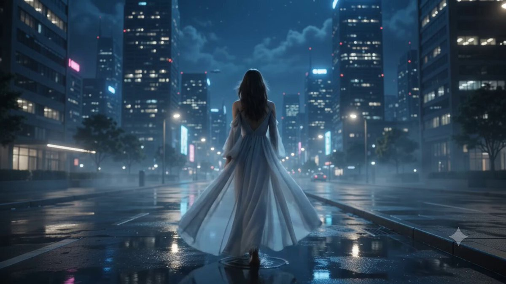
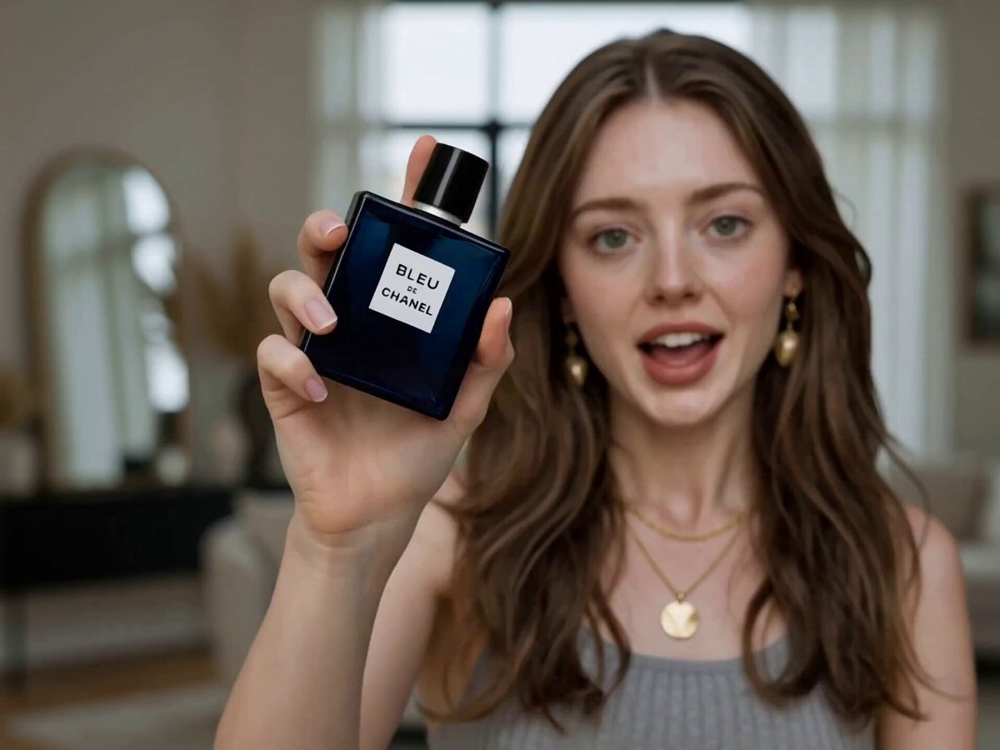
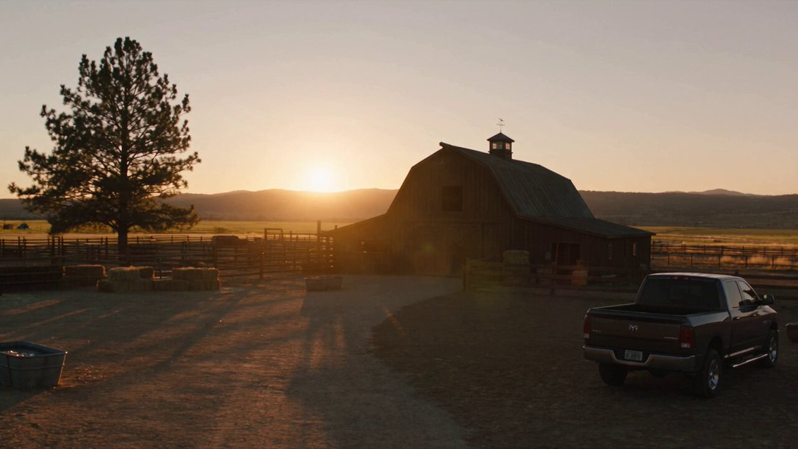

# Seedance 2.5 · 프롬프트 라이브러리 · Leadde.ai

[](README.md) [](README_zh.md) [](README_zh-TW.md) [](README_ja-JP.md) [](README_ko-KR.md) [](README_th-TH.md) [](README_vi-VN.md) [](README_hi-IN.md) [](README_es-ES.md) [-lightgrey)](README_es-419.md) [](README_de-DE.md) [](README_fr-FR.md) [](README_it-IT.md) [-lightgrey)](README_pt-BR.md) [](README_pt-PT.md) [](README_tr-TR.md)

**Best for:** Seedance prompts for motion, camera language, cinematic scenes, product videos, and short-form creative.

For PDF, PPT, SOP, training, and multilingual video workflows:
[Awesome Document-to-Video](https://github.com/LeaddeOpenLab/awesome-document-to-video)

> **매일 엄선하는 고품질 프롬프트**

AI 이미지, 영상, 3D 제작을 위한 완전한 프롬프트를 찾아보세요. 스타일별 분류, 다국어 버전, 원작자와 출처를 제공합니다.

[Leadde.ai 살펴보기 →](https://leadde.ai/?utm_source=github&utm_medium=readme&utm_campaign=prompt-library&utm_content=seedance2.5)

## Leadde.ai 소개

Leadde.ai는 문서, 슬라이드, 텍스트를 교육, 온보딩, 마케팅용 AI 비즈니스 영상으로 만드는 팀을 돕습니다.

저장소에 별을 눌러 매일 엄선한 프롬프트와 새로운 창작 아이디어를 확인하세요.

**36** 개 · 최근 추가: **2026-09-10**

<a name="catalog"></a>

## 카테고리 탐색

[사진술](#category-photography) · [시네마틱 / 영화 스틸컷](#category-cinematic-film-still) · [사이버펑크 / SF](#category-cyberpunk-sci-fi) · [기타](#category-other)

<a name="all-prompts"></a>

<a name="category-photography"></a>

## 사진술

<a name="prompt-2097837460910956650"></a>

### 번역 중

작성자：[@john87445528](https://x.com/john87445528) · [원본 게시물](https://x.com/john87445528/status/2097837460910956650)

사진술 · 캐릭터 · 패션 아이템 · 배포 완료

**요약:** 번역 중


**프롬프트**

```text
번역 중
```

[↑ 카테고리로 돌아가기](#catalog)

---

<a name="prompt-2096930655615758734"></a>

### 30초 극사실적 UGC 영상 프롬프트: 침실에서 직접 들고 찍는 일상 브이로그로, 새로 산 카메라를 보여주며 자연스럽게 이야기하는 젊은 한국 여성.

작성자：[@AIwithkhan](https://x.com/AIwithkhan) · [원본 게시물](https://x.com/AIwithkhan/status/2096930655615758734)

사진술 · 캐릭터 · 배포 완료

**요약:** 30초 극사실적 UGC 영상 프롬프트: 침실에서 직접 들고 찍는 일상 브이로그로, 새로 산 카메라를 보여주며 자연스럽게 이야기하는 젊은 한국 여성.


**프롬프트**

```text
자신의 침실에서 최근 새로 산 카메라에 대해 카메라를 보며 편안하게 이야기하는 20대 초반 한국 여성의 30초 분량 1080p 극사실적 UGC 영상을 제작하세요.
주요 피사체
20대 초반의 젊은 한국 여성, 자연스러운 미모, 사실적인 피부 결, 한 듯 안 한 듯한 옅은 메이크업, 얼굴 주변에 자연스럽게 잔머리가 흘러내린 채 느슨하게 묶은 흑발 웨이브 사이드 포니테일. 몸에 딱 맞는 파스텔 블루 크롭탑, 헐렁한 크림색 파자마 스타일 팬츠, 심플한 실버 목걸이 착용.
영상 전체에 걸쳐 그녀의 정확한 얼굴 이목구비, 헤어스타일, 의상, 신체 비율 및 전반적인 외모를 일관되게 유지하세요.
배경 설정
따스한 월요일 아침, 일반적인 한국 아파트 내 그녀의 아늑한 침실. 약간 헝클어진 흰색 침구 위 침대에 편안하게 앉아 있으며, 등 뒤에는 베개, 작은 협탁, 몇 가지 일상적인 개인 소지품이 있고 창문으로 부드럽고 자연스러운 아침 햇살이 비쳐 듭니다.
인위적으로 연출되거나 고급스럽지 않고, 실제 사람이 살고 있는 듯한 생생하고 진솔한 느낌의 방이어야 합니다.
UGC 스타일
그녀가 카메라를 직접 손에 쥐고 있거나 앞쪽 침대 위에 자연스럽게 세워두었습니다. 자연스러운 핸드헬드 흔들림, 가벼운 자동 초점 재조정, 간헐적인 노출 변화가 있는 약간은 불완전한 프레이밍.
잘 다듬어진 광고가 아닌, 팔로워들을 위해 촬영한 진솔한 개인 일상 브이로그 같은 느낌이어야 합니다.
행동 / 대사
침대에 양반다리를 하고 앉아 렌즈를 바라보며 미소 짓습니다.
그녀는 자연스럽게 말합니다:
“Okay, I finally got this camera I’ve been talking about.”
그녀는 부드럽게 웃으며 카메라를 들어 올려 잠깐 보여줍니다.
“I’ve only had it for like two days, but I already bring it everywhere.”
그녀는 카메라를 다시 내려놓고 베개에 기댑니다.
“I wanted something that feels a little more personal than just using my phone.”
방 안을 둘러본 뒤 다시 렌즈를 쳐다봅니다.
“The footage has this old-school look that I really love. It kind of feels like I’m recording memories instead of just posting videos.”
그녀는 미소를 지으며 흘러내린 머리카락 한 가닥을 귀 뒤로 넘깁니다.
영상 끝 무렵에 시계를 힐끗 보더니 웃으며 말합니다:
“Anyway, it’s Monday, I should probably get out of bed.”
자연스럽게 미소 지으며 녹화를 끄려는 듯 카메라를 향해 손을 뻗고, 그 동작 도중에 영상이 끊깁니다.
카메라 / 비주얼 룩
2000년대 초반 DV 감성이 은은하게 묻어나는 리얼한 UGC: 부드러운 디지털 디테일, 미세한 이미지 노이즈, 약간의 오토포커스 헌팅, 자연스러운 피부 질감과 따스한 아침 햇살. 드라마틱한 조명이나 영화 같은 카메라 워크 없음.
오디오
자연스러운 침실 앰비언스, 그녀의 목소리, 미세한 옷깃 스치는 소리, 먼 곳의 동네 소음 및 가벼운 카메라 조작음만 포함. 음악 없음, 내레이션 없음.
최종 느낌
편안한 한국 라이프스타일 크리에이터 콘텐츠. 자신의 방에서 촬영한 자연스러운 월요일 아침 브이로그처럼 따뜻하고 여성스러우며 친밀하고 현실감 넘치는 분위기.
네거티브
상업적인 연기, 완벽한 스튜디오 조명, 연출된 인플루언서 포즈, 인물 정체성 왜곡, 의상 변경, 일그러진 손, 여분의 손가락, 자막, 로고, 워터마크 또는 AI 아티팩트 없음.
```

[↑ 카테고리로 돌아가기](#catalog)

---

<a name="prompt-2096931238460178592"></a>

### 서울의 오래된 동네에서 평범하지만 잊지 못할 여름 저녁을 보내는 젊은 한국 여성의 모습을 섬세한 타임라인 액션, 핸드헬드 카메라의 질감 결함, 현장 앰비언트 오디오와 함께 담아낸 30초, 1080p, 16:9 비율의 극사실적인 2000년대 초반 DV 홈 비디오 제작.

작성자：[@SimplyAnnisa](https://x.com/SimplyAnnisa) · [원본 게시물](https://x.com/SimplyAnnisa/status/2096931238460178592)

사진술 · 캐릭터 · 배포 완료

**요약:** 서울의 오래된 동네에서 평범하지만 잊지 못할 여름 저녁을 보내는 젊은 한국 여성의 모습을 섬세한 타임라인 액션, 핸드헬드 카메라의 질감 결함, 현장 앰비언트 오디오와 함께 담아낸 30초, 1080p, 16:9 비율의 극사실적인 2000년대 초반 DV 홈 비디오 제작.


**프롬프트**

```text
서울의 한 오래된 동네에서 평범하지만 뜻밖으로 기억에 남는 여름 저녁을 보내는 젊은 한국 여성의 모습을 담은 30초, 1080p, 16:9 비율의 극사실적인 2000년대 초반 DV 홈 비디오를 제작해 주세요.

자연스러운 미모의 20대 초반 한국 여성으로, 사실적인 피부 결, 옅은 화장, 살짝 웨이브진 긴 검은 머리를 하고 있습니다. 옅은 하늘색 니트 상의, 헐렁한 크림색 바지, 흰색 운동화, 갈색 크로스백, 은색 손목시계를 착용하고 있습니다. 그녀의 정체성, 얼굴, 의상, 헤어스타일 및 신체 비율을 완벽하게 일관되게 유지해 주세요.

배경 설정

콘크리트 골목길, 다세대 연립 주택, 화분, 자전거, 전신주, 잎이 무성한 나무들, 그리고 작은 동네 구멍가게가 있는 조용한 서울의 오래된 주택가 골목길입니다. 사람 사는 냄새가 나고 진정성이 느껴집니다. 브랜드, 로고, 광고판, 관광 명소는 전혀 없습니다.

카메라 스타일

2000년대 초반 저가형 DV 캠코더로 찍은 듯한 로우 풋티지: 흔들리는 핸드헬드 움직임, 불완전한 프레이밍, 초점을 잡으려고 방황하는 오토포커스(AF 헌팅), 노출 변화, 바랜 색감, 부드러운 디테일, 가벼운 테이프 노이즈, 의도치 않은 줌 인/아웃, 자연스러운 촬영 실수들. 손떨림 보정이나 영화 같은 앵글은 없습니다.

00:00–00:06 — 미스터리

작은 비닐봉지를 손에 들고 골목길을 걸어가던 그녀는 등 뒤에서 희미하게 울리는 딸랑거리는 소리를 갑자기 듣습니다.

그녀는 멈춰 서서 주위를 둘러봅니다.

카메라는 어리둥절한 그녀의 얼굴을 향해 빠르게 줌인합니다.

그녀가 말합니다:

“Did you hear that?” ("너도 들었어?")

00:06–00:12 — 작은 발견

그녀는 소리를 따라가다 벨 뚜껑이 살짝 벌어져 걸려 있는 작고 낡은 자전거를 발견합니다.

그녀가 벨을 톡 건드립니다.

따르릉.

그녀는 카메라를 쳐다보며 웃습니다.

그러다 자전거에 걸려 있는 손글씨 느낌의 작은 종이 태그를 발견하지만, 글씨가 너무 흐릿해서 읽을 수 없습니다.

00:12–00:18 — 바람

갑자기 불어온 산들바람에 마른 나뭇잎 몇 장이 골목을 가로질러 날아옵니다.

그중 한 장이 그녀의 머리 위에 툭 떨어집니다.

그녀는 눈치채지 못합니다.

촬영자가 웃음을 터뜨립니다.

그녀는 어리둥절해하다가 곧 알아차리고 머리에서 나뭇잎을 떼어냅니다.

그녀는 머쓱한 표정으로 카메라를 흘겨봅니다.

00:18–00:24 — 작은 도전

그녀는 그 나뭇잎을 자전거 안장 위에 올려놓고 중심을 잡아 세워보려 합니다.

하지만 바람이 즉시 나뭇잎을 날려버립니다.

그녀는 다시 시도합니다.

나뭇잎이 또 떨어집니다.

그녀는 웃음을 터뜨리며 결국 포기합니다.

00:24–00:30 — 추억

그녀는 나뭇잎을 집어 들어 자신의 작은 가방에 넣고 다시 집으로 걸어가기 시작합니다.

몇 걸음 걷다가, 그녀는 카메라를 돌아보며 말합니다:

“Okay, that was pointless.” ("그래, 진짜 쓸데없는 짓이었다.")

그녀는 미소를 지으며 계속 걸어갑니다.

카메라는 몇 초 동안 그녀를 따라가다 갑작스럽게 블랙아웃으로 페이드아웃(암전)됩니다.

오디오

자연스러운 현장음만 포함: 발소리, 멀리서 들리는 차량 소리, 자전거 벨 소리, 여름 벌레 울음소리, 나뭇잎 스치는 소리, 바람 소리, 동네 앰비언스, 그리고 자연스러운 웃음소리.

음악, 내레이션, 자막, 캡션, 로고, 워터마크 또는 화면상의 텍스트 없음.

사실성

자연스러운 사람의 반응, 정형화되지 않은 타이밍, 사실적인 물리 법칙, 일관성 있는 사물, 진짜 한국 동네 골목의 디테일, 그리고 신뢰감을 주는 DV 카메라의 결함 표현. CGI 느낌, 왜곡된 손, 여분의 손가락, 복제된 인물, 인물 외모 변화 또는 의상 변경 없음.

16:9 화면비.
```

[↑ 카테고리로 돌아가기](#catalog)

---

<a name="prompt-2097181982924984513"></a>

### 조용한 주택가에서 상세한 시간대별 장면 타임스탬프와 함께 담아낸 2000년대 초반 DV 캠코더 홈 비디오 미학의 진짜 인도네시아 여성.

작성자：[@QAiStudio](https://x.com/QAiStudio) · [원본 게시물](https://x.com/QAiStudio/status/2097181982924984513)

사진술 · 캐릭터 · 배포 완료

**요약:** 조용한 주택가에서 상세한 시간대별 장면 타임스탬프와 함께 담아낸 2000년대 초반 DV 캠코더 홈 비디오 미학의 진짜 인도네시아 여성.


**프롬프트**

```text
진짜 인도네시아 여성, 2000년대 초반 인도네시아 홈 비디오 미학. 그녀의 고유한 얼굴, 정체성, 헤어스타일, 이목구비, 피부 톤, 신체 비율, 자연스러운 겨드랑이 털, 올리브 그린 색상의 바랜 민소매 크롭탑, 헐렁한 하이웨이스트 연청바지, 검은색 캔버스 스니커즈, 검은색 줄 목걸이, 검은색 웨이브 머리, 옆으로 넘긴 앞머리, 부스스하게 묶은 포니테일을 그대로 유지.

평범하고 조용한 인도네시아 주택가: 좁은 콘크리트 골목길, 소박한 단층 주택, 작은 테라스, 낮은 담장, 화분, 주차된 오토바이, 커다란 나무, 머리 위로 엉킨 전선들. 상점이나 상업 활동 없음.

00:00–00:03: 그녀가 테라스 바닥에 앉아 공책에 낙서를 하고 있다. 핸드헬드 카메라가 위/측면에서 맴돌듯 비춘다.
00:03–00:07: 그녀가 펜으로 턱을 톡톡 치며 옅은 미소를 짓더니 다시 그림을 그린다. 카메라는 그녀의 얼굴과 손 사이를 배회한다.
00:07–00:10: 돗자리에 누워 콘크리트 바닥을 기어가는 개미들을 관찰한다.
00:10–00:13: 개미 근처를 살짝 찌르며 부드럽게 웃는다.
00:13–00:17: 낮은 담장으로 걸어가 가볍게 올라앉아 다리를 흔든다.
00:17–00:20: 조용한 거리를 바라보며 무심하게 감자칩을 먹는다.
00:20–00:24: 어깨에 수건을 두른 채 젖은 머리로 계단에 앉아 천천히 머리를 빗는다.
00:24–00:27: 젖은 머리를 빗는 그녀의 핸드헬드 클로즈업 샷, 물방울이 보인다.
00:27–00:30: 빗질을 마치고 젖은 머리를 뒤로 넘기며 카메라를 바라보고 자연스럽게 미소 짓는다. 갑작스럽게 암전.

극도로 날것 그대로인 핸드헬드 DV 캠코더 리얼리즘: 거친 흔들림, 미세한 떨림, 우발적인 프레이밍, 비중앙 구도, 가끔 얼굴이 잘리는 앵글, 오토포커스 버벅임, 노출 변동, 모션 블러, 롤링 셔터 현상, 빛바랜/채도 낮은 색감, 디지털 노이즈 및 압축 결함. 포즈 연출, 손떨림 보정, 영화 같은 느낌, 패션 화보식 스타일링, 현대적인 색보정이나 음악 없음. 오직 자연스러운 아침 앰비언스 사운드만 존재: 새소리, 산들바람, 멀리서 들리는 오토바이 소리, 이웃들의 웅성거림, 종이 긁는 소리, 과자 봉지 소리, 나뭇잎 소리, 빗질 소리. 16:9.
```

[↑ 카테고리로 돌아가기](#catalog)

---

<a name="prompt-2097185861259727263"></a>

### 일몰 수산시장과 해변 산책부터 자정의 방파제까지의 저녁 여정을 담아낸 30초 분량의 한국 바닷가 여행 브이로그용 극사실주의 프롬프트.

작성자：[@nawalsehar](https://x.com/nawalsehar) · [원본 게시물](https://x.com/nawalsehar/status/2097185861259727263)

사진술 · 풍경 / 자연 · 배포 완료

**요약:** 일몰 수산시장과 해변 산책부터 자정의 방파제까지의 저녁 여정을 담아낸 30초 분량의 한국 바닷가 여행 브이로그용 극사실주의 프롬프트.


**프롬프트**

```text
평화로운 해안 마을에서 보낸 어느 날 저녁을 따라가는 젊은 한국 여성을 주인공으로 한 30초 분량의 극사실주의 실사 한국 바닷가 여행 브이로그를 제작하세요. 신선한 해산물, 젖은 바닥, 석양 빛이 어우러진 활기찬 수산시장에서 시작합니다. 그녀는 아늑한 전통 한옥 게스트하우스에 체크인한 뒤, 골든 아워 동안 발밑으로 파도가 밀려오는 해변을 맨발로 걷습니다. 이어서 갓 구운 해산물을 즐기며 주변 환경과 자연스럽게 교감하는 따뜻한 분위기의 밤 수산시장으로 전환됩니다. 마지막은 자정 무렵 조용한 방파제 옆에서 먼바다의 고깃배 불빛과 발아래 부서지는 파도를 바라보며 어두운 바다를 응시하는 장면으로 끝납니다. 2026년 스타일의 실감 나는 스마트폰/시네마 카메라 브이로그 연출, 자연스러운 한국의 환경, 사실적인 피부, 머리카락, 의복, 물, 음식, 연기, 파도 및 인물 움직임. 핸드헬드 카메라, 자연스러운 자동 초점, 노출 변화 및 사실적인 모션 블러. 영어 대화만 포함, 자연스러운 환경음, 배경음악이나 내레이션 없음. 사실적인 물리 법칙, 조명, 부드러운 움직임 및 즉흥적인 표정을 매우 강조함. CGI, 애니메이션, 자막, 로고 또는 워터마크 없음.
```

[↑ 카테고리로 돌아가기](#catalog)

---

<a name="prompt-2097186378861953475"></a>

### 버스를 놓친 후 조용한 마을을 탐방하는 젊은 여성을 따라가는 자연스러운 조명과 핸드헬드 카메라 스타일의 30초 사실적인 일본 산골 마을 여행 브이로그를 제작해 주세요.

작성자：[@aiwithaly](https://x.com/aiwithaly) · [원본 게시물](https://x.com/aiwithaly/status/2097186378861953475)

사진술 · 캐릭터 · 풍경 / 자연 · 배포 완료

**요약:** 버스를 놓친 후 조용한 마을을 탐방하는 젊은 여성을 따라가는 자연스러운 조명과 핸드헬드 카메라 스타일의 30초 사실적인 일본 산골 마을 여행 브이로그를 제작해 주세요.


**프롬프트**

```text
버스를 놓쳐 조용한 마을을 25분 동안 탐방하는 젊은 일본인 여성을 따라가는 30초 분량의 사실적인 일본 산골 마을 여행 브이로그를 제작해 주세요. 떠나는 버스를 쫓아 달리는 모습 → 시간표 확인 → 한적한 거리를 걷고 붉은 다리를 건너는 모습 → 전통 찻집 발견 → 따뜻한 녹차 음미 → 골든 아워의 산 풍경 감상 → 다음 버스 도착 소리를 듣고 정류장으로 돌아가는 모습을 보여줍니다.

2026년 스타일의 실감 나는 여행 영상, 자연스러운 일본 풍경, 사실적인 걸음걸이와 인물 움직임, 바람에 흩날리는 머리카락과 옷자락, 흐르는 시냇물, 김이 피어오르는 차, 자연스러운 버스 물리 역학 및 골든 아워 조명. 자연스러운 자동 초점, 노출 변화, 미세한 모션 블러가 있는 핸드헬드 스마트폰/시네마 카메라 스타일. 영어 대화만 포함, 사실적인 마을 앰비언스 사운드, 배경 음악 없음. CGI, 애니메이션, VHS 질감, 자막, 로고, 워터마크 제외.
```

[↑ 카테고리로 돌아가기](#catalog)

---

<a name="prompt-2097097582262825180"></a>

### 15秒第一人称视角的台球厅暧昧喜剧视频提示词，包含详细的分镜时间线、人物互动、运镜方式、台球局轨迹及音频与负面约束。

작성자：[@john87445528](https://x.com/john87445528) · [원본 게시물](https://x.com/john87445528/status/2097097582262825180)

만화 / 스토리보드 · 사진술 · 캐릭터 · 배포 완료

**요약:** 15秒第一人称视角的台球厅暧昧喜剧视频提示词，包含详细的分镜时间线、人物互动、运镜方式、台球局轨迹及音频与负面约束。


**프롬프트**

```text
｜15秒｜男主第一人称｜海妖风暧昧喜剧 【剧情锁定】 成年女主角#1发现男主准备击球，故意走进他的视野，主动侧坐上台球桌，屈起一条腿，让预定#2服装原有剪裁自然呈现大腿线条，以海妖风眼神和姿态干扰瞄准。男主停杆、抬头，她以为自己的小心思奏效；男主却不耐烦地倒转球杆，用橡胶粗端隔着衣服轻顶她臀侧一下，催她下桌。她被识破后调皮又无奈地让开，男主立即继续击球，母球撞中目标球，目标球落袋。 必须完整呈现“她先站着—主动上桌—故意展示腿部线条并观察他的反应”。她明知会干扰打球，仍主动试探；不能开场便让她已经坐好，也不能演成偶然挡路。 【人物与服装】 画面中唯一可见的人物是成年女主角#1
，面孔、发型、体型保持一致。#1完整穿着预定#2
屏幕截图_31-8-2026_22160_jimeng.jianying.com
服装，带着装饰眼镜
包括既定丝袜
和配饰；#2仅是服装编号，绝不生成第二个人物。腿部呈现服从#2本身的长度、开口和袜装，不能为了露腿改变剪裁、消除袜子或凭空缩短衣服。 成年男主只提供第一人称视点、唯一一支球杆和一句画外对白。脸、身体、手臂、双手、影子、倒影均不入画。全片不出现其他人或人物复制。 【影像与拍摄关系】 9:16竖屏，1080×1920，30fps，约26—28mm等效视角。男主佩戴贴近眼线的轻型头戴相机，保留未经处理的手机视频观感。低头看球、抬头看人、直起身体均带动真实镜头运动。男主无需手持摄影设备，可以正常操杆；握杆手和架杆手始终位于取景下缘之外。 全程连续第一人称，不切到男主正面、第三人称或外部全景。轻微呼吸起伏、头部晃动和不完美重新构图；从白球转看#1时，对焦允许短暂迟疑。冷白顶灯照明，肤色和衣料保留纹理，暗部带少量手机噪点；快速调杆有适量运动模糊，但不能糊掉端头交换。无美颜、磨皮、电影调色和稳定器运镜。 构图以能读懂人物动作为先：上桌时保留她扶库边的手、坐下的位置和两腿变化；试探时让脸与腿部线条同时在画面内；赶人时让表情和球杆粗端同时可见；最后回到白球、红球、中袋的完整路线。镜头不长时间追着某一处身体，也不能为了看脸把上桌和调杆动作裁掉。 【台球厅环境】 普通室内台球厅，绿色台呢、红棕色木质库边、黑色桌体、银色边框和白色网兜球袋。背景为深灰与棕色竖向墙板、浅色百叶窗、深绿色等候椅，顶灯将桌面照得比背景明亮。远处可见另一张无人使用的球桌，环境朴素、有实际使用痕迹，整体空间和光线全程不变。 没有酒吧灯光、粉色爱心、霓虹装饰、豪华软包或摄影棚布景。镜头范围内不出现其他顾客、工作人员、人像海报或镜面反射。 【空间与球局】 男主位于近侧长库边中央，#1开始站在对面长库边、画面右侧。两人隔着约1.3米的桌宽相对，不能改成隔着整张球桌的长度。对面中袋位于画面上方中央，始终是明确的落袋目标。 桌上起始共有四颗球：一颗白色母球、一颗红色实心目标球、一颗蓝球、一颗黄球。白球位于近半台中央；红球在对面中袋前约25厘米，白球、红球、中袋形成容易看清的直线。蓝球与黄球分别停在左右远离球路的位置，全程静止。 #1坐在对面中袋右侧的库边，身体斜向镜头；一条屈腿轻放在台面右侧边缘，另一条腿垂在桌外。她的腿部和上身进入男主瞄准视野，但不踩球、不压球、不把腿跨在两球之间。她必须下桌后男主才击球。 她坐下前，白球到红球、红球到中袋的路线已在开场建立；她坐下后，屈腿位于这条路线右侧，进入视野并分散注意，但实际球路没有被身体堵死。她收腿下桌的过程中不得碰动任何球。球位从开头直到出杆保持不变，观众能用同一组位置看懂男主始终想打哪一球。 【海妖风与结尾表情】 坐姿呈自然S曲线：身体微侧，肩部下沉，颈部拉长，下巴轻轻侧抬，腰胯略向一侧移。屈腿与垂腿前后错位，大腿线条在人物整体中自然可见；左手撑库边，右手只整理一次发丝。半垂眼冷感直视男主，嘴角仅有很淡的试探笑意。 前半段冷艳、克制、有距离感；后半段按剧情允许出现调皮、无奈的微笑。她被识破后不惊恐、不生气，也不狼狈尖叫，而是嘴角先停半拍，随后侧眼抿笑、小幅摇头，像在用表情说“行吧，你就知道打球”。这句话不实际说出，不加字幕。 暧昧必须通过相互观察表现：她每次调整坐姿后都会瞥一眼杆头，看到杆头停住才露出得意；男主的镜头则反复从她回到红球，留下他其实更在乎球局的线索。前半段的腿部展示、后半段的调皮笑都属于成年人的轻松玩笑，保持自然、从容，不用夸张表情代替剧情。 【球杆连续性】 唯一一支约145厘米的台球杆：浅木色细杆、细小蓝色皮头、深色粗握柄、尾部黑色橡胶保护帽。细头用于击球，橡胶粗端用于一次轻微赶人动作。 调头是端对端转过180度。必须连续看见：细头离开白球并撤回；同一杆身斜向扫过镜头前方；细头转向侧下方，粗握柄和黑色尾帽从另一侧绕出；最终黑色粗端指向#1。握持点可以藏在下缘，杆身不能整根退出后突然换成另一端，也不能只沿长轴自转。 翻杆时杆身经过人物前方，必须与她保持明显的前后距离，不扫到头发、面部或肩膀。橡胶尾帽靠近臀侧后仅短暂接触一次，随即离开；接下来由#1自己撑住库边、收腿、滑下。她的身体运动、衣料变化与接触顺序同步，不能先下桌再补拍顶人的动作。 【严格时间分镜】 → 0—3秒，第一人称俯看球桌。白球、红球、中袋与左右静止的蓝黄两球同时建立，细杆头正在白球后方试瞄。 原本站在对面长库边右侧的#1先看一眼球杆方向，再看向镜头。她主动扶住库边，侧身坐上去，屈起一条腿放到台面边缘，另一条腿垂在桌外。坐下、抬腿和衣料自然形成褶皱的过程连续可见，#2原有剪裁呈现大腿线条。镜头随男主抬头，从球路转向她的完整坐姿。 → 3—5.5秒，保持#1面部、上身和腿部同框的中景。她肩部放松下沉、颈部拉长，身体形成S曲线，指尖整理发丝，半垂眼看着镜头，随后把视线短暂移向球杆，确认男主是否停下。 球杆停止试瞄。镜头略低头看球，又抬回她脸上。#1看见这个反应，嘴角慢慢浮起一丝笃定笑意，屈起的膝盖略向侧面调整，使大腿线条更完整。动作明显带有故意干扰的试探，但不拉扯衣摆。 → 5.5—7秒，球杆再次靠近白球，却仍未击打。男主短促呼气，镜头随他直起身体升高，发出略带火气、不耐烦的成年男声：“让开，让开。” #1没有立刻移动，只轻轻侧头，半垂眼望着他，嘴角还保留着以为自己成功的笑意。 → 7—8.5秒，完整展示调转球杆。浅木色细头先从白球后方撤回，同一杆身斜贯画面前景，细头沿侧下方转走；深色粗柄与黑色橡胶尾帽从另一侧转到正前方，完成端对端半圈翻转。 相机有轻微头部晃动，但始终让杆身的一部分留在画面中。最终画面下方清楚出现朝向#1的黑色橡胶粗端，细头已经朝向男主一侧。 → 8.5—10秒，男主将粗端越过桌面，隔着完整#2服装，在#1靠台面一侧的臀部外侧短促轻顶一下，随即撤开。人物中景同时交代她的脸、姿态、库边和接触动作，不切局部特写。 #1低头看一眼黑色杆尾，嘴角原来的笃定笑意停住半拍。她明白男主完全没有配合自己的试探，主动双手撑库边，把屈起的腿收出台面，顺势向桌外滑下。动作由她自身支撑完成，不被顶飞，也不跌倒。 → 10—11秒，#1双脚落地后向画面右侧让开半步，鞋底落地声清楚。她侧眼看向男主，抿住忍不住扬起的嘴角，轻轻摇一次头，带一点“被你看穿了”的调皮无奈。 她身体重新微侧，颈线拉长，维持冷艳基调；不是慌张、恼怒、委屈或被羞辱的表情。 → 11—12秒，球杆粗端收回，按先前相反的路径端对端调转：黑色尾帽转向下缘，浅木色杆身和蓝色细皮头重新指向白球。镜头随男主低头回到球路，细头停在白球后方，#1已经完全让出观察方向。 → 12—14秒，男主平稳出杆一次，细皮头实际接触白球，发出清楚的“嗒”。白球先滚动，再撞上红球；红球沿直线滚向对面中袋，越过袋沿并落进白色网兜，发出真实的落袋声。 白球碰撞后留在台面，减速停下；蓝球和黄球原地不动。落袋后桌上剩白、蓝、黄三颗球，红球不能再次出现在桌面。 → 14—15秒，镜头从空出的中袋略抬向右侧。#1站在桌旁，目光先扫过落袋位置，再回到男主，半垂眼侧视，嘴角带着克制的调皮笑意，轻轻呼出一口气。 她保持自然S曲线和前后错位的双腿，一副小计策失败却又拿他没办法的模样。男主没有搭话，结尾停在她无奈抿笑的反应上。 【音频】 现场同期声：通风设备、远处模糊人声、坐上库边的衣料摩擦、球杆转动的轻响、鞋底落地、击球、球体碰撞与落袋声。唯一对白来自镜头后方成年男主：“让开，让开。”#1用表情完成反应。无背景音乐、旁白、解释性对白和罐头笑声。 【负面约束】 不得省略主动上桌和故意干扰；不得只拍她已经坐好的状态；不得把大腿裁出画面，也不得使用裙底角度或腿臀慢扫；不得改变#2服装或露出内衣；不得复制人物、肢体、球和球杆；不得出现男主或第二个#1；不得把翻杆省略成杆子退出后换端；不得用细头顶人、反复顶撞、造成受伤或摔落；不得让#1做惊恐、愤怒或委屈反应；不得省略白球撞红球和红球真实落袋；不得白球入袋代替红球，不得目标球凭空消失；不得出现字幕、水印、平台UI、爱心贴纸、慢动作或电影滤镜。
```

[↑ 카테고리로 돌아가기](#catalog)

---

<a name="category-cinematic-film-still"></a>

## 시네마틱 / 영화 스틸컷

<a name="prompt-2097942616415568240"></a>

### 번역 중

작성자：[@IsabelWhite24](https://x.com/IsabelWhite24) · [원본 게시물](https://x.com/IsabelWhite24/status/2097942616415568240)

시네마틱 / 영화 스틸컷 · 사이버펑크 / SF · 캐릭터 · 풍경 / 자연 · 배포 완료

**요약:** 번역 중



**프롬프트**

```text
번역 중
```

[↑ 카테고리로 돌아가기](#catalog)

---

<a name="prompt-2097901351049294063"></a>

### 여름 저녁 시골 카운티 축제에 간 여성을 담은 30초 분량의 사실적인 브이로그 동영상 프롬프트.

작성자：[@nawalsehar](https://x.com/nawalsehar) · [원본 게시물](https://x.com/nawalsehar/status/2097901351049294063)

시네마틱 / 영화 스틸컷 · 캐릭터 · 배포 완료

**요약:** 여름 저녁 시골 카운티 축제에 간 여성을 담은 30초 분량의 사실적인 브이로그 동영상 프롬프트.


**프롬프트**

```text
따뜻한 여름 저녁, 젊은 미국인 여성을 따라가는 30초 분량의 초극사실적 시네마틱 미국 카운티 페어(카운티 축제) 브이로그를 제작하세요. 금빛 노을이 잦아드는 가운데 그녀가 소규모 시골 축제장에 들어서는 것으로 시작하여, 대관람차를 타고, 갓 튀겨낸 퍼널 케이크를 나눠 먹고, 링 던지기 게임을 해보고, 가족들과 지역 상인들 사이를 거닐며, 라이브 컨트리 밴드의 공연을 듣고, 밤하늘을 수놓는 불꽃놀이를 감상합니다.

먼지 날리는 오솔길, 픽업트럭, 음식 가판대, 목재 부스, 줄조명, 아이들, 가족들, 농경지, 환하게 빛나는 카니발 놀이기구 등을 통해 축제장에 진정한 현지 정취와 삶의 흔적을 담아내세요. 전체적으로 일관된 인물의 외모와 의상을 유지하세요.

사실적인 2026년 스타일 핸드헬드 브이로그 촬영 기법, 자연스러운 표정, 미세한 카메라 흔들림, 사실적인 저녁 조명, 자연스러운 군중의 행동 및 물리적으로 정확한 움직임을 구현하세요. 디테일한 음식, 눈 같은 슈가 파우더, 놀이기구의 기계 장치, 던져진 링, 불꽃놀이, 흩날리는 연기, 바람, 빛 반사를 세밀하게 포착하세요.

오직 자연스러운 축제장 음향과 라이브 음악만을 사용하고, 짧고 입술 싱크가 맞는 미국식 영어 대화를 포함하세요. 내레이션, 자막, CGI, 애니메이션, 인위적인 군중, 비현실적인 물리 법칙, 떠다니는 카메라, 로고 또는 워터마크는 일체 제외합니다.
```

[↑ 카테고리로 돌아가기](#catalog)

---

<a name="prompt-2097502400961761425"></a>

### 열대 꽃 계곡에서 놀고 있는 어린 사내아이와 진주빛 흰색 아기 드래곤의 3D 애니메이션 영화 장면.

작성자：[@Zarnab\_with\_Ai](https://x.com/Zarnab_with_Ai) · [원본 게시물](https://x.com/Zarnab_with_Ai/status/2097502400961761425)

시네마틱 / 영화 스틸컷 · 3D 렌더링 · 캐릭터 · 동물 / 생명체 · 배포 완료

**요약:** 열대 꽃 계곡에서 놀고 있는 어린 사내아이와 진주빛 흰색 아기 드래곤의 3D 애니메이션 영화 장면.


**프롬프트**

```text
다채롭고 영화 같은 스타일로 고품질 3D 애니메이션 판타지 장면을 제작하세요.

헝클어진 검은 머리와 수수한 베이지색 옷을 입은 귀여운 어린 사내아이가 친근한 아기 드래곤 곁의 아름다운 꽃밭 속에 앉아 놀고 있습니다. 드래곤은 크고 사랑스러우며, 은은한 푸른빛이 감도는 진주빛 흰색 몸에 작은 뿔, 표정이 풍부한 밝은 파란 눈, 머리와 목 주변의 부드러운 깃털 같은 비늘, 그리고 길고 우아한 꼬리를 가지고 있습니다.

배경은 울창하고 푸른 산, 맑고 투명한 청록색 물, 열대 나무, 부드러운 흰 구름이 떠 있는 맑고 푸른 하늘로 둘러싸인 마법 같은 열대 계곡입니다.

어린아이가 곁에 앉아 있는 동안 선명한 분홍빛 붉은 꽃들 사이에서 평화롭게 휴식을 취하고 있는 잠자는 아기 드래곤의 클로즈업 샷으로 시작합니다. 드래곤은 천천히 눈을 뜨고 호기심 어린 눈빛으로 주변을 둘러보며 귀엽고 장난스러운 표정을 짓습니다.

물가 근처의 아름다운 푸른 꽃밭에 드래곤과 아이가 둘러싸인 더 넓은 샷으로 전환됩니다. 아이가 바라보며 웃는 동안 드래곤은 꽃밭 사이로 장난스럽게 뒤로 데굴데굴 구릅니다.

아름다운 섬 같은 풍경, 꽃이 만발한 들판, 열대 나무, 산, 청록색 물이 드러나는 영화 같은 항공 와이드 샷을 보여줍니다. 근처 나무 주변에서 알록달록한 작은 새들이 날아다니고 폴짝거리는 가운데, 그 아래에서는 아이와 드래곤이 함께 놀고 있습니다.

그런 다음 드래곤의 등에 앉아 있는 아이의 클로즈업으로 돌아옵니다. 아이가 행복하게 웃자 드래곤은 우스꽝스럽고 장난기 가득한 표정을 짓습니다.

거대한 다채로운 꽃 풀밭에서 아이와 사랑스러운 드래곤이 함께 평화롭게 누워 미소를 지으며 이 마법 같은 순간을 즐기는 모습으로 마무리됩니다.

부드러운 캐릭터 애니메이션, 풍부한 감정 표현, 자연스러운 신체 움직임, 영화 같은 카메라 전환, 얕은 심도, 부드러운 볼류메트릭 조명, 생생한 색감, 정교한 3D 텍스처, 온 가족이 즐길 수 있는 마법 같은 분위기, 완성도 높은 애니메이션 영화 품질, 따뜻하고 감동적인 톤을 사용하세요.

텍스트 없음, 자막 없음, 워터마크 없음.
화면비: 16:9.
재생 시간: 약 15초.
```

[↑ 카테고리로 돌아가기](#catalog)

---

<a name="prompt-2096826123330138410"></a>

### 골든 아워의 눈 덮인 알파인 슬로프에서 크림색 인조 모피 코트를 입고 흰색 스키를 멘 금발 여성의 영화 같은 패션 샷.

작성자：[@noorlewisx](https://x.com/noorlewisx) · [원본 게시물](https://x.com/noorlewisx/status/2096826123330138410)

시네마틱 / 영화 스틸컷 · 캐릭터 · 패션 아이템 · 배포 완료

**요약:** 골든 아워의 눈 덮인 알파인 슬로프에서 크림색 인조 모피 코트를 입고 흰색 스키를 멘 금발 여성의 영화 같은 패션 샷.


**프롬프트**

```text
영화 같은 패션 영화 스틸 컷, 로우 앵글 샷, 골든 아워의 햇살 가득한 눈 덮인 알파인 산비탈에서 카메라를 향해 걸어오는 웨이브 진 더티 블론드 머리와 갈색 눈을 가진 아름다운 젊은 여성. 그녀는 화이트 골지 크롭 탑과 매칭되는 화이트 쇼츠 위에 오버사이즈 크림색 인조 모피 코트를 입고, 화이트 털 스키 부츠와 화이트 장갑을 착용하고 있다. 그녀는 검은색 바인딩이 달린 매끈한 화이트 스키 한 쌍을 한쪽 어깨에 메고 있다. 얕은 피사계 심도와 보케가 있는 극단적 전경의 반짝이는 결정형 눈, 눈 덮인 봉우리와 맑은 푸른빛에서 황혼으로 이어지는 하늘이 있는 배경, 드라마틱한 림 라이팅, 하이패션 에디토리얼 사진, 35mm 필름 그레인, 초현실적, 사실적 포토리얼리즘, 8k
```

[↑ 카테고리로 돌아가기](#catalog)

---

<a name="prompt-2097303258171949530"></a>

### 번역 중

작성자：[@Strength04\_X](https://x.com/Strength04_X) · [원본 게시물](https://x.com/Strength04_X/status/2097303258171949530)

시네마틱 / 영화 스틸컷 · 캐릭터 · 패션 아이템 · 배포 완료

원본 게시물：[@Strength04\_X](https://x.com/Strength04_X) · [원본 게시물](https://x.com/Strength04_X/status/2097272589387546831)

**요약:** 번역 중


**프롬프트**

```text
번역 중
```

[↑ 카테고리로 돌아가기](#catalog)

---

<a name="prompt-2096984350055436729"></a>

### 번역 중

작성자：[@TanLuAI](https://x.com/TanLuAI) · [원본 게시물](https://x.com/TanLuAI/status/2096984350055436729)

시네마틱 / 영화 스틸컷 · 배포 완료

**요약:** 번역 중


**프롬프트**

```text
번역 중
```

[↑ 카테고리로 돌아가기](#catalog)

---

<a name="prompt-2097249504986644872"></a>

### 30초 아트토이 블라인드 박스 언박싱 및 실사 변신 비트 싱크 비디오 생성 프롬프트로, 글로벌 설정, 멀티 숏 콘티 동작, 대사 및 네거티브 프롬프트를 상세하게 규정함.

작성자：[@johnAGI168](https://x.com/johnAGI168) · [원본 게시물](https://x.com/johnAGI168/status/2097249504986644872)

만화 / 스토리보드 · 시네마틱 / 영화 스틸컷 · 배포 완료

**요약:** 30초 아트토이 블라인드 박스 언박싱 및 실사 변신 비트 싱크 비디오 생성 프롬프트로, 글로벌 설정, 멀티 숏 콘티 동작, 대사 및 네거티브 프롬프트를 상세하게 규정함.


**프롬프트**

```text
Duration: 30초
Aspect ratio: 
人物参考: ​ 
Language: 중국어 보통화
Audio: 영상 전체에서 여성 음성 대사는 단 두 마디뿐; 중반부는 트렌디한 일렉트로닉 음악과 트랜지션 음향 효과만 존재; 기타 내레이션 없음, 기타 대사 없음, 자막 없음
Style: 사실적인 모바일 언박싱 브이로그＋고퀄리티 아트토이 변신 쇼, 빠른 템포의 비트 싱크 편집

GLOBAL CONTINUITY

여주인공:
전체 영상에서 이미지 1의 성인 여성 한 명만 등장하며, 이목구비와 체형을 일관되게 유지. 오프닝 헤어스타일과 의상은 레퍼런스 이미지를 그대로 따르며; 변신이 트리거된 후에만 블라인드 박스 피규어와 동일한 스타일로 변경됨.

오리지널 블라인드 박스 디자인:
블루·퍼플 성운 시크릿 모델. 블랙·실버 다면체 블라인드 박스 패키지, 표면에는 블루·퍼플 오로라 그라데이션, 전면에는 투명한 별 모양 창이 있으며, 브랜드 텍스트 없음.

피규어:
피규어의 이목구비는 이미지 1을 프로토타입으로 하며, 정교한 아트토이 비율 적용. 가르마를 중심으로 반반 나뉜 헤어 컬러: 화면 기준 왼쪽은 일렉트릭 블루, 오른쪽은 네뷸라 퍼플, 가지런한 앞머리, 두 갈래의 그라데이션 땋은 머리. 실버 화이트 비대칭 미니스커트, 투명 블루·퍼플 숄, 별 모양 허리 체인 및 실버 통굽 숏부츠 착용.

실사 변신 스타일링:
피규어의 반은 파랗고 반은 보라색인 헤어, 메이크업, 의상 및 액세서리를 완벽히 재현하되, 실제 성인 여성의 신체 비율을 유지하며 카툰형 몸매로 변하지 않음.

SHOT 1（00:00-00:04.00）자신만의 시크릿 모델 뽑기

장면:
아늑하고 모던한 침실, 여주인공이 테이블 앞에 앉아 있고, 테이블 위에는 블루·퍼플 성운 블라인드 박스 하나만 놓여 있음.

동작:
-00:01.50: 여주인공이 포장 비닐을 뜯고, 다면체 상자 뚜껑을 열어 내부에서 은색 포장 봉투를 꺼냄.
.50-00:02.50: 그녀가 포장 봉투를 뜯고 피규어를 왼손 손바닥에 쏟아냄.
.50-00:04.00: 그녀가 고개를 숙여 피규어의 얼굴을 똑똑히 확인하고 눈을 크게 뜨며, 고개를 들어 카메라를 쳐다본 후 다시 피규어를 바라봄.

음성 내용①:
“我去，这么帅！”

어조:
빠르고, 놀랍고, 진솔함, 자연스러운 입 모양과 정확한 중국어 립싱크.

카메라:
정면 미디엄 샷으로 시작; 피규어가 나타날 때 빠르게 줌인하여 여주인공의 놀란 표정과 손에 든 피규어가 동시에 선명하게 유지됨.

SHOT 2（00:04.00-00:09.00）피규어 쇼케이스 및 변신

동작:
.00-00:05.50: 피규어 단독 제품 클로즈업, 카메라가 회전하며 반청반자 헤어, 시스루 숄, 별 모양 허리 체인, 통굽 숏부츠를 보여줌.
.50-00:07.50: 여주인공이 피규어를 얼굴 옆에 대고 두 얼굴을 대조하며, 눈썹을 치켜올리고 입술을 다물며 흥미롭다는 표정을 지음.
.50-00:09.00: 여주인공이 피규어 앞에서 작은 손가락 하트를 만듦; 피규어 가슴의 별 장식이 켜짐. 블루·퍼플 섬광이 화면을 빠르게 뒤덮으며 손가락 하트를 이용한 가림 매치 컷으로 전환됨.

사운드:
음악, 미세한 패키지 소리, 별빛 작동음 및 변신 임팩트 효과음만 존재; 대사 없음.

SHOT 3（00:09.00-00:26.00）실사판 시크릿 모델 비트 싱크 쇼케이스

변신 결과:
섬광이 끝난 후, 여주인공은 이미 피규어와 동일한 스타일을 착용하고 있으며, 헤어는 엄격히 왼쪽 파랑, 오른쪽 보라색임. 이목구비는 여전히 이미지 1 유지.

.00-00:11.50:
아이스 블루 단색 배경, 전신 정면. 여주인공이 양팔을 바깥으로 벌리고 몸을 약간 비틀어 전체적인 스타일링을 과시함; 카메라가 살짝 수평 이동.

.50-00:13.50:
딥 퍼플 배경, 여주인공이 반대쪽 서 있는 자세로 빠르게 전환하며 턴과 함께 블루·퍼플 땋은 머리가 흩날림; 동작은 음악의 강한 비트에 딱 맞춤.

.50-00:15.50:
얼굴 밀착 클로즈업. 여주인공이 한 손을 얼굴 옆에 가져다 대며 블루·퍼플 그라데이션 네일, 별 모양 반지, 투톤 앞머리를 보여줌; 살짝 눈썹을 치켜올림.

.50-00:17.50:
그린 배경, 여주인공이 카메라를 향해 윙크하며 눈 옆으로 브이 포즈를 취함; 카메라가 빠르게 줌인.

.50-00:20.00:
마젠타 배경, 로우 앵글 촬영. 여주인공이 실버 통굽 숏부츠 한 발을 카메라 앞쪽으로 내딛음, 밑창이 카메라 가까이 다가가지만 얼굴을 가리지는 않으며 곧이어 회수함.

.00-00:22.50:
연보라 그리드 배경, 여주인공이 바닥에 비스듬히 앉아 한쪽 다리는 구부리고 다른 쪽 다리는 자연스럽게 뻗은 채 손바닥으로 바닥을 짚고 차분하게 카메라를 응시함.

.50-00:24.50:
오렌지·블루 그라데이션 배경, 전신 스탠딩 포즈. 여주인공이 한 손으로 머리를 짚고 다른 손은 허리에 올리며 피규어 패키지 화보 같은 정지 동작을 완성함.

.50-00:26.00:
블랙 별빛 배경, 여주인공이 반쯤 쪼그려 앉아 카메라에 가까이 다가가 장난기 넘치는 미소를 지음; 블루·퍼플 섬광이 아래에서 위로 훑고 지나가며 현실 장면으로 되돌아감.

사운드:
구간 전체에 내레이션 없음, 대사 없음. 일렉트로닉 음악, 비트 악센트, 섬광 소리, 발소리, 옷깃 스치는 소리만 존재.

카메라 스타일:
전신, 로우 앵글, 익스트림 클로즈업 및 측면 앵글이 빠르게 전환됨. 각 컷의 동작은 간결하며 약 2초마다 하나의 스타일링이 연출됨. 배경에 영단어나 어떠한 문자도 나타나지 않음.

SHOT 4（00:26.00-00:30.00）시크릿 모델 엔딩

장면:
심플한 밝은 배경. 여주인공은 여전히 블루·퍼플 시크릿 실사 스타일을 유지하고 있으며, 손에는 자신과 완벽히 동일한 스타일의 피규어를 들고 있음.

동작:
.00-00:27.50: 여주인공이 먼저 손에 든 피규어를 바라본 뒤 천천히 얼굴을 피규어 가까이 가져감.
.50-00:29.50: 그녀가 피규어와 함께 카메라를 마주보고 눈썹을 살짝 들썩이며 장난기 넘치고 자신감 있는 미소를 지음.
.50-00:30.00: 그녀가 피규어를 카메라 앞으로 들어 올리고 뒤에서 윙크하며 정지 화면으로 마무리.

음성 내용②:
“谁是你的隐藏款？”

어조:
가볍고 장난스러우며 약간의 신비감이 감돎; 보통 속도, 정확한 중국어 립싱크.

CONSTRAINTS

- 영상 전체에서 음성 내용은 오직 “我去，这么帅！”와 “谁是你的隐藏款？” 두 마디로 엄격히 제한됨.
- 00:04부터 00:27.50 사이에는 어떠한 내레이션이나 대사도 절대 금지.
- 스토리는 오직 박스 개봉, 피규어 발견, 변신 발동, 스타일링 쇼케이스, 피규어를 손에 든 엔딩으로만 구성됨.
- 설명서, 숨겨진 룰, 두 번째 피규어, 축소화 또는 공포 반전 등을 추가하지 말 것.
- 피규어와 실제 인물은 반드시 동일한 캐릭터 디자인이어야 함.
- 헤어는 항상 왼쪽 파랑, 오른쪽 보라색이어야 하며 색상이 뒤바뀌어서는 안 됨.
- 자막 없음, 배경 텍스트 없음, 브랜드 로고 없음.

NEGATIVE

추가 내레이션, 연속 해설, 추가 대사, 세 번째 대사, 내레이션 시 인물 입 뻥긋거림,
인물 축소, 실사인물이 탁상 피규어로 변함, 두 번째 피규어, 공포 반전,
원작의 핑크·블랙 헤어 복제, 원작의 블루 라이더 재킷 복제, 영문 대형 텍스트 배경,
헤어 색상 뒤바뀜, 투톤 헤어가 단색으로 섞임, 피규어 얼굴이 모르는 사람으로 변함,
정체성 드리프트, 의상 드리프트, 피규어 크기 변동, 추가 인물,
warped faces, melting features, extra limbs, fused fingers,
robotic delivery, lip-sync drift, silent mouth movement, double mouth,
subtitles, Chinese text, English text, watermarks, logos
```

[↑ 카테고리로 돌아가기](#catalog)

---

<a name="prompt-2096948259059085379"></a>

### 슬로우 모션 검술, 수묵화 시각 효과, 볼류메트릭 조명이 돋보이는 가을 단풍 숲에서의 영화 같은 무협 결투.

작성자：[@aiwithlumi](https://x.com/aiwithlumi) · [원본 게시물](https://x.com/aiwithlumi/status/2096948259059085379)

시네마틱 / 영화 스틸컷 · 풍경 / 자연 · 배포 완료

**요약:** 슬로우 모션 검술, 수묵화 시각 효과, 볼류메트릭 조명이 돋보이는 가을 단풍 숲에서의 영화 같은 무협 결투.


**프롬프트**

```text
가을 단풍 숲을 배경으로 한 영화 같은 무협 시퀀스: 휘날리는 분홍빛과 흰색의 실크 한푸를 입은 여무사와 푸른 도포를 입은 남무사, 두 무술가가 이끼 낀 젖은 강 바위 위에서 대치하고, 황금빛 햇살이 안개를 뚫고 들어오며 붉은 단풍잎이 떨어진다. 여무사가 허공으로 뛰어올라 강철 검을 뽑아 들고 극적인 슬로우 모션으로 그를 향해 활공하며, 칼날이 부딪치며 눈부신 불꽃이 튄다. 그녀는 우아하게 착지하며 주변으로 물보라를 일으키고, 프레임 전반으로 검은 수묵화 효과가 번져 나간다. 마지막은 붉은 단풍과 찬란한 역광 속에 두 무사가 머리 위로 칼을 들고 호흡을 맞춘 방어 자세를 취하는 완벽한 대칭의 와이드 샷으로 마무리되며, 극도로 디테일한 질감, 영화 같은 24fps 움직임, 분위기 있는 볼류메트릭 조명을 담고 있다.
```

[↑ 카테고리로 돌아가기](#catalog)

---

<a name="prompt-2096815972560835061"></a>

### 시골 마을을 탐험하고 폭포 뒤에 숨겨진 마법의 문을 발견하는 두 어린 친구의 이야기를 담은 30초 시네마틱 3D 카툰 모험 프롬프트.

작성자：[@iamrealsnow](https://x.com/iamrealsnow) · [원본 게시물](https://x.com/iamrealsnow/status/2096815972560835061)

시네마틱 / 영화 스틸컷 · 일러스트레이션 · 3D 렌더링 · 배포 완료

**요약:** 시골 마을을 탐험하고 폭포 뒤에 숨겨진 마법의 문을 발견하는 두 어린 친구의 이야기를 담은 30초 시네마틱 3D 카툰 모험 프롬프트.


**프롬프트**

```text
아름다운 시골 마을을 배경으로 한 매력적인 30초 시네마틱 3D 카툰 모험을 제작하세요, 16:9 가로 화면 비율.

장면 1 — 0–5초:
푸른 언덕, 통나무 오두막, 텃밭, 그리고 반짝이는 강으로 둘러싸인 다채로운 작은 마을의 이른 아침. 호기심 많은 어린 소년과 영리한 어린 소녀로 이루어진 사랑스러운 오리지널 카툰 친구 두 명이 작은 모험 배낭을 메고 오두막 밖으로 나옵니다. 머리 위로는 새들이 날아다니고 따뜻한 햇살이 마을을 가득 채웁니다.

장면 2 — 5–10초:
두 친구는 큰 나무 밑에 끼워져 있던 오래된 나무 지도를 발견합니다. 그들의 눈이 흥분으로 커집니다. 지도에는 근처 숲 깊은 곳에 있는 신비로운 폭포가 그려져 있습니다. 그들은 들떠서 숲을 가리키며 여정을 시작합니다.

장면 3 — 10–17초:
그들은 명랑한 마을 오솔길을 따라 달리고, 작은 나무 다리를 건너며, 친근한 농장 동물들을 지나 울창한 숲으로 들어갑니다. 나무 사이로 햇살이 쏟아져 내리는 동안 나비들이 그들 주변을 팔랑거리며 날아다닙니다. 그들의 표정에는 설렘과 호기심이 드러납니다.

장면 4 — 17–24초:
그들은 빛나는 꽃들과 거대한 이끼 낀 바위들로 둘러싸인 숨겨진 폭포에 도착합니다. 폭포 뒤에서 그들은 산에 새겨진 작고 신비로운 나무 문을 발견합니다. 소년이 천천히 문을 열고, 소녀는 소년의 어깨 너머로 들여다봅니다.

장면 5 — 24–30초:
문 안쪽에서 마법 같은 황금빛이 흘러나와 그들의 놀란 얼굴을 비춥니다. 그들은 서로를 바라보며 미소 짓고 함께 안으로 걸어 들어갑니다. 카메라가 숲을 지나 뒤로 빠지면서 저 멀리 아름다운 마을의 전경이 드러나고, 더 큰 모험이 시작될 것 같은 느낌을 주며 장면이 끝납니다.

스타일: 귀엽고 높은 퀄리티의 3D 애니메이션 카툰, 표정이 풍부한 얼굴, 경쾌한 캐릭터 애니메이션, 생생한 시골의 색감, 시네마틱 조명, 부드러운 볼류메트릭 햇빛, 디테일한 환경, 기발한 모험 분위기, 부드러운 카메라 무빙, 가족 친화적, 오리지널 캐릭터, 식별 가능한 저작권 캐릭터 없음, 텍스트 없음, 로고 없음, 16:9.
```

[↑ 카테고리로 돌아가기](#catalog)

---

<a name="prompt-2097182918368276602"></a>

### 서울의 한 한국인 여성이 손가락을 튕겨 시간을 멈추고, 의상을 변신시키며, LED 전광판에서 시각적 루프를 유발하는 시간대별 시퀀스를 상세히 담은 15초 분량의 시네마틱 비디오 프롬프트.

작성자：[@MissDelulu9](https://x.com/MissDelulu9) · [원본 게시물](https://x.com/MissDelulu9/status/2097182918368276602)

시네마틱 / 영화 스틸컷 · 캐릭터 · 패션 아이템 · 배포 완료

**요약:** 서울의 한 한국인 여성이 손가락을 튕겨 시간을 멈추고, 의상을 변신시키며, LED 전광판에서 시각적 루프를 유발하는 시간대별 시퀀스를 상세히 담은 15초 분량의 시네마틱 비디오 프롬프트.


**프롬프트**

```text
서울의 한국인 여성이 등장하는 15초 분량의 초현실적 시네마틱 16:9 가로형 비디오를 제작하세요.

0–2초:
그녀의 얼굴 익스트림 클로즈업. 그녀가 갑자기 카메라를 똑바로 응시하며 장난스럽고 자신감 넘치는 표정으로 말합니다: “Watch this.”

2–6초:
그녀가 손가락을 튕깁니다.

즉시, 그녀의 평범한 의상이 놀랍도록 세련된 미래지향적 한국 스트리트 패션 룩으로 변신하며, 주변 서울 거리 전체가 움직이던 도중 그대로 멈춰버립니다.

6–11초:
그녀는 시간이 멈춘 군중 사이를 무심한 듯 걸어갑니다. 그녀가 사람들을 스쳐 지나갈 때마다 그들은 하나씩 멈춤이 풀리지만, 그들의 옷차림은 완전히 다른 하이패션 룩으로 변신합니다.

11–15초:
그녀가 거대한 LED 전광판에 도달하여 그것을 바라보자, 전광판에는 갑자기 그녀가 그쪽으로 걸어오는 실시간 영상이 표시되며 불가능한 시각적 루프가 만들어집니다.

빠른 템포의 편집, 극도로 사실적인 한국 여성, 자연스러운 한국 거리 환경, 프리미엄 패션 스타일링, 시네마틱한 야간 조명, 사실적인 군중의 움직임, 부드러운 변신 효과, 디테일한 얼굴 표정, 역동적인 카메라 무빙, 강력한 시각적 훅, 놀라운 결말, 세련된 바이럴 소셜 미디어 미학, 자막 없음, 워터마크 없음.
```

[↑ 카테고리로 돌아가기](#catalog)

---

<a name="prompt-2096906803967840616"></a>

### 유선 이어폰을 끼고 충칭을 탐방하는 K-pop 아이돌 스타일의 여성을 담은 30초 분량의 시네마틱 여행 패션 MV 프롬프트로, 전체 타임라인 구성, 카메라 앵글, 의상 및 네거티브 프롬프트를 포함합니다.

작성자：[@ImaStudio\_ai](https://x.com/ImaStudio_ai) · [원본 게시물](https://x.com/ImaStudio_ai/status/2096906803967840616)

사진술 · 시네마틱 / 영화 스틸컷 · 캐릭터 · 패션 아이템 · 배포 완료

**요약:** 유선 이어폰을 끼고 충칭을 탐방하는 K-pop 아이돌 스타일의 여성을 담은 30초 분량의 시네마틱 여행 패션 MV 프롬프트로, 전체 타임라인 구성, 카메라 앵글, 의상 및 네거티브 프롬프트를 포함합니다.


**프롬프트**

```text
중국 충칭을 배경으로 한 30초, 16:9, 24fps의 포토리얼 시네마틱 여행 패션 MV를 제작해 주세요.
핵심 콘셉트:
가상의 한국 K-pop 스타일 젊은 여성이 흰색 유선 이어폰으로 음악을 들으며 충칭을 하루 동안 탐방합니다. 영상 전체는 감각적인 한국 여행 브이로그와 청춘 뮤직비디오가 결합된 느낌으로, 신선하고 자연스러우며 생동감 넘치고 영화적이어야 하며 관광 홍보 광고 느낌이 나서는 절대 안 됩니다.
캐릭터 고정:
여성 1인 단독, 20–23세, 한국 아이돌 비주얼: 작고 정교한 얼굴형, 자연스럽고 맑은 피부, 가벼운 시스루 뱅을 한 긴 흑발, 짙은 갈색 눈, 자연스러운 애교살, 얇은 아이라인, 촉촉한 누드 핑크빛 입술, 슬림한 체형.
모든 샷에서 완전히 동일한 얼굴, 헤어, 신체 비율, 메이크업 및 정체성을 유지할 것.
흰색 유선 이어폰은 영상 내내 선명하게 보일 것.
대사 없음. 아이컨택, 옅은 미소, 걷기, 뒤돌아보기, 웃음, 음악에 맞춰 자연스럽게 리듬을 타는 움직임으로 감정을 표현.
의상:
낮: 크림색 크롭 니트 상의, 연청 하이웨이스트 청바지, 실버 귀걸이, 블랙 숄더백.
일몰: 슬림핏 페일 블루그레이 상의, 블랙 크롭 재킷, 청바지.
밤: 블랙 캐미솔, 오버사이즈 블랙 재킷, 실버 주얼리.
의상 변경은 하드 컷(hard cuts)에서만 이루어짐.
타임라인:
0–3초: 강변 뷰포인트에서의 초근접 셀피. 충칭의 스카이라인과 다리가 뒤편에 부드럽게 아웃포커싱됨. 그녀가 한쪽 이어폰을 꽂고 음악이 시작되며 카메라를 향해 미소 짓는다.
3–6초: 충칭의 가파른 언덕길 골목에서의 팔로우 샷. 층층이 쌓인 건물, 비탈길, 나무, 나뭇잎 사이로 쏟아지는 햇살. 머리카락과 이어폰 줄이 자연스럽게 흔들린다.
6–9초: 리즈바(Liziba). 모노레일이 아파트 건물을 관통하는 로우 앵글. 그녀가 위를 올려다본 뒤 뒤돌아서며 미소 짓는다.
9–12초: 창장 케이블카. 창가에 서서 강, 다리, 고층 타워, 겹겹이 이어진 입체 도시를 내려다본다. 바람에 머리카락과 이어폰 줄이 날린다.
12–15초: 언덕길 옛 골목 / 산청 보도 / 스바티. 돌계단, 오래된 건물, 홍등, 아기자기한 상점들. 그녀가 위쪽으로 걸어 올라가며 카메라를 뒤돌아본다.
15–18초: 빠른 라이프스타일 몽타주: 돌계단을 딛는 신발, 난간을 잡은 손, 음료를 사는 모습, 바람에 흩날리는 머리카락, 좁은 골목 틈 사이로 프레임에 담긴 고층 빌딩들.
18–22초: 일몰 전망대. 룩 2(LOOK 2)로 전환. 따뜻한 주황빛 속 넓게 펼쳐진 스카이라인, 강, 다리. 그녀의 뒷모습에서 시작해 옆모습으로 이어짐. 그녀가 잠시 눈을 감고 음악을 감상한다.
22–26초: 밤의 훙야둥. 룩 3(LOOK 3)으로 전환. 따뜻한 황금빛 조명, 짙은 푸른 밤하늘, 실제 인파. 친구가 뒤따라가며 찍는 듯한 자연스러운 톤으로 촬영. 그녀가 뒤돌아 웃으며 계속 걸어간다.
26–30초: 첸쓰먼 대교 근처의 밤 강변. 여성 친구 한 명이 합류한다. 정형화된 안무가 아닌 비트에 맞춰 자유롭게 가볍게 뛰고, 돌고, 웃으며 리듬을 탄다. 주인공이 카메라 가까이 다가와 한쪽 이어폰을 빼며 환하게 빛나는 도시를 돌아본다.
마지막 텍스트:
CHONGQING
FOLLOW THE SOUND.
카메라:
24mm 도시 와이드, 35–50mm 인물, 85mm 디테일. 부드러운 핸드헬드, 워킹 팔로우, 셀피 구도, 완만한 푸시인, 자연스러운 로우 앵글. 동작에 맞춰 이어지는 하드 컷.
리얼리즘:
실제 피부 결 질감, 자연스러운 머리카락 물리 효과, 안정적인 이어폰 줄, 사실적인 충칭의 건축물, 모노레일, 케이블카, 인파, 강과 언덕길.
네거티브(NEGATIVE):
얼굴 변형, 캐릭터 중복, 무작위 의상 변경, 이어폰 누락, 일그러진 손, 플라스틱 같은 인공 피부, 사이버펑크풍 충칭, 충칭을 대체한 일본이나 한국의 거리, 가짜 랜드마크, 무작위 텍스트, 자막, 워터마크, 과도한 뷰티 필터.
최종 분위기:
한국 K-pop 소녀의 충칭에서의 첫날 — 귀에는 음악이 흐르고, 온 도시가 그녀만의 뮤직비디오처럼 살아 움직인다.
```

[↑ 카테고리로 돌아가기](#catalog)

---

<a name="prompt-2096832969453543579"></a>

### 오후 폭우 속에서 우산을 함께 쓰고 카페를 찾는 두 학생의 모습을 담은 30초 분량의 극사실적 미국 대학교 로맨스 브이로그를 제작해 주세요.

작성자：[@nawalsehar](https://x.com/nawalsehar) · [원본 게시물](https://x.com/nawalsehar/status/2096832969453543579)

사진술 · 시네마틱 / 영화 스틸컷 · 배포 완료

**요약:** 오후 폭우 속에서 우산을 함께 쓰고 카페를 찾는 두 학생의 모습을 담은 30초 분량의 극사실적 미국 대학교 로맨스 브이로그를 제작해 주세요.


**프롬프트**

```text
갑작스러운 오후의 폭우를 배경으로 한 30초 분량의 극사실적 실사 미국 대학교 로맨스 브이로그를 제작해 주세요. 한 여학생이 우산 없이 폭우를 맞고 있을 때, 한 남학생이 친절하게 자신의 검은색 우산을 씌워줍니다. 두 사람은 사실적인 미국 대학 캠퍼스를 함께 걸으며 농담을 주고받고 서서히 편안해집니다. 이들은 아늑한 캠퍼스 카페로 비를 피해 들어가 빗방울 맺힌 창가에서 따뜻한 커피를 나누며 미묘한 설렘의 순간을 맞이합니다. 비가 그치자 구름 사이로 황금빛 햇살이 비치고, 두 사람은 젖은 캠퍼스를 나란히 걷습니다. 현대적인 2026년 시네마틱 성장 영화 스타일, 자연스러운 미국식 영어 대화, 사실적인 비, 젖은 머리카락과 옷, 우산의 물리적 움직임, 물웅덩이 반사, 현실적인 대학생의 행동, 스마트폰 핸드헬드 스타일 카메라, 자연스러운 표정과 은은한 로맨스. 과장된 연기, CGI, 애니메이션, 자막, 음악, 워터마크 없음.
```

[↑ 카테고리로 돌아가기](#catalog)

---

<a name="prompt-2097184908250845406"></a>

### 자세한 대사, 립싱크 지침, 영화 같은 여행 필름 미학을 갖춘 일몰 무렵 활기찬 유럽 구시가지를 탐험하는 스타일리시한 여성의 시네마틱 AI 여행 브이로그.

작성자：[@CaliraVal](https://x.com/CaliraVal) · [원본 게시물](https://x.com/CaliraVal/status/2097184908250845406)

시네마틱 / 영화 스틸컷 · 캐릭터 · 풍경 / 자연 · 배포 완료

**요약:** 자세한 대사, 립싱크 지침, 영화 같은 여행 필름 미학을 갖춘 일몰 무렵 활기찬 유럽 구시가지를 탐험하는 스타일리시한 여성의 시네마틱 AI 여행 브이로그.


**프롬프트**

```text
일몰 무렵 활기찬 유럽의 구시가지를 탐험하는 스타일리시한 젊은 여성의 시네마틱 AI 여행 브이로그. 그녀는 흐르는 듯한 긴 흑발을 지녔으며 화이트 크롭 탑, 가벼운 오버사이즈 재킷, 베이지색 반바지를 착용하고 있습니다. 다채로운 색감의 역사적인 건물들, 아늑한 카페, 현지 상점들과 따뜻하게 빛나는 가로등으로 둘러싸인 좁은 자갈길을 그녀는 자신감 넘치게 걸어갑니다.

그녀는 카메라를 자연스럽게 바라보며 친근하고 에너지 넘치는 성격으로 시청자들에게 직접 말을 건넵니다. 명확한 발음, 사실적인 대화 톤, 섬세한 감정을 담은 자연스러운 젊은 여성의 영어 보이스오버를 추가하세요. 그녀의 음성과 입술 움직임을 완벽하게 동기화하세요.

보이스오버 대사:
“Hey everyone! I’m exploring this beautiful city today, and honestly, every street feels like a movie. The atmosphere here is incredible, and I can’t wait to show you what I find!”
(여러분 안녕하세요! 오늘 이 아름다운 도시를 둘러보고 있는데, 솔직히 모든 거리가 영화 같아요. 이곳 분위기는 정말 환상적이고, 제가 발견한 것들을 빨리 보여드리고 싶어요!)

작은 길거리 베이커리에서 현지 페이스트리를 구매하는 장면으로 전환됩니다. 그녀는 미소 지으며 말합니다:
“This looks absolutely delicious. I had to try it!”
(이거 정말 맛있어 보여요. 안 먹어볼 수가 없었어요!)

그런 다음 그녀는 야외 카페에 앉아 지나가는 사람들을 바라보며 커피를 즐깁니다:
“Sometimes the best part of traveling is simply slowing down and enjoying the moment.”
(때로는 여행에서 가장 좋은 순간이 그저 속도를 늦추고 지금 이 순간을 즐기는 것이죠.)

마지막 장면: 해가 질 무렵 도시가 내려다보이는 아름다운 전망대로 그녀가 걸어갑니다. 그녀는 카메라를 돌아보며 말합니다:
“Okay, this view is definitely the highlight of my day. Would you come here?”
(좋아요, 이 전망은 분명 오늘 하루의 최고의 하이라이트예요. 여러분도 여기 오고 싶으신가요?)

자연스러운 얼굴 표정, 정확한 립싱크, 사실적인 여성 영어 음성, 섬세한 호흡과 멈춤, 자연스러운 손짓 제스처, 사실적인 피부 질감, 섬세한 머릿결의 움직임, 실감 나는 핸드헬드 브이로그 카메라, 부드러운 카메라 트래킹, 얕은 심도, 사실적인 배경 행인들, 영화 같은 골든아워 조명, 부드러운 렌즈 플레어, 포토리얼리스틱, 4K, 매우 정교한 디테일, 자연스러운 움직임, 프리미엄 여행 영화 미학.
```

[↑ 카테고리로 돌아가기](#catalog)

---

<a name="prompt-2097182529564365135"></a>

### 밤의 안개 낀 절벽에서 떠오르는 생체발광 구체들에 둘러싸인 노 등대지기와 연속적인 영화적 푸시인 카메라 움직임.

작성자：[@SyntheSarah](https://x.com/SyntheSarah) · [원본 게시물](https://x.com/SyntheSarah/status/2097182529564365135)

사진술 · 시네마틱 / 영화 스틸컷 · 건축 / 인테리어 · 배포 완료

**요약:** 밤의 안개 낀 절벽에서 떠오르는 생체발광 구체들에 둘러싸인 노 등대지기와 연속적인 영화적 푸시인 카메라 움직임.


**프롬프트**

```text
밤의 안개 낀 절벽 위에 선 비바람을 겪은 노인 등대지기. 두꺼운 울 코트를 입고 낡은 황동 랜턴을 들고 있다. 그의 발아래에서는 파도가 바위에 부딪칠 때마다 은은한 생체발광 푸른 빛을 발한다. 그가 랜턴을 들어 올리자, (반딧불이 같은) 수십 개의 떠다니는 빛나는 구체들이 물에서 솟아올라 그를 지나 안개 낀 공기 속으로 떠다니며 그의 주위를 부드럽게 맴돈다. 볼류메트릭 달빛 광선이 안개를 뚫고 들어온다. 카메라는 절벽의 와이드 샷으로 시작해, 구체들이 등대지기를 감싸는 동안 그의 얼굴을 향해 느리고 영화적인 푸시인을 진행하며, 그의 눈 속에 구체들이 비치는 클로즈업으로 끝난다. 틸과 따뜻한 호박색 컬러 그레이딩, 극사실적 질감, 얕은 피사계 심도, 필름 그레인, 분위기 있는 안개, 15초, 매끄러운 연속 카메라 움직임, 무편집.
```

[↑ 카테고리로 돌아가기](#catalog)

---

<a name="prompt-2097225058439840092"></a>

### A detailed 30-second vertical video prompt detailing a timeline-based transformation from a gray Blender 3D clay blockout into a photorealistic futuristic desert city around a central observatory.

작성자：[@Itswsm105f](https://x.com/Itswsm105f) · [원본 게시물](https://x.com/Itswsm105f/status/2097225058439840092)

사진술 · 시네마틱 / 영화 스틸컷 · 3D 렌더링 · 사이버펑크 / SF · 배포 완료

**요약:** A detailed 30-second vertical video prompt detailing a timeline-based transformation from a gray Blender 3D clay blockout into a photorealistic futuristic desert city around a central observatory.


**프롬프트**

```text
Create a 30-second vertical 9:16 cinematic comparison video demonstrating how a simple Blender 3D blockout can be transformed into a highly detailed cinematic AI-generated scene.
CONCEPT: A futuristic desert city built around a massive ancient-looking circular observatory.
0–5 seconds — Blender Blockout:
Show a basic gray Blender clay render from an elevated cinematic camera angle. The scene contains simple geometric buildings, large cylindrical towers, rectangular platforms, a huge circular observatory structure in the center, basic roads and small placeholder vehicles. Everything is untextured gray clay with simple lighting, clearly looking like a 3D Blender blockout.
5–10 seconds — Camera Push-In:
Slowly move the camera toward the central observatory while maintaining the exact composition and geometry. Subtle Blender viewport/clay-render feeling. No textures, no realistic materials.
10–15 seconds — Transformation:
Begin a smooth visual transition from the gray Blender blockout into the finished cinematic environment. Geometry remains structurally consistent while realistic materials, textures, lighting, atmosphere and environmental details gradually appear.
15–25 seconds — Final AI Cinematic Scene:
Reveal a spectacular futuristic desert metropolis at golden hour. Massive sandstone-and-metal towers rise from golden dunes, connected by elevated bridges. The central circular observatory has intricate futuristic architecture, glowing windows and mechanical details. Small flying vehicles move naturally between buildings. Dust particles float through warm sunlight. Long shadows, volumetric lighting, realistic reflections, detailed surfaces, atmospheric depth and subtle heat haze. Make the environment feel enormous, believable and cinematic.
25–30 seconds — Final Reveal:
Pull the camera backward and upward to reveal the full city surrounded by endless desert dunes. The final frame should create a strong visual contrast between the simple Blender concept and the stunning finished AI-generated world.
STYLE: photorealistic cinematic sci-fi, AAA game environment quality, realistic materials, natural atmospheric perspective, volumetric sunlight, detailed architecture, physically realistic lighting, subtle camera movement, premium VFX, highly detailed environment.
IMPORTANT: The final scene must be completely original and must NOT reproduce the reference video's architecture, composition, Japanese temples, floating islands, army formations, or cloud setting. Preserve only the general Blender blockout → AI cinematic transformation concept.
NO: cartoon style, anime, distorted buildings, random geometry changes, excessive camera shake, text artifacts, duplicated vehicles, warped architecture, unrealistic physics.
```

[↑ 카테고리로 돌아가기](#catalog)

---

<a name="prompt-2096837494000308685"></a>

### 빅뱅부터 현대 인류에 이르기까지 우주와 지구 생명의 매끄러운 진화를 묘사하는 30초 분량의 포토리얼리스틱 시네마틱 다큐멘터리 프롬프트.

작성자：[@RuzainaMeer](https://x.com/RuzainaMeer) · [원본 게시물](https://x.com/RuzainaMeer/status/2096837494000308685)

사진술 · 시네마틱 / 영화 스틸컷 · 배포 완료

**요약:** 빅뱅부터 현대 인류에 이르기까지 우주와 지구 생명의 매끄러운 진화를 묘사하는 30초 분량의 포토리얼리스틱 시네마틱 다큐멘터리 프롬프트.


**프롬프트**

```text
우주의 진화와 지구 생명체의 역사를 하나의 매끄러운 여정으로 보여주는 30초 분량의 초극사실적 시네마틱 다큐멘터리를 제작하세요.\n\n빅뱅과 공간의 팽창으로 시작하여, 물질의 형성, 최초의 별들, 은하, 초신성, 그리고 태양계와 지구의 탄생을 보여줍니다. 이어 화산 활동이 활발한 초기 지구, 식어가는 바다, 원시 단세포 생물, 복잡한 해양 생물, 생명체의 육상 진출, 선사 시대의 숲, 공룡, 초기 포유류, 영장류, 초기 인류, 그리고 마침내 현대 호모 사피엔스로 전환됩니다.\n\n마지막에는 현대 인류가 지평선을 바라보는 가운데, 카메라가 지구에서 달, 태양계, 은하수로 빠르게 줌아웃되며 인류와 우주를 연결합니다.\n\n연속적인 시네마틱 카메라 움직임, 시간과 규모를 넘나드는 매끄러운 전환, 사실적인 물리 법칙, 과학적 고증에 기반한 환경, 자연스러운 움직임, 정밀한 동물 해부학적 구조, 사실적인 조명, HDR 및 프리미엄 다큐멘터리 촬영 기법을 사용하세요.\n\n16:9, 극사실적, 포토리얼리스틱, 감정적으로 강력함, 과학적 근거에 기반함. 텍스트, 라벨, 내레이션, 판타지, 사이버펑크, 네온 또는 미래주의적 요소 배제.
```

[↑ 카테고리로 돌아가기](#catalog)

---

<a name="prompt-2097185540391211470"></a>

### 골든아워의 햇살과 웅장한 산세가 어우러진 알파인 숲 속 험준한 길을 걷는 초현실적인 시네마틱 산악 하이킹 장면.

작성자：[@AIwithMinal](https://x.com/AIwithMinal) · [원본 게시물](https://x.com/AIwithMinal/status/2097185540391211470)

시네마틱 / 영화 스틸컷 · 풍경 / 자연 · 배포 완료

**요약:** 골든아워의 햇살과 웅장한 산세가 어우러진 알파인 숲 속 험준한 길을 걷는 초현실적인 시네마틱 산악 하이킹 장면.


**프롬프트**

```text
초현실적인 시네마틱 산악 하이킹 장면, 울창한 알파인 숲을 구불구불 통과하는 좁고 험준한 산길, 양쪽에 늘어선 거대하고 풍화된 바위들, 드라마틱한 그림자를 드리우는 키 큰 나무들, 나뭇가지 사이로 비쳐 드는 따뜻한 골든아워의 햇살, 멀리 보이는 웅장하고 겹겹이 쌓인 산맥, 부드러운 대기 안개, 자연스러운 어스 톤, 몰입감 넘치는 대자연의 분위기, 매끄러운 시네마틱 카메라 워크, 사실적인 질감, 볼륨메트릭 라이팅, 얕은 심도, HDR, 8K, 포토리얼리스틱, 시네마틱 컬러 그레이딩, 전문 야외 모험 촬영 기법, 세로 9:16.
```

[↑ 카테고리로 돌아가기](#catalog)

---

<a name="prompt-2096791786807275583"></a>

### 얕은 조수 웅덩이에서 해변 자갈로 만들어진 작은 인간형 피규어가 춤을 추다 무너지는 21초 길이의 세로형 9:16 시네마틱 스톱모션 애니메이션.

작성자：[@arsalannazir07](https://x.com/arsalannazir07) · [원본 게시물](https://x.com/arsalannazir07/status/2096791786807275583)

시네마틱 / 영화 스틸컷 · 배포 완료

**요약:** 얕은 조수 웅덩이에서 해변 자갈로 만들어진 작은 인간형 피규어가 춤을 추다 무너지는 21초 길이의 세로형 9:16 시네마틱 스톱모션 애니메이션.


**프롬프트**

```text
21초 길이의 세로형 9:16 시네마틱 스톱모션 애니메이션을 제작합니다. 자연스러운 형태의 매끄러운 해변 자갈들로만 만들어진 아주 작은 인간형 피규어가 바위투성이 해변의 얕은 조수 웅덩이에서 살아 움직입니다. 신체의 각 부위는 개별 자갈로 구성되어 있습니다. 머리는 커다란 타원형 자갈, 몸통은 차곡차곡 쌓인 둥근 자갈들, 팔과 다리는 더 작은 자갈들로 이루어져 있습니다.

이 장면은 살짝 초점이 맞지 않는 철조망을 통해 촬영되어 자연스러운 전경 프레임을 만듭니다. 캐릭터 뒤로는 고요한 해안선, 얕은 바닷물, 따개비로 뒤덮인 바위, 해조류, 그리고 흐린 하늘 아래 은은하게 흐려진 숲이 펼쳐집니다. 사실적인 텍스처, 자연스럽고 차분한 색감, 얕은 피사계 심도, 사실적인 물의 반사.

애니메이션: 돌 피규어는 천천히 균형을 잡고 장난기 넘치는 작은 인간처럼 움직이기 시작합니다. 무게중심을 옮기고, 한쪽 다리를 들고, 무릎을 굽히고, 돌로 된 팔을 흔들며 젖은 표면에서 조심스럽게 균형을 유지하면서 기발하고 독특한 작은 춤을 춥니다. 발걸음마다 작은 물결이 일고, 물속에 비친 모습이 자연스럽게 움직입니다. 움직임은 손으로 직접 만든 스톱모션의 느낌이어야 하며, 약간 불완전하지만 사실적인 돌의 물리 법칙과 무게감을 지녀 믿을 수 있어야 합니다.

마지막 몇 초 동안, 피규어는 균형을 잃고 비틀거리다 자연스럽게 무너지며, 개별 돌들이 분리되어 얕고 젖은 바닥 위로 굴러떨어집니다. 캐릭터는 완전히 평범한 돌들로 분해됩니다. 흩어진 돌들과 그 반사 모습을 비추는 카메라로 끝납니다.

카메라: 고정된 스마트폰 스타일의 세로 구도, 미세하고 자연스러운 카메라 움직임, 미디엄 풀 샷, 수면과 가까운 로우 앵글, 철조망으로 인한 강한 전경 보케, 시네마틱한 피사계 심도.

조명: 부드럽게 확산된 일광, 흐린 해안 분위기, 사실적인 반사 및 젖은 돌의 하이라이트.

스타일: 극도로 사실적인 실사 환경 + 기발하고 사실적인 돌 스톱모션 캐릭터, 촉감이 느껴지는 돌의 텍스처, 물리적으로 믿을 수 있는 움직임, 시네마틱 매크로 사진, CGI 느낌의 표면 없음, 텍스트 없음, 사람 없음.

네거티브 프롬프트: cartoon, plastic-looking stones, exaggerated facial features, smooth CGI character, floating objects, unrealistic physics, extra limbs, changing environment, camera cuts, text, watermark, oversaturated colors.
```

[↑ 카테고리로 돌아가기](#catalog)

---

<a name="prompt-2096840505355370629"></a>

### 35mm 필름 미학과 핸드헬드 카메라 움직임, 따뜻한 빈티지 톤, 자연스러운 일상의 순간들로 구성된 8개의 디테일한 장면을 통해 발리를 탐험하는 20세 동아시아 여성을 담은 30초 시네마틱 열대 여행 브이로그 몽타주.

작성자：[@eshal\_\_ai](https://x.com/eshal__ai) · [원본 게시물](https://x.com/eshal__ai/status/2096840505355370629)

사진술 · 시네마틱 / 영화 스틸컷 · 레트로 / 빈티지 · 캐릭터 · 배포 완료

**요약:** 35mm 필름 미학과 핸드헬드 카메라 움직임, 따뜻한 빈티지 톤, 자연스러운 일상의 순간들로 구성된 8개의 디테일한 장면을 통해 발리를 탐험하는 20세 동아시아 여성을 담은 30초 시네마틱 열대 여행 브이로그 몽타주.


**프롬프트**

```text
꿈같은 여름 휴가 동안 발리를 탐험하는 짙은 머리의 아름다운 20세 동아시아 여성을 담은 30초 분량의 영화 같은 열대 여행 브이로그 몽타주. 핸드헬드 카메라 움직임, 솔직한 순간들, 부드러운 골든 아워의 햇살, 몽환적인 35mm 필름 미학, 따뜻한 빈티지 색보정, 얕은 심도, 자연스러운 피부 질감, 분위기 있는 조명, 영화 같은 스토리텔링을 통해 진정한 럭셔리 여행 일기처럼 촬영되었습니다. 모든 장면에 걸쳐 동일한 여성을 유지하세요: 짙은 머리, 젊은 외모, 자연스러운 메이크업, 우아한 여름 의상, 편안하고 행복한 표정. 포맷: 4K 시네마틱 비디오, 24fps, 35mm 필름 그레인, 사실적인 핸드헬드 카메라, 소프트 포커스, 따뜻한 색감, 여행 다큐멘터리 스타일.

장면 1 (0-4초) — 도착 및 마을 거리: 따뜻한 발리의 아침. 린넨 랩 드레스를 입고 선글라스를 머리 위로 올린 여성이 프란지파니 나무와 돌 사당이 늘어선 좁은 거리를 거닙니다. 오토바이가 배경에서 부드럽게 흐려져 지나가고, 문 앞 공양물에서 향 연기가 피어오릅니다. 카메라는 뒤에서 그녀를 따라가다가, 그녀가 어깨 너머로 돌아보며 웃으며 나직하게 "Okay, I think I already love it here."라고 말하는 순간 클로즈업으로 전환됩니다.

장면 2 (4-8초) — 절벽 해변 탐험: 그녀는 돌계단을 내려와 좁은 절벽 해변으로 향하고, 그녀 뒤로는 청록색 바닷물이 석회암 절벽에 부딪힙니다. 그녀는 드레스 밑단을 살짝 올린 채 바닷물이 발을 감싸는 파도를 느끼며 맨발로 물가를 걷습니다. 거품으로 채워지는 그녀의 발자국, 수면 위로 흩어지는 햇살, 지평선을 둘러싼 울퉁불퉁한 절벽의 로우 앵글 숏.

장면 3 (8-12초) — 계단식 논과 정글의 순간들: 바나나 잎과 대나무 사이로 위를 올려다보는 웜즈아이 뷰(worm's-eye view), 부드러운 렌즈 플레어와 함께 따스한 빛줄기가 쏟아집니다. 장면이 전환되어 에메랄드빛 계단식 논 가장자리에 서 있는 그녀의 클로즈업이 보이고, 바람이 머리카락을 흩날리는 가운데 그녀는 먼 곳을 바라보며 조용히 중얼거립니다. "It's so green it doesn't look real."

장면 4 (12-16초) — 와룽 카페 & 슬로우 라이프: 그녀는 정글이 내려다보이는 작은 야외 와룽에 혼자 앉아 종이 빨대로 신선한 코코넛 워터를 마십니다. 햇빛이 엮은 대나무 발 사이로 스며듭니다. 코코넛을 감싼 그녀의 손, 껍질에 맺힌 물방울, 나무가 흔들리는 것을 바라보며 만족스럽게 짓는 미소의 클로즈업 숏.

장면 5 (16-20초) — 바다 어드벤처: 그녀는 수면 위로 햇살이 반짝이는 잔잔한 청록색 석호에서 나무 롱보드를 젓습니다. 카메라는 수면 높이에서 그녀를 선회하며 부드러운 잔물결과 멀리 있는 푸른 절벽을 담아냅니다. 그녀는 살짝 균형을 잃고 크게 웃으며 카메라를 향해 외칩니다. "Don't film this part — actually, keep filming it."

장면 6 (20-24초) — 야시장 탐방: 종이등이 걸려 환하게 빛나는 발리의 야시장, 공기 중으로 피어오르는 사테 연기, 가격을 외치는 상인들. 그녀는 인파 사이를 지나며 구운 꼬치구이와 망고 찹쌀밥을 맛보고, 그녀의 얼굴은 따뜻한 줄조명과 지나가는 오토바이 전조등에 비칩니다. 맛을 보고 눈이 커지는 그녀의 영화 같은 클로즈업, 등불은 그녀 뒤에서 부드러운 보케로 흐려집니다.

장면 7 (24-27초) — 황금빛 일몰 피날레: 태양이 바다 속으로 가라앉고 하늘이 주황색과 보라색으로 물들며 젖은 모래 위에 물결치는 반영 속에서 해안가에 서 있는 그녀의 와이드 실루엣 숏. 파도가 발목 주변을 부드럽게 감싸고, 그녀는 한 손으로 눈을 가리며 마지막 빛을 향해 얼굴을 듭니다.

장면 8 (27-30초) — 호텔의 밤 회상: 밤에 반짝이는 해안 스카이라인이 내려다보이는 루프탑 풀 바. 심플한 흰색 드레스를 입은 그녀가 난간에 기대어 서 있고, 미풍에 머리카락이 흔들리며, 도시의 불빛이 그녀의 눈에 반사됩니다. 호텔 침대에 한쪽 팔꿈치를 괴고 웅크린 채 부드럽고 따뜻한 미소를 지으며 렌즈를 똑바로 바라보고 "Goodnight from Bali."라고 말하는 마지막 친밀한 클로즈업.

카메라 스타일: 진정한 여행 브이로그 시네마토그래피, 핸드헬드 카메라 흔들림, 매끄러운 시네마틱 트랜지션, 슬로우 푸시인, 자연스럽게 흐르는 듯한 움직임, 간헐적인 POV 숏, 현실적인 오토포커스 탐색, 미묘한 모션 블러.

비주얼 스타일: 몽환적인 발리 휴가 영상, 부티크 여행 브랜드 감성, 부드러운 황금빛 햇살, 사실적인 피부 질감, 시네마틱한 얕은 심도, 향수를 자극하는 35mm 필름 느낌, 따뜻하고 분위기 있는 톤, 대본 없는 자연스러운 표정, 감성적인 스토리텔링.

제외 요소: 만화 스타일, CGI 느낌, 플라스틱 피부, 비현실적인 얼굴, 일관되지 않은 인물 외모, 변하는 헤어스타일, 여분의 손가락, 왜곡된 신체, 인위적인 조명, 과포화된 색상, 흐릿한 얼굴, 부자연스러운 움직임, 중복된 인물.
```

[↑ 카테고리로 돌아가기](#catalog)

---

<a name="category-cyberpunk-sci-fi"></a>

## 사이버펑크 / SF

<a name="prompt-2097330853588402541"></a>

### 사이버 무협 비 내리는 밤의 대결, 붉은 옷 여인이 장타로 기계 거한의 영혼을 육신 밖으로 쳐내는 콘티 프롬프트.

작성자：[@TanLuAI](https://x.com/TanLuAI) · [원본 게시물](https://x.com/TanLuAI/status/2097330853588402541)

만화 / 스토리보드 · 사이버펑크 / SF · 캐릭터 · 배포 완료

원본 게시물：[@TanLuAI](https://x.com/TanLuAI) · [원본 게시물](https://x.com/TanLuAI/status/2096586474645004331)

**요약:** 사이버 무협 비 내리는 밤의 대결, 붉은 옷 여인이 장타로 기계 거한의 영혼을 육신 밖으로 쳐내는 콘티 프롬프트.


**프롬프트**

```text
생성@36c7ae17-4706-44b8-a6bc-cf3fd46b7dd4의 후속 스토리: 【스타일】 실사 영화 스타일, 사이버 무협과 네오 누아르의 융합. 채도가 낮은 차가운 쇠색조의 비 내리는 밤, 짙은 붉은 옷감, 젖은 검은 도포, 기계 의수가 질감의 대비를 이룸. 쏟아지는 장대비, 바닥에 깔린 볼륨 안개, 젖은 돌바닥의 반영, 강한 명암 대비를 지닌 빛과 그림자. 내력과 영체는 모두 무색투명한 굴절로 표현되며, 유색 에너지, 발광 윤곽, 광구 또는 광륜은 없음. 환경음과 액션 음향 효과만 존재하며, 멜로디가 있는 배경 음악, 대사, 내레이션은 없음. 【길이】 15초, 16:9 가로 화면. 
【인물 및 배경】 붉은 옷을 입은 여인@ca34fb78-722b-4e56-8e1f-bc4d2e0f5b56, 붉은색 짧은 형태의 천 신발을 착용. 2.5미터의 거한@a92d0332-132f-4b88-864f-00f4dd75d724, 상투, 수염, 검은 장포와 양팔 기계 의수, 여인보다 머리 세 개 정도 더 큰 거구. 여인이 좌측, 거한이 우측에 위치하며 둘 사이는 한 팔 거리, 거한의 등 뒤에는 영체 분리를 위한 공간을 확보. 전 과정 동일한 거리, 동일한 빗줄기, 건물 형태는 안정적으로 유지. 
【00:00—00:03｜쇼트 01: 빗속 대치, 몸을 낮추고 장타 준비】 65mm 미디엄 쇼트, 붉은 옷 여인의 어깨 뒤에서 천천히 패닝하며 두 사람의 옆모습과 키 차이를 드러냄. 기계 우산 면이 상단을 차지하고 우산 가장자리를 따라 빗물이 줄지어 떨어짐. 우측의 거한은 반 걸음 앞으로 압박하며 다가와 장화 바닥으로 괸 물을 밟고 고개를 숙여 여인을 내려다보며, 허리 옆 기계 손을 천천히 쥐어 여인의 어깨를 만지려 함. 여인은 우산을 수직으로 공중으로 던져 올리고, 우산은 여인의 손을 떠나 높은 공중에 정지한 채 떠 있음. 왼발은 앞에 두어 체중을 싣고 오른발은 뒤에 두며, 양 무릎을 살짝 굽히고 중심을 부드럽게 낮춤. 오른손은 허리 옆에서 손바닥을 펴고 오른쪽 팔꿈치는 몸에 밀착. 쇼트 말미에 거한이 오른쪽 기계 팔을 들어 올리기 시작함과 동시에 여인이 오른발 앞꿈치로 지면을 박차며 다음 쇼트로 연결. 음향 효과: 굵은 빗소리, 발로 물을 밟는 소리, 기계 관절의 묵직한 마찰음. 
【00:03—00:06｜쇼트 02: 장타 적중, 육신과 영체의 어긋남 시작】 전방 측면 로우 앵글로 전환, 40mm 미디엄 풀 쇼트로 여인의 발놀림, 골반, 장타 타격점을 명확히 포착. 여인이 뒷발로 지면을 차고 우측 골반을 전방으로 회전시키며 허리와 복부의 힘으로 우측 어깨와 팔꿈치를 이끌어, 오른손 바닥을 허리 옆에서 최단 경로로 맹렬하게 뻗어 장저(손바닥 밑부분)로 거한의 흉골 중앙을 정확히 가격. 먼저 실제 타격감을 표현: 검은 도포의 가슴 부위가 안쪽으로 함몰되며 주름이 어깨와 허리 쪽으로 퍼져나감. 거한의 흉곽이 뒤로 물러나고 어깨가 벌어지며 머리가 뒤늦게 뒤로 젖혀지고 기계 팔 동작이 중단됨. 양발은 땅에서 떨어지지 않고 신발 밑창만 뒤로 몇 센티미터 밀려나며 얕은 물자국을 냄. 여인의 앞다리는 흔들림 없이 하중을 지탱하고 오른쪽 팔꿈치는 살짝 굽힌 채 손바닥이 가슴에 닿은 채 짧게 머무르며, 붉은 소매와 긴 머리카락은 반 박자 더 앞으로 휘날림. 타격점 주변의 빗줄기가 잠시 휘어지고 물방울이 옆으로 밀려나며, 배경의 붉은 기둥에 국소적인 투명 굴절이 발생(섬광 없음). 적중 후 시간이 잠시 슬로우 모션이 되며 거한의 육신은 초점을 잃고, 목과 어깨 뒤쪽으로 몇 센티미터가량 투명한 윤곽선이 어긋나 나타나며 몸의 또 다른 층이 여전히 충격의 관성에 따라 뒤로 밀려나는 듯 보임. 음향 효과: 소매를 가르는 파공음, 묵직하고 단단한 타격음, 빗소리가 순간적으로 작아졌다가 서서히 회복. 
【00:06—00:09｜쇼트 03: 영체의 연속 분리, 등 뒤 체공】 50mm 측면 미디엄 풀 쇼트, 카메라가 천천히 측면으로 이동하며 줌아웃하여 육신과 영체를 동시에 포착. 거한의 육신은 무릎을 굽힌 채 뒤로 젖혀져 양발을 땅에 디딘 상태를 유지하고, 영체는 육신 내부로부터 뒤쪽 위 방향으로 연속적으로 미끄러져 나옴: 흉곽과 어깨선이 먼저 어긋나고, 이어서 머리와 얼굴이 드러나며, 두 기계 팔이 차례로 빠져나오고, 허리와 복부, 다리 및 도포 자락이 마지막으로 분리됨. 영체는 거한의 얼굴, 수염, 상투, 검은 도포 및 기계 팔 구조를 온전히 유지하고 있으며 선명한 볼륨감과 디테일을 지닌 전체 무색 반투명 상태. 영체를 투과하여 약간 굴절된 객잔과 빗줄기를 볼 수 있으며, 갑자기 나타난 복제 인간이나 하얀 연기 형태가 아님. 둘 사이에는 짧은 순간 무색투명한 얇은 막이 늘어나다가 거리가 멀어짐에 따라 점차 가늘어지며 끊어지고, 굴절은 신체 윤곽을 따라 되돌아가며 사라짐. 영체는 육신 뒤쪽 약 70cm, 위쪽 약 40cm 지점까지 밀려나 감속하여 체공하며, 양발은 땅에서 떨어져 있고 옷자락과 양팔은 반 박자 더 흔들림. 여인은 오른손 바닥을 거두고, 우산은 공중에 멈춘 채 떠 있음. 쇼트 말미에 정상 속도로 돌아오며, 빗방울은 육신에 부딪히지만 영체는 그대로 통과함. 음향 효과: 묵직한 공기 압축음, 옷감과 금속의 은은한 마찰음, 정상적인 빗소리 점진적 회복. 
【00:09—00:12｜쇼트 04: 손을 내려다보고 아래의 육신을 발견】 85mm 미디엄 클로즈업으로 전환, 거한의 육신 머리와 어깨는 좌측 하단 전경에 살짝 아웃포커스된 채 놓이고, 영체는 우측 상단 후방에 위치하며 초점은 영체의 눈과 양손에 고정. 배경은 동일한 객잔의 붉은 기둥, 아련한 홍등과 빗줄기. 영체는 미간을 찌푸리며 두 투명한 기계 손을 가슴 앞으로 들어 올려 손바닥을 자신을 향하게 하고 기계 손가락 관절을 천천히 한 번 굽혔다 폄. 손바닥 내부 구조는 온전하지만 손바닥을 통해 배경을 투과해 볼 수 있음. 그는 먼저 양손을 응시하다가 이내 고개를 숙여 자신의 육신을 발견하고는 눈을 번쩍 크게 뜨고 입술을 살짝 벌리며 표정이 혼란에서 경악으로 변함. 영체의 몸은 약간의 부유감만 있을 뿐 위아래로 출렁이지 않음. 이어 그는 망설이며 오른손을 뻗어 육신의 뒤통수를 향해 다가가고, 어깨를 앞으로 내밀며 팔꿈치를 서서히 폄. 쇼트 말미에 투명한 손가락 끝이 육신의 젖은 머리칼에 닿는 순간, 접촉 부위에 미세한 무색 굴절이 일어남. 음향 효과: 빗소리, 처마 끝 낙수음, 먼 곳 배관의 증기 배출음, 귀신 소리나 배경 음악 없음. 
【00:12—00:15｜쇼트 05: 손바닥이 머리를 관통하고 영혼 탈골을 자각】 전방 측면 클로즈업으로 전환, 육신은 앞쪽 아래, 영체는 뒤쪽 위에 유지. 카메라가 살짝 측면으로 이동하며 영체의 오른손이 육신의 뒤통수로 들어가 손가락과 손바닥이 차례로 아무런 저항 없이 관통하고, 손가락 끝이 육신의 앞쪽 뺨 옆으로 드러나는 모습을 선명하게 보여줌. 육신의 머리카락과 피부는 온전하며 구멍이나 손상이 없고 고통 반응도 없음. 관통 경계에는 윤곽선에 밀착된 무색 굴절만 존재하며 손바닥의 이동에 따라 자연스럽게 닫힘. 영체의 팔은 여전히 뒤쪽 어깨와 연결되어 있어야 하며 어긋나거나 끊어지지 않음. 영체는 뚫고 나온 오른손을 응시하며 잠시 굳었다가, 기계 손가락을 천천히 쥐었다가 다시 펴며 자신을 만질 수 없음을 깨달음. 초점이 투명한 손바닥에서 경악에 찬 그의 두 눈으로 다시 이동하고, 그는 시선을 돌려 여인을 바라봄. 카메라는 부드럽게 줌아웃되며 좌측 가장자리에 여인의 붉은 소매와 물방울 떨어지는 우산 가장자리가 걸치고, 여인은 여전히 차분함을 유지. '초점을 잃은 육신, 허공에 뜬 영체, 우산을 들고 있는 여인'의 장면으로 마무리. 음향 효과: 미세한 공기 요동음, 지속적인 빗소리, 우산 가장자리의 낙수음. 
【화면 제약 사항】 장타가 명중한 후에만 영체 분리가 발생할 것; 육신은 제자리 근처에 머물고 영체만 뒤쪽 위로 이동할 것. 전 과정에서 거한의 육신은 하나, 대응하는 영체도 하나만 존재할 것. 모든 내력과 영체 효과는 무색투명하며 자체 발광하지 않을 것. 캐릭터 외모, 기계 구조, 의상, 배경 및 광원을 일관되게 유지할 것. 자막, 판독 가능한 문자, 워터마크, 유색 특수 효과 없음.
```

[↑ 카테고리로 돌아가기](#catalog)

---

<a name="category-other"></a>

## 기타

<a name="prompt-2097904148360630318"></a>

### 번역 중

작성자：[@CaliraVal](https://x.com/CaliraVal) · [원본 게시물](https://x.com/CaliraVal/status/2097904148360630318)

캐릭터 · 배포 완료

**요약:** 번역 중



**프롬프트**

```text
번역 중
```

[↑ 카테고리로 돌아가기](#catalog)

---

<a name="prompt-2097917075176178101"></a>

### 일출부터 일몰까지 목장 여성의 일상을 담은 사실적인 30초 분량의 아메리칸 랜치 라이프스타일 브이로그 제작.

작성자：[@aiwithaly](https://x.com/aiwithaly) · [원본 게시물](https://x.com/aiwithaly/status/2097917075176178101)

캐릭터 · 풍경 / 자연 · 배포 완료

**요약:** 일출부터 일몰까지 목장 여성의 일상을 담은 사실적인 30초 분량의 아메리칸 랜치 라이프스타일 브이로그 제작.



**프롬프트**

```text
동일한 젊은 여성 목장주의 하루 일과를 일출부터 일몰까지 현실감 있게 따라가는 30초 분량의 초극사실적 아메리칸 랜치 라이프스타일 브이로그를 제작해 주세요. 그녀가 헛간을 열고 말들에게 먹이를 주는 것으로 시작하여, 나무 울타리를 수리하고, 말에 안장을 얹어 드넓은 서부 들판을 달리는 모습을 담습니다.

세월의 흔적이 묻어나는 헛간, 말 방목장, 건초, 흙길, 나무 울타리, 픽업트럭, 푸른 초원과 먼 언덕이 있는 진정한 작업 목장을 보여주세요. 인물, 말, 의복, 목장 환경을 완벽하게 일관되게 유지하세요.

현실적인 말의 행동, 승마 생체역학, 말굽 충격, 먼지, 풀의 흔들림, 가죽 마구, 사료, 나무, 망치질 충격, 자연 채광을 담아내세요. 클로즈업, 목장의 와이드 뷰, 사실적인 오토포커스, 미세한 카메라 흔들림, 매끄러운 골든 아워 승마 장면이 포함된 2026년 핸드헬드 다큐멘터리 브이로그 촬영 기법을 적용하세요.

자연스러운 동시녹음 음향(다이에제틱 오디오)만 사용: 말, 새, 바람, 헛간 소음, 말굽 소리, 공구, 가죽, 곤충 소리. 짧게 동기화된 미국식 영어 대화. 음악, 내레이션, 자막, CGI, 인위적인 움직임, 비현실적인 물리 법칙, 로고, 워터마크는 배제하세요.
```

[↑ 카테고리로 돌아가기](#catalog)

---

<a name="prompt-2097908289619284300"></a>

### 제품 클로즈업, 도포 과정, 슬로건이 포함된 라벤더 페이스 마스크를 위한 멀티 씬 스킨케어 광고 프롬프트.

작성자：[@AvelyrahnAI](https://x.com/AvelyrahnAI) · [원본 게시물](https://x.com/AvelyrahnAI/status/2097908289619284300)

제품 · 배포 완료

**요약:** 제품 클로즈업, 도포 과정, 슬로건이 포함된 라벤더 페이스 마스크를 위한 멀티 씬 스킨케어 광고 프롬프트.


**프롬프트**

```text
부드러운 파스텔 퍼플과 라벤더 테마, 따뜻하고 럭셔리한 조명이 돋보이는 깔끔하고 미니멀한 뷰티 광고 영상 미학.

장면 1: 미니멀한 흰색 원형 받침대 위에 놓인 'Foxtale Skin Radiance Mask' 라벨이 붙은 짙은 보라색 스킨케어 용기의 시네마틱 클로즈업 샷. 뚜껑이 열려 매끄러운 라벤더 클레이 마스크가 드러나고 주변에 작은 보라색 꽃들이 흩어져 있다.

장면 2: 흰색 화장용 스패출러가 용기에서 풍부하고 크리미한 휘핑 라벤더 퍼플 텍스처를 떠올리는 매크로 줌 샷.

장면 3: 빛나는 피부의 젊은 여성이 미소를 지으며 스패출러로 부드러운 라벤더 마스크팩을 광대뼈에 바르고 자연스럽게 펴 바르는 모습.

장면 4: 파스텔 퍼플 배경 속 스톤 블록 위에 놓인 용기, 오른쪽에는 'Detans & Brightens  Cleaner Pores  Clearer Skin  Natural Glow'라고 적힌 우아하고 볼드한 텍스트.
```

[↑ 카테고리로 돌아가기](#catalog)

---

<a name="prompt-2097893690220085662"></a>

### 2000년대 초반 DV 질감의 서울 옛 골목길에서 고기를 굽다 손을 데여 물로 식히고 아이스크림을 사는 한국 여성의 일상 한 장면.

작성자：[@AIwithkhan](https://x.com/AIwithkhan) · [원본 게시물](https://x.com/AIwithkhan/status/2097893690220085662)

캐릭터 · 배포 완료

**요약:** 2000년대 초반 DV 질감의 서울 옛 골목길에서 고기를 굽다 손을 데여 물로 식히고 아이스크림을 사는 한국 여성의 일상 한 장면.


**프롬프트**

```text
20대 초반의 젊은 한국 여성이 등장하는 30초 분량의 1080p 극사실적인 개인 홈비디오를 제작하세요. 헝클어진 긴 검은색 사이드 포니테일, 파스텔 블루 슬림핏 상의, 헐렁한 크림색 파자마 바지, 검은색 운동화, 은목걸이를 착용하고 캔버스 토트백을 메고 있으며, 영상 전체에서 동일한 외모를 유지해야 합니다.
배경은 따뜻한 여름 오후의 한적한 서울 옛 주택가 골목길: 좁은 콘크리트 골목, 작은 단독주택들, 낡은 담장, 화분들, 자전거, 전신주, 머리 위의 전선들, 빨래, 그리고 소박한 야외 바베큐 그릴.
2000년대 초반 소비자용 DV 캠코더의 날것 감성 적용: 강한 핸드헬드 흔들림, 불완전한 프레이밍, 오토포커스 버벅임, 노출 변화, 모션 블러, 바랜 색감, 소프트한 디지털 디테일, 가벼운 노이즈, 의도치 않은 줌 인/아웃; 정돈된 영화적 촬영 기법 배제.
그녀는 토트백을 들고 집을 나와 문을 잠그고, 포니테일을 매만진 뒤 산들바람에 머리카락을 흩날리며 골목길을 유유히 걸어갑니다.
작은 집 밖에서 회색 크롭탑과 헐렁한 파자마 바지, 실내 슬리퍼를 신고 소박한 숯불 바베큐 그릴에서 음식을 준비하고 있는 젊은 한국인 친구를 발견합니다.
그녀는 미소를 지으며 다가가 “도와줄까?”라고 묻고, 친구는 기쁘게 집게를 건넵니다.
둘은 웃고 대화하며 그녀가 조심스레 음식을 뒤집는 것을 돕다가, 실수로 뜨거운 바베큐 그릴 가장자리에 손이 닿아 즉시 손을 떼며 “아! 뜨거워!”라고 외칩니다.
친구는 걱정스러운 표정으로 근처 야외 수도꼭지를 가리키고, 그녀는 다친 손을 감싸 쥐며 서둘러 걸어갑니다.
수도꼭지를 틀고 차가운 흐르는 물에 손을 댑니다. 손가락 위로 자연스럽게 물이 흐르는 클로즈업과 함께 그녀는 안도의 한숨을 쉽니다.
손을 닦은 뒤, 근처의 작은 아이스크림 손수레를 발견하고 다가가 판매자에게서 소박한 아이스크림을 하나 고릅니다.
캔버스 토트백에서 동전을 꺼내 자연스럽게 세어 판매자에게 건네고, 작은 미소를 머금은 채 아이스크림을 먹으며 걸어갑니다.
그녀는 같은 주택가 골목을 통해 집으로 걸어 돌아가며, 자신의 손을 보고 다시 아이스크림을 보더니 나지막이 “이게 도움이 될지도 모르겠네”라고 중얼거린 뒤 대문 안으로 사라집니다.
오디오: 발소리, 새소리, 풀벌레 소리, 스쿠터 소리, 자전거 벨 소리, 동네 사람들의 목소리, 고기 굽는 지글지글한 소리, 숯불 타닥거리는 소리, 대화, 흐르는 물소리, 아이스크림 카트 소리, 동전 소리, 카메라 조작 잡음 등 자연스러운 현장음(다이에제틱 사운드)만 포함. 음악이나 내레이션 없음. 네거티브: 자막, 캡션, 로고, 워터마크, 인물/의상 변경, 인물 복제, 일그러진 손, 유혈, 피, 과도한 상처, CGI 느낌, 순간이동, 물체 중복, 정돈된 영화적 카메라 무빙 없음.
```

[↑ 카테고리로 돌아가기](#catalog)

---

<a name="prompt-2097891120701480996"></a>

### 가을 축제에서 유카타 차림의 여성이 타코야키를 사고 산책하는 모습을 담은 자연스러운 스마트폰 촬영풍 영상 프롬프트.

작성자：[@akiyoshisan](https://x.com/akiyoshisan) · [원본 게시물](https://x.com/akiyoshisan/status/2097891120701480996)

캐릭터 · 배포 완료

원본 게시물：[@akiyoshisan](https://x.com/akiyoshisan) · [원본 게시물](https://x.com/akiyoshisan/status/2097185065772138617)

**요약:** 가을 축제에서 유카타 차림의 여성이 타코야키를 사고 산책하는 모습을 담은 자연스러운 스마트폰 촬영풍 영상 프롬프트.


**프롬프트**

```text
현대 일본, 9월 중순 후쿠오카의 가을 축제를 연상시키는 신사 참배길의 밤. 사랑스러운 유카타 차림의 일본 여성을 친구가 스마트폰으로 자연스럽게 촬영하고 있다. 포장마차의 따뜻한 불빛과 약간 푸른빛을 띤 초가을 밤공기.

여성은 포장마차를 발견하고 타코야키를 산다. 음식을 받은 후 배 모양의 용기(후네자라)를 가슴 높이에 들고, 이쑤시개로 타코야키 한 개만을 집어 든 뒤, 뜨겁기 때문에 입가 앞에서 짧게 '후-' 하고 식힌 후 자연스럽게 먹는다. 맛있음을 과장되게 연기하지 않고, 눈매와 입가가 살짝 부드러워지는 정도. 소스나 가쓰오부시가 묻을까 신경 쓰여 티슈로 입가를 가볍게 닦아낸다.

그 후 곧바로 걷기 시작하며, 포장마차 행렬, 인파, 넓은 참배길, 조금 한적한 신사 옆길로 2~3초마다 경쾌한 템포로 장소와 구도를 바꾼다. 뒷모습만 오래 지속하지 않고, 옆모습, 손 주변, 대각선 뒤, 풀샷의 걸음걸이를 자연스럽게 전환한다. 후반부에는 포장마차의 불빛이 멀어지고, 밤바람에 앞머리와 유카타 소매가 흔들린다. 마지막은 걸어가는 도중 카메라가 옆으로 돌아 들어가며 자연스럽게 얼굴 클로즈업. 축제를 즐긴 여운과 늦여름에서 초가을로 넘어가는 공기감을 남기며 마무리된다.

대사, 자막, BGM, 로고 없음. 과장된 연기, 모델 같은 포즈, 카메라 아이컨택 없음. 고정 카메라를 길게 지속하지 않음. 배 모양 용기에 직접 입을 대고 베어 물지 않고 타코야키는 반드시 이쑤시개로 먹을 것. 인물의 얼굴, 유카타, 오비(허리띠), 헤어스타일, 부채, 배 모양 용기의 연속성을 유지할 것.
```

[↑ 카테고리로 돌아가기](#catalog)

---

<a name="prompt-2096903888813330826"></a>

### 바삭한 성젠바오의 조리 과정, 터져 나오는 육즙, 담음새를 보여주는 상업 광고 스타일의 ASMR 영상 프롬프트.

작성자：[@Lianaalane](https://x.com/Lianaalane) · [원본 게시물](https://x.com/Lianaalane/status/2096903888813330826)

제품 마케팅 · 음식 / 음료 · 배포 완료

**요약:** 바삭한 성젠바오의 조리 과정, 터져 나오는 육즙, 담음새를 보여주는 상업 광고 스타일의 ASMR 영상 프롬프트.


**프롬프트**

```text
크리미하고 부드러운 조명, 슬로모션으로 떨어지는 육즙, 피어오르는 김, 군침이 도는 클로즈업이 어우러진 프리미엄 아시안 길거리 음식 ASMR 영상의 윤기 있고 극도로 디테일한 상업 광고 스타일 그대로, 극사실적인 15초 시네마틱 음식 비디오를 제작하세요.
검은 무쇠 팬에서 나무 젓가락이 통통하고 하얀 성젠바오를 천천히 들어 올립니다. 위에는 검은깨와 송송 썬 쪽파가 얹혀 있고, 반죽은 따스한 조명 아래서 반짝입니다. 성젠바오가 극적인 슬로모션으로 찢어지며 진한 황금빛 육즙과 촉촉한 다진 고기 소가 터져 나오고, 끈적하고 영롱한 호박색 소스가 길고 윤기 나는 가닥을 이루며 쏟아져 내리는 한편 짙은 흰 김이 소용돌이치며 피어오릅니다. 육즙 가득한 미트볼 같은 소에서 황금빛 액체가 하얀 세라믹 숟가락으로 끊임없이 똑똑 떨어져 완벽하고 묵직한 물방울을 형성하는 익스트림 클로즈업. 가스레인지 위 무쇠 스킬렛에 주름이 완벽하게 잡힌 날것의 포자들이 가득 차 있고, 맑은 물이 부어지자마자 순식간에 두터운 수증기 구름이 형성되는 풀샷. 금속 뒤집개로 뒤집자 캐러멜라이즈된 바삭한 바닥이 드러나며, 바닥면이 바삭하고 황금빛 레이스 모양의 크러스트로 변해가는 타이트한 샷. 청화 접시에 완성된 만두들이 쌓여 있고, 한 입 베어 문 만두 속 훈훈한 분홍빛 고기와 소스가 드러나며 젓가락으로 진한 참기름 간장 소스에 찍어냅니다. 아늑한 밤 주방의 나무 식탁 위, 따뜻한 펜던트 조명 아래 김이 모락모락 나는 접시를 담은 마지막 풀샷. 먼 도시의 불빛이 보이는 어두운 창문을 배경으로 부드러운 김이 피어오릅니다.
```

[↑ 카테고리로 돌아가기](#catalog)

---

<a name="prompt-2097194787564658942"></a>

### 아침 침실에서의 언박싱과 반짝이는 블루 젬스톤 세트를 담아낸 30초 럭셔리 주얼리 광고.

작성자：[@ayzalnooor24521](https://x.com/ayzalnooor24521) · [원본 게시물](https://x.com/ayzalnooor24521/status/2097194787564658942)

기타 · 배포 완료

**요약:** 아침 침실에서의 언박싱과 반짝이는 블루 젬스톤 세트를 담아낸 30초 럭셔리 주얼리 광고.


**프롬프트**

```text
따뜻하고 우아한 스타일로 제작된 30초 분량의 영화 같은 럭셔리 주얼리 광고 영상. 아름답게 꾸며진 침실, 부드러운 아침 햇살, 원목 테이블 위에 놓인 프리미엄 주얼리 선물 상자로 영상이 시작됩니다. 한 여성이 우아한 상자를 부드럽게 집어 들며 섬세하고 감성적인 언박싱 순간을 연출합니다. 카메라가 영화 같은 클로즈업 샷으로 그녀의 얼굴과 손을 비추며 주얼리가 드러나는 순간을 포착합니다. 부드러운 황금빛 조명 아래 반짝이는 블루 젬스톤 펜던트가 정교한 매크로 샷으로 보여집니다. 그녀는 목걸이를 우아하게 착용하여 세련된 디자인과 럭셔리한 광채를 돋보이게 합니다. 장면은 창가에서 따뜻한 햇살을 받으며 컵을 든 채 맞이하는 평화로운 아침 순간으로 이어집니다. 클로즈업 샷은 사실적인 그림자와 반사와 함께 그녀의 피부 위에서 자연스럽게 반짝이는 펜던트를 담아냅니다. 영상은 매칭되는 주얼리 풀 세트가 진열된 프리미엄 주얼리 상자로 마무리됩니다. 부드러운 시네마틱 조명, 따뜻한 골드 톤, 럭셔리 광고 미학, 부드러운 카메라 무빙, 얕은 심도, 사실적인 디테일, 9:16 세로 형식.
```

[↑ 카테고리로 돌아가기](#catalog)

---

<a name="prompt-2097320255139795072"></a>

### POV 시점 스마트폰 원격 조작 여자친구 환복 상세 스토리보드 프롬프트.

작성자：[@johnAGI168](https://x.com/johnAGI168) · [원본 게시물](https://x.com/johnAGI168/status/2097320255139795072)

만화 / 스토리보드 · 패션 아이템 · 배포 완료

원본 게시물：[@johnAGI168](https://x.com/johnAGI168) · [원본 게시물](https://x.com/johnAGI168/status/2077395194773672409)

**요약:** POV 시점 스마트폰 원격 조작 여자친구 환복 상세 스토리보드 프롬프트.


**프롬프트**

```text
Duration: 20초
Aspect ratio: 9:16
Overall style: POV 남자친구 1인칭 숏폼 드라마, 리얼한 스마트폰 핸드헬드의 미세한 숨결 흔들림, 투명한 실내 자연광, 스마트폰 스와이프+탭 순간 환복, 경쾌하고 달달한 템포, 세로 화면

【장면】밝은 거실/침실, 통창 자연광, 심플하고 아늑한 배경, 잡동사니 없는 깨끗한 바닥
【캐릭터】여주인공(@이미지1, 오프닝에서는 캐릭터 본래 의상 착용); 남주인공은 POV 시점으로 전체 장면에서 얼굴 미노출, 화면 하단에 스마트폰을 쥔 남성의 손만 등장
【소품】모던 베젤리스 스마트폰 1대, 세로로 쥠. 화면은 심플하고 트렌디한 코디 앱: 상단 대형 미리보기, 하단 가로 스크롤 가능한 의상 카드. 매 스와이프마다 손가락을 따르는 관성이 있으며, 카드 탭 시 화면의 미세한 줌+짧은 진동 피드백

SHOT 1（00:00-00:03.5）오프닝 착장 쇼케이스
화면: POV, 여주인공이 화면 중앙에 서서 기분 좋게 제자리에서 반 바퀴 돌며 코디를 보여주고, 양손으로 옷자락을 살짝 들어 올리며 눈을 반짝이며 카메라를 바라봄.
대사: 여주인공: "자기야, 나 오늘 입은 거 어때?"
효과음: 실내 앰비언스, 옷감 스치는 미세한 소리.
Constraints: 여주인공 전신 화면에 노출, 오프닝 의상 = 캐릭터 본래 의상.

SHOT 2（00:03.5-00:06.5）폰을 꺼냄 + 첫 번째 스와이프
화면: 화면 하단에서 남주인공의 손이 폰을 들어 올리며 프레임인, 화면이 켜지며 코디 앱 표시. 엄지손가락이 오른쪽에서 왼쪽으로 카드를 넘기다 @의상1 카드에서 멈추고 미리보기가 확대됨.
대사: 남주인공(내레이션, 나른하게): "괜찮네. 이 옷으로 한번 입어봐."
효과음: 화면 스와이프의 가벼운 마찰음.
Constraints: 스마트폰 화면은 선명하게 식별 가능해야 하며, 카드 위 의상이 @의상1임을 알 수 있어야 함; 남주인공은 손만 노출, 얼굴 노출 금지.

SHOT 3（00:06.5-00:09.5）첫 번째 탭 순간 변화
화면: 엄지손가락이 @의상1 카드를 탭하자 화면에 짧은 진동. 탭이 닿는 동일한 프레임에서 여주인공의 의상이 순식간에 @의상1로 변경됨, 위치·포즈·헤어스타일은 완벽하게 연속적임; 그녀는 옷을 내려다보며 눈을 크게 뜨고 입을 벌렸다가 다시 고개를 들어 카메라를 봄.
대사: 여주인공(놀라며): "어?!"
효과음: 청량한 "띱" + 환복 효과음 "띵", 옷감이 펼쳐지는 미세한 소리.
Constraints: 환복은 탭과 동일한 프레임에서 단일 프레임 순간 변화로 발생; 위에서 아래로 몸을 훑는 부드러운 미광 추가 가능; 디졸브, 블랙 플래시, 인물 위치 점프 금지.

SHOT 4（00:09.5-00:13）두 번째 스와이프 + 탭 순간 변화
화면: 엄지손가락이 다시 왼쪽으로 스와이프, 카드가 @의상2에서 멈추고 탭. 동일 프레임에서 여주인공이 @의상2로 변경; 이번에는 상황을 파악하고 뺨을 살짝 붉히며 손가락을 몸 앞에서 만지작거리고, 부끄러워하며 몸을 살짝 비틀고 시선을 피하면서도 참지 못하고 카메라를 봄.
대사: 남주인공(내레이션): "이것도 괜찮네."
여주인공(작은 목소리로): "너 진짜…… 막 누른다."
효과음: 스와이프 소리 + "띱" + "띵", 경쾌한 음악이 서서히 올라옴.
Constraints: @의상1 카드에서 @의상2로 넘어가는 스와이프가 완전히 보여야 함; 환복은 여전히 탭과 동일한 프레임의 하드 컷.

SHOT 5（00:13-00:16.5）세 번째 스와이프 + 탭 순간 변화
화면: 다시 @의상3으로 넘겨서 한 번 탭. 동일 프레임에서 @의상3으로 변경; 여주인공은 이미 익숙해져 아랫입술을 살짝 깨물고 손을 올려 새 옷의 깃/치맛자락을 정돈하며 약간得意한 눈빛으로 카메라를 봄.
대사: 여주인공: "이거…… 제법 예쁜데?"
효과음: "띱" + "띵", 음악 템포가 반 박자 빨라짐.
Constraints: 3단계 감정 발전: 놀람 → 부끄러움 →得意함; 매번 작은 디테일 동작이 있어야 하며 가만히 서 있는 것 금지.

SHOT 6（00:16.5-00:20）네 번째 스와이프 + 탭 + 마무리
화면: 마지막 스와이프가 @의상4에서 멈추고 엄지손가락으로 탭. 동일 프레임에서 여주인공이 @의상4로 순간 변화; 그녀는 바로 웃음을 터뜨리며 한 걸음 다가와 카메라 가까이 오며 장난기 어린 눈을 찡긋거림. 스마트폰은 여전히 화면 하단에 들려 있고 화면은 @의상4 미리보기에 멈춰 있음.
대사: 남주인공(내레이션, 만족스럽게): "이걸로 확정."
여주인공(웃으며 다가와, 앙탈 부리듯): "자기 진짜 짓궂어—— 근데 너무 좋아!"
효과음: "띱" + "띵", 음악은 여주인공 대사 타이밍에 맞춰 달콤한 강박으로 마무리.
Constraints: 엔딩에서 여주인공이 다가오되 과도하게 얼굴을 밀착하지 않음; 스마트폰은 화면 하단에 지속적으로 노출; 의상 순서 고정: 오프닝 = 본래 의상 → @의상1 → @의상2 → @의상3 → @의상4, 순서 왜곡 불가.

【감독 절대 수칙】
1. 환복 철칙: 모든 환복은 '탭'과 동일한 단일 프레임에서 순간 변화로 발생해야 함. 여주인공의 위치, 포즈, 헤어스타일, 얼굴형은 환복 프레임을 넘어 완벽하게 연속되어야 하며 오직 의상만 변경됨.
2. POV 철칙: 카메라 = 남주인공의 눈, 전 구간 미세한 핸드헬드 호흡 흔들림; 남주인공은 손 + 내레이션만 등장, 얼굴 노출 절대 금지.
3. 스마트폰 철칙: 매번 반드시 먼저 스와이프한 후 탭해야 하며 스와이프는 손을 따르고 카드 전환이 명확해야 함; 허공에서 환복하거나 화면을 보지 않고 바로 변하는 연출 금지.
4. 의상 참조: 오프닝 = @이미지1 본래 의상; 1회차 = @의상1; 2회차 = @의상2; 3회차 = @의상3; 4회차 = @의상4.
5. 대사 입모양은 또렷해야 하며 탭 비트와 일치할 것.

Negative: 디졸브 환복, 블랙 플래시, 화이트 플래시, 연기, 회전 가림, 인물 순간이동, 포즈 끊김, 얼굴형 변화, 헤어스타일 변화, 신발 멋대로 변경(의상 이미지 자체에 포함된 경우 제외), 남주인공 얼굴 노출, 가로 화면, 자막, 워터마크, 로고, 배경 갑작스러운 변경, 다수인원 프레임인, 헐렁한 홈웨어(의상 이미지가 그런 경우가 아니라면), 과도한 카메라 흔들림, 스마트폰 화면 흐림 및 판독 불가.
```

[↑ 카테고리로 돌아가기](#catalog)

---

<a name="prompt-2097261787548615064"></a>

### 매크로 샷, 끈적하게 떨어지는 질감, 스튜디오 조명을 갖추고 COSRX 달팽이 점액 에센스를 선보이는 3개 장면의 고급 스킨케어 광고 프롬프트.

작성자：[@AvelyrahnAI](https://x.com/AvelyrahnAI) · [원본 게시물](https://x.com/AvelyrahnAI/status/2097261787548615064)

기타 · 배포 완료

**요약:** 매크로 샷, 끈적하게 떨어지는 질감, 스튜디오 조명을 갖추고 COSRX 달팽이 점액 에센스를 선보이는 3개 장면의 고급 스킨케어 광고 프롬프트.


**프롬프트**

```text
장면 1: 매끄러운 유리 표면 위에 서 있는 COSRX Advanced Snail 96 Mucin Power Essence 병의 영화 같은 매크로 샷. 피어오르는 몽환적인 흰 연기와 공중에 뜬 투명한 물방울로 둘러싸여 있으며, 따뜻한 베이지색과 부드러운 골드 스튜디오 조명, 4k 해상도, 사실적 묘사.

장면 2: 농밀하고 윤기 있는 점성의 달팽이 점액 에센스가 위에서 병 옆의 반사되는 유리 표면으로 천천히 떨어지며 늘어나 미세한 물방울 파동을 만들어내는 역동적인 클로즈업 전환. 우아하고 럭셔리한 미학, 극도로 정밀한 질감.

장면 3: 유리병 위로 부드러운 빛이 반짝이고 아래 고인 에센스에 마지막 파문이 잦아들면서 제품 라벨에 또렷하게 초점을 맞추는 부드러운 카메라 푸시인, 미니멀하고 고급스러운 광고 룩.
```

[↑ 카테고리로 돌아가기](#catalog)

---

[Leadde.ai 살펴보기 →](https://leadde.ai/?utm_source=github&utm_medium=readme&utm_campaign=prompt-library&utm_content=seedance2.5)
