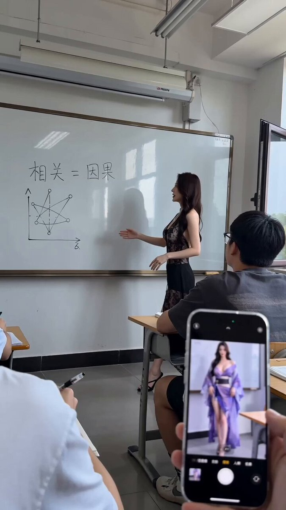
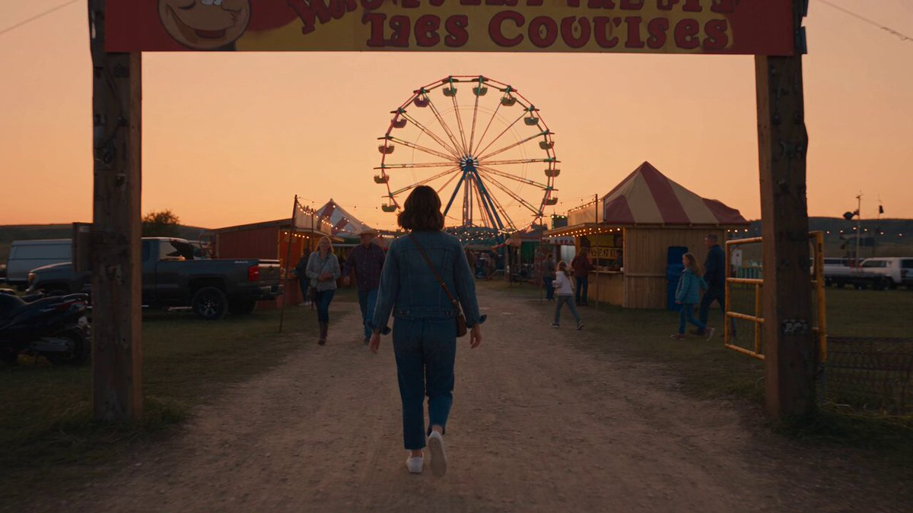
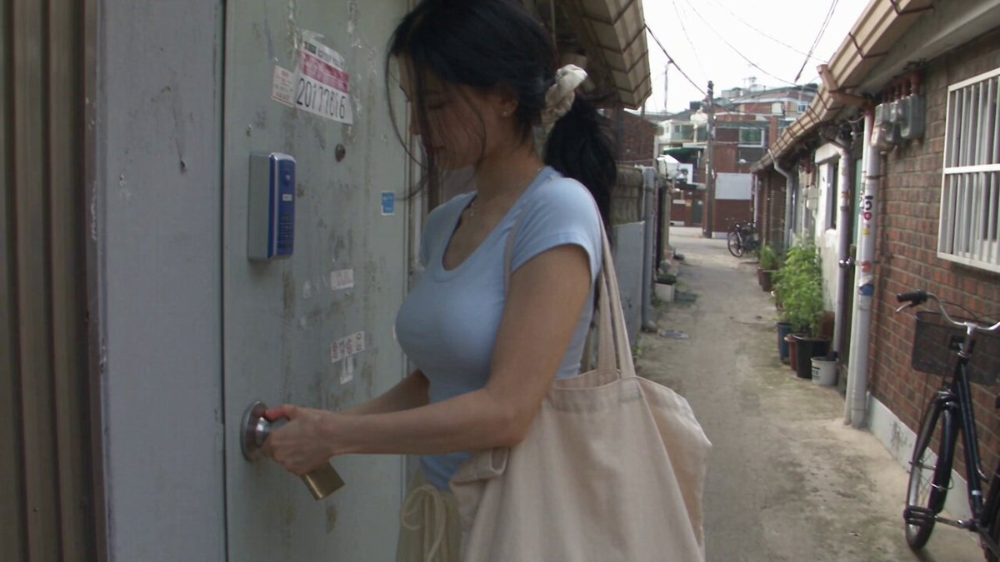
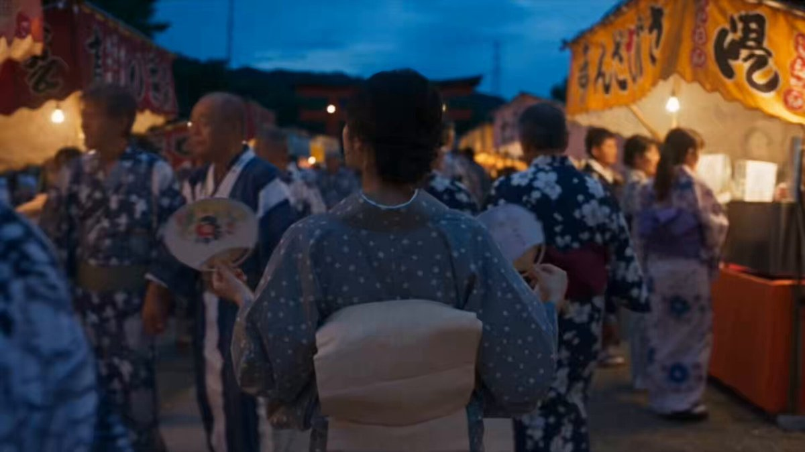

# Seedance 2.5 · Biblioteca de prompts · Leadde.ai

[](README.md) [](README_zh.md) [](README_zh-TW.md) [](README_ja-JP.md) [](README_ko-KR.md) [](README_th-TH.md) [](README_vi-VN.md) [](README_hi-IN.md) [](README_es-ES.md) [-lightgrey)](README_es-419.md) [](README_de-DE.md) [](README_fr-FR.md) [](README_it-IT.md) [-brightgreen)](README_pt-BR.md) [](README_pt-PT.md) [](README_tr-TR.md)

**Best for:** Seedance prompts for motion, camera language, cinematic scenes, product videos, and short-form creative.

For PDF, PPT, SOP, training, and multilingual video workflows:
[Awesome Document-to-Video](https://github.com/LeaddeOpenLab/awesome-document-to-video)

> **Prompts de qualidade selecionados diariamente**

Descubra prompts completos para imagens, vídeos e criações 3D com IA. Explore por estilo, consulte versões em vários idiomas e conheça os autores e as fontes.

[Explore a Leadde.ai →](https://leadde.ai/?utm_source=github&utm_medium=readme&utm_campaign=prompt-library&utm_content=seedance2.5)

## Conheça a Leadde.ai

A Leadde.ai ajuda equipes a transformar documentos, slides e textos em vídeos empresariais com IA para treinamento, integração e marketing.

Dê uma estrela a este repositório para acompanhar nossa seleção diária de prompts e descobrir novas ideias.

**32** Prompts · Última adição: **2026-09-10**

<a name="catalog"></a>

## Explorar por categoria

[Fotografia](#category-photography) · [Cinematográfico / Imagem de Filme](#category-cinematic-film-still) · [Cyberpunk / Ficção Científica](#category-cyberpunk-sci-fi) · [Outros](#category-other)

<a name="all-prompts"></a>

<a name="category-photography"></a>

## Fotografia

<a name="prompt-2097837460910956650"></a>

### Tradução em andamento

Autor：[@john87445528](https://x.com/john87445528) · [Publicação original](https://x.com/john87445528/status/2097837460910956650)

Fotografia · Personagem · Item de Moda · Publicado

**Resumo:** Tradução em andamento



**Prompt**

```text
Tradução em andamento
```

[↑ Voltar às categorias](#catalog)

---

<a name="prompt-2096930655615758734"></a>

### Prompt de vídeo UGC ultrarrealista de 30 segundos: Jovem coreana filma um vlog casual em seu quarto, mostrando sua nova câmera e conversando naturalmente.

Autor：[@AIwithkhan](https://x.com/AIwithkhan) · [Publicação original](https://x.com/AIwithkhan/status/2096930655615758734)

Fotografia · Personagem · Publicado

**Resumo:** Prompt de vídeo UGC ultrarrealista de 30 segundos: Jovem coreana filma um vlog casual em seu quarto, mostrando sua nova câmera e conversando naturalmente.


**Prompt**

```text
Crie um vídeo UGC ultrarrealista de 30 segundos em 1080p de uma jovem mulher coreana em seu próprio quarto, conversando casualmente com a câmera sobre a nova câmera que comprou recentemente.
ASSUNTO PRINCIPAL
Jovem mulher coreana com pouco mais de 20 anos, naturalmente bonita, textura de pele realista, maquiagem mínima, cabelo preto ondulado preso frouxamente em um rabo de cavalo lateral bagunçado com algumas mechas soltas ao redor do rosto. Vestindo uma blusa curta ajustada em azul pastel, calça solta estilo pijama na cor creme e um colar de prata simples.
Mantenha sua identidade facial exata, penteado, roupa, proporções corporais e aparência geral consistentes ao longo de todo o vídeo.
CENÁRIO
Seu próprio quarto aconchegante em um apartamento coreano normal em uma manhã quente de segunda-feira. Ela está sentada confortavelmente em sua cama com roupas de cama brancas levemente amarrotadas, um travesseiro atrás dela, uma pequena mesa de cabeceira, alguns itens pessoais do dia a dia e luz solar suave e natural entrando pela janela.
O quarto deve parecer vivido e autêntico, não encenado ou luxuoso.
ESTILO UGC
Ela mesma está segurando a câmera ou ela está casualmente apoiada na cama à sua frente. O enquadramento é ligeiramente imperfeito, com movimento natural de câmera na mão, pequenos ajustes de foco automático e mudanças ocasionais de exposição.
O vídeo deve parecer um vlog pessoal genuíno gravado para seus seguidores, não um anúncio polido.
AÇÃO / DIÁLOGO
Ela se senta de pernas cruzadas na cama, olha para a lente e sorri.
Ela diz naturalmente:
“Okay, I finally got this camera I’ve been talking about.”
Ela ri suavemente e pega a câmera para mostrá-la brevemente.
“I’ve only had it for like two days, but I already bring it everywhere.”
Ela a coloca de volta no lugar e se encosta no travesseiro.
“I wanted something that feels a little more personal than just using my phone.”
Ela olha ao redor do quarto e, em seguida, volta a olhar para a lente.
“The footage has this old-school look that I really love. It kind of feels like I’m recording memories instead of just posting videos.”
Ela sorri e coloca uma mecha solta de cabelo atrás da orelha.
Perto do final, ela olha de relance para o relógio, ri e diz:
“Anyway, it’s Monday, I should probably get out of bed.”
Ela estende a mão em direção à câmera como se fosse parar de gravar, sorrindo naturalmente, e o vídeo é cortado no meio do movimento.
CÂMERA / APARÊNCIA VISUAL
UGC autêntico com uma sensação sutil inspirada nas fitas DV do início dos anos 2000: detalhes digitais suaves, ruído de imagem suave, leve busca de foco automático, textura de pele natural e luz quente da manhã. Sem iluminação dramática ou movimentos de câmera cinematográficos.
ÁUDIO
Apenas a ambiência natural do quarto, a voz dela, movimento sutil de tecidos, sons distantes da vizinhança e leve ruído de manuseio da câmera. Sem música, sem narração.
SENSAÇÃO FINAL
Conteúdo descontraído de criadora de estilo de vida coreana. Quente, feminino, íntimo e crível, como um vlog casual de segunda-feira de manhã filmado em seu próprio quarto.
NEGATIVO
Sem atuação comercial, sem iluminação perfeita de estúdio, sem poses ensaiadas de influenciador, sem alteração de identidade, sem trocas de roupa, sem mãos distorcidas, sem dedos extras, sem legendas, logotipos, marcas d'água ou artefatos de IA.
```

[↑ Voltar às categorias](#catalog)

---

<a name="prompt-2096931238460178592"></a>

### Crie um vídeo caseiro em DV do início dos anos 2000, ultrarrealista, de 30 segundos, 1080p e proporção 16:9, de uma jovem coreana vivenciando uma noite de verão comum, mas memorável, em um bairro antigo de Seul, com ações detalhadas em linha do tempo, falhas de câmera na mão e áudio ambiente.

Autor：[@SimplyAnnisa](https://x.com/SimplyAnnisa) · [Publicação original](https://x.com/SimplyAnnisa/status/2096931238460178592)

Fotografia · Personagem · Publicado

**Resumo:** Crie um vídeo caseiro em DV do início dos anos 2000, ultrarrealista, de 30 segundos, 1080p e proporção 16:9, de uma jovem coreana vivenciando uma noite de verão comum, mas memorável, em um bairro antigo de Seul, com ações detalhadas em linha do tempo, falhas de câmera na mão e áudio ambiente.


**Prompt**

```text
Crie um vídeo caseiro em DV do início dos anos 2000, ultrarrealista, de 30 segundos, 1080p e proporção 16:9, de uma jovem coreana vivenciando uma noite de verão comum, mas surpreendentemente memorável, em um bairro antigo de Seul.

Uma mulher coreana naturalmente bonita no início dos seus 20 anos, pele realista, maquiagem mínima, cabelos pretos longos e levemente ondulados, blusa de tricô azul-claro, calças largas bege-claras, tênis brancos, bolsa transversal marrom e relógio prateado. Mantenha sua identidade, rosto, roupa, penteado e proporções perfeitamente consistentes.

CENÁRIO

Uma rua residencial antiga e tranquila de Seul com vielas de concreto, edifícios de apartamentos, vasos de plantas, bicicletas, postes de energia, árvores frondosas e uma pequena loja de conveniência de bairro. Com aspecto habitado e autêntico. Sem marcas, logotipos, anúncios ou pontos turísticos.

ESTILO DE CÂMERA

Filmagens brutas de uma camcorder DV barata do início dos anos 2000: movimento trêmulo feito à mão, enquadramento imperfeito, busca de foco automático, alterações de exposição, cores desbotadas, detalhes suaves, leve ruído de fita, zooms acidentais e falhas naturais de filmagem. Sem estabilização ou tomadas cinematográficas.

00:00–00:06 — O MISTÉRIO

Ela caminha pela rua segurando uma pequena sacola plástica quando, de repente, ouve um tilintar suave atrás dela.

Ela para e olha ao redor.

A câmera faz um zoom rápido em direção ao seu rosto confuso.

Ela diz:

“Did you hear that?”

00:06–00:12 — A PEQUENA DESCOBERTA

Ela segue o som e encontra uma bicicleta antiga e pequena com uma campainha minúscula presa ligeiramente aberta.

Ela dá um leve toque na campainha.

Trim.

Ela olha para a câmera e ri.

Em seguida, ela nota uma pequena etiqueta de papel com aparência manuscrita pendurada na bicicleta, mas a escrita está ilegível demais para ser compreendida.

00:12–00:18 — O VENTO

Uma brisa repentina sopra várias folhas secas pela rua.

Uma delas cai diretamente na cabeça dela.

Ela não percebe.

Quem está gravando ri.

Ela parece confusa, então se dá conta e tira a folha.

Ela lança um olhar envergonhado para a câmera.

00:18–00:24 — O PEQUENO DESAFIO

Ela coloca a folha no selim da bicicleta e tenta equilibrá-la ali.

O vento a sopra imediatamente para longe.

Ela tenta de novo.

A folha cai novamente.

Ela ri e finalmente desiste.

00:24–00:30 — A LEMBRANÇA

Ela pega a folha, coloca-a dentro da sua pequena bolsa e começa a caminhar de volta para casa.

Após alguns passos, ela se vira para a câmera e diz:

“Okay, that was pointless.”

Ela sorri e continua caminhando.

A câmera a segue por alguns segundos antes de cortar abruptamente para o preto.

ÁUDIO

Apenas som ambiente natural da locação: passos, tráfego distante, campainha de bicicleta, insetos de verão, folhas, vento, ambiência de bairro e risadas naturais.

Sem música, narração, legendas, subtítulos, logotipos, marcas d'água ou texto na tela.

REALISMO

Reações humanas naturais, sincronização imperfeita, física realista, objetos consistentes, detalhes autênticos de um bairro coreano e imperfeições verossímeis de câmera DV. Sem aspecto de CGI, mãos distorcidas, dedos extras, pessoas duplicadas, alteração de identidade ou trocas de roupa.

Proporção 16:9.
```

[↑ Voltar às categorias](#catalog)

---

<a name="prompt-2097181982924984513"></a>

### Mulher indonésia autêntica em uma estética de vídeo caseiro de filmadora DV do início dos anos 2000 com marcações de tempo cronológicas detalhadas das cenas em um bairro tranquilo.

Autor：[@QAiStudio](https://x.com/QAiStudio) · [Publicação original](https://x.com/QAiStudio/status/2097181982924984513)

Fotografia · Personagem · Publicado

**Resumo:** Mulher indonésia autêntica em uma estética de vídeo caseiro de filmadora DV do início dos anos 2000 com marcações de tempo cronológicas detalhadas das cenas em um bairro tranquilo.


**Prompt**

```text
Mulher indonésia autêntica, estética de vídeo caseiro indonésio do início dos anos 2000. Preservar seu rosto exato, identidade, penteado, traços faciais, tom de pele, proporções corporais, pelos naturais nas axilas, cropped sem mangas verde-oliva desbotado, jeans azul-claro solto de cintura alta, tênis de lona pretos, colar de cordão preto, cabelo preto ondulado, franja lateral, rabo de cavalo preso e desarrumado. Bairro residencial indonésio comum e tranquilo: beco estreito de concreto, casas simples de um andar, pequenos terraços, muretas baixas, vasos de plantas, motocicletas estacionadas, árvores grandes, cabos aéreos emaranhados. Sem lojas ou atividade comercial. 00:00–00:03: Ela se senta no chão de um terraço rabiscando em um caderno; a câmera na mão paira de cima/de lado. 00:03–00:07: Ela bate a caneta no queixo, sorri levemente e continua a desenhar; a câmera vagueia entre seu rosto e suas mãos. 00:07–00:10: Ela se deita em uma esteira observando formigas rastejando pelo concreto. 00:10–00:13: Ela cutuca suavemente perto das formigas e ri baixinho. 00:13–00:17: Ela caminha até uma mureta baixa, pula para cima e balança as pernas. 00:17–00:20: Ela come salgadinhos casualmente enquanto olha para a rua tranquila. 00:20–00:24: Ela se senta nos degraus com uma toalha nos ombros, cabelos úmidos, penteando-os lentamente. 00:24–00:27: Plano aproximado na mão dela penteando o cabelo molhado, gotas de água visíveis. 00:27–00:30: Ela termina, joga o cabelo úmido para trás, olha para a câmera e sorri naturalmente. Corte abrupto para preto. Realismo extremamente cru de filmadora DV na mão: movimento intenso, microtremores, enquadramento acidental, composição descentralizada, corte ocasional do rosto, busca de foco automático, flutuações de exposição, desfoque de movimento, rolling shutter, cores desbotadas/dessaturadas, ruído digital e artefatos de compressão. Sem poses, estabilização, visual cinematográfico, estilo comercial de moda, gradação moderna ou música. Apenas ambiente matinal natural: pássaros, brisa, motocicletas distantes, conversas da vizinhança, papel riscando, pacote de salgadinhos, folhas, pente. 16:9.
```

[↑ Voltar às categorias](#catalog)

---

<a name="prompt-2097185861259727263"></a>

### Prompt fotorrealista para um vlog de viagem de 30 segundos no litoral coreano capturando uma jornada noturna, desde mercados de peixe ao pôr do sol e caminhadas costeiras até um quebra-mar à meia-noite.

Autor：[@nawalsehar](https://x.com/nawalsehar) · [Publicação original](https://x.com/nawalsehar/status/2097185861259727263)

Fotografia · Paisagem / Natureza · Publicado

**Resumo:** Prompt fotorrealista para um vlog de viagem de 30 segundos no litoral coreano capturando uma jornada noturna, desde mercados de peixe ao pôr do sol e caminhadas costeiras até um quebra-mar à meia-noite.


**Prompt**

```text
Crie um vlog de viagem live-action fotorrealista de 30 segundos no litoral coreano acompanhando uma jovem coreana durante uma noite em uma pacata vila costeira. Comece em um movimentado mercado de frutos do mar com produtos frescos, pisos molhados e a luz do pôr do sol. Ela faz check-in em uma aconchegante pousada tradicional e depois caminha descalça pela praia enquanto as ondas tocam seus pés durante a hora dourada. Transição para um mercado noturno acolhedor de frutos do mar, onde ela saboreia frutos do mar recém-grelhados e interage naturalmente com o ambiente. Termine à meia-noite ao lado de um quebra-mar silencioso, contemplando o oceano escuro com luzes de barcos de pesca ao longe e ondas quebrando abaixo. Autêntico estilo de vlog de 2026 para smartphone/câmera de cinema, ambiente coreano natural, pele, cabelo, roupas, água, comida, fumaça, ondas e movimentos humanos realistas. Câmera na mão, foco automático natural, mudanças de exposição e desfoque de movimento realista. Diálogo apenas em inglês, áudio ambiente natural, sem música de fundo ou narração. Grande ênfase em física convincente, iluminação, movimento fluido e expressões espontâneas. Sem CGI, animação, legendas, logotipos ou marcas d'água.
```

[↑ Voltar às categorias](#catalog)

---

<a name="prompt-2097186378861953475"></a>

### Crie um vlog de viagem fotorrealista de 30 segundos em uma cidade montanhosa japonesa acompanhando uma jovem que explora um vilarejo tranquilo após perder o ônibus, com iluminação natural e estilo de câmera na mão.

Autor：[@aiwithaly](https://x.com/aiwithaly) · [Publicação original](https://x.com/aiwithaly/status/2097186378861953475)

Fotografia · Personagem · Paisagem / Natureza · Publicado

**Resumo:** Crie um vlog de viagem fotorrealista de 30 segundos em uma cidade montanhosa japonesa acompanhando uma jovem que explora um vilarejo tranquilo após perder o ônibus, com iluminação natural e estilo de câmera na mão.


**Prompt**

```text
Crie um vlog de viagem fotorrealista de 30 segundos em uma cidade montanhosa japonesa, acompanhando uma jovem japonesa que perde o ônibus e passa 25 minutos explorando a cidade tranquila. Mostre-a correndo atrás do ônibus que parte → verificando o horário → caminhando por ruas pacíficas e atravessando uma ponte vermelha → descobrindo uma casa de chá tradicional → saboreando um chá verde quente → admirando a vista da montanha na hora de ouro → ouvindo o próximo ônibus chegar e retornando ao ponto. Filmagens de viagem autênticas de 2026, cenário japonês natural, caminhada e movimentos humanos realistas, cabelo e roupas reagindo ao vento, riacho fluindo, chá fumegante, física verossímil do ônibus e iluminação de hora de ouro. Estilo de câmera de cinema ou smartphone na mão com foco automático natural, mudanças de exposição e desfoque de movimento sutil. Diálogo apenas em inglês, ambiente de vilarejo realista e sem música de fundo. Sem CGI, animação, estética VHS, legendas, logotipos ou marcas d'água.
```

[↑ Voltar às categorias](#catalog)

---

<a name="prompt-2097097582262825180"></a>

### 15秒第一人称视角的台球厅暧昧喜剧视频提示词，包含详细的分镜时间线、人物互动、运镜方式、台球局轨迹及音频与负面约束。

Autor：[@john87445528](https://x.com/john87445528) · [Publicação original](https://x.com/john87445528/status/2097097582262825180)

Quadrinhos / Storyboard · Fotografia · Personagem · Publicado

**Resumo:** 15秒第一人称视角的台球厅暧昧喜剧视频提示词，包含详细的分镜时间线、人物互动、运镜方式、台球局轨迹及音频与负面约束。


**Prompt**

```text
｜15秒｜男主第一人称｜海妖风暧昧喜剧 【剧情锁定】 成年女主角#1发现男主准备击球，故意走进他的视野，主动侧坐上台球桌，屈起一条腿，让预定#2服装原有剪裁自然呈现大腿线条，以海妖风眼神和姿态干扰瞄准。男主停杆、抬头，她以为自己的小心思奏效；男主却不耐烦地倒转球杆，用橡胶粗端隔着衣服轻顶她臀侧一下，催她下桌。她被识破后调皮又无奈地让开，男主立即继续击球，母球撞中目标球，目标球落袋。 必须完整呈现“她先站着—主动上桌—故意展示腿部线条并观察他的反应”。她明知会干扰打球，仍主动试探；不能开场便让她已经坐好，也不能演成偶然挡路。 【人物与服装】 画面中唯一可见的人物是成年女主角#1
，面孔、发型、体型保持一致。#1完整穿着预定#2
屏幕截图_31-8-2026_22160_jimeng.jianying.com
服装，带着装饰眼镜
包括既定丝袜
和配饰；#2仅是服装编号，绝不生成第二个人物。腿部呈现服从#2本身的长度、开口和袜装，不能为了露腿改变剪裁、消除袜子或凭空缩短衣服。 成年男主只提供第一人称视点、唯一一支球杆和一句画外对白。脸、身体、手臂、双手、影子、倒影均不入画。全片不出现其他人或人物复制。 【影像与拍摄关系】 9:16竖屏，1080×1920，30fps，约26—28mm等效视角。男主佩戴贴近眼线的轻型头戴相机，保留未经处理的手机视频观感。低头看球、抬头看人、直起身体均带动真实镜头运动。男主无需手持摄影设备，可以正常操杆；握杆手和架杆手始终位于取景下缘之外。 全程连续第一人称，不切到男主正面、第三人称或外部全景。轻微呼吸起伏、头部晃动和不完美重新构图；从白球转看#1时，对焦允许短暂迟疑。冷白顶灯照明，肤色和衣料保留纹理，暗部带少量手机噪点；快速调杆有适量运动模糊，但不能糊掉端头交换。无美颜、磨皮、电影调色和稳定器运镜。 构图以能读懂人物动作为先：上桌时保留她扶库边的手、坐下的位置和两腿变化；试探时让脸与腿部线条同时在画面内；赶人时让表情和球杆粗端同时可见；最后回到白球、红球、中袋的完整路线。镜头不长时间追着某一处身体，也不能为了看脸把上桌和调杆动作裁掉。 【台球厅环境】 普通室内台球厅，绿色台呢、红棕色木质库边、黑色桌体、银色边框和白色网兜球袋。背景为深灰与棕色竖向墙板、浅色百叶窗、深绿色等候椅，顶灯将桌面照得比背景明亮。远处可见另一张无人使用的球桌，环境朴素、有实际使用痕迹，整体空间和光线全程不变。 没有酒吧灯光、粉色爱心、霓虹装饰、豪华软包或摄影棚布景。镜头范围内不出现其他顾客、工作人员、人像海报或镜面反射。 【空间与球局】 男主位于近侧长库边中央，#1开始站在对面长库边、画面右侧。两人隔着约1.3米的桌宽相对，不能改成隔着整张球桌的长度。对面中袋位于画面上方中央，始终是明确的落袋目标。 桌上起始共有四颗球：一颗白色母球、一颗红色实心目标球、一颗蓝球、一颗黄球。白球位于近半台中央；红球在对面中袋前约25厘米，白球、红球、中袋形成容易看清的直线。蓝球与黄球分别停在左右远离球路的位置，全程静止。 #1坐在对面中袋右侧的库边，身体斜向镜头；一条屈腿轻放在台面右侧边缘，另一条腿垂在桌外。她的腿部和上身进入男主瞄准视野，但不踩球、不压球、不把腿跨在两球之间。她必须下桌后男主才击球。 她坐下前，白球到红球、红球到中袋的路线已在开场建立；她坐下后，屈腿位于这条路线右侧，进入视野并分散注意，但实际球路没有被身体堵死。她收腿下桌的过程中不得碰动任何球。球位从开头直到出杆保持不变，观众能用同一组位置看懂男主始终想打哪一球。 【海妖风与结尾表情】 坐姿呈自然S曲线：身体微侧，肩部下沉，颈部拉长，下巴轻轻侧抬，腰胯略向一侧移。屈腿与垂腿前后错位，大腿线条在人物整体中自然可见；左手撑库边，右手只整理一次发丝。半垂眼冷感直视男主，嘴角仅有很淡的试探笑意。 前半段冷艳、克制、有距离感；后半段按剧情允许出现调皮、无奈的微笑。她被识破后不惊恐、不生气，也不狼狈尖叫，而是嘴角先停半拍，随后侧眼抿笑、小幅摇头，像在用表情说“行吧，你就知道打球”。这句话不实际说出，不加字幕。 暧昧必须通过相互观察表现：她每次调整坐姿后都会瞥一眼杆头，看到杆头停住才露出得意；男主的镜头则反复从她回到红球，留下他其实更在乎球局的线索。前半段的腿部展示、后半段的调皮笑都属于成年人的轻松玩笑，保持自然、从容，不用夸张表情代替剧情。 【球杆连续性】 唯一一支约145厘米的台球杆：浅木色细杆、细小蓝色皮头、深色粗握柄、尾部黑色橡胶保护帽。细头用于击球，橡胶粗端用于一次轻微赶人动作。 调头是端对端转过180度。必须连续看见：细头离开白球并撤回；同一杆身斜向扫过镜头前方；细头转向侧下方，粗握柄和黑色尾帽从另一侧绕出；最终黑色粗端指向#1。握持点可以藏在下缘，杆身不能整根退出后突然换成另一端，也不能只沿长轴自转。 翻杆时杆身经过人物前方，必须与她保持明显的前后距离，不扫到头发、面部或肩膀。橡胶尾帽靠近臀侧后仅短暂接触一次，随即离开；接下来由#1自己撑住库边、收腿、滑下。她的身体运动、衣料变化与接触顺序同步，不能先下桌再补拍顶人的动作。 【严格时间分镜】 → 0—3秒，第一人称俯看球桌。白球、红球、中袋与左右静止的蓝黄两球同时建立，细杆头正在白球后方试瞄。 原本站在对面长库边右侧的#1先看一眼球杆方向，再看向镜头。她主动扶住库边，侧身坐上去，屈起一条腿放到台面边缘，另一条腿垂在桌外。坐下、抬腿和衣料自然形成褶皱的过程连续可见，#2原有剪裁呈现大腿线条。镜头随男主抬头，从球路转向她的完整坐姿。 → 3—5.5秒，保持#1面部、上身和腿部同框的中景。她肩部放松下沉、颈部拉长，身体形成S曲线，指尖整理发丝，半垂眼看着镜头，随后把视线短暂移向球杆，确认男主是否停下。 球杆停止试瞄。镜头略低头看球，又抬回她脸上。#1看见这个反应，嘴角慢慢浮起一丝笃定笑意，屈起的膝盖略向侧面调整，使大腿线条更完整。动作明显带有故意干扰的试探，但不拉扯衣摆。 → 5.5—7秒，球杆再次靠近白球，却仍未击打。男主短促呼气，镜头随他直起身体升高，发出略带火气、不耐烦的成年男声：“让开，让开。” #1没有立刻移动，只轻轻侧头，半垂眼望着他，嘴角还保留着以为自己成功的笑意。 → 7—8.5秒，完整展示调转球杆。浅木色细头先从白球后方撤回，同一杆身斜贯画面前景，细头沿侧下方转走；深色粗柄与黑色橡胶尾帽从另一侧转到正前方，完成端对端半圈翻转。 相机有轻微头部晃动，但始终让杆身的一部分留在画面中。最终画面下方清楚出现朝向#1的黑色橡胶粗端，细头已经朝向男主一侧。 → 8.5—10秒，男主将粗端越过桌面，隔着完整#2服装，在#1靠台面一侧的臀部外侧短促轻顶一下，随即撤开。人物中景同时交代她的脸、姿态、库边和接触动作，不切局部特写。 #1低头看一眼黑色杆尾，嘴角原来的笃定笑意停住半拍。她明白男主完全没有配合自己的试探，主动双手撑库边，把屈起的腿收出台面，顺势向桌外滑下。动作由她自身支撑完成，不被顶飞，也不跌倒。 → 10—11秒，#1双脚落地后向画面右侧让开半步，鞋底落地声清楚。她侧眼看向男主，抿住忍不住扬起的嘴角，轻轻摇一次头，带一点“被你看穿了”的调皮无奈。 她身体重新微侧，颈线拉长，维持冷艳基调；不是慌张、恼怒、委屈或被羞辱的表情。 → 11—12秒，球杆粗端收回，按先前相反的路径端对端调转：黑色尾帽转向下缘，浅木色杆身和蓝色细皮头重新指向白球。镜头随男主低头回到球路，细头停在白球后方，#1已经完全让出观察方向。 → 12—14秒，男主平稳出杆一次，细皮头实际接触白球，发出清楚的“嗒”。白球先滚动，再撞上红球；红球沿直线滚向对面中袋，越过袋沿并落进白色网兜，发出真实的落袋声。 白球碰撞后留在台面，减速停下；蓝球和黄球原地不动。落袋后桌上剩白、蓝、黄三颗球，红球不能再次出现在桌面。 → 14—15秒，镜头从空出的中袋略抬向右侧。#1站在桌旁，目光先扫过落袋位置，再回到男主，半垂眼侧视，嘴角带着克制的调皮笑意，轻轻呼出一口气。 她保持自然S曲线和前后错位的双腿，一副小计策失败却又拿他没办法的模样。男主没有搭话，结尾停在她无奈抿笑的反应上。 【音频】 现场同期声：通风设备、远处模糊人声、坐上库边的衣料摩擦、球杆转动的轻响、鞋底落地、击球、球体碰撞与落袋声。唯一对白来自镜头后方成年男主：“让开，让开。”#1用表情完成反应。无背景音乐、旁白、解释性对白和罐头笑声。 【负面约束】 不得省略主动上桌和故意干扰；不得只拍她已经坐好的状态；不得把大腿裁出画面，也不得使用裙底角度或腿臀慢扫；不得改变#2服装或露出内衣；不得复制人物、肢体、球和球杆；不得出现男主或第二个#1；不得把翻杆省略成杆子退出后换端；不得用细头顶人、反复顶撞、造成受伤或摔落；不得让#1做惊恐、愤怒或委屈反应；不得省略白球撞红球和红球真实落袋；不得白球入袋代替红球，不得目标球凭空消失；不得出现字幕、水印、平台UI、爱心贴纸、慢动作或电影滤镜。
```

[↑ Voltar às categorias](#catalog)

---

<a name="category-cinematic-film-still"></a>

## Cinematográfico / Imagem de Filme

<a name="prompt-2097901351049294063"></a>

### Tradução em andamento

Autor：[@nawalsehar](https://x.com/nawalsehar) · [Publicação original](https://x.com/nawalsehar/status/2097901351049294063)

Cinematográfico / Imagem de Filme · Personagem · Publicado

**Resumo:** Tradução em andamento



**Prompt**

```text
Tradução em andamento
```

[↑ Voltar às categorias](#catalog)

---

<a name="prompt-2097502400961761425"></a>

### Cena cinematográfica animada em 3D de um garotinho e um filhote de dragão branco perolado brincando em um vale de flores tropicais.

Autor：[@Zarnab\_with\_Ai](https://x.com/Zarnab_with_Ai) · [Publicação original](https://x.com/Zarnab_with_Ai/status/2097502400961761425)

Cinematográfico / Imagem de Filme · Renderização 3D · Personagem · Animal / Criatura · Publicado

**Resumo:** Cena cinematográfica animada em 3D de um garotinho e um filhote de dragão branco perolado brincando em um vale de flores tropicais.


**Prompt**

```text
Crie uma cena fantástica animada em 3D de alta qualidade em um estilo cinematográfico e colorido.

Um garotinho adorável com cabelo preto desgrenhado e uma roupa simples de tecido bege está sentado e brincando em um campo de belas flores ao lado de um amigável filhote de dragão. O dragão é grande, adorável, branco perolado com detalhes em azul-claro, chifres pequenos, olhos azuis brilhantes e expressivos, escamas suaves semelhantes a penas ao redor da cabeça e do pescoço, e uma cauda longa e elegante.

A cena acontece em um vale tropical mágico cercado por montanhas verdejantes, água turquesa cristalina, árvores tropicais e um céu azul brilhante com suaves nuvens brancas.

Comece com um plano em close-up do filhote de dragão dormindo, descansando pacificamente entre flores vibrantes rosa-avermelhadas enquanto o garotinho está sentado por perto. O dragão abre lentamente os olhos, olha em volta com curiosidade e faz uma expressão fofa e brincalhona.

Faça uma transição para um plano mais aberto onde o dragão e a criança estão cercados por um campo de belas flores azuis perto da água. O dragão rola de costas de forma brincalhona pelas flores enquanto a criança observa e ri.

Mostre um plano aéreo cinematográfico aberto revelando a bela paisagem semelhante a uma ilha, campos floridos, árvores tropicais, montanhas e água turquesa. Pequenos pássaros coloridos voam e saltitam ao redor de uma árvore próxima enquanto a criança e o dragão brincam juntos embaixo.

Em seguida, retorne a um close-up da criança sentada nas costas do dragão. O dragão faz expressões faciais engraçadas e divertidas enquanto a criança ri alegremente.

Termine com a criança e o adorável dragão deitados pacificamente juntos em um enorme prado de flores coloridas, sorrindo e aproveitando o momento mágico.

Use animação de personagens suave, emoções faciais expressivas, movimento corporal natural, transições cinematográficas de câmera, profundidade de campo rasa, iluminação volumétrica suave, cores vibrantes, texturas 3D detalhadas, atmosfera mágica para toda a família, qualidade refinada de filme de animação e um tom caloroso e comovente.

Sem texto, sem legendas, sem marca d'água.
Proporção de tela: 16:9.
Duração: aproximadamente 15 segundos.
```

[↑ Voltar às categorias](#catalog)

---

<a name="prompt-2096826123330138410"></a>

### Foto de moda cinematográfica de uma mulher loira em um casaco de pele sintética creme carregando esquis brancos em uma encosta alpina nevada na hora dourada.

Autor：[@noorlewisx](https://x.com/noorlewisx) · [Publicação original](https://x.com/noorlewisx/status/2096826123330138410)

Cinematográfico / Imagem de Filme · Personagem · Item de Moda · Publicado

**Resumo:** Foto de moda cinematográfica de uma mulher loira em um casaco de pele sintética creme carregando esquis brancos em uma encosta alpina nevada na hora dourada.


**Prompt**

```text
Fotograma de filme de moda cinematográfico, ângulo baixo de uma linda jovem com cabelos loiro-escuro ondulados e olhos castanhos caminhando em direção à câmera em uma encosta de montanha alpina nevada e ensolarada na hora dourada. Ela veste um casaco oversized de pele sintética creme sobre um cropped canelado branco e shorts brancos combinando, botas de esqui felpudas brancas e luvas brancas. Ela carrega um par de esquis brancos elegantes com fixações pretas apoiados em um ombro. Neve cristalina cintilante em primeiro plano extremo com profundidade de campo rasa e bokeh, picos cobertos de neve e céu limpo variando do azul ao crepúsculo ao fundo, iluminação dramática de contorno, fotografia editorial de alta-costura, granulação de filme 35mm, ultrarrealista, fotorrealista, 8k
```

[↑ Voltar às categorias](#catalog)

---

<a name="prompt-2097303258171949530"></a>

### Tradução em andamento

Autor：[@Strength04\_X](https://x.com/Strength04_X) · [Publicação original](https://x.com/Strength04_X/status/2097303258171949530)

Cinematográfico / Imagem de Filme · Personagem · Item de Moda · Publicado

Publicação original：[@Strength04\_X](https://x.com/Strength04_X) · [Publicação original](https://x.com/Strength04_X/status/2097272589387546831)

**Resumo:** Tradução em andamento


**Prompt**

```text
Tradução em andamento
```

[↑ Voltar às categorias](#catalog)

---

<a name="prompt-2096984350055436729"></a>

### Tradução em andamento

Autor：[@TanLuAI](https://x.com/TanLuAI) · [Publicação original](https://x.com/TanLuAI/status/2096984350055436729)

Cinematográfico / Imagem de Filme · Publicado

**Resumo:** Tradução em andamento


**Prompt**

```text
Tradução em andamento
```

[↑ Voltar às categorias](#catalog)

---

<a name="prompt-2097249504986644872"></a>

### Tradução em andamento

Autor：[@johnAGI168](https://x.com/johnAGI168) · [Publicação original](https://x.com/johnAGI168/status/2097249504986644872)

Quadrinhos / Storyboard · Cinematográfico / Imagem de Filme · Publicado

**Resumo:** Tradução em andamento


**Prompt**

```text
Tradução em andamento
```

[↑ Voltar às categorias](#catalog)

---

<a name="prompt-2096948259059085379"></a>

### Duelo cinematográfico de artes marciais Wuxia em uma floresta de bordos no outono com luta de espadas em câmera lenta, visuais de aquarela de tinta e iluminação volumétrica.

Autor：[@aiwithlumi](https://x.com/aiwithlumi) · [Publicação original](https://x.com/aiwithlumi/status/2096948259059085379)

Cinematográfico / Imagem de Filme · Paisagem / Natureza · Publicado

**Resumo:** Duelo cinematográfico de artes marciais Wuxia em uma floresta de bordos no outono com luta de espadas em câmera lenta, visuais de aquarela de tinta e iluminação volumétrica.


**Prompt**

```text
Sequência cinematográfica de Wuxia em uma floresta de bordos no outono: dois artistas marciais, uma guerreira em um fluido Hanfu de seda rosa e branca e um guerreiro em vestes azuis, enfrentam-se em rochas de rio úmidas e musgosas enquanto raios de sol dourados atravessam a névoa e folhas vermelhas de bordo caem. Ela salta no ar, saca seu Jian de aço e desliza em direção a ele em uma câmera lenta dramática antes que suas lâminas colidam com uma explosão de faíscas brilhantes. Ela pousa com graça, espirrando água ao seu redor, enquanto um efeito de aquarela de tinta sumi-e preta se espalha pelo quadro. Termine com um plano aberto perfeitamente simétrico de ambos os guerreiros segurando espadas acima de suas cabeças em postura de guarda sincronizada, emoldurados por bordos vermelhos e luz de fundo radiante, com texturas hiperdetalhadas, movimento cinematográfico a 24fps e iluminação volumétrica atmosférica.
```

[↑ Voltar às categorias](#catalog)

---

<a name="prompt-2096815972560835061"></a>

### Um prompt para uma aventura cinematográfica em desenho animado 3D de 30 segundos apresentando dois jovens amigos explorando uma vila no campo e descobrindo uma porta mágica escondida atrás de uma cachoeira.

Autor：[@iamrealsnow](https://x.com/iamrealsnow) · [Publicação original](https://x.com/iamrealsnow/status/2096815972560835061)

Cinematográfico / Imagem de Filme · Ilustração · Renderização 3D · Publicado

**Resumo:** Um prompt para uma aventura cinematográfica em desenho animado 3D de 30 segundos apresentando dois jovens amigos explorando uma vila no campo e descobrindo uma porta mágica escondida atrás de uma cachoeira.


**Prompt**

```text
Crie uma charmosa aventura cinematográfica em desenho animado 3D de 30 segundos em uma bela vila no campo, paisagem 16:9.

Cena 1 — 0–5 seg:
Início da manhã em uma pequena vila colorida cercada por colinas verdes, chalés de madeira, hortas e um rio cintilante. Dois adoráveis amigos originais de desenho animado, um garotinho curioso e uma garotinha esperta, saem de seu chalé carregando pequenas mochilas de aventura. Pássaros voam no alto e a luz do sol quente preenche a vila.

Cena 2 — 5–10 seg:
Os dois amigos descobrem um velho mapa de madeira escondido sob uma grande árvore. Seus olhos se arregalam de empolgação. O mapa mostra uma cachoeira misteriosa nas profundezas da floresta próxima. Eles apontam entusiasmados em direção à floresta e começam sua jornada.

Cena 3 — 10–17 seg:
Eles correm por um alegre caminho da vila, atravessam uma pequena ponte de madeira, passam por animais dóceis da fazenda e entram em uma floresta exuberante. Borboletas voam ao redor deles enquanto os raios de sol atravessam as árvores. Suas expressões mostram empolgação e curiosidade.

Cena 4 — 17–24 seg:
Eles chegam a uma cachoeira escondida cercada por flores brilhantes e pedras gigantes cobertas de musgo. Atrás da cachoeira, eles descobrem uma pequena porta de madeira misteriosa esculpida na montanha. O menino a abre lentamente enquanto a menina olha por cima do ombro dele.

Cena 5 — 24–30 seg:
Uma luz dourada mágica brilha de dentro da entrada, iluminando seus rostos maravilhados. Eles se olham, sorriem e entram juntos. A câmera se afasta pela floresta, revelando a bela vila ao longe enquanto a cena termina com a sensação de que uma aventura maior está prestes a começar.

Estilo: desenho animado 3D fofo de alta qualidade, rostos expressivos, animação lúdica de personagens, cores vibrantes do campo, iluminação cinematográfica, luz solar volumétrica suave, ambientes detalhados, atmosfera de aventura fantasiosa, movimento de câmera suave, adequado para toda a família, personagens originais, sem personagens protegidos por direitos autorais reconhecíveis, sem texto, sem logotipos, 16:9.
```

[↑ Voltar às categorias](#catalog)

---

<a name="prompt-2097182918368276602"></a>

### Um prompt para vídeo cinematográfico de 15 segundos detalhando sequências cronometradas de uma mulher coreana em Seul estalando os dedos para congelar o tempo, transformando roupas e ativando um loop visual em um outdoor de LED.

Autor：[@MissDelulu9](https://x.com/MissDelulu9) · [Publicação original](https://x.com/MissDelulu9/status/2097182918368276602)

Cinematográfico / Imagem de Filme · Personagem · Item de Moda · Publicado

**Resumo:** Um prompt para vídeo cinematográfico de 15 segundos detalhando sequências cronometradas de uma mulher coreana em Seul estalando os dedos para congelar o tempo, transformando roupas e ativando um loop visual em um outdoor de LED.


**Prompt**

```text
Crie um vídeo cinematográfico ultrarrealista de 15 segundos em formato paisagem 16:9 apresentando uma mulher coreana em Seul.

0–2 s:
Plano detalhe extremo de seu rosto. De repente, ela olha direto para a câmera e diz com uma expressão confiante e brincalhona: “Watch this.”

2–6 s:
Ela estala os dedos.

Instantaneamente, sua roupa comum se transforma em um deslumbrante look futurista de moda de rua coreana, enquanto toda a rua de Seul congela em pleno movimento ao seu redor.

6–11 s:
Ela caminha casualmente pela multidão congelada. Conforme passa por cada pessoa, elas de repente descongelam uma a uma, mas suas roupas se transformam em looks de alta-costura completamente diferentes.

11–15 s:
Ela chega a um outdoor de LED gigante, olha para ele, e o outdoor de repente exibe um vídeo ao vivo DELA caminhando em direção a ele, criando um loop visual impossível.

Edição em ritmo acelerado, mulher coreana extremamente realista, ambiente urbano coreano natural, figurino de moda premium, iluminação noturna cinematográfica, movimento de multidão realista, efeitos de transformação suaves, expressões faciais detalhadas, movimento dinâmico de câmera, forte apelo visual inicial, final surpreendente, estética viral polida para redes sociais, sem legendas, sem marca d'água.
```

[↑ Voltar às categorias](#catalog)

---

<a name="prompt-2096906803967840616"></a>

### Prompt de MV cinemático de moda e viagem de 30 segundos com uma garota idol de K-pop explorando Chongqing com fones de ouvido com fio, incluindo detalhamento completo do cronograma, ângulos de câmera, guarda-roupa e prompts negativos.

Autor：[@ImaStudio\_ai](https://x.com/ImaStudio_ai) · [Publicação original](https://x.com/ImaStudio_ai/status/2096906803967840616)

Fotografia · Cinematográfico / Imagem de Filme · Personagem · Item de Moda · Publicado

**Resumo:** Prompt de MV cinemático de moda e viagem de 30 segundos com uma garota idol de K-pop explorando Chongqing com fones de ouvido com fio, incluindo detalhamento completo do cronograma, ângulos de câmera, guarda-roupa e prompts negativos.


**Prompt**

```text
Crie um MV de moda e viagem cinemático, fotorrealista, de 30 segundos, em 16:9, a 24fps, ambientado em Chongqing, China.
CONCEITO PRINCIPAL:
Uma jovem fictícia no estilo K-pop coreano passa um dia explorando Chongqing enquanto escuta música com fones de ouvido brancos com fio. O filme inteiro parece um elegante vlog de viagem coreano misturado com um videoclipe jovem — fresco, natural, vívido e cinemático, nunca como um comercial de turismo.
FIXAÇÃO DA PERSONAGEM:
Apenas uma mulher, idade de 20–23 anos, visual de idol coreana: rosto pequeno e refinado, pele clara natural, cabelos longos e pretos com franja fina e suave, olhos castanho-escuros, aegyo-sal sutil, delineador fino, lábios rosa-nude com brilho, corpo magro.
Mantenha exatamente o mesmo rosto, cabelo, proporções corporais, maquiagem e identidade em todas as tomadas.
Fones de ouvido brancos com fio permanecem visíveis o tempo todo.
Sem diálogos. A emoção é transmitida por meio de contato visual, pequenos sorrisos, caminhadas, voltas para trás, risos e movimentos naturais ao ritmo da música.
GUARDA-ROUPA:
Dia: blusa cropped de tricô na cor creme, calça jeans azul-clara de cintura alta, brincos prateados, bolsa de ombro preta.
Pôr do sol: blusa ajustada azul-acinzentada clara, jaqueta cropped preta, calça jeans.
Noite: regata preta de alcinha, jaqueta preta oversized, joias prateadas.
Trocas de roupa apenas em cortes secos.
CRONOGRAMA:
0–3s: Selfie em primeiríssimo plano em um mirante à beira do rio. O horizonte e a ponte de Chongqing suavemente desfocados ao fundo. Ela coloca um fone no ouvido, a música começa, ela sorri para a câmera.
3–6s: Câmera acompanhando em uma rua íngreme em uma encosta de Chongqing. Edifícios em camadas, encostas, árvores, luz do sol entre as folhas. O cabelo e o cabo do fone se movem naturalmente.
6–9s: Liziba. Ângulo baixo enquanto o monotrilho atravessa o edifício residencial. Ela olha para cima, depois se vira e sorri.
9–12s: Teleférico do Rio Yangtzé. Ela fica perto da janela, observando o rio, as pontes, as torres e os níveis íngremes da cidade. O vento movimenta seu cabelo e o fio do fone de ouvido.
12–15s: Rua antiga na encosta / Shancheng Trail / Shibati. Escadarias de pedra, edifícios antigos, lanternas, pequenas lojas. Ela sobe a rua e olha para trás em direção à câmera.
15–18s: Montagem rápida de estilo de vida: sapatos em degraus de pedra, mão no corrimão, comprando uma bebida, cabelo ao vento, edifícios altos emoldurados por ruas estreitas.
18–22s: Mirante ao pôr do sol. Mudar para o LOOK 2. Horizonte amplo, rio e pontes sob luz laranja quente. Comece pelas costas dela, depois o perfil lateral. Ela fecha os olhos brevemente e ouve.
22–26s: Hongya Cave à noite. Mudar para o LOOK 3. Luzes douradas quentes, céu azul-escuro, multidões reais. Filmar de forma casual, como um amigo que a segue. Ela olha para trás, ri e continua andando.
26–30s: Margem do rio à noite perto da Ponte Qiansimen. Uma amiga se junta a ela. Elas saltitam, giram, riem e se movem informalmente no ritmo — sem coreografia formal. A protagonista caminha para mais perto, tira um fone de ouvido, olha para trás em direção à cidade reluzente.
Texto final:
CHONGQING
FOLLOW THE SOUND.
CÂMERA:
Planos abertos da cidade em 24mm, retratos em 35–50mm, detalhes em 85mm. Câmera na mão suave, acompanhamento caminhando, enquadramento de selfie, aproximações lentas em push-in, ângulos baixos naturais. Cortes secos motivados pela ação.
REALISMO:
Textura de pele real, física natural do cabelo, cabo do fone de ouvido estável, arquitetura realista de Chongqing, monotrilho, teleférico, multidões, rio e encostas.
NEGATIVO:
Sem desvio de rosto, personagem duplicada, troca aleatória de figurino, fones de ouvido faltando, mãos deformadas, pele de plástico, Chongqing cyberpunk, ruas japonesas ou coreanas substituindo Chongqing, pontos turísticos falsos, texto aleatório, legendas, marca-d'água, filtragem excessiva de beleza.
SENSAÇÃO FINAL:
O primeiro dia de uma garota de K-pop coreana em Chongqing — música nos ouvidos, a cidade inteira se movendo como seu próprio videoclipe.
```

[↑ Voltar às categorias](#catalog)

---

<a name="prompt-2096832969453543579"></a>

### Crie um vlog de romance fotorrealista de 30 segundos em uma universidade americana durante uma tempestade à tarde, acompanhando dois estudantes que compartilham um guarda-chuva e vão a um café.

Autor：[@nawalsehar](https://x.com/nawalsehar) · [Publicação original](https://x.com/nawalsehar/status/2096832969453543579)

Fotografia · Cinematográfico / Imagem de Filme · Publicado

**Resumo:** Crie um vlog de romance fotorrealista de 30 segundos em uma universidade americana durante uma tempestade à tarde, acompanhando dois estudantes que compartilham um guarda-chuva e vão a um café.


**Prompt**

```text
Crie um vlog de romance live-action fotorrealista de 30 segundos em uma universidade americana ambientado durante uma tempestade repentina à tarde. Uma jovem estudante é pega por uma chuva forte sem guarda-chuva, até que um estudante gentilmente compartilha seu guarda-chuva preto. Eles caminham juntos por um campus universitário realista dos EUA, brincando e aos poucos ficando à vontade um com o outro.

Eles se refugiam em um café aconchegante do campus, tomam um café quente ao lado de uma janela coberta de chuva e têm um momento sutil de conexão. Quando a chuva para, a luz dourada do sol rompe as nuvens e eles caminham juntos pelo campus molhado.

Estilo cinematográfico moderno de amadurecimento de 2026, diálogos naturais em inglês americano, chuva realista, cabelos e roupas molhados, física de guarda-chuva, reflexos em poças d'água, comportamento estudantil autêntico, câmera na mão estilo smartphone, expressões naturais e romance sutil. Sem atuações exageradas, CGI, animação, legendas, música ou marca d'água.
```

[↑ Voltar às categorias](#catalog)

---

<a name="prompt-2097184908250845406"></a>

### Um vlog de viagem cinematográfico por IA de uma jovem estilosa explorando um vibrante centro histórico europeu ao pôr do sol com diálogos detalhados, instruções de sincronização labial e estética de filme de viagem cinematográfico.

Autor：[@CaliraVal](https://x.com/CaliraVal) · [Publicação original](https://x.com/CaliraVal/status/2097184908250845406)

Cinematográfico / Imagem de Filme · Personagem · Paisagem / Natureza · Publicado

**Resumo:** Um vlog de viagem cinematográfico por IA de uma jovem estilosa explorando um vibrante centro histórico europeu ao pôr do sol com diálogos detalhados, instruções de sincronização labial e estética de filme de viagem cinematográfico.


**Prompt**

```text
Um vlog de viagem cinematográfico criado por IA de uma jovem estilosa explorando um charmoso centro histórico europeu ao pôr do sol. Ela tem cabelos escuros longos e soltos, veste um cropped branco, uma jaqueta leve oversized e shorts bege. Ela caminha com confiança por ruelas estreitas de paralelepípedos rodeadas por edifícios históricos coloridos, cafés acolhedores, lojinhas locais e postes de iluminação com luz quente e acolhedora. Ela olha naturalmente para a câmera e fala diretamente com o público com uma personalidade simpática e enérgica. Adicione uma narração feminina jovem e natural em inglês com pronúncia clara, tom de conversa realista e emoção sutil. Faça sua fala perfeitamente sincronizada com os movimentos dos lábios. Diálogo da narração: “Hey everyone! I’m exploring this beautiful city today, and honestly, every street feels like a movie. The atmosphere here is incredible, and I can’t wait to show you what I find!” Corta para ela comprando um doce local em uma pequena padaria de rua. Ela sorri e diz: “This looks absolutely delicious. I had to try it!” Depois, ela se senta em um café ao ar livre aproveitando um café enquanto observa as pessoas passarem: “Sometimes the best part of traveling is simply slowing down and enjoying the moment.” Tomada final: ela caminha em direção a um belo mirante com vista para a cidade enquanto o sol se põe. Ela se vira para a câmera e diz: “Okay, this view is definitely the highlight of my day. Would you come here?” Expressões faciais naturais, sincronização labial precisa, voz feminina realista em inglês, respirações e pausas sutis, gestos manuais naturais, textura de pele realista, movimento sutil do cabelo, câmera autêntica de vlog na mão, rastreamento suave de câmera, profundidade de campo reduzida, pessoas ao fundo realistas, iluminação cinematográfica de hora dourada, suave reflexo de lente, fotorrealista, 4K, altamente detalhado, movimento natural, estética premium de filme de viagem.
```

[↑ Voltar às categorias](#catalog)

---

<a name="prompt-2097182529564365135"></a>

### Um faroleiro marcado pelo tempo em um penhasco nebuloso à noite cercado por orbes bioluminescentes que sobem, com um movimento contínuo de aproximação cinematográfica de câmera.

Autor：[@SyntheSarah](https://x.com/SyntheSarah) · [Publicação original](https://x.com/SyntheSarah/status/2097182529564365135)

Fotografia · Cinematográfico / Imagem de Filme · Arquitetura / Interiores · Publicado

**Resumo:** Um faroleiro marcado pelo tempo em um penhasco nebuloso à noite cercado por orbes bioluminescentes que sobem, com um movimento contínuo de aproximação cinematográfica de câmera.


**Prompt**

```text
Um velho faroleiro calejado pelo tempo está sobre um penhasco nebuloso à noite, vestindo um casaco grosso de lã e segurando uma velha lanterna de latão. Abaixo dele, as ondas do oceano brilham com uma suave luz azul bioluminescente a cada quebra contra as rochas. Ao erguer a lanterna, dezenas de orbes brilhantes flutuantes (como vaga-lumes) emergem da água e passam por ele em direção ao ar nevoento, girando suavemente ao redor de sua silhueta. Feixes volumétricos de luar cortam a névoa. A câmera começa em um plano aberto do penhasco e, em seguida, faz um lento movimento cinematográfico de aproximação (push-in) em direção ao rosto do faroleiro enquanto os orbes o cercam, terminando em um close-up com os orbes refletidos em seus olhos. Gradação de cores em cerceta e âmbar quente, texturas hiper-realistas, profundidade de campo rasa, granulação de filme, névoa atmosférica, 15 segundos, movimento de câmera suave e contínuo, sem cortes.
```

[↑ Voltar às categorias](#catalog)

---

<a name="prompt-2097225058439840092"></a>

### A detailed 30-second vertical video prompt detailing a timeline-based transformation from a gray Blender 3D clay blockout into a photorealistic futuristic desert city around a central observatory.

Autor：[@Itswsm105f](https://x.com/Itswsm105f) · [Publicação original](https://x.com/Itswsm105f/status/2097225058439840092)

Fotografia · Cinematográfico / Imagem de Filme · Renderização 3D · Cyberpunk / Ficção Científica · Publicado

**Resumo:** A detailed 30-second vertical video prompt detailing a timeline-based transformation from a gray Blender 3D clay blockout into a photorealistic futuristic desert city around a central observatory.


**Prompt**

```text
Create a 30-second vertical 9:16 cinematic comparison video demonstrating how a simple Blender 3D blockout can be transformed into a highly detailed cinematic AI-generated scene.
CONCEPT: A futuristic desert city built around a massive ancient-looking circular observatory.
0–5 seconds — Blender Blockout:
Show a basic gray Blender clay render from an elevated cinematic camera angle. The scene contains simple geometric buildings, large cylindrical towers, rectangular platforms, a huge circular observatory structure in the center, basic roads and small placeholder vehicles. Everything is untextured gray clay with simple lighting, clearly looking like a 3D Blender blockout.
5–10 seconds — Camera Push-In:
Slowly move the camera toward the central observatory while maintaining the exact composition and geometry. Subtle Blender viewport/clay-render feeling. No textures, no realistic materials.
10–15 seconds — Transformation:
Begin a smooth visual transition from the gray Blender blockout into the finished cinematic environment. Geometry remains structurally consistent while realistic materials, textures, lighting, atmosphere and environmental details gradually appear.
15–25 seconds — Final AI Cinematic Scene:
Reveal a spectacular futuristic desert metropolis at golden hour. Massive sandstone-and-metal towers rise from golden dunes, connected by elevated bridges. The central circular observatory has intricate futuristic architecture, glowing windows and mechanical details. Small flying vehicles move naturally between buildings. Dust particles float through warm sunlight. Long shadows, volumetric lighting, realistic reflections, detailed surfaces, atmospheric depth and subtle heat haze. Make the environment feel enormous, believable and cinematic.
25–30 seconds — Final Reveal:
Pull the camera backward and upward to reveal the full city surrounded by endless desert dunes. The final frame should create a strong visual contrast between the simple Blender concept and the stunning finished AI-generated world.
STYLE: photorealistic cinematic sci-fi, AAA game environment quality, realistic materials, natural atmospheric perspective, volumetric sunlight, detailed architecture, physically realistic lighting, subtle camera movement, premium VFX, highly detailed environment.
IMPORTANT: The final scene must be completely original and must NOT reproduce the reference video's architecture, composition, Japanese temples, floating islands, army formations, or cloud setting. Preserve only the general Blender blockout → AI cinematic transformation concept.
NO: cartoon style, anime, distorted buildings, random geometry changes, excessive camera shake, text artifacts, duplicated vehicles, warped architecture, unrealistic physics.
```

[↑ Voltar às categorias](#catalog)

---

<a name="prompt-2096837494000308685"></a>

### Um prompt para documentário cinematográfico fotorrealista de 30 segundos retratando a evolução contínua do universo e da vida na Terra, do Big Bang à humanidade moderna.

Autor：[@RuzainaMeer](https://x.com/RuzainaMeer) · [Publicação original](https://x.com/RuzainaMeer/status/2096837494000308685)

Fotografia · Cinematográfico / Imagem de Filme · Publicado

**Resumo:** Um prompt para documentário cinematográfico fotorrealista de 30 segundos retratando a evolução contínua do universo e da vida na Terra, do Big Bang à humanidade moderna.


**Prompt**

```text
Crie um documentário cinematográfico ultrafotorrealista de 30 segundos mostrando a evolução do universo e da vida na Terra em uma jornada contínua e sem emendas.

Comece com o Big Bang e a expansão do espaço, depois mostre a formação da matéria, as primeiras estrelas, galáxias, supernovas e o nascimento do Sistema Solar e da Terra. Faça a transição para a Terra primitiva vulcânica, oceanos em resfriamento, vida unicelular primitiva, organismos marinhos complexos, a vida migrando para a terra firme, florestas pré-históricas, dinossauros, primeiros mamíferos, primatas, hominídeos e, finalmente, o Homo sapiens moderno.

Termine com um ser humano moderno olhando em direção ao horizonte enquanto a câmera se afasta rapidamente da Terra em direção à Lua, ao Sistema Solar e à Via Láctea, conectando a humanidade ao universo.

Use movimentos contínuos de câmera cinematográfica, transições suaves através do tempo e da escala, física realista, ambientes cientificamente inspirados, movimentos naturais, anatomia animal detalhada, iluminação realista, HDR e cinematografia documental de primeira linha.

16:9, ultrarrealista, fotorrealista, emocionalmente poderoso, cientificamente embasado. Sem texto, legendas, narração, fantasia, cyberpunk, neon ou elementos futuristas.
```

[↑ Voltar às categorias](#catalog)

---

<a name="prompt-2097185540391211470"></a>

### Cena cinematográfica ultrarrealista de trilha na montanha ao longo de uma trilha acidentada em uma floresta alpina com luz solar da hora dourada e montanhas majestosas.

Autor：[@AIwithMinal](https://x.com/AIwithMinal) · [Publicação original](https://x.com/AIwithMinal/status/2097185540391211470)

Cinematográfico / Imagem de Filme · Paisagem / Natureza · Publicado

**Resumo:** Cena cinematográfica ultrarrealista de trilha na montanha ao longo de uma trilha acidentada em uma floresta alpina com luz solar da hora dourada e montanhas majestosas.


**Prompt**

```text
Cena cinematográfica ultrarrealista de trilha na montanha, uma trilha estreita e acidentada serpenteando por uma densa floresta alpina, enormes rochas desgastadas em ambos os lados, árvores altas projetando sombras dramáticas, luz solar quente da hora de ouro filtrando pelos galhos, montanhas majestosas em camadas visíveis à distância, suave névoa atmosférica, tons terrosos naturais, atmosfera imersiva de natureza selvagem, movimento de câmera cinematográfico e suave, texturas realistas, iluminação volumétrica, profundidade de campo reduzida, HDR, 8K, fotorrealista, gradação de cor cinematográfica, cinematografia profissional de aventura ao ar livre, vertical 9:16.
```

[↑ Voltar às categorias](#catalog)

---

<a name="prompt-2096791786807275583"></a>

### Uma animação cinematográfica em stop-motion vertical em 9:16 de 21 segundos de uma minúscula figura humanoide feita de pedras de praia dançando e desmoronando em uma poça de maré rasa.

Autor：[@arsalannazir07](https://x.com/arsalannazir07) · [Publicação original](https://x.com/arsalannazir07/status/2096791786807275583)

Cinematográfico / Imagem de Filme · Publicado

**Resumo:** Uma animação cinematográfica em stop-motion vertical em 9:16 de 21 segundos de uma minúscula figura humanoide feita de pedras de praia dançando e desmoronando em uma poça de maré rasa.


**Prompt**

```text
Crie uma animação cinematográfica em stop-motion vertical em 9:16 de 21 segundos. Uma minúscula figura humanoide feita inteiramente de pedras de praia lisas e com formatos naturais ganha vida em uma poça de maré rasa em uma costa rochosa. Cada parte do corpo é construída a partir de pedras individuais: uma grande pedra oval como a cabeça, pedras arredondadas empilhadas para o tronco, pedras menores formando braços e pernas.

A cena é filmada através de uma cerca de arame ligeiramente fora de foco, criando uma moldura natural em primeiro plano. Atrás do personagem há uma costa calma, água do mar rasa, rochas cobertas de cracas, algas marinhas e uma floresta suavemente desfocada sob um céu nublado. Texturas fotorrealistas, cores naturais suaves, profundidade de campo rasa, reflexos realistas na água.

Animação: A figura de pedra equilibra-se lentamente e começa a se mover como um pequeno humano brincalhão. Ela desloca seu peso, levanta uma perna, dobra os joelhos, balança os braços de pedra e faz uma dancinha peculiar enquanto mantém cuidadosamente o equilíbrio na superfície molhada. Pequenas ondulações se formam sob cada passo, e seu reflexo se move naturalmente na água. Os movimentos devem parecer stop-motion feito à mão, ligeiramente imperfeitos, mas críveis, com física e peso de pedra realistas.

Nos segundos finais, a figura perde o equilíbrio, tropeça e desaba naturalmente, com as pedras individuais se separando e caindo no chão raso e molhado. O personagem se desmonta completamente em pedras comuns. Termine com a câmera fixa nas pedras espalhadas e em seus reflexos.

Câmera: composição vertical estática no estilo smartphone, movimento de câmera sutil e natural, plano médio-aberto, ângulo baixo próximo ao nível da água, forte efeito bokeh no primeiro plano proveniente da cerca, profundidade de campo cinematográfica.

Iluminação: luz do dia suave e difusa, atmosfera costeira nublada, reflexos realistas e brilhos de pedra molhada.

Estilo: ambiente live-action ultrarrealista + personagem extravagante em stop-motion de pedra fotorrealista, texturas de pedra táteis, movimento fisicamente crível, macrofotografia cinematográfica, sem superfícies que pareçam CGI, sem texto, sem humanos.

Prompt negativo: desenho animado, pedras com aparência de plástico, características faciais exageradas, personagem CGI suave, objetos flutuando, física irrealista, membros extras, ambiente mudando, cortes de câmera, texto, marca d'água, cores supersaturadas.
```

[↑ Voltar às categorias](#catalog)

---

<a name="prompt-2096840505355370629"></a>

### Uma montagem cinematográfica de 30 segundos em estilo vlog de viagem tropical apresentando uma mulher do leste asiático de 20 anos explorando Bali através de oito cenas detalhadas, com estética de filme 35mm, movimento de câmera na mão, tons vintage quentes e momentos naturais e espontâneos.

Autor：[@eshal\_\_ai](https://x.com/eshal__ai) · [Publicação original](https://x.com/eshal__ai/status/2096840505355370629)

Fotografia · Cinematográfico / Imagem de Filme · Retrô / Vintage · Personagem · Publicado

**Resumo:** Uma montagem cinematográfica de 30 segundos em estilo vlog de viagem tropical apresentando uma mulher do leste asiático de 20 anos explorando Bali através de oito cenas detalhadas, com estética de filme 35mm, movimento de câmera na mão, tons vintage quentes e momentos naturais e espontâneos.


**Prompt**

```text
Uma montagem cinematográfica de 30 segundos em estilo vlog de viagem tropical apresentando uma linda mulher do leste asiático de 20 anos com cabelos escuros explorando Bali durante férias de verão dos sonhos. Filmado como um autêntico diário de viagem de luxo com movimentos de câmera na mão, momentos espontâneos, luz suave da hora dourada, estética sonhadora de filme 35mm, gradação de cores vintage e quente, profundidade de campo rasa, textura natural de pele, iluminação atmosférica e narrativa cinematográfica. Mantenha a mesma mulher em todas as cenas: cabelos escuros, aparência jovem, maquiagem natural, roupas de verão elegantes, expressão relaxada e feliz. Formato: vídeo cinematográfico 4K, 24fps, granulação de filme 35mm, câmera na mão realista, foco suave, paleta de cores quentes, estilo documentário de viagem.

Cena 1 (0-4s) — Chegada e rua da vila: Uma manhã balinesa quente. A mulher caminha por uma rua estreita ladeada por frangipanis e santuários de pedra, vestindo um vestido envelope de linho, óculos de sol levantados no cabelo. Motocicletas passam suavemente desfocadas ao fundo, a fumaça de incenso sobe de uma oferenda na entrada. A câmera a segue por trás, depois faz um movimento rápido para um close-up enquanto ela olha para trás por cima do ombro e ri, dizendo baixinho: "Okay, I think I already love it here."

Cena 2 (4-8s) — Descoberta da praia no penhasco: Ela desce degraus de pedra em direção a uma praia estreita no penhasco, a água turquesa quebrando contra os penhascos de calcário atrás dela. Ela caminha descalça na linha da maré, a barra do vestido levemente levantada, ondas se enrolando em seus pés. Tomadas em ângulo baixo de suas pegadas se enchendo de espuma, a luz do sol se espalhando pela água, penhascos escarpados emoldurando o horizonte.

Cena 3 (8-12s) — Terraço de arroz e momentos na selva: Uma visão de baixo para cima olhando através de folhas de bananeira e bambus, a luz solar cortando em feixes quentes com reflexos suaves de lente. Corte para um close-up dela parada na borda de um terraço de arroz esmeralda, o vento levantando mechas soltas de cabelo enquanto ela olha para longe, murmurando baixinho: "It's so green it doesn't look real."

Cena 4 (12-16s) — Café Warung e vida calma: Ela se senta sozinha em um pequeno warung ao ar livre com vista para a selva, bebericando água de coco fresca por um canudo de papel. A luz do sol filtra através de persianas de bambu trançado. Tomadas em close-up de suas mãos envolvendo o coco, a condensação gotejando na casca, seu meio-sorriso satisfeito enquanto observa as árvores balançarem.

Cena 5 (16-20s) — Aventura no oceano: Ela rema em um longboard de madeira por uma lagoa turquesa calma, com a luz do sol brilhando na superfície. A câmera a circula ao nível da água, capturando ondulações suaves e falésias verdes distantes. Ela perde o equilíbrio ligeiramente, ri alto e grita para a câmera: "Don't film this part — actually, keep filming it."

Cena 6 (20-24s) — Exploração do mercado noturno: Um vibrante mercado noturno balinês decorado com lanternas de papel, fumaça de satay subindo no ar, vendedores anunciando preços. Ela se move pela multidão provando espetinhos grelhados e mango sticky rice, seu rosto iluminado por cordões de luzes quentes e faróis de motos que passam. Close-ups cinematográficos de seus olhos se arregalando com o sabor, lanternas borradas em um suave bokeh atrás dela.

Cena 7 (24-27s) — Encerramento com pôr do sol dourado: Uma tomada ampla em silhueta dela na beira d'água enquanto o sol se põe no mar, o céu ardendo em laranja e violeta, reflexos ondulando na areia molhada. As ondas lavam suavemente seus tornozelos enquanto ela inclina o rosto em direção à última luz, com uma mão protegendo os olhos.

Cena 8 (27-30s) — Reflexão noturna no hotel: Um bar na piscina da cobertura com vista para o horizonte costeiro reluzente à noite. Ela se apoia no parapeito em um vestido branco simples, cortina de cabelo se movendo na brisa, luzes da cidade refletidas em seus olhos. Close-up íntimo final dela encolhida na cama do hotel, apoiada em um cotovelo, olhando diretamente para a lente com um sorriso suave e caloroso enquanto diz: "Goodnight from Bali."

Estilo de câmera: Cinematografia autêntica de vlog de viagem, tremor de câmera na mão, transições cinematográficas suaves, aproximações lentas em push-in, movimentos naturais e fluidos, planos POV ocasionais, busca realista de autofoco, desfoque de movimento sutil.

Estilo visual: Filme de férias dos sonhos em Bali, estética de marca de viagem boutique, luz solar suave e dourada, textura de pele realista, profundidade de campo cinematográfica rasa, visual nostálgico de filme 35mm, tons atmosféricos quentes, expressões naturais e espontâneas, narrativa emocional.

Evite: estilo de desenho animado, aparência de CGI, pele de plástico, rosto irreal, aparência de personagem inconsistente, mudança de penteado, dedos extras, corpo distorcido, iluminação artificial, cores supersaturadas, rosto borrado, movimentos não naturais, pessoas duplicadas.
```

[↑ Voltar às categorias](#catalog)

---

<a name="category-cyberpunk-sci-fi"></a>

## Cyberpunk / Ficção Científica

<a name="prompt-2097330853588402541"></a>

### Tradução em andamento

Autor：[@TanLuAI](https://x.com/TanLuAI) · [Publicação original](https://x.com/TanLuAI/status/2097330853588402541)

Quadrinhos / Storyboard · Cyberpunk / Ficção Científica · Personagem · Publicado

Publicação original：[@TanLuAI](https://x.com/TanLuAI) · [Publicação original](https://x.com/TanLuAI/status/2096586474645004331)

**Resumo:** Tradução em andamento


**Prompt**

```text
Tradução em andamento
```

[↑ Voltar às categorias](#catalog)

---

<a name="category-other"></a>

## Outros

<a name="prompt-2097893690220085662"></a>

### Tradução em andamento

Autor：[@AIwithkhan](https://x.com/AIwithkhan) · [Publicação original](https://x.com/AIwithkhan/status/2097893690220085662)

Personagem · Publicado

**Resumo:** Tradução em andamento



**Prompt**

```text
Tradução em andamento
```

[↑ Voltar às categorias](#catalog)

---

<a name="prompt-2097891120701480996"></a>

### Tradução em andamento

Autor：[@akiyoshisan](https://x.com/akiyoshisan) · [Publicação original](https://x.com/akiyoshisan/status/2097891120701480996)

Personagem · Publicado

Publicação original：[@akiyoshisan](https://x.com/akiyoshisan) · [Publicação original](https://x.com/akiyoshisan/status/2097185065772138617)

**Resumo:** Tradução em andamento



**Prompt**

```text
Tradução em andamento
```

[↑ Voltar às categorias](#catalog)

---

<a name="prompt-2096903888813330826"></a>

### Prompt de vídeo ASMR estilo comercial apresentando o cozimento, o caldo jorrando e a apresentação de shengjianbao crocantes.

Autor：[@Lianaalane](https://x.com/Lianaalane) · [Publicação original](https://x.com/Lianaalane/status/2096903888813330826)

Marketing de Produto · Alimentos / Bebidas · Publicado

**Resumo:** Prompt de vídeo ASMR estilo comercial apresentando o cozimento, o caldo jorrando e a apresentação de shengjianbao crocantes.


**Prompt**

```text
Crie um vídeo cinematográfico hiper-realista de 15 segundos sobre comida, no exato estilo comercial brilhante e ultradetalhado dos filmes ASMR de comida de rua asiática premium, com iluminação suave e cremosa, gotas de suco em câmera lenta, vapor subindo e close-ups de dar água na boca. 
Hashis de madeira levantam lentamente um shengjianbao branco e farto de uma frigideira de ferro preto, com gergelim preto e cebolinha por cima, a massa brilhando sob a luz quente. O bao é rasgado em câmera lenta dramática enquanto um caldo dourado e espesso e um recheio suculento de carne moída jorram para fora, com o molho âmbar pegajoso esticando e caindo em cascata em longos fios brilhantes enquanto o vapor branco denso gira para cima. Close-up extremo do recheio saboroso semelhante a uma almôndega, enquanto o líquido dourado goteja continuamente em uma colher de cerâmica branca, formando gotas pesadas e perfeitas. Plano aberto de uma frigideira de ferro fundido cheia de baozi crus perfeitamente pregueados em um fogão a gás, enquanto água limpa é despejada, criando instantaneamente nuvens espessas de vapor. Planos fechados mostram o fundo ficando crocante em rendas douradas enquanto uma espátula de metal os vira, revelando bordas caramelizadas e crocantes. Baozi prontos empilhados em um prato azul e branco, um deles mordido para revelar carne rosada fumegante e molho, com hashis mergulhando-o em um molho escuro de soja e gergelim. Plano aberto final do prato fumegante sob uma luminária pendente quente sobre uma mesa de madeira em uma cozinha noturna aconchegante, vapor suave subindo contra uma janela escura com luzes distantes da cidade.
```

[↑ Voltar às categorias](#catalog)

---

<a name="prompt-2097194787564658942"></a>

### Comercial de joias de luxo de 30 segundos apresentando um unboxing matinal no quarto e um conjunto brilhante de pedras preciosas azuis.

Autor：[@ayzalnooor24521](https://x.com/ayzalnooor24521) · [Publicação original](https://x.com/ayzalnooor24521/status/2097194787564658942)

Outros · Publicado

**Resumo:** Comercial de joias de luxo de 30 segundos apresentando um unboxing matinal no quarto e um conjunto brilhante de pedras preciosas azuis.


**Prompt**

```text
Crie um vídeo publicitário cinematográfico de 30 segundos de joias de luxo em um estilo caloroso e elegante.
O vídeo começa com um quarto lindamente decorado, luz suave do sol matinal e uma caixa de presente de joias premium colocada sobre uma mesa de madeira.
Uma mulher pega suavemente a elegante caixa, criando um momento delicado e emocional de unboxing.
A câmera se aproxima em planos detalhados e cinematográficos do rosto e das mãos dela enquanto ela revela a joia.
Um pingente de pedra preciosa azul brilhante é mostrado em planos macro detalhados com iluminação dourada suave.
Ela usa o colar com graça, destacando seu design elegante e brilho luxuoso.
A cena continua com um momento matinal tranquilo perto da janela, segurando uma xícara sob a luz quente do sol.
Planos de detalhe capturam o pingente brilhando naturalmente contra sua pele com sombras e reflexos realistas.
O vídeo termina com um porta-joias premium exibindo o conjunto completo de joias combinando.
Iluminação suave e cinematográfica, tons dourados quentes, estética de comercial de luxo, movimentos de câmera suaves, profundidade de campo rasa, detalhes fotorrealistas, formato vertical 9:16.
```

[↑ Voltar às categorias](#catalog)

---

<a name="prompt-2097320255139795072"></a>

### Prompt de roteiro decupado detalhado para troca de roupas controlada por celular em perspectiva POV.

Autor：[@johnAGI168](https://x.com/johnAGI168) · [Publicação original](https://x.com/johnAGI168/status/2097320255139795072)

Quadrinhos / Storyboard · Item de Moda · Publicado

Publicação original：[@johnAGI168](https://x.com/johnAGI168) · [Publicação original](https://x.com/johnAGI168/status/2077395194773672409)

**Resumo:** Prompt de roteiro decupado detalhado para troca de roupas controlada por celular em perspectiva POV.


**Prompt**

```text
Duração: 20 segundos
Proporção de tela: 9:16
Estilo geral: Microdrama em primeira pessoa em POV do namorado, leve balanço de respiração realista de gravação feita segurando o celular na mão, luz natural interna clara e transparente, troca instantânea de roupa ao deslizar e tocar no celular, ritmo leve e romântico doce, tela vertical

【Cenário】Sala/quarto bem iluminado, luz natural vinda de janelas amplas do chão ao teto, fundo simples e aconchegante, chão limpo e sem bagunça
【Personagens】Protagonista feminina (@Imagem 1, vestindo o figurino original da personagem no início); o protagonista masculino está na perspectiva POV, sem mostrar o rosto em nenhum momento, apenas mãos masculinas segurando o celular aparecem na parte inferior da tela
【Adereço】Um smartphone moderno sem bordas, segurado na vertical. A tela exibe um aplicativo minimalista e elegante de moda: visualização grande na parte superior e cartões de roupas deslizáveis horizontalmente na parte inferior. Cada deslize possui inércia suave ao toque, e ao tocar em um cartão há um leve zoom na tela com resposta háptica curta

SHOT 1 (00:00-00:03.5) Exibição inicial
Cena: POV, a protagonista feminina está no centro da tela, dá meia-volta animada no lugar para mostrar o visual, segura a barra da roupa levemente com as duas mãos, olhando para a câmera com olhos brilhantes.
Falas: Protagonista feminina: "Amor, o que você achou do meu look de hoje?"
Efeitos sonoros: Ruído ambiente interno, som leve do tecido da roupa.
Restrições: Protagonista feminina de corpo inteiro em quadro, figurino inicial = figurino original da personagem.

SHOT 2 (00:03.5-00:06.5) Pegando o celular + primeiro deslize
Cena: Na parte inferior da tela, a mão do protagonista masculino segura o celular entrando no enquadramento, a tela se acende mostrando o aplicativo de moda. O polegar desliza os cartões da direita para a esquerda, parando no cartão de @Roupa 1, a imagem de prévia se amplia.
Falas: Protagonista masculino (voz em off, tom descontraído): "Até que tá legal. Deixa eu ver com esse conjunto aqui."
Efeitos sonoros: Som suave de fricção ao deslizar a tela.
Restrições: A tela do celular deve estar nítida e legível, o cartão deve ser claramente identificável como @Roupa 1; apenas as mãos do protagonista masculino aparecem, sem mostrar o rosto.

SHOT 3 (00:06.5-00:09.5) Primeiro toque e troca instantânea
Cena: O polegar toca no cartão de @Roupa 1, a tela vibra brevemente. No mesmo quadro exato do toque, o figurino da protagonista feminina se transforma instantaneamente em @Roupa 1, com posição, pose e penteado perfeitamente contínuos; ela olha para baixo encarando a roupa, com olhos arregalados e boca aberta de surpresa, depois olha de volta para a câmera.
Falas: Protagonista feminina (surpresa): "Ué?!"
Efeitos sonoros: Um "bip" nítido + "plim" da troca de roupa, leve som do tecido se ajeitando.
Restrições: A troca de roupa ocorre no exato mesmo quadro do clique, corte seco de um único quadro; pode adicionar um suave feixe de luz descendo pelo corpo; proibido dissoluções, telas pretas piscando, ou saltos de posição da personagem.

SHOT 4 (00:09.5-00:13) Segundo deslize + clique e troca instantânea
Cena: O polegar desliza para a esquerda novamente, o cartão para em @Roupa 2, dá um toque. No mesmo quadro, a protagonista feminina muda para @Roupa 2; desta vez ela cai na real, fica com as bochechas ligeiramente coradas, cruza e entrelaça os dedos na frente do corpo, se contorce timidamente com movimentos sutis, desviando o olhar mas sem resistir a olhar para a câmera.
Falas: Protagonista masculino (voz em off): "Esse também ficou bom."
Protagonista feminina (em voz baixa): "Você... fica clicando à toa."
Efeitos sonoros: Som de deslize + "bip" + "plim", música leve e alegre começa a subir suavemente.
Restrições: O deslize deve mostrar claramente a transição do cartão de @Roupa 1 para @Roupa 2; a troca de roupa continua sendo um corte seco no mesmo quadro do clique.

SHOT 5 (00:13-00:16.5) Terceiro deslize + clique e troca instantânea
Cena: Desliza novamente até @Roupa 3, dá um toque. No mesmo quadro muda para @Roupa 3; a protagonista feminina já se acostumou, morde levemente o lábio inferior, ergue as mãos para ajeitar a gola/saia da roupa nova, e olha para a câmera com um ar ligeiramente convencido.
Falas: Protagonista feminina: "Esse daqui... até que ficou bem bonito, né?"
Efeitos sonoros: "Bip" + "plim", o ritmo da música acelera meio compasso.
Restrições: Progressão emocional em três etapas: surpresa → timidez → orgulho/confiança; com pequenos gestos em cada uma, proibido ficar parada estática.

SHOT 6 (00:16.5-00:20) Quarto deslize + clique + encerramento
Cena: O último deslize para em @Roupa 4, o polegar clica. No mesmo quadro, a protagonista feminina se transforma instantaneamente em @Roupa 4; ela dá uma risada aberta, dá um passo à frente se aproximando da câmera, apertando os olhos com malícia charmosa. O celular continua levantado na parte inferior da tela, com a tela fixa na prévia de @Roupa 4.
Falas: Protagonista masculino (voz em off, satisfeito): "Fechou, vai ser esse."
Protagonista feminina (sorrindo enquanto se aproxima, em tom de provocação carinhosa): "Você não presta... mas eu adorei!"
Efeitos sonoros: "Bip" + "plim", a música finaliza com uma batida doce e forte no momento da fala final da protagonista.
Restrições: No final a protagonista se aproxima sem invadir em excesso a lente; o celular deve estar sempre visível na parte inferior da tela; ordem rígida dos figurinos: início = figurino original → @Roupa 1 → @Roupa 2 → @Roupa 3 → @Roupa 4, sem erros na ordem.

【Regras Inegociáveis do Diretor】
1. Regra da Troca de Roupa: Cada troca ocorre no exato mesmo quadro do "clique", transição de quadro único. Posição corporal, pose, penteado e formato do rosto da protagonista devem ser perfeitamente contínuos através do quadro de troca, alterando apenas as roupas.
2. Regra do POV: A câmera representa a visão do protagonista masculino, com leve balanço de respiração de câmera na mão por toda a cena; o protagonista masculino atua apenas com as mãos e voz em off, estritamente proibido mostrar seu rosto.
3. Regra do Celular: Sempre deve haver primeiro o deslize e depois o clique, com resposta tátil no deslize e transição clara de cartões; proibido trocar roupas do nada ou sem olhar para a tela.
4. Referência de Figurinos: Início = roupas originais de @Imagem 1; 1ª vez = @Roupa 1; 2ª vez = @Roupa 2; 3ª vez = @Roupa 3; 4ª vez = @Roupa 4.
5. Movimento labial claro e sincronizado com as falas, alinhado ao ritmo dos cliques.

Negativos: troca de roupa por fusão/dissolvência, flash preto, flash branco, fumaça, giro para transição oculta, teletransporte do personagem, quebra de pose, mudança no formato do rosto, mudança de penteado, calçados mudando aleatoriamente (a menos que a referência da roupa inclua), mostrar o rosto do protagonista masculino, proporção horizontal, legendas, marcas d'água, logotipos, mudança repentina de fundo, múltiplas pessoas em cena, roupas casuais/pijamas soltos a menos que a referência exija, tremor excessivo de câmera, tela do celular borrada ou ilegível.
```

[↑ Voltar às categorias](#catalog)

---

<a name="prompt-2097261787548615064"></a>

### Um prompt comercial de skincare de alto padrão em 3 cenas destacando a essência de mucina de caracol COSRX com tomadas macro, textura viscosa gotejante e iluminação de estúdio.

Autor：[@AvelyrahnAI](https://x.com/AvelyrahnAI) · [Publicação original](https://x.com/AvelyrahnAI/status/2097261787548615064)

Outros · Publicado

**Resumo:** Um prompt comercial de skincare de alto padrão em 3 cenas destacando a essência de mucina de caracol COSRX com tomadas macro, textura viscosa gotejante e iluminação de estúdio.


**Prompt**

```text
Cena 1: Tomada macro cinematográfica de um frasco de COSRX Advanced Snail 96 Mucin Power Essence sobre uma superfície de vidro elegante, cercado por uma fumaça branca etérea ondulante e gotas de água cristalinas flutuantes, iluminação de estúdio em bege quente e dourado suave, resolução 4k, fotorrealista.\n\nCena 2: Transição dinâmica em close-up enquanto a essência de mucina de caracol espessa, brilhante e viscosa pinga lentamente e se estica do alto sobre a superfície reflexiva de vidro ao lado do frasco, criando microgotas ondulantes, estética elegante e luxuosa, texturas hiperdetalhadas.\n\nCena 3: Suave aproximação da câmera focando nitidamente o rótulo do produto enquanto uma luz suave brilha através do frasco de vidro e uma ondulação final se acomoda na essência acumulada abaixo, visual comercial minimalista e de alto padrão.
```

[↑ Voltar às categorias](#catalog)

---

[Explore a Leadde.ai →](https://leadde.ai/?utm_source=github&utm_medium=readme&utm_campaign=prompt-library&utm_content=seedance2.5)
