# Seedance · Thư viện Prompt · Leadde.ai

[](README.md) [](README_zh.md) [](README_zh-TW.md) [](README_ja-JP.md) [](README_ko-KR.md) [](README_th-TH.md) [](README_vi-VN.md) [](README_hi-IN.md) [](README_es-ES.md) [-lightgrey)](README_es-419.md) [](README_de-DE.md) [](README_fr-FR.md) [](README_it-IT.md) [-lightgrey)](README_pt-BR.md) [](README_pt-PT.md) [](README_tr-TR.md)

> **Tuyển chọn câu lệnh chất lượng cao mỗi ngày**

Khám phá câu lệnh đầy đủ để tạo ảnh, video và 3D bằng AI. Duyệt theo phong cách, đọc nhiều ngôn ngữ và xem tác giả cùng nguồn gốc.

[Khám phá Leadde.ai →](https://leadde.ai/?utm_source=github&utm_medium=readme&utm_campaign=prompt-library&utm_content=seedance)

## Giới thiệu Leadde.ai

Leadde.ai giúp các nhóm chuyển tài liệu, trang trình chiếu và văn bản thành video kinh doanh bằng AI cho đào tạo, hội nhập nhân viên và tiếp thị.

Gắn sao kho này để theo dõi câu lệnh tuyển chọn hằng ngày và tìm ý tưởng sáng tạo mới.

**28** Prompt · Bổ sung mới nhất: **2026-09-09**

<a name="catalog"></a>

## Duyệt theo danh mục

[Nhiếp ảnh](#category-photography) · [Điện ảnh / Ảnh tĩnh từ phim](#category-cinematic-film-still) · [Cyberpunk / Khoa học viễn tưởng](#category-cyberpunk-sci-fi) · [Khác](#category-other)

<a name="all-prompts"></a>

<a name="category-photography"></a>

## Nhiếp ảnh

<a name="prompt-2096930655615758734"></a>

### Đang dịch

Tác giả：[@AIwithkhan](https://x.com/AIwithkhan) · [Bài gốc](https://x.com/AIwithkhan/status/2096930655615758734)

Nhiếp ảnh · Nhân vật · Đã xuất bản

**Tóm tắt:** Đang dịch


**Câu lệnh**

```text
Đang dịch
```

[↑ Về danh mục](#catalog)

---

<a name="prompt-2096931238460178592"></a>

### Đang dịch

Tác giả：[@SimplyAnnisa](https://x.com/SimplyAnnisa) · [Bài gốc](https://x.com/SimplyAnnisa/status/2096931238460178592)

Nhiếp ảnh · Nhân vật · Đã xuất bản

**Tóm tắt:** Đang dịch

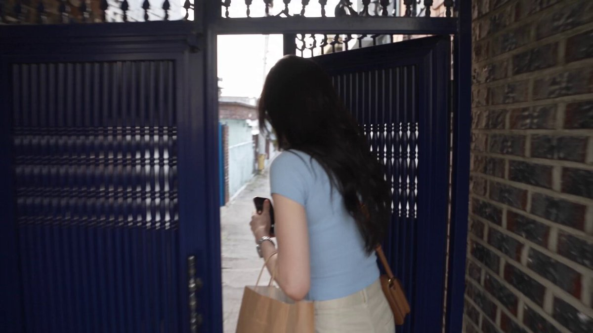

**Câu lệnh**

```text
Đang dịch
```

[↑ Về danh mục](#catalog)

---

<a name="prompt-2097181982924984513"></a>

### Người phụ nữ Indonesia đích thực trong thẩm mỹ video gia đình quay bằng máy quay DV đầu những năm 2000 với các mốc thời gian chi tiết theo trình tự trong một khu phố yên tĩnh.

Tác giả：[@QAiStudio](https://x.com/QAiStudio) · [Bài gốc](https://x.com/QAiStudio/status/2097181982924984513)

Nhiếp ảnh · Nhân vật · Đã xuất bản

**Tóm tắt:** Người phụ nữ Indonesia đích thực trong thẩm mỹ video gia đình quay bằng máy quay DV đầu những năm 2000 với các mốc thời gian chi tiết theo trình tự trong một khu phố yên tĩnh.

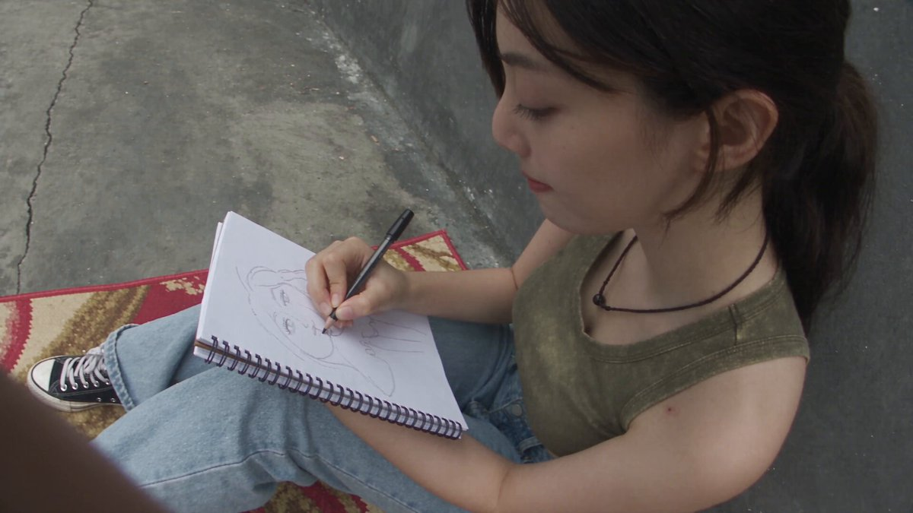

**Câu lệnh**

```text
Người phụ nữ Indonesia đích thực, thẩm mỹ video gia đình Indonesia đầu những năm 2000. Giữ nguyên chính xác khuôn mặt, danh tính, kiểu tóc, đường nét khuôn mặt, tông màu da, tỷ lệ cơ thể, lông nách tự nhiên, áo crop top không tay màu xanh ô liu phai màu, quần jeans ống rộng cạp cao màu xanh nhạt, giày thể thao vải canvas màu đen, vòng cổ dây đen, tóc gợn sóng màu đen, tóc mái lệch, buộc đuôi ngựa rối.

Khu dân cư Indonesia yên tĩnh bình thường: con hẻm bê tông hẹp, những ngôi nhà một tầng đơn sơ, hiên nhà nhỏ, tường thấp, cây cảnh trong chậu, xe máy đỗ, cây lớn, dây điện chằng chịt trên cao. Không có hàng quán hay hoạt động thương mại.

00:00–00:03: Cô ấy ngồi trên sàn hiên nhà vẽ nguệch ngoạc vào một cuốn sổ; máy quay cầm tay lơ lửng từ phía trên/bên cạnh.
00:03–00:07: Cô ấy gõ bút vào cằm, mỉm cười nhẹ rồi tiếp tục vẽ; máy quay di chuyển qua lại giữa khuôn mặt và bàn tay cô.
00:07–00:10: Cô ấy nằm trên chiếu quan sát đàn kiến bò dọc theo nền bê tông.
00:10–00:13: Cô ấy nhẹ nhàng chọc nhẹ gần lũ kiến và cười khẽ.
00:13–00:17: Cô ấy đi đến một bức tường thấp, nhảy lên và đung đưa chân.
00:17–00:20: Cô ấy thong thả ăn khoai tây chiên trong khi nhìn ra con đường yên tĩnh.
00:20–00:24: Cô ấy ngồi trên bậc thang với chiếc khăn quàng qua vai, mái tóc ẩm ướt, từ từ chải tóc.
00:24–00:27: Cảnh quay cận cảnh cầm tay khi cô ấy đang chải mái tóc ướt, có thể nhìn thấy những giọt nước.
00:27–00:30: Cô ấy chải xong, hất mái tóc ẩm ra sau, nhìn về phía máy quay và mỉm cười tự nhiên. Đột ngột chuyển sang màn hình đen.

Chân thực tột cùng kiểu máy quay DV cầm tay thô ráp: chuyển động mạnh, rung lắc nhẹ, bố cục vô tình, lệch tâm, thỉnh thoảng bị cắt xén khuôn mặt, lấy nét tự động bị giật đảo, biến động phơi sáng, nhòe chuyển động, màn trập lăn (rolling shutter), màu sắc phai/giảm bão hòa, nhiễu hạt kỹ thuật số và các vệt nén nén hình ảnh. Không tạo dáng, không chống rung, không phong cách điện ảnh, không tạo hình kiểu quảng cáo thời trang, không chỉnh màu hiện đại, không âm nhạc. Chỉ có âm thanh môi trường buổi sáng tự nhiên: tiếng chim, gió nhẹ, tiếng xe máy xa xa, tiếng trò chuyện trong xóm, tiếng cọ giấy, gói khoai tây chiên, lá cây, tiếng lược chải. 16:9.
```

[↑ Về danh mục](#catalog)

---

<a name="prompt-2097185861259727263"></a>

### Lời nhắc chân thực sống động cho một vlog du lịch bờ biển Hàn Quốc dài 30 giây ghi lại hành trình buổi tối từ chợ cá lúc hoàng hôn, dạo bộ ven biển đến bờ kè chắn sóng lúc nửa đêm.

Tác giả：[@nawalsehar](https://x.com/nawalsehar) · [Bài gốc](https://x.com/nawalsehar/status/2097185861259727263)

Nhiếp ảnh · Phong cảnh / Thiên nhiên · Đã xuất bản

**Tóm tắt:** Lời nhắc chân thực sống động cho một vlog du lịch bờ biển Hàn Quốc dài 30 giây ghi lại hành trình buổi tối từ chợ cá lúc hoàng hôn, dạo bộ ven biển đến bờ kè chắn sóng lúc nửa đêm.


**Câu lệnh**

```text
Tạo một vlog du lịch bờ biển Hàn Quốc hành động thực tế sống động như thật dài 30 giây theo chân một phụ nữ trẻ Hàn Quốc trải qua một buổi tối tại một ngôi làng ven biển yên bình. Bắt đầu tại một khu chợ hải sản sôi động với hải sản tươi sống, sàn nhà ẩm ướt và ánh hoàng hôn. Cô nhận phòng tại một nhà khách truyền thống ấm cúng, sau đó đi chân trần dọc theo bãi biển khi những con sóng vỗ nhẹ vào chân cô trong giờ vàng. Chuyển cảnh sang chợ hải sản ban đêm ấm cúng, nơi cô thưởng thức hải sản nướng tươi ngon và tương tác tự nhiên với khung cảnh xung quanh. Kết thúc vào nửa đêm bên cạnh một bờ kè chắn sóng yên tĩnh, phóng tầm mắt ra đại dương đen thẳm với ánh đèn câu cá xa xa và sóng vỗ bên dưới. Phong cách vlog bằng điện thoại thông minh/máy quay điện ảnh chân thực năm 2026, môi trường Hàn Quốc tự nhiên, làn da, mái tóc, trang phục, nước, thức ăn, khói, sóng biển và chuyển động của con người sống động như thật. Máy quay cầm tay, tự động lấy nét tự nhiên, thay đổi độ phơi sáng và hiệu ứng làm mờ chuyển động chân thực. Chỉ đối thoại bằng tiếng Anh, âm thanh môi trường tự nhiên, không có nhạc nền hoặc lời dẫn chuyện. Nhấn mạnh vào tính chân thực của vật lý, ánh sáng, chuyển động mượt mà và biểu cảm tự nhiên. Không có CGI, hoạt hình, phụ đề, biểu trưng hoặc hình mờ.
```

[↑ Về danh mục](#catalog)

---

<a name="prompt-2097186378861953475"></a>

### Tạo một vlog du lịch chân thực dài 30 giây tại thị trấn miền núi Nhật Bản, theo chân một cô gái trẻ khám phá ngôi làng yên tĩnh sau khi lỡ xe buýt, mang phong cách ánh sáng tự nhiên và máy quay cầm tay.

Tác giả：[@aiwithaly](https://x.com/aiwithaly) · [Bài gốc](https://x.com/aiwithaly/status/2097186378861953475)

Nhiếp ảnh · Nhân vật · Phong cảnh / Thiên nhiên · Đã xuất bản

**Tóm tắt:** Tạo một vlog du lịch chân thực dài 30 giây tại thị trấn miền núi Nhật Bản, theo chân một cô gái trẻ khám phá ngôi làng yên tĩnh sau khi lỡ xe buýt, mang phong cách ánh sáng tự nhiên và máy quay cầm tay.

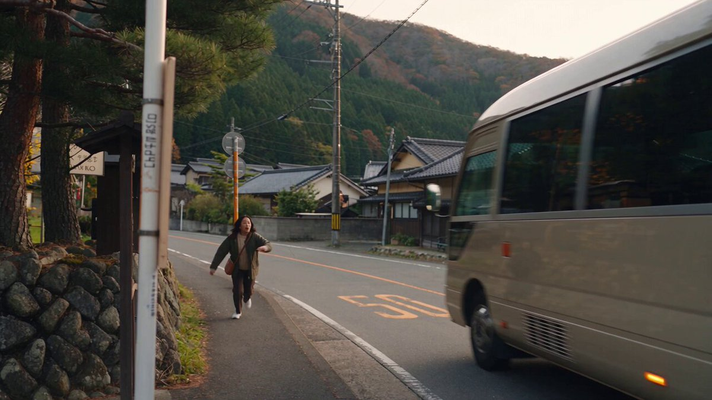

**Câu lệnh**

```text
Tạo một vlog du lịch chân thực dài 30 giây tại thị trấn miền núi Nhật Bản, theo chân một cô gái trẻ người Nhật bị lỡ xe buýt và dành 25 phút khám phá thị trấn yên bình. Thể hiện cảnh cô chạy đuổi theo chiếc xe buýt vừa rời bến → kiểm tra bảng giờ xe chạy → đi bộ qua những con phố tĩnh lặng và băng qua cây cầu màu đỏ → khám phá một quán trà truyền thống → thưởng thức tách trà xanh ấm nóng → ngắm nhìn khung cảnh núi non trong giờ vàng → nghe thấy tiếng xe buýt tiếp theo đang tới và quay trở lại trạm dừng.

Cảnh quay du lịch thực tế năm 2026, phong cảnh Nhật Bản tự nhiên, chuyển động bước đi và cơ thể người chân thực, tóc và trang phục bay theo gió, dòng suối chảy, trà bốc khói nghi ngút, chuyển động vật lý của xe buýt chuẩn xác và ánh sáng giờ vàng. Phong cách máy quay phim/điện thoại thông minh cầm tay với khả năng tự động lấy nét tự nhiên, thay đổi độ phơi sáng và hiệu ứng mờ chuyển động tinh tế. Chỉ có đối thoại bằng tiếng Anh, âm thanh môi trường làng quê chân thực và không có nhạc nền. Không có CGI, hoạt hình, hiệu ứng VHS, phụ đề, logo hoặc hình mờ.
```

[↑ Về danh mục](#catalog)

---

<a name="prompt-2097097582262825180"></a>

### 15秒第一人称视角的台球厅暧昧喜剧视频提示词，包含详细的分镜时间线、人物互动、运镜方式、台球局轨迹及音频与负面约束。

Tác giả：[@john87445528](https://x.com/john87445528) · [Bài gốc](https://x.com/john87445528/status/2097097582262825180)

Truyện tranh / Bảng phân cảnh · Nhiếp ảnh · Nhân vật · Đã xuất bản

**Tóm tắt:** 15秒第一人称视角的台球厅暧昧喜剧视频提示词，包含详细的分镜时间线、人物互动、运镜方式、台球局轨迹及音频与负面约束。

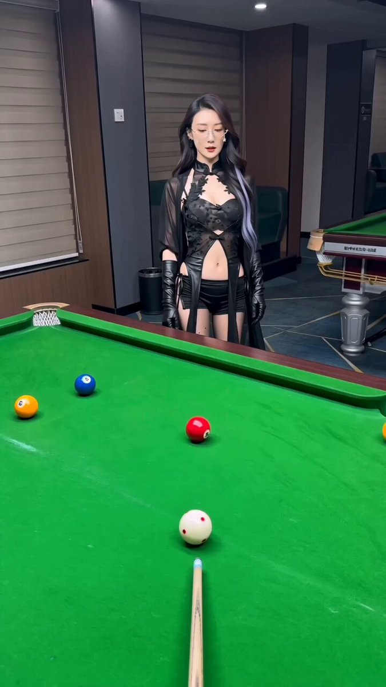

**Câu lệnh**

```text
｜15秒｜男主第一人称｜海妖风暧昧喜剧 【剧情锁定】 成年女主角#1发现男主准备击球，故意走进他的视野，主动侧坐上台球桌，屈起一条腿，让预定#2服装原有剪裁自然呈现大腿线条，以海妖风眼神和姿态干扰瞄准。男主停杆、抬头，她以为自己的小心思奏效；男主却不耐烦地倒转球杆，用橡胶粗端隔着衣服轻顶她臀侧一下，催她下桌。她被识破后调皮又无奈地让开，男主立即继续击球，母球撞中目标球，目标球落袋。 必须完整呈现“她先站着—主动上桌—故意展示腿部线条并观察他的反应”。她明知会干扰打球，仍主动试探；不能开场便让她已经坐好，也不能演成偶然挡路。 【人物与服装】 画面中唯一可见的人物是成年女主角#1
，面孔、发型、体型保持一致。#1完整穿着预定#2
屏幕截图_31-8-2026_22160_jimeng.jianying.com
服装，带着装饰眼镜
包括既定丝袜
和配饰；#2仅是服装编号，绝不生成第二个人物。腿部呈现服从#2本身的长度、开口和袜装，不能为了露腿改变剪裁、消除袜子或凭空缩短衣服。 成年男主只提供第一人称视点、唯一一支球杆和一句画外对白。脸、身体、手臂、双手、影子、倒影均不入画。全片不出现其他人或人物复制。 【影像与拍摄关系】 9:16竖屏，1080×1920，30fps，约26—28mm等效视角。男主佩戴贴近眼线的轻型头戴相机，保留未经处理的手机视频观感。低头看球、抬头看人、直起身体均带动真实镜头运动。男主无需手持摄影设备，可以正常操杆；握杆手和架杆手始终位于取景下缘之外。 全程连续第一人称，不切到男主正面、第三人称或外部全景。轻微呼吸起伏、头部晃动和不完美重新构图；从白球转看#1时，对焦允许短暂迟疑。冷白顶灯照明，肤色和衣料保留纹理，暗部带少量手机噪点；快速调杆有适量运动模糊，但不能糊掉端头交换。无美颜、磨皮、电影调色和稳定器运镜。 构图以能读懂人物动作为先：上桌时保留她扶库边的手、坐下的位置和两腿变化；试探时让脸与腿部线条同时在画面内；赶人时让表情和球杆粗端同时可见；最后回到白球、红球、中袋的完整路线。镜头不长时间追着某一处身体，也不能为了看脸把上桌和调杆动作裁掉。 【台球厅环境】 普通室内台球厅，绿色台呢、红棕色木质库边、黑色桌体、银色边框和白色网兜球袋。背景为深灰与棕色竖向墙板、浅色百叶窗、深绿色等候椅，顶灯将桌面照得比背景明亮。远处可见另一张无人使用的球桌，环境朴素、有实际使用痕迹，整体空间和光线全程不变。 没有酒吧灯光、粉色爱心、霓虹装饰、豪华软包或摄影棚布景。镜头范围内不出现其他顾客、工作人员、人像海报或镜面反射。 【空间与球局】 男主位于近侧长库边中央，#1开始站在对面长库边、画面右侧。两人隔着约1.3米的桌宽相对，不能改成隔着整张球桌的长度。对面中袋位于画面上方中央，始终是明确的落袋目标。 桌上起始共有四颗球：一颗白色母球、一颗红色实心目标球、一颗蓝球、一颗黄球。白球位于近半台中央；红球在对面中袋前约25厘米，白球、红球、中袋形成容易看清的直线。蓝球与黄球分别停在左右远离球路的位置，全程静止。 #1坐在对面中袋右侧的库边，身体斜向镜头；一条屈腿轻放在台面右侧边缘，另一条腿垂在桌外。她的腿部和上身进入男主瞄准视野，但不踩球、不压球、不把腿跨在两球之间。她必须下桌后男主才击球。 她坐下前，白球到红球、红球到中袋的路线已在开场建立；她坐下后，屈腿位于这条路线右侧，进入视野并分散注意，但实际球路没有被身体堵死。她收腿下桌的过程中不得碰动任何球。球位从开头直到出杆保持不变，观众能用同一组位置看懂男主始终想打哪一球。 【海妖风与结尾表情】 坐姿呈自然S曲线：身体微侧，肩部下沉，颈部拉长，下巴轻轻侧抬，腰胯略向一侧移。屈腿与垂腿前后错位，大腿线条在人物整体中自然可见；左手撑库边，右手只整理一次发丝。半垂眼冷感直视男主，嘴角仅有很淡的试探笑意。 前半段冷艳、克制、有距离感；后半段按剧情允许出现调皮、无奈的微笑。她被识破后不惊恐、不生气，也不狼狈尖叫，而是嘴角先停半拍，随后侧眼抿笑、小幅摇头，像在用表情说“行吧，你就知道打球”。这句话不实际说出，不加字幕。 暧昧必须通过相互观察表现：她每次调整坐姿后都会瞥一眼杆头，看到杆头停住才露出得意；男主的镜头则反复从她回到红球，留下他其实更在乎球局的线索。前半段的腿部展示、后半段的调皮笑都属于成年人的轻松玩笑，保持自然、从容，不用夸张表情代替剧情。 【球杆连续性】 唯一一支约145厘米的台球杆：浅木色细杆、细小蓝色皮头、深色粗握柄、尾部黑色橡胶保护帽。细头用于击球，橡胶粗端用于一次轻微赶人动作。 调头是端对端转过180度。必须连续看见：细头离开白球并撤回；同一杆身斜向扫过镜头前方；细头转向侧下方，粗握柄和黑色尾帽从另一侧绕出；最终黑色粗端指向#1。握持点可以藏在下缘，杆身不能整根退出后突然换成另一端，也不能只沿长轴自转。 翻杆时杆身经过人物前方，必须与她保持明显的前后距离，不扫到头发、面部或肩膀。橡胶尾帽靠近臀侧后仅短暂接触一次，随即离开；接下来由#1自己撑住库边、收腿、滑下。她的身体运动、衣料变化与接触顺序同步，不能先下桌再补拍顶人的动作。 【严格时间分镜】 → 0—3秒，第一人称俯看球桌。白球、红球、中袋与左右静止的蓝黄两球同时建立，细杆头正在白球后方试瞄。 原本站在对面长库边右侧的#1先看一眼球杆方向，再看向镜头。她主动扶住库边，侧身坐上去，屈起一条腿放到台面边缘，另一条腿垂在桌外。坐下、抬腿和衣料自然形成褶皱的过程连续可见，#2原有剪裁呈现大腿线条。镜头随男主抬头，从球路转向她的完整坐姿。 → 3—5.5秒，保持#1面部、上身和腿部同框的中景。她肩部放松下沉、颈部拉长，身体形成S曲线，指尖整理发丝，半垂眼看着镜头，随后把视线短暂移向球杆，确认男主是否停下。 球杆停止试瞄。镜头略低头看球，又抬回她脸上。#1看见这个反应，嘴角慢慢浮起一丝笃定笑意，屈起的膝盖略向侧面调整，使大腿线条更完整。动作明显带有故意干扰的试探，但不拉扯衣摆。 → 5.5—7秒，球杆再次靠近白球，却仍未击打。男主短促呼气，镜头随他直起身体升高，发出略带火气、不耐烦的成年男声：“让开，让开。” #1没有立刻移动，只轻轻侧头，半垂眼望着他，嘴角还保留着以为自己成功的笑意。 → 7—8.5秒，完整展示调转球杆。浅木色细头先从白球后方撤回，同一杆身斜贯画面前景，细头沿侧下方转走；深色粗柄与黑色橡胶尾帽从另一侧转到正前方，完成端对端半圈翻转。 相机有轻微头部晃动，但始终让杆身的一部分留在画面中。最终画面下方清楚出现朝向#1的黑色橡胶粗端，细头已经朝向男主一侧。 → 8.5—10秒，男主将粗端越过桌面，隔着完整#2服装，在#1靠台面一侧的臀部外侧短促轻顶一下，随即撤开。人物中景同时交代她的脸、姿态、库边和接触动作，不切局部特写。 #1低头看一眼黑色杆尾，嘴角原来的笃定笑意停住半拍。她明白男主完全没有配合自己的试探，主动双手撑库边，把屈起的腿收出台面，顺势向桌外滑下。动作由她自身支撑完成，不被顶飞，也不跌倒。 → 10—11秒，#1双脚落地后向画面右侧让开半步，鞋底落地声清楚。她侧眼看向男主，抿住忍不住扬起的嘴角，轻轻摇一次头，带一点“被你看穿了”的调皮无奈。 她身体重新微侧，颈线拉长，维持冷艳基调；不是慌张、恼怒、委屈或被羞辱的表情。 → 11—12秒，球杆粗端收回，按先前相反的路径端对端调转：黑色尾帽转向下缘，浅木色杆身和蓝色细皮头重新指向白球。镜头随男主低头回到球路，细头停在白球后方，#1已经完全让出观察方向。 → 12—14秒，男主平稳出杆一次，细皮头实际接触白球，发出清楚的“嗒”。白球先滚动，再撞上红球；红球沿直线滚向对面中袋，越过袋沿并落进白色网兜，发出真实的落袋声。 白球碰撞后留在台面，减速停下；蓝球和黄球原地不动。落袋后桌上剩白、蓝、黄三颗球，红球不能再次出现在桌面。 → 14—15秒，镜头从空出的中袋略抬向右侧。#1站在桌旁，目光先扫过落袋位置，再回到男主，半垂眼侧视，嘴角带着克制的调皮笑意，轻轻呼出一口气。 她保持自然S曲线和前后错位的双腿，一副小计策失败却又拿他没办法的模样。男主没有搭话，结尾停在她无奈抿笑的反应上。 【音频】 现场同期声：通风设备、远处模糊人声、坐上库边的衣料摩擦、球杆转动的轻响、鞋底落地、击球、球体碰撞与落袋声。唯一对白来自镜头后方成年男主：“让开，让开。”#1用表情完成反应。无背景音乐、旁白、解释性对白和罐头笑声。 【负面约束】 不得省略主动上桌和故意干扰；不得只拍她已经坐好的状态；不得把大腿裁出画面，也不得使用裙底角度或腿臀慢扫；不得改变#2服装或露出内衣；不得复制人物、肢体、球和球杆；不得出现男主或第二个#1；不得把翻杆省略成杆子退出后换端；不得用细头顶人、反复顶撞、造成受伤或摔落；不得让#1做惊恐、愤怒或委屈反应；不得省略白球撞红球和红球真实落袋；不得白球入袋代替红球，不得目标球凭空消失；不得出现字幕、水印、平台UI、爱心贴纸、慢动作或电影滤镜。
```

[↑ Về danh mục](#catalog)

---

<a name="category-cinematic-film-still"></a>

## Điện ảnh / Ảnh tĩnh từ phim

<a name="prompt-2097502400961761425"></a>

### Đang dịch

Tác giả：[@Zarnab\_with\_Ai](https://x.com/Zarnab_with_Ai) · [Bài gốc](https://x.com/Zarnab_with_Ai/status/2097502400961761425)

Điện ảnh / Ảnh tĩnh từ phim · Kết xuất 3D · Nhân vật · Động vật / Sinh vật · Đã xuất bản

**Tóm tắt:** Đang dịch


**Câu lệnh**

```text
Đang dịch
```

[↑ Về danh mục](#catalog)

---

<a name="prompt-2096826123330138410"></a>

### Đang dịch

Tác giả：[@noorlewisx](https://x.com/noorlewisx) · [Bài gốc](https://x.com/noorlewisx/status/2096826123330138410)

Điện ảnh / Ảnh tĩnh từ phim · Nhân vật · Mặt hàng thời trang · Đã xuất bản

**Tóm tắt:** Đang dịch


**Câu lệnh**

```text
Đang dịch
```

[↑ Về danh mục](#catalog)

---

<a name="prompt-2097303258171949530"></a>

### Đang dịch

Tác giả：[@Strength04\_X](https://x.com/Strength04_X) · [Bài gốc](https://x.com/Strength04_X/status/2097303258171949530)

Điện ảnh / Ảnh tĩnh từ phim · Nhân vật · Mặt hàng thời trang · Đã xuất bản

Bài gốc：[@Strength04\_X](https://x.com/Strength04_X) · [Bài gốc](https://x.com/Strength04_X/status/2097272589387546831)

**Tóm tắt:** Đang dịch

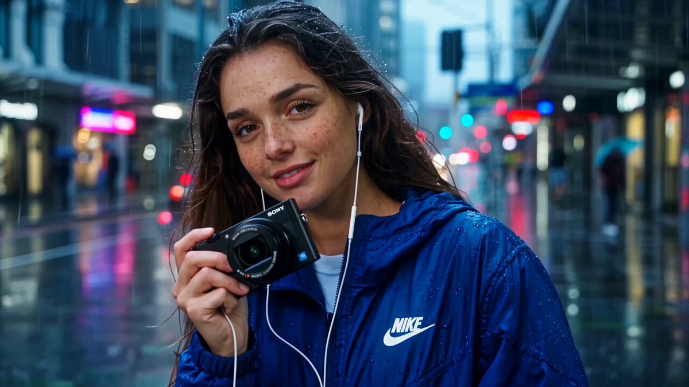

**Câu lệnh**

```text
Đang dịch
```

[↑ Về danh mục](#catalog)

---

<a name="prompt-2096984350055436729"></a>

### Đang dịch

Tác giả：[@TanLuAI](https://x.com/TanLuAI) · [Bài gốc](https://x.com/TanLuAI/status/2096984350055436729)

Điện ảnh / Ảnh tĩnh từ phim · Đã xuất bản

**Tóm tắt:** Đang dịch

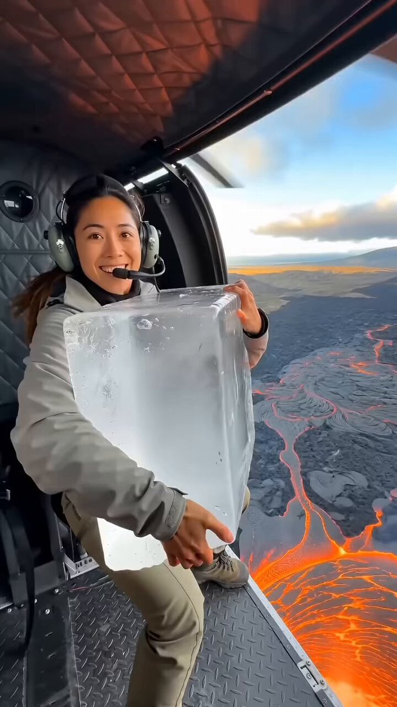

**Câu lệnh**

```text
Đang dịch
```

[↑ Về danh mục](#catalog)

---

<a name="prompt-2097249504986644872"></a>

### Đang dịch

Tác giả：[@johnAGI168](https://x.com/johnAGI168) · [Bài gốc](https://x.com/johnAGI168/status/2097249504986644872)

Truyện tranh / Bảng phân cảnh · Điện ảnh / Ảnh tĩnh từ phim · Đã xuất bản

**Tóm tắt:** Đang dịch


**Câu lệnh**

```text
Đang dịch
```

[↑ Về danh mục](#catalog)

---

<a name="prompt-2096948259059085379"></a>

### Màn đấu võ kiếm hiệp điện ảnh trong rừng phong mùa thu với đấu kiếm chuyển động chậm, hình ảnh hiệu ứng thủy mặc và ánh sáng thể tích.

Tác giả：[@aiwithlumi](https://x.com/aiwithlumi) · [Bài gốc](https://x.com/aiwithlumi/status/2096948259059085379)

Điện ảnh / Ảnh tĩnh từ phim · Phong cảnh / Thiên nhiên · Đã xuất bản

**Tóm tắt:** Màn đấu võ kiếm hiệp điện ảnh trong rừng phong mùa thu với đấu kiếm chuyển động chậm, hình ảnh hiệu ứng thủy mặc và ánh sáng thể tích.

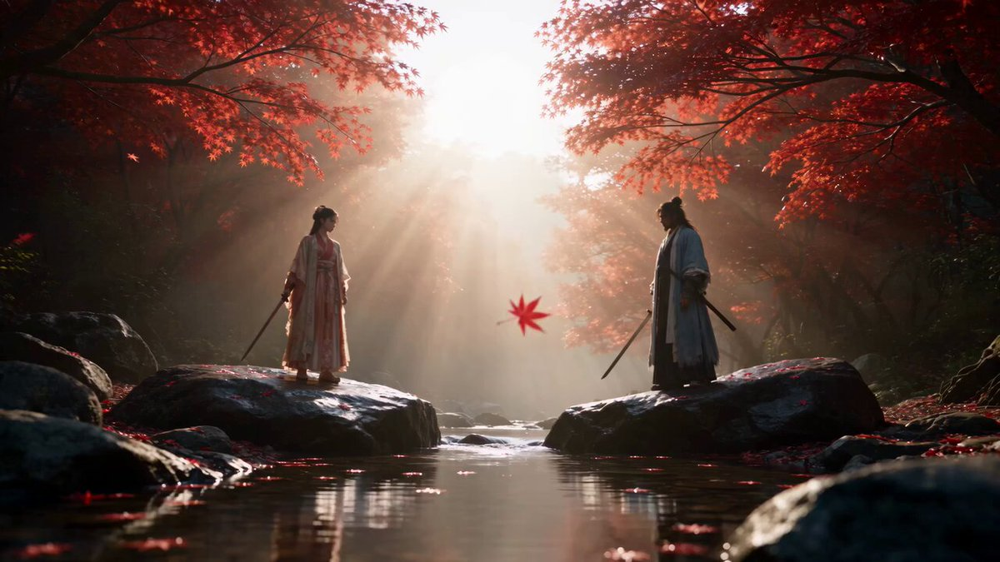

**Câu lệnh**

```text
Trường đoạn kiếm hiệp điện ảnh trong rừng phong mùa thu: hai võ sĩ, một nữ hiệp trong bộ Hán phục lụa hồng trắng thướt tha và một nam hiệp trong tà áo lam, đối đầu trên những tảng đá rêu phong ướt át bên sông khi những tia nắng vàng xuyên qua làn sương và lá phong đỏ rơi rụng. Nàng phóng mình lên không trung, rút thanh kiếm thép và lướt về phía chàng trong chuyển động chậm đầy kịch tính trước khi lưỡi kiếm chạm nhau tóe ra những tia lửa rực rỡ. Nàng tiếp đất duyên dáng, làm nước bắn tung tóe xung quanh, trong khi hiệu ứng tranh thủy mặc sumi-e đen tuyền lan tỏa khắp khung hình. Kết thúc bằng cảnh quay góc rộng đối xứng hoàn hảo của hai võ sĩ giơ kiếm qua đầu trong tư thế thủ đồng bộ, được viền bởi những tán phong đỏ và ánh sáng ngược rực rỡ, với kết cấu siêu chi tiết, chuyển động điện ảnh 24fps và ánh sáng thể tích đầy không khí nghệ thuật.
```

[↑ Về danh mục](#catalog)

---

<a name="prompt-2096815972560835061"></a>

### Đang dịch

Tác giả：[@iamrealsnow](https://x.com/iamrealsnow) · [Bài gốc](https://x.com/iamrealsnow/status/2096815972560835061)

Điện ảnh / Ảnh tĩnh từ phim · Minh họa · Kết xuất 3D · Đã xuất bản

**Tóm tắt:** Đang dịch


**Câu lệnh**

```text
Đang dịch
```

[↑ Về danh mục](#catalog)

---

<a name="prompt-2097182918368276602"></a>

### Lời nhắc tạo video điện ảnh dài 15 giây nêu chi tiết các phân cảnh theo thời gian về một người phụ nữ Hàn Quốc ở Seoul búng tay để đóng băng thời gian, biến đổi trang phục và kích hoạt vòng lặp thị giác trên bảng quảng cáo LED.

Tác giả：[@MissDelulu9](https://x.com/MissDelulu9) · [Bài gốc](https://x.com/MissDelulu9/status/2097182918368276602)

Điện ảnh / Ảnh tĩnh từ phim · Nhân vật · Mặt hàng thời trang · Đã xuất bản

**Tóm tắt:** Lời nhắc tạo video điện ảnh dài 15 giây nêu chi tiết các phân cảnh theo thời gian về một người phụ nữ Hàn Quốc ở Seoul búng tay để đóng băng thời gian, biến đổi trang phục và kích hoạt vòng lặp thị giác trên bảng quảng cáo LED.

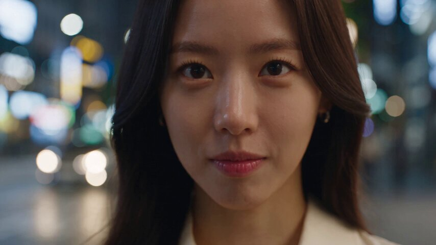

**Câu lệnh**

```text
Tạo một video điện ảnh tỷ lệ 16:9 nằm ngang dài 15 giây, siêu thực tế, có sự xuất hiện của một người phụ nữ Hàn Quốc tại Seoul.

0–2 giây:
Cận cảnh cực đại khuôn mặt của cô ấy. Cô ấy đột nhiên nhìn thẳng vào ống kính và nói với vẻ mặt tinh nghịch, tự tin: “Watch this.”

2–6 giây:
Cô ấy búng ngón tay.

Ngay lập tức, bộ trang phục bình thường của cô ấy biến hóa thành một phong cách thời trang đường phố Hàn Quốc tương lai đầy ấn tượng, trong khi toàn bộ đường phố Seoul xung quanh cô ấy đóng băng ngay giữa chuyển động.

6–11 giây:
Cô ấy thong thả bước đi qua đám đông đang bất động. Khi cô ấy đi qua từng người, họ đột nhiên thoát khỏi trạng thái đóng băng từng người một, nhưng trang phục của họ lại biến đổi thành những diện mạo thời trang cao cấp hoàn toàn khác biệt.

11–15 giây:
Cô ấy bước tới một bảng quảng cáo LED khổng lồ, nhìn vào đó, và bảng quảng cáo đột nhiên hiển thị video trực tiếp về chính CÔ ẤY đang bước về phía nó, tạo ra một vòng lặp thị giác bất khả thi.

Cắt dựng nhịp độ nhanh, người phụ nữ Hàn Quốc cực kỳ chân thực, khung cảnh đường phố Hàn Quốc tự nhiên, phong cách thời trang cao cấp, ánh sáng ban đêm mang đậm chất điện ảnh, chuyển động đám đông chân thực, hiệu ứng biến đổi mượt mà, biểu cảm khuôn mặt chi tiết, chuyển động máy quay sống động, điểm thu hút thị giác mạnh mẽ, kết thúc bất ngờ, thẩm mỹ mạng xã hội lan truyền được trau chuốt kỹ lưỡng, không phụ đề, không hình mờ.
```

[↑ Về danh mục](#catalog)

---

<a name="prompt-2096906803967840616"></a>

### Lời nhắc MV thời trang du lịch điện ảnh 30 giây khắc họa một cô gái thần tượng K-pop khám phá Trùng Khánh với tai nghe có dây, bao gồm phân tích timeline chi tiết, góc máy, trang phục và lời nhắc phủ định.

Tác giả：[@ImaStudio\_ai](https://x.com/ImaStudio_ai) · [Bài gốc](https://x.com/ImaStudio_ai/status/2096906803967840616)

Nhiếp ảnh · Điện ảnh / Ảnh tĩnh từ phim · Nhân vật · Mặt hàng thời trang · Đã xuất bản

**Tóm tắt:** Lời nhắc MV thời trang du lịch điện ảnh 30 giây khắc họa một cô gái thần tượng K-pop khám phá Trùng Khánh với tai nghe có dây, bao gồm phân tích timeline chi tiết, góc máy, trang phục và lời nhắc phủ định.

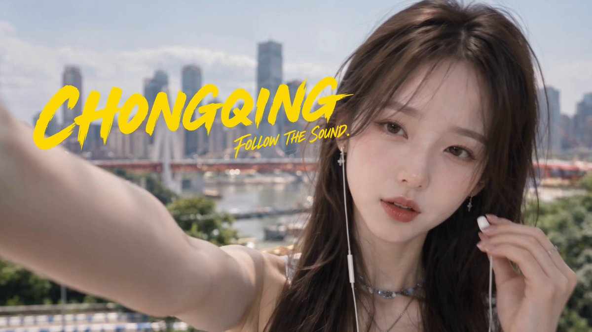

**Câu lệnh**

```text
Tạo một MV thời trang du lịch điện ảnh chân thực 30 giây, tỷ lệ 16:9, 24fps lấy bối cảnh tại Trùng Khánh, Trung Quốc.
Ý TƯỞNG CỐT LÕI:
Một cô gái trẻ phong cách K-pop Hàn Quốc hư cấu dành một ngày khám phá Trùng Khánh trong khi nghe nhạc qua tai nghe có dây màu trắng. Toàn bộ thước phim mang lại cảm giác như một vlog du lịch Hàn Quốc phong cách kết hợp với một video ca nhạc tuổi trẻ — tươi mới, tự nhiên, sống động và đậm chất điện ảnh, không bao giờ giống một quảng cáo du lịch.
KHÓA NHÂN VẬT:
Chỉ một người phụ nữ duy nhất, 20–23 tuổi, ngoại hình thần tượng Hàn Quốc: khuôn mặt nhỏ nhắn thanh tú, làn da sáng tự nhiên, mái tóc đen dài với tóc mái thưa mềm mại, đôi mắt nâu sẫm, bọng mắt cười (aegyo-sal) tinh tế, đường kẻ mắt mỏng, đôi môi màu hồng nude bóng nhẹ, vóc dáng thon thả.
Giữ nguyên vẹn khuôn mặt, mái tóc, tỷ lệ cơ thể, lớp trang điểm và danh tính trong từng cảnh quay.
Tai nghe có dây màu trắng luôn hiển thị xuyên suốt.
Không có lời thoại. Cảm xúc được thể hiện qua ánh mắt, nụ cười nhẹ, bước đi, ngoảnh lại, cười đùa và chuyển động tự nhiên theo điệu nhạc.
TRANG PHỤC:
Ban ngày: áo dệt kim dáng lửng màu kem, quần jean cạp cao màu xanh nhạt, khuyên tai bạc, túi đeo vai màu đen.
Hoàng hôn: áo ôm vừa vặn màu xanh xám nhạt, áo khoác lửng màu đen, quần jean.
Ban đêm: áo hai dây màu đen, áo khoác đen rộng (oversized), trang sức bạc.
Chỉ đổi trang phục tại các điểm cắt cảnh dứt khoát (hard cuts).
TIMELINE:
0–3 giây: Tự chụp góc cực cận (extreme close selfie) tại điểm ngắm cảnh ven sông. Đường chân trời và cây cầu Trùng Khánh mờ nhẹ phía sau. Cô đeo một bên tai nghe vào, nhạc bắt đầu, cô mỉm cười với máy quay.
3–6 giây: Cảnh theo dõi (follow shot) trên con phố sườn đồi dốc ở Trùng Khánh. Những tòa nhà nhiều tầng, dốc núi, cây cối, ánh nắng xuyên qua kẽ lá. Mái tóc và dây tai nghe chuyển động tự nhiên.
6–9 giây: Lý Tử Bá (Liziba). Góc máy thấp khi tàu điện một ray chạy xuyên qua tòa nhà chung cư. Cô ngước nhìn lên, rồi quay lại mỉm cười.
9–12 giây: Cáp treo sông Dương Tử. Cô đứng gần cửa sổ, nhìn ra dòng sông, những cây cầu, các tòa tháp và các tầng lớp dốc của thành phố. Gió thổi bay mái tóc và dây tai nghe của cô.
12–15 giây: Phố cổ sườn đồi / Lối đi bộ Sơn Thành (Shancheng Trail) / Thập Bát Đễ (Shibati). Bậc thang đá, nhà cổ, lồng đèn, hàng quán nhỏ. Cô bước lên dốc và liếc nhìn lại máy quay.
15–18 giây: Đoạn dựng phong cách sống nhanh: giày bước trên bậc đá, tay vịn lan can, mua đồ uống, tóc bay trong gió, các tòa nhà cao tầng đóng khung giữa những con phố hẹp.
18–22 giây: Điểm ngắm cảnh hoàng hôn. Chuyển sang OUTFIT 2. Toàn cảnh đường chân trời rộng lớn, dòng sông và các cây cầu ngập trong ánh sáng cam ấm áp. Bắt đầu từ phía sau lưng cô, sau đó là góc nghiêng. Cô nhắm mắt lại trong giây lát và lắng nghe.
22–26 giây: Hồng Nhai Động về đêm. Chuyển sang OUTFIT 3. Ánh đèn vàng ấm áp, bầu trời xanh thẫm, đám đông chân thực. Quay một cách tự nhiên như một người bạn đang đi theo sau cô. Cô ngoảnh lại, cười lớn và tiếp tục bước đi.
26–30 giây: Bờ sông về đêm gần cầu Thiên Tư Môn (Qiansimen). Một cô bạn gái cùng tham gia. Họ nhún nhảy nhẹ nhàng, xoay người, cười đùa và chuyển động theo nhịp điệu — không phải vũ đạo bài bản. Nhân vật chính bước lại gần hơn, tháo một bên tai nghe, nhìn lại thành phố rực rỡ ánh đèn.
Chữ cuối phim:
CHONGQING
FOLLOW THE SOUND.
MÁY QUAY:
Góc rộng thành phố 24mm, chân dung 35–50mm, chi tiết 85mm. Cầm tay nhẹ nhàng (handheld), đi theo chuyển động, căn khung kiểu selfie, đẩy vào từ từ (slow push-in), góc thấp tự nhiên. Cắt cảnh dứt khoát dựa trên hành động.
ĐỘ CHÂN THỰC:
Kết cấu da thật, vật lý tóc tự nhiên, dây tai nghe ổn định, kiến trúc Trùng Khánh chân thực, tàu điện một ray, cáp treo, đám đông, dòng sông và các con dốc.
TIÊU CỰC (NEGATIVE):
Không biến dạng khuôn mặt, nhân vật trùng lặp, tự ý đổi trang phục ngẫu nhiên, thiếu tai nghe, bàn tay méo mó, làn da nhựa bóng giả tạo, Trùng Khánh phong cách cyberpunk, phố xá Nhật Bản hoặc Hàn Quốc thay thế Trùng Khánh, địa danh giả mạo, văn bản ngẫu nhiên, phụ đề, hình mờ (watermark), bộ lọc làm đẹp quá đà.
CẢM XÚC CUỐI CÙNG:
Ngày đầu tiên của một cô gái thần tượng K-pop Hàn Quốc tại Trùng Khánh — âm nhạc văng vẳng bên tai, cả thành phố chuyển động như MV của chính cô.
```

[↑ Về danh mục](#catalog)

---

<a name="prompt-2096832969453543579"></a>

### Tạo một vlog lãng mạn phong cách đại học Mỹ chân thực như ảnh dài 30 giây trong cơn mưa dông buổi chiều, theo chân hai sinh viên che chung ô và ghé một quán cà phê.

Tác giả：[@nawalsehar](https://x.com/nawalsehar) · [Bài gốc](https://x.com/nawalsehar/status/2096832969453543579)

Nhiếp ảnh · Điện ảnh / Ảnh tĩnh từ phim · Đã xuất bản

**Tóm tắt:** Tạo một vlog lãng mạn phong cách đại học Mỹ chân thực như ảnh dài 30 giây trong cơn mưa dông buổi chiều, theo chân hai sinh viên che chung ô và ghé một quán cà phê.

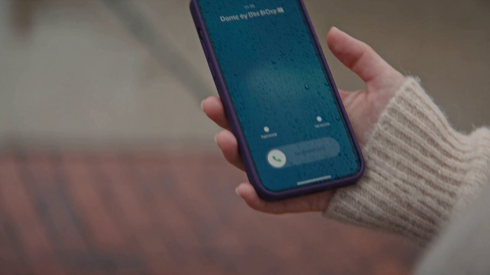

**Câu lệnh**

```text
Tạo một vlog lãng mạn quay người thật, chân thực như ảnh dài 30 giây lấy bối cảnh tại một trường đại học Mỹ trong cơn mưa dông bất chợt vào buổi chiều. Một nữ sinh bị mắc kẹt dưới cơn mưa tầm tã mà không có ô, cho đến khi một nam sinh tốt bụng che chung chiếc ô màu đen của mình. Họ cùng nhau bước đi trong khuôn viên trường đại học Mỹ chân thực, vừa trêu đùa vừa dần trở nên thoải mái bên nhau. Họ trú mưa tại một quán cà phê ấm cúng trong khuôn viên trường, cùng nhau uống cà phê nóng bên khung cửa sổ đọng đầy nước mưa, và có một khoảnh khắc kết nối đầy tinh tế. Khi mưa tạnh, ánh nắng vàng rực rỡ xuyên qua những đám mây và họ cùng nhau dạo bước qua khuôn viên trường còn ướt nước mưa. Phong cách điện ảnh tuổi trưởng thành hiện đại năm 2026, đối thoại tiếng Anh Mỹ tự nhiên, mưa chân thực, tóc và quần áo ướt, chuyển động vật lý của ô, phản chiếu trên vũng nước, hành vi sinh viên chân thực, góc máy phong cách cầm tay bằng điện thoại thông minh, biểu cảm tự nhiên và sự lãng mạn nhẹ nhàng. Không diễn xuất phóng đại, không CGI, không hoạt hình, không phụ đề, không âm nhạc hay hình mờ.
```

[↑ Về danh mục](#catalog)

---

<a name="prompt-2097184908250845406"></a>

### Một vlog du lịch AI đậm chất điện ảnh về cô gái trẻ sành điệu khám phá phố cổ châu Âu lúc hoàng hôn với lời thoại chi tiết, hướng dẫn khớp khẩu hình và tính thẩm mỹ phim du lịch điện ảnh.

Tác giả：[@CaliraVal](https://x.com/CaliraVal) · [Bài gốc](https://x.com/CaliraVal/status/2097184908250845406)

Điện ảnh / Ảnh tĩnh từ phim · Nhân vật · Phong cảnh / Thiên nhiên · Đã xuất bản

**Tóm tắt:** Một vlog du lịch AI đậm chất điện ảnh về cô gái trẻ sành điệu khám phá phố cổ châu Âu lúc hoàng hôn với lời thoại chi tiết, hướng dẫn khớp khẩu hình và tính thẩm mỹ phim du lịch điện ảnh.

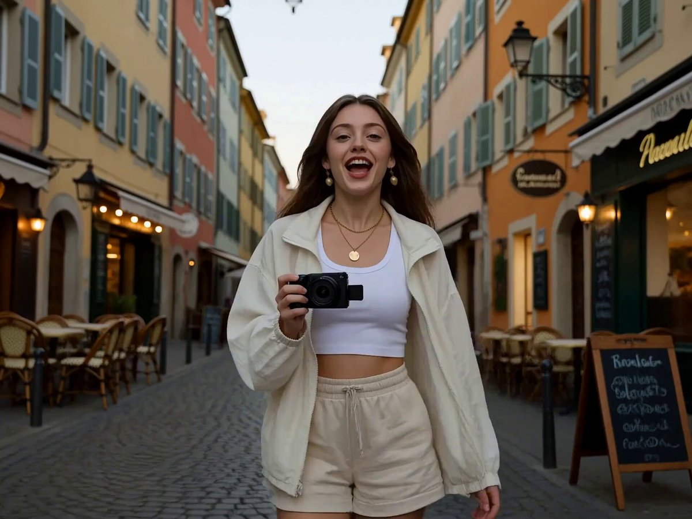

**Câu lệnh**

```text
Một vlog du lịch AI mang phong cách điện ảnh về một cô gái trẻ trung, sành điệu đang khám phá khu phố cổ châu Âu tràn đầy sức sống lúc hoàng hôn. Cô có mái tóc đen dài bồng bềnh, mặc áo crop-top màu trắng, áo khoác oversized mỏng nhẹ và quần short màu be. Cô tự tin sải bước qua những con phố lát đá cuội hẹp, bao quanh bởi những tòa nhà cổ kính đầy màu sắc, những quán cà phê ấm cúng, cửa hiệu địa phương và ánh đèn đường vàng ấm áp.

Cô nhìn tự nhiên vào máy quay và trò chuyện trực tiếp với khán giả bằng phong thái thân thiện, tràn đầy năng lượng. Thêm giọng lồng tiếng tiếng Anh nữ trẻ tự nhiên với phát âm rõ ràng, tông giọng đối thoại chân thực và cảm xúc tinh tế. Đảm bảo lời nói của cô khớp hoàn hảo với chuyển động của môi.

Lời thoại lồng tiếng:
“Hey everyone! I’m exploring this beautiful city today, and honestly, every street feels like a movie. The atmosphere here is incredible, and I can’t wait to show you what I find!”
(Chào mọi người! Hôm nay mình đang khám phá thành phố tuyệt đẹp này, và thật lòng mà nói, mỗi góc phố đều đẹp như một thước phim. Bầu không khí ở đây thật tuyệt vời, và mình rất nóng lòng được cho các bạn thấy những gì mình tìm được!)

Chuyển cảnh đến cảnh cô mua một chiếc bánh ngọt địa phương từ tiệm bánh nhỏ ven đường. Cô mỉm cười và nói:
“This looks absolutely delicious. I had to try it!”
(Món này trông ngon tuyệt vời luôn. Mình nhất định phải thử mới được!)

Sau đó, cô ngồi tại một quán cà phê ngoài trời thưởng thức cà phê trong khi ngắm nhìn dòng người qua lại:
“Sometimes the best part of traveling is simply slowing down and enjoying the moment.”
(Đôi khi điều tuyệt vời nhất của những chuyến đi chỉ đơn giản là sống chậm lại và tận hưởng từng khoảnh khắc.)

Cảnh quay cuối cùng: cô bước về phía một điểm ngắm cảnh tuyệt đẹp nhìn ra toàn thành phố khi hoàng hôn buông xuống. Cô quay lại nhìn vào máy quay và nói:
“Okay, this view is definitely the highlight of my day. Would you come here?”
(Được rồi, khung cảnh này chắc chắn là điểm nhấn tuyệt vời nhất trong ngày của mình. Bạn có muốn đến đây không?)

Biểu cảm khuôn mặt tự nhiên, khớp khẩu hình chính xác, giọng nữ tiếng Anh chân thực, nhịp thở và khoảng ngắt tinh tế, cử chỉ tay tự nhiên, kết cấu làn da chân thực, chuyển động tóc mềm mại, cảm giác máy quay vlog cầm tay chân thực, chuyển động camera mượt mà, độ sâu trường ảnh nông, người đi lại phía sau chân thực, ánh sáng giờ vàng điện ảnh, hiệu ứng lóe sáng ống kính dịu nhẹ, chân thực như ảnh chụp, 4K, độ chi tiết cao, chuyển động tự nhiên, thẩm mỹ phim du lịch cao cấp.
```

[↑ Về danh mục](#catalog)

---

<a name="prompt-2097182529564365135"></a>

### Một người gác hải đăng dãi dầu sương gió trên vách đá mù sương ban đêm được bao quanh bởi các quả cầu phát quang sinh học bay lên, với chuyển động máy quay đẩy vào liên tục mang phong cách điện ảnh.

Tác giả：[@SyntheSarah](https://x.com/SyntheSarah) · [Bài gốc](https://x.com/SyntheSarah/status/2097182529564365135)

Nhiếp ảnh · Điện ảnh / Ảnh tĩnh từ phim · Kiến trúc / Nội thất · Đã xuất bản

**Tóm tắt:** Một người gác hải đăng dãi dầu sương gió trên vách đá mù sương ban đêm được bao quanh bởi các quả cầu phát quang sinh học bay lên, với chuyển động máy quay đẩy vào liên tục mang phong cách điện ảnh.

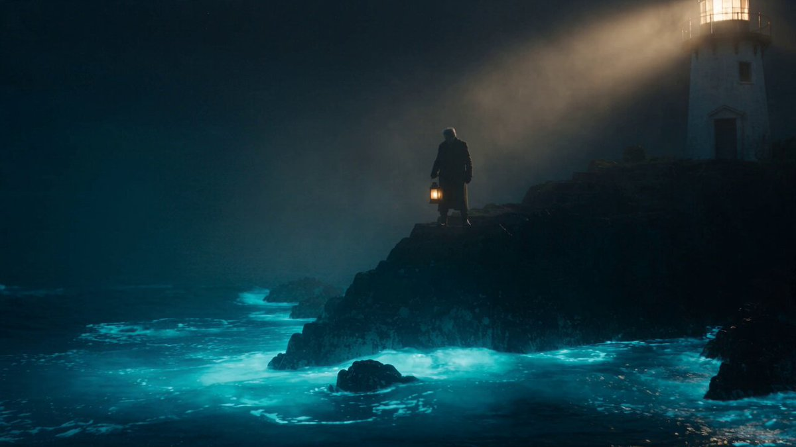

**Câu lệnh**

```text
Một người gác hải đăng già dãi dầu sương gió đứng trên vách đá mù sương lúc nửa đêm, mặc chiếc áo khoác len dày, cầm một chiếc đèn lồng đồng thau cổ. Bên dưới ông, những con sóng biển phát ra ánh sáng sinh học màu xanh lam dịu nhẹ mỗi khi đập vào ghềnh đá. Khi ông nâng chiếc đèn lồng lên, hàng chục quả cầu phát sáng trôi nổi (như đom đóm) từ mặt nước bay lên và lướt qua ông vào không khí mờ sương, nhẹ nhàng xoay quanh thân hình ông. Những luồng ánh trăng thể tích xuyên qua màn sương mù. Máy quay bắt đầu bằng góc rộng trên vách đá, sau đó từ từ đẩy lại gần khuôn mặt người gác đèn theo phong cách điện ảnh khi các quả cầu vây quanh ông, kết thúc bằng một cảnh cận cảnh với những quả cầu phản chiếu trong mắt ông. Chỉnh màu tông xanh mòng két và hổ phách ấm áp, kết cấu siêu thực, độ sâu trường ảnh nông, hạt phim, sương mù đậm chất khí quyển, 15 giây, chuyển động máy quay mượt mà liên tục, không cắt cảnh.
```

[↑ Về danh mục](#catalog)

---

<a name="prompt-2097225058439840092"></a>

### A detailed 30-second vertical video prompt detailing a timeline-based transformation from a gray Blender 3D clay blockout into a photorealistic futuristic desert city around a central observatory.

Tác giả：[@Itswsm105f](https://x.com/Itswsm105f) · [Bài gốc](https://x.com/Itswsm105f/status/2097225058439840092)

Nhiếp ảnh · Điện ảnh / Ảnh tĩnh từ phim · Kết xuất 3D · Cyberpunk / Khoa học viễn tưởng · Đã xuất bản

**Tóm tắt:** A detailed 30-second vertical video prompt detailing a timeline-based transformation from a gray Blender 3D clay blockout into a photorealistic futuristic desert city around a central observatory.

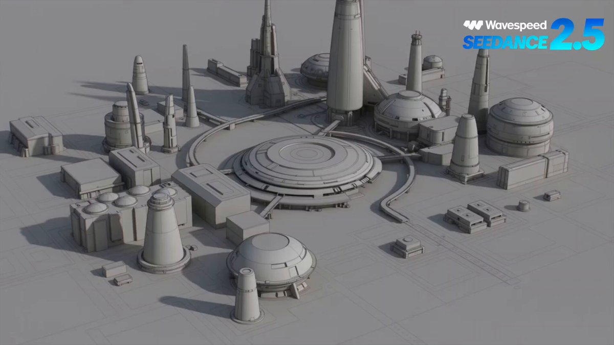

**Câu lệnh**

```text
Create a 30-second vertical 9:16 cinematic comparison video demonstrating how a simple Blender 3D blockout can be transformed into a highly detailed cinematic AI-generated scene.
CONCEPT: A futuristic desert city built around a massive ancient-looking circular observatory.
0–5 seconds — Blender Blockout:
Show a basic gray Blender clay render from an elevated cinematic camera angle. The scene contains simple geometric buildings, large cylindrical towers, rectangular platforms, a huge circular observatory structure in the center, basic roads and small placeholder vehicles. Everything is untextured gray clay with simple lighting, clearly looking like a 3D Blender blockout.
5–10 seconds — Camera Push-In:
Slowly move the camera toward the central observatory while maintaining the exact composition and geometry. Subtle Blender viewport/clay-render feeling. No textures, no realistic materials.
10–15 seconds — Transformation:
Begin a smooth visual transition from the gray Blender blockout into the finished cinematic environment. Geometry remains structurally consistent while realistic materials, textures, lighting, atmosphere and environmental details gradually appear.
15–25 seconds — Final AI Cinematic Scene:
Reveal a spectacular futuristic desert metropolis at golden hour. Massive sandstone-and-metal towers rise from golden dunes, connected by elevated bridges. The central circular observatory has intricate futuristic architecture, glowing windows and mechanical details. Small flying vehicles move naturally between buildings. Dust particles float through warm sunlight. Long shadows, volumetric lighting, realistic reflections, detailed surfaces, atmospheric depth and subtle heat haze. Make the environment feel enormous, believable and cinematic.
25–30 seconds — Final Reveal:
Pull the camera backward and upward to reveal the full city surrounded by endless desert dunes. The final frame should create a strong visual contrast between the simple Blender concept and the stunning finished AI-generated world.
STYLE: photorealistic cinematic sci-fi, AAA game environment quality, realistic materials, natural atmospheric perspective, volumetric sunlight, detailed architecture, physically realistic lighting, subtle camera movement, premium VFX, highly detailed environment.
IMPORTANT: The final scene must be completely original and must NOT reproduce the reference video's architecture, composition, Japanese temples, floating islands, army formations, or cloud setting. Preserve only the general Blender blockout → AI cinematic transformation concept.
NO: cartoon style, anime, distorted buildings, random geometry changes, excessive camera shake, text artifacts, duplicated vehicles, warped architecture, unrealistic physics.
```

[↑ Về danh mục](#catalog)

---

<a name="prompt-2096837494000308685"></a>

### Lời nhắc tạo phim tài liệu điện ảnh siêu thực dài 30 giây khắc họa sự tiến hóa liền mạch của vũ trụ và sự sống trên Trái Đất, từ Vụ Nổ Lớn đến nhân loại hiện đại.

Tác giả：[@RuzainaMeer](https://x.com/RuzainaMeer) · [Bài gốc](https://x.com/RuzainaMeer/status/2096837494000308685)

Nhiếp ảnh · Điện ảnh / Ảnh tĩnh từ phim · Đã xuất bản

**Tóm tắt:** Lời nhắc tạo phim tài liệu điện ảnh siêu thực dài 30 giây khắc họa sự tiến hóa liền mạch của vũ trụ và sự sống trên Trái Đất, từ Vụ Nổ Lớn đến nhân loại hiện đại.


**Câu lệnh**

```text
Tạo một thước phim tài liệu điện ảnh siêu thực dài 30 giây thể hiện sự tiến hóa của vũ trụ và sự sống trên Trái Đất trong một hành trình liền mạch duy nhất.\n\nBắt đầu với Vụ Nổ Lớn (Big Bang) và sự giãn nở của không gian, sau đó thể hiện vật chất hình thành, những ngôi sao đầu tiên, các thiên hà, siêu tân tinh, cùng sự ra đời của Hệ Mặt Trời và Trái Đất. Chuyển tiếp sang Trái Đất sơ khai đầy núi lửa, đại dương nguội dần, sinh vật đơn bào nguyên thủy, sinh vật biển phức tạp, sự sống tiến lên cạn, những khu rừng tiền sử, khủng long, động vật có vú sơ khai, linh trưởng, vượn người, và cuối cùng là Người hiện đại (Homo sapiens).\n\nKết thúc với hình ảnh một con người hiện đại nhìn về phía đường chân trời khi máy quay nhanh chóng lùi xa từ Trái Đất đến Mặt Trăng, Hệ Mặt Trời và Ngân Hà, kết nối nhân loại với vũ trụ.\n\nSử dụng chuyển động máy quay điện ảnh liên tục, các chuyển cảnh liền mạch qua thời gian và quy mô không gian, vật lý chân thực, môi trường dựa trên cảm hứng khoa học, chuyển động tự nhiên, giải phẫu động vật chi tiết, ánh sáng chân thực, HDR và kỹ thuật quay phim tài liệu cao cấp.\n\n16:9, siêu thực, photorealistic, giàu cảm xúc, có cơ sở khoa học. Không có văn bản, nhãn dán, lời tường thuật, yếu tố kỳ ảo, cyberpunk, neon hoặc các yếu tố tương lai.
```

[↑ Về danh mục](#catalog)

---

<a name="prompt-2097185540391211470"></a>

### Cảnh đi bộ đường dài trên núi mang phong cách điện ảnh siêu thực dọc theo con đường gồ ghề trong rừng núi cao với ánh nắng giờ vàng và những ngọn núi hùng vĩ.

Tác giả：[@AIwithMinal](https://x.com/AIwithMinal) · [Bài gốc](https://x.com/AIwithMinal/status/2097185540391211470)

Điện ảnh / Ảnh tĩnh từ phim · Phong cảnh / Thiên nhiên · Đã xuất bản

**Tóm tắt:** Cảnh đi bộ đường dài trên núi mang phong cách điện ảnh siêu thực dọc theo con đường gồ ghề trong rừng núi cao với ánh nắng giờ vàng và những ngọn núi hùng vĩ.

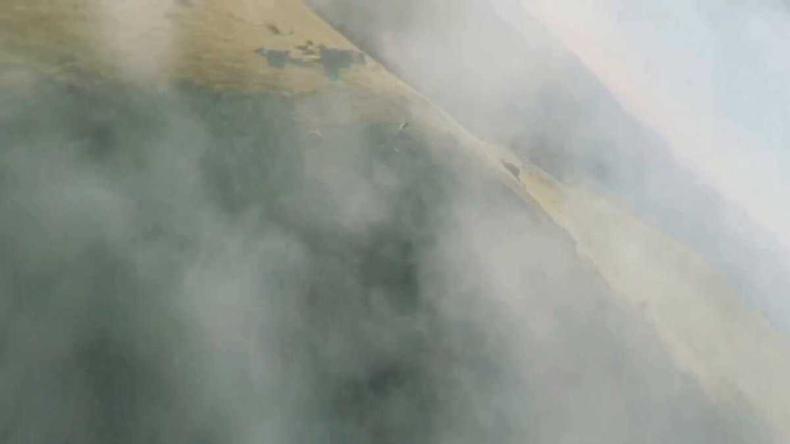

**Câu lệnh**

```text
Cảnh đi bộ đường dài trên núi mang phong cách điện ảnh siêu thực, một con đường mòn hẹp gồ ghề uốn lượn qua khu rừng núi cao rậm rạp, những tảng đá phong hóa khổng lồ ở cả hai bên, những hàng cây cao đổ bóng đầy ấn tượng, ánh nắng ấm áp của giờ vàng xuyên qua các nhánh cây, những dãy núi hùng vĩ trập trùng ở phía xa, làn sương mờ khí quyển dịu nhẹ, tông màu đất tự nhiên, bầu không khí hoang dã đắm chìm, chuyển động máy quay điện ảnh mượt mà, kết cấu chân thực, ánh sáng thể tích, độ sâu trường ảnh nông, HDR, 8K, chân thực như ảnh chụp, chỉnh màu điện ảnh, kỹ thuật quay phim phiêu lưu dã ngoại chuyên nghiệp, khung hình dọc 9:16.
```

[↑ Về danh mục](#catalog)

---

<a name="prompt-2096791786807275583"></a>

### Một hoạt hình tĩnh vật \(stop-motion\) điện ảnh tỉ lệ dọc 9:16 dài 21 giây về một nhân vật hình người tí hon làm từ đá bờ biển nhảy múa rồi sụp đổ trong một vũng thủy triều nông.

Tác giả：[@arsalannazir07](https://x.com/arsalannazir07) · [Bài gốc](https://x.com/arsalannazir07/status/2096791786807275583)

Điện ảnh / Ảnh tĩnh từ phim · Đã xuất bản

**Tóm tắt:** Một hoạt hình tĩnh vật \(stop-motion\) điện ảnh tỉ lệ dọc 9:16 dài 21 giây về một nhân vật hình người tí hon làm từ đá bờ biển nhảy múa rồi sụp đổ trong một vũng thủy triều nông.

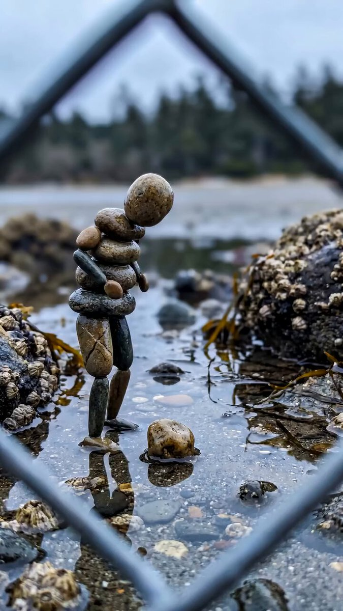

**Câu lệnh**

```text
Tạo một hoạt hình tĩnh vật (stop-motion) điện ảnh tỉ lệ dọc 9:16 dài 21 giây. Một nhân vật hình người tí hon được làm hoàn toàn từ những viên đá cuội bờ biển nhẵn nhụi có hình dạng tự nhiên sống dậy trong một vũng thủy triều nông trên bờ biển đầy đá. Mỗi bộ phận cơ thể được cấu tạo từ các viên đá riêng lẻ—viên đá lớn hình bầu dục làm đầu, các viên đá tròn xếp chồng lên nhau làm thân, các viên đá nhỏ hơn tạo thành tay và chân.

Cảnh quay qua một hàng rào lưới mắt cáo hơi mất nét, tạo thành khung tiền cảnh tự nhiên. Phía sau nhân vật là bờ biển phẳng lặng, nước biển nông, đá bám đầy hà biển, rong biển và một khu rừng mờ ảo nhẹ nhàng dưới bầu trời u ám. Kết cấu chân thực như ảnh chụp, màu sắc tự nhiên trầm lắng, độ sâu trường ảnh nông, hình ảnh phản chiếu trên mặt nước chân thực.

Hoạt họa: Nhân vật bằng đá từ từ lấy thăng bằng và bắt đầu chuyển động như một con người nhỏ bé tinh nghịch. Nó chuyển trọng tâm, nhấc một chân lên, gập đầu gối, đung đưa cánh tay bằng đá và thực hiện một điệu nhảy nhỏ kỳ quặc trong khi cẩn thận giữ thăng bằng trên bề mặt ẩm ướt. Những gợn sóng nhỏ hình thành dưới mỗi bước chân và hình ảnh phản chiếu của nó di chuyển tự nhiên trong nước. Các chuyển động phải mang lại cảm giác stop-motion thủ công, hơi không hoàn hảo nhưng đáng tin cậy, với trọng lượng và vật lý của đá chân thực.

Về những giây cuối cùng, nhân vật mất thăng bằng, vấp ngã và sụp đổ tự nhiên, các viên đá riêng lẻ tách rời và lăn trên mặt đất ẩm ướt nông. Nhân vật hoàn toàn rã thành những viên đá bình thường. Kết thúc bằng cảnh máy quay giữ nguyên khung hình trên những viên đá rải rác và hình ảnh phản chiếu của chúng.

Máy quay: bố cục dọc kiểu điện thoại thông minh cố định, chuyển động máy quay tự nhiên tinh tế, góc quay trung toàn cảnh (medium-full shot), góc thấp sát mặt nước, hiệu ứng bokeh tiền cảnh mạnh từ hàng rào, độ sâu trường ảnh điện ảnh.

Ánh sáng: ánh sáng ban ngày khuếch tán mềm mại, bầu không khí bờ biển u ám, phản chiếu chân thực và điểm sáng trên đá ướt.

Phong cách: môi trường cảnh quay thực tế siêu thực + nhân vật stop-motion bằng đá kỳ thú như ảnh chụp thực, kết cấu đá xúc giác, chuyển động hợp lý về mặt vật lý, nhiếp ảnh macro điện ảnh, không có bề mặt trông như CGI, không có văn bản, không có con người.

Negative prompt: cartoon, plastic-looking stones, exaggerated facial features, smooth CGI character, floating objects, unrealistic physics, extra limbs, changing environment, camera cuts, text, watermark, oversaturated colors.
```

[↑ Về danh mục](#catalog)

---

<a name="prompt-2096840505355370629"></a>

### Đoạn phim travel vlog nhiệt đới dài 30 giây mang phong cách điện ảnh ghi lại hình ảnh thiếu nữ Đông Á 20 tuổi khám phá Bali qua 8 cảnh quay chi tiết, mang tính thẩm mỹ của phim 35mm, chuyển động máy quay cầm tay, tông màu cổ điển ấm áp và những khoảnh khắc tự nhiên đời thường.

Tác giả：[@eshal\_\_ai](https://x.com/eshal__ai) · [Bài gốc](https://x.com/eshal__ai/status/2096840505355370629)

Nhiếp ảnh · Điện ảnh / Ảnh tĩnh từ phim · Cổ điển / Cổ điển · Nhân vật · Đã xuất bản

**Tóm tắt:** Đoạn phim travel vlog nhiệt đới dài 30 giây mang phong cách điện ảnh ghi lại hình ảnh thiếu nữ Đông Á 20 tuổi khám phá Bali qua 8 cảnh quay chi tiết, mang tính thẩm mỹ của phim 35mm, chuyển động máy quay cầm tay, tông màu cổ điển ấm áp và những khoảnh khắc tự nhiên đời thường.

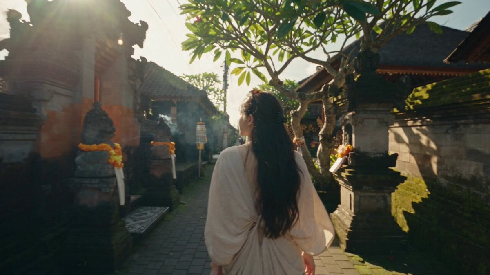

**Câu lệnh**

```text
Đoạn phim travel vlog nhiệt đới đậm chất điện ảnh dài 30 giây khắc họa một thiếu nữ Đông Á 20 tuổi xinh đẹp với mái tóc đen đang khám phá Bali trong một chuyến du lịch mùa hè đầy thơ mộng. Được quay như một cuốn nhật ký du lịch sang trọng chân thực với chuyển động máy quay cầm tay, những khoảnh khắc tự nhiên, ánh nắng giờ vàng dịu nhẹ, phong cách phim 35mm mơ màng, chỉnh màu vintage ấm áp, độ sâu trường ảnh nông, kết cấu da tự nhiên, ánh sáng đầy tính khí quyển và lối kể chuyện điện ảnh. Giữ nguyên hình ảnh nhân vật nữ trong suốt mọi cảnh: tóc đen, vẻ ngoài trẻ trung, trang điểm tự nhiên, trang phục mùa hè thanh lịch, biểu cảm thư thái vui vẻ. Định dạng: video điện ảnh 4K, 24fps, hạt phim 35mm, máy quay cầm tay chân thực, lấy nét mềm, bảng màu ấm áp, phong cách phim tài liệu du lịch.

Cảnh 1 (0-4s) — Điểm đến & Con đường làng: Một buổi sáng Bali ấm áp. Cô gái tản bộ trên con đường hẹp rợp bóng hoa sứ và những ngôi đền đá, mặc váy quấn vải lanh, kính râm cài trên tóc. Xe máy lướt qua làm mờ hậu cảnh nhẹ nhàng, làn khói hương thoang thoảng bay ra từ lễ vật trước hiên nhà. Máy quay theo sau lưng cô, rồi lia nhanh vào cận cảnh khi cô ngoảnh lại nhìn qua vai và mỉm cười, khẽ nói: "Okay, I think I already love it here."

Cảnh 2 (4-8s) — Khám phá bãi biển vách đá: Cô bước xuống những bậc đá dẫn ra bãi biển vách đá hẹp, làn nước màu ngọc lam vỗ vào những vách đá vôi phía sau. Cô đi chân trần dọc mép nước, tà váy khẽ nâng lên, từng đợt sóng cuộn qua đôi chân. Góc máy thấp bắt trọn những dấu chân ngập trong bọt sóng, ánh nắng lấp lánh trải dài trên mặt nước, những vách đá lởm chởm ôm trọn đường chân trời.

Cảnh 3 (8-12s) — Ruộng bậc thang & Khoảnh khắc rừng nhiệt đới: Góc nhìn từ dưới lên xuyên qua những tán lá chuối và rặng tre, ánh nắng xuyên qua thành những vệt sáng ấm áp cùng hiệu ứng lóe sáng ống kính dịu nhẹ. Chuyển sang cận cảnh cô đứng bên rìa ruộng bậc thang xanh ngọc bích, gió khẽ bay những lọn tóc vương khi cô phóng tầm mắt nhìn ra xa, khẽ thì thầm: "It's so green it doesn't look real."

Cảnh 4 (12-16s) — Quán cà phê Warung & Lối sống chậm: Cô ngồi một mình tại một quán warung ngoài trời nhỏ nhìn ra rừng rậm, nhâm nhi nước dừa tươi bằng ống hút giấy. Ánh nắng lọc qua những tấm mành tre đan. Cận cảnh đôi bàn tay cô ôm lấy quả dừa, những giọt nước đọng trên vỏ, nụ cười nhẹ hài lòng khi cô ngắm nhìn hàng cây đu đưa theo gió.

Cảnh 5 (16-20s) — Cuộc phiêu lưu trên đại dương: Cô chèo ván gỗ dài qua đầm phá màu ngọc lam tĩnh lặng, ánh nắng lấp lánh trên mặt nước. Máy quay lượn quanh cô ở tầm mặt nước, ghi lại những gợn sóng lăn tăn và những vách đá xanh xa xa. Cô hơi mất thăng bằng, bật cười lớn và gọi về phía máy quay: "Don't film this part — actually, keep filming it."

Cảnh 6 (20-24s) — Khám phá chợ đêm: Chợ đêm Bali rực rỡ giăng đầy đèn lồng giấy, khói thịt xiên nướng satay nghi ngút trong không khí, tiếng người bán hàng rao giá. Cô len lỏi qua đám đông thưởng thức xiên nướng và xôi xoài, khuôn mặt được thắp sáng bởi ánh đèn dây ấm áp và ánh đèn pha xe máy lướt qua. Cận cảnh điện ảnh với đôi mắt cô mở to thích thú khi nếm thử, những chiếc đèn lồng phía sau nhòe thành bokeh mềm mại.

Cảnh 7 (24-27s) — Kết thúc hoàng hôn vàng rực: Cảnh bóng đen toàn cảnh cô đứng bên bờ biển khi mặt trời lặn dần xuống biển, bầu trời rực sắc cam và tím, bóng phản chiếu gợn sóng trên nền cát ướt. Sóng vỗ nhẹ quanh mắt cá chân khi cô nghiêng mặt đón lấy những tia sáng cuối ngày, một tay che nhẹ mắt.

Cảnh 8 (27-30s) — Trầm tư ban đêm tại khách sạn: Quán bar hồ bơi trên tầng thượng nhìn ra đường chân trời ven biển lấp lánh về đêm. Cô tựa vào lan can trong chiếc váy trắng giản dị, mái tóc buông xõa bay nhẹ trong gió, ánh đèn thành phố phản chiếu trong mắt cô. Cận cảnh thân mật cuối cùng khi cô cuộn tròn trên giường khách sạn, chống một khuỷu tay, nhìn thẳng vào ống kính với nụ cười ấm áp, dịu dàng và nói: "Goodnight from Bali."

Phong cách máy quay: Kỹ thuật quay phim travel vlog chân thực, độ rung lắc tự nhiên của máy cầm tay, chuyển cảnh điện ảnh mượt mà, kỹ thuật đẩy máy chậm (slow push-ins), chuyển động trôi tự nhiên, thỉnh thoảng có các góc nhìn thứ nhất (POV), bắt nét tự động chân thực, mờ chuyển động tinh tế.

Phong cách hình ảnh: Thước phim kỳ nghỉ Bali mơ màng, thẩm mỹ thương hiệu du lịch cao cấp, ánh nắng vàng dịu, kết cấu da chân thực, độ sâu trường ảnh nông đậm chất điện ảnh, vẻ hoài niệm của phim 35mm, tông màu khí quyển ấm áp, biểu cảm tự nhiên không theo kịch bản, lối kể chuyện giàu cảm xúc.

Tránh: phong cách hoạt hình, giao diện CGI, da nhựa, khuôn mặt phi thực tế, ngoại hình nhân vật không nhất quán, thay đổi kiểu tóc, thừa ngón tay, cơ thể biến dạng, ánh sáng nhân tạo, màu sắc quá bão hòa, mặt mờ, chuyển động không tự nhiên, người trùng lặp.
```

[↑ Về danh mục](#catalog)

---

<a name="category-cyberpunk-sci-fi"></a>

## Cyberpunk / Khoa học viễn tưởng

<a name="prompt-2097330853588402541"></a>

### Đang dịch

Tác giả：[@TanLuAI](https://x.com/TanLuAI) · [Bài gốc](https://x.com/TanLuAI/status/2097330853588402541)

Truyện tranh / Bảng phân cảnh · Cyberpunk / Khoa học viễn tưởng · Nhân vật · Đã xuất bản

Bài gốc：[@TanLuAI](https://x.com/TanLuAI) · [Bài gốc](https://x.com/TanLuAI/status/2096586474645004331)

**Tóm tắt:** Đang dịch

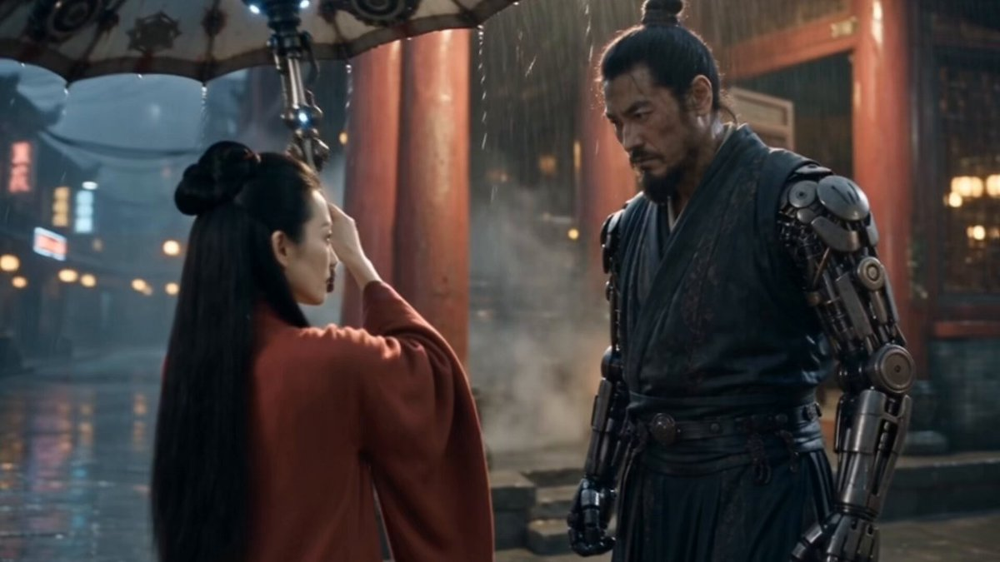

**Câu lệnh**

```text
Đang dịch
```

[↑ Về danh mục](#catalog)

---

<a name="category-other"></a>

## Khác

<a name="prompt-2096903888813330826"></a>

### Đang dịch

Tác giả：[@Lianaalane](https://x.com/Lianaalane) · [Bài gốc](https://x.com/Lianaalane/status/2096903888813330826)

Tiếp thị sản phẩm · Thực phẩm / Đồ uống · Đã xuất bản

**Tóm tắt:** Đang dịch


**Câu lệnh**

```text
Đang dịch
```

[↑ Về danh mục](#catalog)

---

<a name="prompt-2097194787564658942"></a>

### Đang dịch

Tác giả：[@ayzalnooor24521](https://x.com/ayzalnooor24521) · [Bài gốc](https://x.com/ayzalnooor24521/status/2097194787564658942)

Khác · Đã xuất bản

**Tóm tắt:** Đang dịch


**Câu lệnh**

```text
Đang dịch
```

[↑ Về danh mục](#catalog)

---

<a name="prompt-2097320255139795072"></a>

### Đang dịch

Tác giả：[@johnAGI168](https://x.com/johnAGI168) · [Bài gốc](https://x.com/johnAGI168/status/2097320255139795072)

Truyện tranh / Bảng phân cảnh · Mặt hàng thời trang · Đã xuất bản

Bài gốc：[@johnAGI168](https://x.com/johnAGI168) · [Bài gốc](https://x.com/johnAGI168/status/2077395194773672409)

**Tóm tắt:** Đang dịch

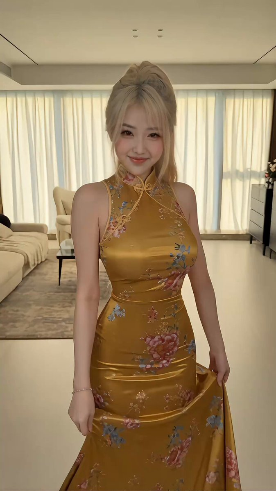

**Câu lệnh**

```text
Đang dịch
```

[↑ Về danh mục](#catalog)

---

<a name="prompt-2097261787548615064"></a>

### Đang dịch

Tác giả：[@AvelyrahnAI](https://x.com/AvelyrahnAI) · [Bài gốc](https://x.com/AvelyrahnAI/status/2097261787548615064)

Khác · Đã xuất bản

**Tóm tắt:** Đang dịch

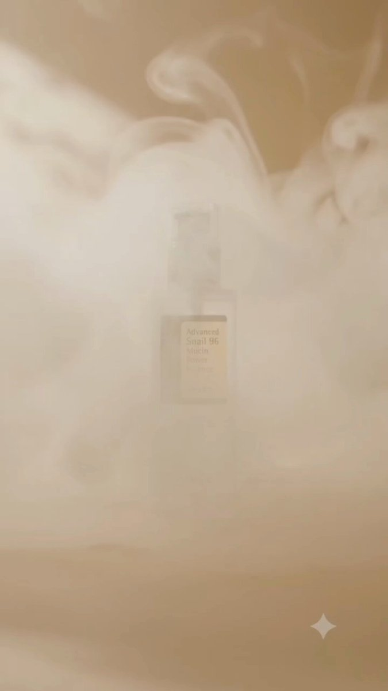

**Câu lệnh**

```text
Đang dịch
```

[↑ Về danh mục](#catalog)

---

[Khám phá Leadde.ai →](https://leadde.ai/?utm_source=github&utm_medium=readme&utm_campaign=prompt-library&utm_content=seedance)
