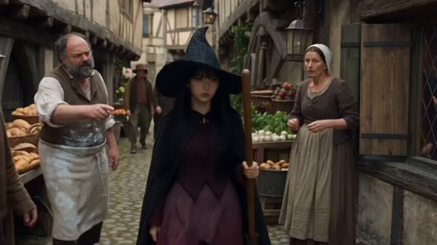

<a name="prompt-2098284076809719997"></a>

### 年轻女巫用巨大的水龙卷扑灭燃烧的中世纪村庄的电影级黑暗奇幻场景。

作者：[@Zoyavelle](https://x.com/Zoyavelle) · [查看 X 原帖](https://x.com/Zoyavelle/status/2098284076809719997)

电影 / 电影剧照 · 已推流

**概括:** 年轻女巫用巨大的水龙卷扑灭燃烧的中世纪村庄的电影级黑暗奇幻场景。



**提示词**

```text
创作一段高度逼真的电影级奇幻视频，背景设定在发生神秘超自然灾难的中世纪欧洲村庄。一位年轻美丽的女子，皮肤苍白，留着黑色长直发，头戴宽大的黑色尖顶女巫帽，身穿黑色深色斗篷和深酒红色中世纪长裙，穿行在拥挤的中世纪村庄中，村民们带着恐惧和猜疑凝视着她。木质半木结构房屋、石板街道、陈旧的集市摊位、身着质朴服饰的中世纪村民，弥漫着氛围感十足的烟雾和迷雾。

她走向一座巨大的石质拱门，走进一个俯瞰村庄的开阔庭院。远处，几座中世纪房屋正在剧烈燃烧，巨大的橙色火焰和浓密的黑烟升腾入空。女巫突然展现出超自然力量，紧贴地面向前凌空飞掠，她深色的斗篷和长裙在风中剧烈飘舞。

一道巨大的魔法水龙卷突然在燃烧的村庄中央升起，形成巨大的旋转水柱冲过街道，开始扑灭火焰。当神秘飞行的女巫穿过烟雾弥漫的天空时，村民们聚集在一起，震惊地抬头仰望。

展现中世纪村庄被烟雾与水流笼罩、燃烧的屋顶、受惊的村民以及巨大水涡的极具张力的航拍镜头。最后以这位年轻女巫平静地站在村民中间的电影级特写镜头结束，她带着神秘莫测的表情直视镜头。

逼真，电影级黑暗奇幻，中世纪欧洲，逼真的人类面孔，细致入微的服装和建筑，体积光，自然的火焰与烟雾模拟，逼真的水流物理效果，戏剧性氛围，浅景深，逼真的摄像机运镜，流畅的动态，电影级构图，高细节，4K，变形宽银幕电影质感，戏剧性光影，逼真质感，史诗奇幻电影风格。
```
