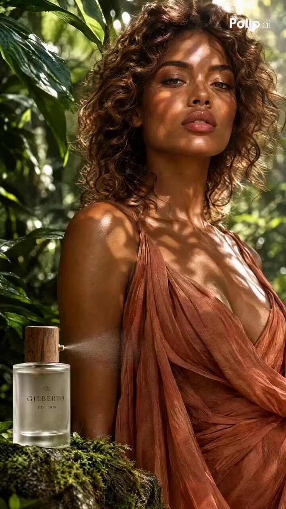

<a name="prompt-2098306219903492133"></a>

### 15秒植物香水奢华商业广告分镜提示词，包含微距露珠、产品特写、人物独白及品牌结尾。

作者：[@yourPlugAI](https://x.com/yourPlugAI) · [查看 X 原帖](https://x.com/yourPlugAI/status/2098306219903492133)

漫画 / 故事板 · 产品营销 · 角色 · 产品 · 已推流

查看 X 原帖：[@yourPlugAI](https://x.com/yourPlugAI) · [查看 X 原帖](https://x.com/yourPlugAI/status/2098049745885225020)

**概括:** 15秒植物香水奢华商业广告分镜提示词，包含微距露珠、产品特写、人物独白及品牌结尾。



**提示词**

```text
15秒连续视频提示词

0至3秒（吸引点）
画面：极微距向上仰拍镜头，穿过滴落着清晨露珠的生机勃勃的绿色热带树叶。阳光在镜头中耀眼地闪烁，照亮悬浮的花粉和水颗粒。
动作：露珠顺着巨大的棕榈叶滑落，在超逼真的慢动作中飞溅在未经雕琢的原石上，瞬间将微小水滴向上溅起。
声音：低沉有机的木管和声开场，伴随清脆且细节极其丰富的水滴飞溅音效，夹杂着温柔的鸟鸣和树叶沙沙声。

3至6秒（产品展示）
画面：平滑的运镜环绕着一瓶磨砂玻璃香水瓶，瓶身直立在一块覆满苔藓的玄武岩上，四周环绕着盛开的野生兰花。
动作：侧面喷嘴干净利落地喷洒出细腻如露珠般的植物薄雾，水平方向扩散开来，清脆的阳光捕捉到每一颗微滴，营造出微妙的彩虹棱镜效果。
声音：清脆的金属泵喷压声，随后是令人心旷神怡的环境薄雾呼啸声和微风轻拂的沙沙声。

6至9秒（人物对白）
画面：中景，女子站在洒满阳光的植物玻璃温室中，轻轻拨开脸庞前的一片绿色蕨类叶片，神情从容自信地直视摄像机镜头。
动作：她将头微微偏向阳光，面部放松且十分沉稳，带着温柔的微笑自然地说出台词。
声音：柔和、质朴的木质原声弦乐和弦衬托着温暖、带有呼吸感的旁白：“Breathe the wild.”

9至12秒（感官迸发）
画面：快速绽放的延时序列，金色的花瓣在香水瓶周围舒展展开，在动态物理运动中与旋动的阳光和绿叶无缝融合。
动作：泥土气息的苔藓和花瓣在香水瓶周围轻盈地升腾至空中，营造出一种失重的自然漂浮效果。
声音：激昂的原声旋律渐强，伴随着柔和的空气呼啸转场音和细微沙沙的质感声。

12至15秒（品牌结尾）
画面：居中的主角特写镜头，磨砂玻璃瓶直立在洒满阳光的大理石板上，四周是鲜绿的苔藓和清晨的露水。雕刻的品牌名“GILBERTO”以清晰醒目的金色字体展现。
动作：晨光从左至右平滑地扫过瓶身，精致的植物薄雾在瓶底逐渐沉降。
声音：温暖、沉稳的原声风铃声久久回荡，随后柔和淡出。
```
