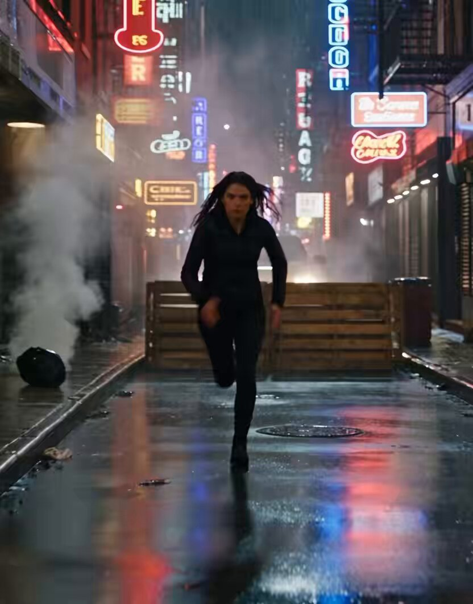

<a name="prompt-2098319351917002812"></a>

### 好莱坞动作大片风格的雨夜小巷追逐戏，女性主角逃离SUV追捕并骑摩托跃过建筑跨度。

作者：[@codewithhajra](https://x.com/codewithhajra) · [查看 X 原帖](https://x.com/codewithhajra/status/2098319351917002812)

电影 / 电影剧照 · 车辆 · 建筑 / 室内设计 · 已推流

**概括:** 好莱坞动作大片风格的雨夜小巷追逐戏，女性主角逃离SUV追捕并骑摩托跃过建筑跨度。



**提示词**

```text
角色：一名20岁出头的美丽女性，拥有自然逼真的五官，深棕色长发，健美身材，身穿一件时尚利落的黑色战术夹克、修身深色长裤和作战靴。她神情坚定，无所畏惧。

场景 — 0–3秒：
暴雨浸透的城市小巷夜景。霓虹灯招牌倒映在潮湿的地面上。这名女性朝着镜头奔跑，身后一辆黑色SUV突然撞穿路障。火花和碎片在空中飞溅。

场景 — 3–6秒：
她迅速滑过一辆停放车辆的引擎盖，转身并险险避开袭来的攻击。镜头以快速手持跟拍方式追随着她。她的头发和夹克随着动作自然摆动。

场景 — 6–8秒：
她从车座上抓起一顶摩托车头盔，跃上一辆时尚的黑色摩托车，疾速穿过小巷。SUV在后方紧追不舍，车头大灯划破雨帘。

场景 — 8–10秒：
摩托车从两栋建筑之间的一处小型坡道腾空跃起。在她飞跃半空时呈现定格般的慢动作，身后闪烁着城市的灯火。她平稳着陆并疾驰而去。

视觉风格：高端好莱坞动作大片风格，逼真摄影，电影级光影，极具戏剧感的雨势，真实物理效果，逼真的实景爆炸感，动态镜头运动，浅景深，变形镜头光晕，细致的面部表情，逼真的皮肤纹理，高级VFX特效。

运镜：快速跟拍镜头 → 低角度动作镜头 → 特写镜头 → 广角俯瞰航拍。平稳而激烈的镜头运动，电影级运动模糊。

音频：厚重的电影级打击乐，轰鸣的摩托车引擎声，轮胎尖叫声，雨声，撞击声，以及在最终着陆时极具戏剧性的低音重击。

重要提示：在所有镜头中保持同一女性角色、面部、发型和服装的一致性。无文字，无字幕，无扭曲的人体解剖结构，无多余肢体，无卡通外观。
```
