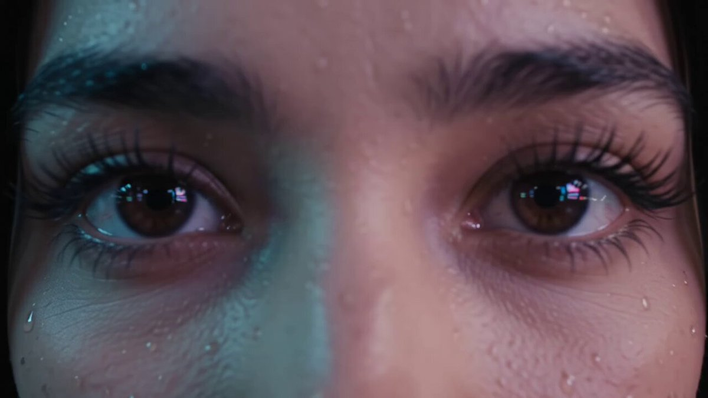

<a name="prompt-2098330707374514573"></a>

### 霓虹闪烁的夜晚城市街道上三位歌手演唱的详细多镜头电影感音乐录影带提示词。

作者：[@meAsifAi](https://x.com/meAsifAi) · [查看 X 原帖](https://x.com/meAsifAi/status/2098330707374514573)

电影 / 电影剧照 · 城市风光 / 街道 · 已推流

**概括:** 霓虹闪烁的夜晚城市街道上三位歌手演唱的详细多镜头电影感音乐录影带提示词。



**提示词**

```text
创作一段时长30秒的超逼真电影感音乐录影带（MV），由三位年轻成年歌手在霓虹闪烁的夜晚城市中演唱一首富有感染力的现代歌曲。视频应呈现高预算专业音乐录影带的质感，具备逼真的人物、精准的对口型、富有表现力的演绎、极具氛围感的灯光以及精致考究的电影摄影。

角色设定

角色1 — 女主角：
年轻成年女性，20岁出头，黑色长发，眼神富有表现力，身着优雅的黑银相间服饰，性格自信而又情感充沛。

角色2 — 男主角：
年轻成年男性，20岁出头，深色纹理短发，时尚黑夹克搭配白衬衫，极具个人魅力且情绪饱满。

角色3 — 女副唱：
年轻成年女性，20岁出头，齐肩深色短发，时尚深红色服装，台风充满活力而自然。

在整段视频中，必须保持他们的面部、服装、发型、身材比例和身份完全一致。

场景环境

微雨过后带有未来感的光鲜夜间市中心街道。湿润的路面反射着五彩斑斓的霓虹灯牌，发光的店面，若隐若现的薄雾，远处的车流，电影级虚化散景，充满氛围感的城市灯光和逼真的倒影。

分镜设计

0–4 秒 — 开篇
角色1眼睛的特写大镜头。眼中清晰可见霓虹倒影。随着她开口演唱，镜头缓慢拉远。背景中的雨滴闪烁着微光。

4–8 秒 — 主角独唱
角色1在湿漉漉的街道上缓缓前行，直视镜头演唱。平稳的后退跟镜头。她的秀发在夜风中自然飘动。

8–12 秒 — 男声段落
切至角色2倚靠在被霓虹照亮的建筑旁。他开始演唱自己的段落。镜头围绕他缓缓进行电影级环绕运镜，背景是模糊成光晕的绚烂城市灯火。

12–16 秒 — 女歌手入镜
角色3漫步穿过霓虹街头登场。她一边注视镜头一边演唱。平滑的侧向跟拍镜头过渡到面部特写。

16–22 秒 — 三人合唱
三名角色在宽阔的城市十字路口汇合共同演唱。镜头在他们演唱时缓慢环绕旋转。自然的互动，微妙的手势，令人信服的默契感。

22–27 秒 — 情绪高潮副歌
快速而优雅的特写剪辑序列：角色1演唱，角色2加入，角色3和声。每一个嘴型变动都精确匹配所提供的音频。

27–30 秒 — 尾声镜头
三位歌手并肩伫立在湿润街道的中央。镜头缓缓向上升起并向后拉远，展现四周流光溢彩的璀璨城市。他们在节拍精准之处共同唱完最后一句歌词。以极具震撼力的电影级全景镜头收尾。

电影摄影手法

高端音乐录影带摄影风格，变形宽银幕镜头质感，浅景深，平稳的云台跟踪，慢动作点缀，电影级特写镜头，受控的运镜，真实的镜头光晕，自然的动态模糊，迷人的散景与富有动态的构图。

音频与表演

使用所提供的歌曲/音频作为精准的音轨。角色必须清晰可见地唱出准确的歌词，且对口型达到音素级别的精准度。表情、眼神和肢体动作应与歌曲的情感与节奏完美契合。不得出现与歌词无关的对话说话动作。

画质细节

超逼真，照片级真实人物，自然细腻的皮肤纹理，逼真的眼睛与牙齿，符合物理规律的光照，逼真的湿润表面反射，根根分明的发丝，逼真的织物运动，HDR，电影级高对比度，专业色彩校正与调色，4K细节，高端顶尖音乐录影带美学。

负向提示词：面部变形，身份改变，服装不一致，多余人物，角色复制，扭曲的手部，畸形面部，不自然的行走，机械僵硬的动作，错误的嘴型同步，随机说话，画面闪烁，插帧伪影，文字，字幕，徽标，水印。
```
