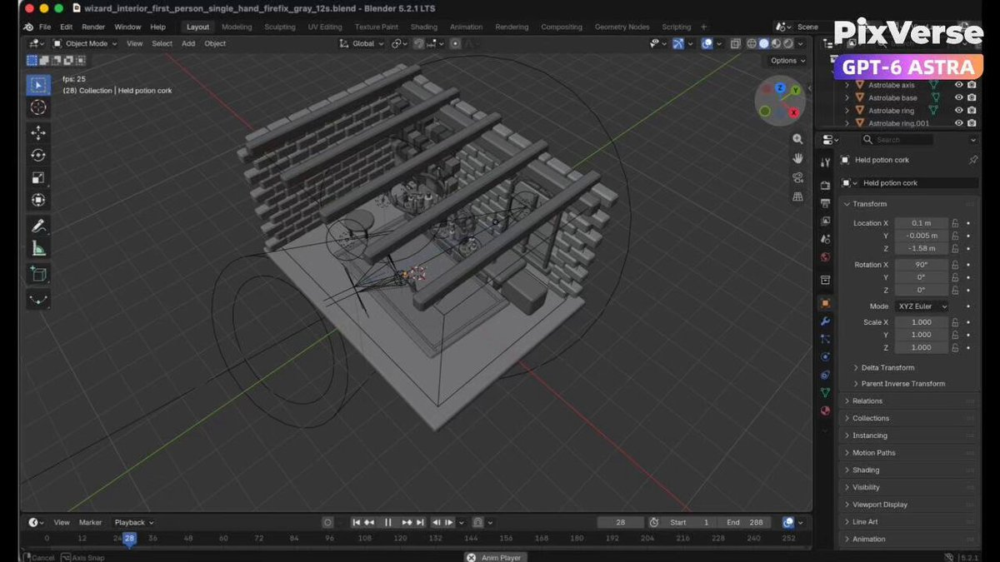

<a name="prompt-2098432693222715716"></a>

### 在 Blender 中制作一段 12 秒的一镜到底巫师工坊动画，并通过 PixVerse Seedance 2.5 进行风格化处理。

作者：[@KICHOCHEZI](https://x.com/KICHOCHEZI) · [查看 X 原帖](https://x.com/KICHOCHEZI/status/2098432693222715716)

电影 / 电影剧照 · 3D 渲染 · 已推流

**概括:** 在 Blender 中制作一段 12 秒的一镜到底巫师工坊动画，并通过 PixVerse Seedance 2.5 进行风格化处理。



**提示词**

```text
根据提供的巫师工坊参考，在 Blender 中制作一段 12 秒的一镜到底白模动画。构建石墙、木架、拱形窗、壁炉、书籍、天文仪器以及摆满药水瓶的炼金台。制作低角度第一人称视角的动画，画面中恰好有一只右手拿着一瓶药水。从药水瓶靠近右下边缘开始，环视工坊并望向窗户，自然地举起药水瓶，停顿仔细端详，然后一边放下药水瓶一边转向壁炉和发光的试剂。导出白模 MP4。然后使用配备 Seedance 2.5 的 PixVerse，参考 Blender 视频的摄像机视角、动作和空间布局，并以提供的图像作为外观参考。保持连续镜头和时间节奏，同时添加风化的石头、雕花木材、磨损的皮革、逼真的玻璃、清冷的窗光、温暖的壁炉光照、发光的魔法液体、自然的火焰、余烬、火花和烟雾。
```
