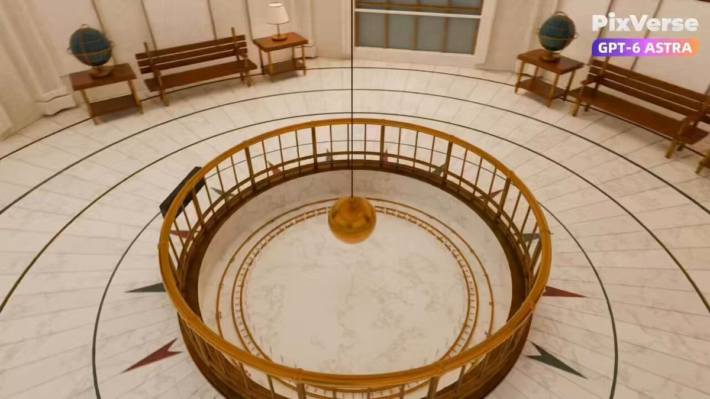

<a name="prompt-2098450393277595841"></a>

### 基于参考图在Blender中重建格里菲斯天文台3D大厅并用PixVerse渲染的三镜头工作流指令。

作者：[@leilamakes](https://x.com/leilamakes) · [查看 X 原帖](https://x.com/leilamakes/status/2098450393277595841)

电影 / 电影剧照 · 3D 渲染 · 已推流

**概括:** 基于参考图在Blender中重建格里菲斯天文台3D大厅并用PixVerse渲染的三镜头工作流指令。



**提示词**

```text
在本地Blender中创建格里菲斯天文台中央圆形大厅的可编辑3D重建，包括傅科摆、穹顶壁画、青铜栏杆、大理石地板、长椅、天球仪、台灯和天文展示设施。创建一个稳定的15秒摄像机序列，包含三个5秒镜头：推进大厅、抬升并围绕中央摆旋转。使用仰视的升高摄像机围绕穹顶和壁画旋转。靠近天球仪并进行平滑的细节环绕运动。使用这些完全相同的摄像机动画渲染灰模视频。在生成最终视频前，仔细检查摄像机运动、构图、空间流线和遮挡关系。在PixVerse中，使用Seedance 2.5。对于每个镜头，上传对应的灰模视频和同一张格里菲斯天文台内部的真实照片。照片控制材质、颜色、壁画和光照。灰模视频控制房间布局、构图、透视和摄像机运动。提示词：使用@参考图像 的视觉风格生成@灰模视频 。严格保留灰模视频的建筑结构、家具位置、物体数量、构图、透视和摄像机运动。仅应用参考图像中的写实材质、穹顶壁画和温暖的室内光照。保持所有物体静止。请勿添加人物、家具、门、窗或展品。请勿更改建筑或摄像机路径。避免剪辑跳切、抖动、形变、闪烁或布局变化。检查每个生成的镜头，仅重新生成有明显问题的镜头。将审核通过的镜头合并为一个15秒的视频，并导出每个镜头的第一帧。交付可编辑的Blender项目、灰模视频、三个生成的镜头、最终视频、提示词以及首帧截图。
```
