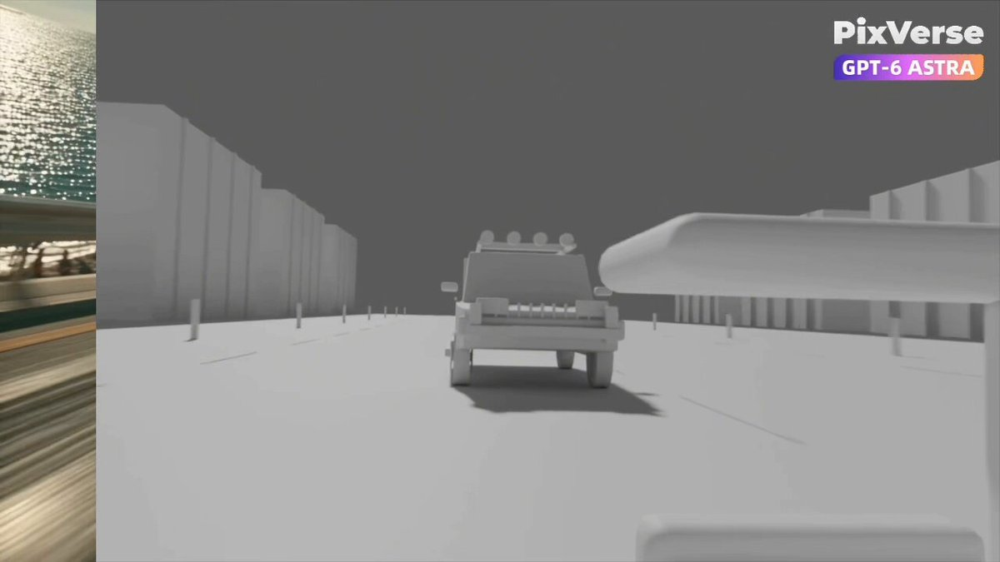

<a name="prompt-2098461817555374451"></a>

### GTA风格追车全流程指令，指导Blender制作灰模与动画并由PixVerse生成最终视频。

作者：[@Aria\_Nawi](https://x.com/Aria_Nawi) · [查看 X 原帖](https://x.com/Aria_Nawi/status/2098461817555374451)

电影 / 电影剧照 · 3D 渲染 · 车辆 · 已推流

**概括:** GTA风格追车全流程指令，指导Blender制作灰模与动画并由PixVerse生成最终视频。



**提示词**

```text
使用以下工作流程创建原创的GTA风格卡通汽车追逐戏：设计：定义一名主要驾驶员、一辆逃逸车辆、一辆追逐车辆以及一个城市环境。保持它们的设计一致。规划三个4秒的镜头：后方跟随追踪追逐镜头、穿过急转弯的侧面追踪镜头，以及广角离开镜头。在Blender中构建：创建干净的灰模以及功能性的角色与载具绑定骨骼。无需贴图或UV展开。动画与测试：为驾驶员、转向、车轮转动、载具和摄像机制作动画。保持连贯的行驶方向和车辆先后顺序。修复穿模、悬空车轮、轮胎滑动、崩坏的姿势以及双手脱离方向盘的问题。在Blender中渲染：以1280×720分辨率、24 fps渲染第1–288帧。将Blender实际渲染的帧组装成一段完整的12秒灰模母带。单独导出每个镜头，并渲染匹配的灰模静态帧作为形状和构图参考。使用PixVerse插件完成收尾：在720p下使用Seedance 2.5，分别处理每个镜头。将Blender剪辑用作运动参考，灰模静态帧用作形状参考。在生成提示词中定义一致的卡通调色板。保留摄像机运动、动作节奏、角色与载具设计以及车辆数量。审查与交付：检查两个完整视频的视觉缺陷和连续性。修复Blender中的问题，仅重新生成失败的Seedance镜头，每个镜头最多重试两次。交付可编辑的.blend文件、原生720p Blender灰模视频、单独标记的720p Seedance版本，以及一份关于遗留局限性的简短评估。
```
