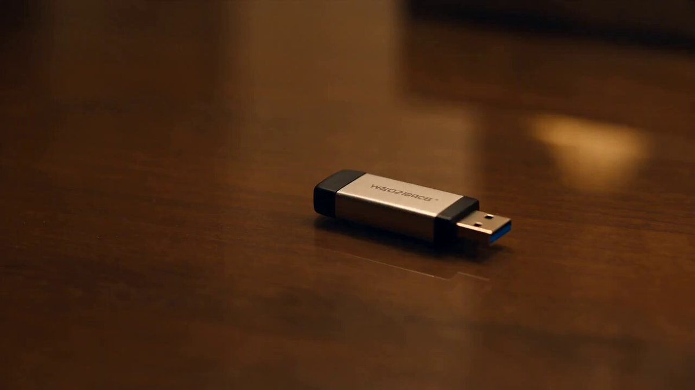

<a name="prompt-2098487159363871212"></a>

### 30秒电影感动作惊悚场景：一名女性从高层酒店房间逃至阳台以躲避入侵者。

作者：[@aaassa120](https://x.com/aaassa120) · [查看 X 原帖](https://x.com/aaassa120/status/2098487159363871212)

电影 / 电影剧照 · 角色 · 已推流

**概括:** 30秒电影感动作惊悚场景：一名女性从高层酒店房间逃至阳台以躲避入侵者。



**提示词**

```text
超逼真电影感30秒动作惊悚片，场景设定在夜间高层现代高档酒店房间内。一名身穿实用深色夹克、长裤和舒适鞋子的成年职业女性，在将一个神秘且看似加密的U盘放入旅行包后，发现自己被人跟踪追捕。

0–5秒：酒店书桌上U盘的紧凑微距特写。她迅速抓起U盘，看了一眼房门，将其放入旅行包并拉上拉链。突然响起的三声敲门声让她瞬间僵在原地。

5–10秒：镜头缓慢以电影感推向酒店房门。随后是一记沉重的敲门声，一个低沉模糊的男声说道：“开门。我们知道你在里面。”她的表情由疑惑转为恐惧。她低语道：“这不可能，”然后警惕地往后退。

10–15秒：门把手慢慢向下转动的极特写。逼真的门闩与锁具机械声。切至她惊恐的面容，她一把抓起旅行包冲向阳台。

15–20秒：她用双手推开阳台玻璃滑门，真实克服了轨道的阻力。凉爽的夜风自然拂动她的头发和夹克。在她身后，酒店房门因猛烈撞击而剧烈晃动。她小心翼翼地迈出到阳台，在高层边缘保持着真实的身体平衡。

20–25秒：酒店房门遭受又一次强力撞击。门锁和门框抗衡片刻后，门终于顺着合页自然向内甩开。门道处出现一个隐约可见的黑影轮廓。突如其来的气流吹乱了散落的纸张，她进一步走向阳台深处。

25–30秒：她走到栏杆旁，俯瞰脚下遥远的城市夜景。她转向相隔一段狭窄间隙的邻近阳台，然后回头看向正在逼近的黑影。她紧紧抓住栏杆，低语道：“快想办法。”极具戏剧性的室外全景镜头展现出酒店外立面、她的阳台以及相邻的阳台。

写实电影质感，逼真的人体演技与生物力学，精准的重力、动量、惯性、摩擦力、平衡感、门体机械结构、玻璃滑门运动、织物动态、物体重量感、自然夜间光影、克制的手持摄影镜头感、逼真景深、自然运动模糊、实景特效美学、同步对白与音效设计、远方城市环境音、脚步声、呼吸声、撞门声、门锁震颤、玻璃门推拉声以及夜风声。

无超级英雄物理学、无不可能的跳跃、无坠落、无瞬间移动、无漂浮物体、无炸裂的门、无无端碎裂的玻璃、无夸张强风、无机械呆板的表演、无解剖结构变形、无面部或服装突变、无重复角色、无不可能实现的机位运镜、无明显CGI感、无血液、无血腥、无文字、无标识、无水印。

在悬念高潮处戛然而止，硬切至全黑画面。。
```
