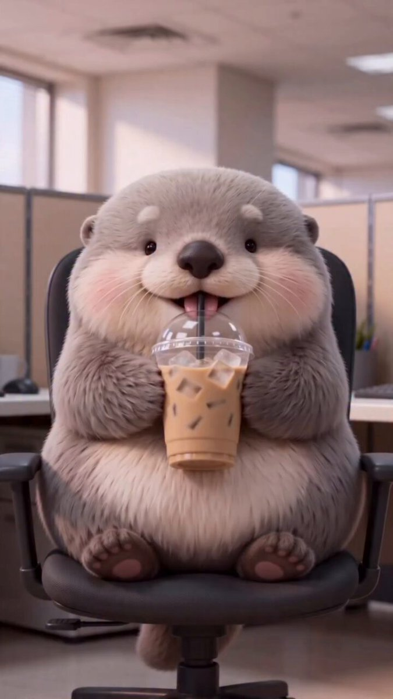

<a name="prompt-2098590744080757223"></a>

### 3D动画场景提示词：描绘一只可爱的毛绒水獭坐在办公室转椅上用吸管喝冰咖啡的温馨画面。

作者：[@Zarnab\_with\_Ai](https://x.com/Zarnab_with_Ai) · [查看 X 原帖](https://x.com/Zarnab_with_Ai/status/2098590744080757223)

3D 渲染 · 角色 · 食品 / 饮料 · 已推流

**概括:** 3D动画场景提示词：描绘一只可爱的毛绒水獭坐在办公室转椅上用吸管喝冰咖啡的温馨画面。



**提示词**

```text
创作一个高质量、超精细的3D动画场景，主角依然是那只可爱的胖乎乎水獭形角色，拥有柔软的灰褐色毛发、乳白色的肚子和口鼻部、小巧圆润的耳朵、富有光泽的黑眼睛、小巧的深色鼻子、红润的面颊、短短的小爪子以及清晰可爱的小肉垫。该角色具有柔软的毛绒玩具质感、圆滚滚的身材比例和纯真开朗的表情。

将该角色置于舒适地坐在当代黑色人体工学办公椅上的状态。角色正手捧并用吸管喝着一杯装在透明塑料杯里的冰咖啡，双爪自然地环抱着杯子。保持角色位于画面正中且突出。

场景设定在明亮的现代办公室内，背景有成排的米灰色小隔间、电脑显示器、大窗户、柔和的日光、光洁的地板以及精致的办公室细节。采用浅景深效果，使角色保持清晰对焦，而背景则柔和虚化。

让画面呈现出高级动画电影剧照的质感：极具细节的柔软毛发、逼真的织物与塑料纹理、富有表现力的光泽眼眸、自然柔和的光影、电影级构图、逼真的阴影、细腻的环境光遮蔽、精致的3D渲染、可爱奇妙的氛围、干净利落的构图、专业级动画品质、高分辨率、竖版9:16构图。

重要提示：全程保持完全一致的角色设计和身材比例，前景不得出现人类，无文字，无标识Logo，无水印，且解剖结构无畸变。
```
