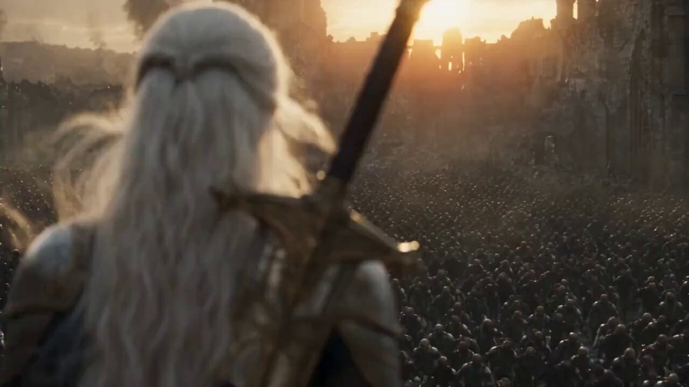

<a name="prompt-2098622086608773436"></a>

### 23秒多镜头史诗级暗黑奇幻战争序列，刻画白发女战士孤身迎战敌军与巨型重甲兵的电影质感战斗过程。

作者：[@Noor\_ul\_ain43](https://x.com/Noor_ul_ain43) · [查看 X 原帖](https://x.com/Noor_ul_ain43/status/2098622086608773436)

电影 / 电影剧照 · 已推流

**概括:** 23秒多镜头史诗级暗黑奇幻战争序列，刻画白发女战士孤身迎战敌军与巨型重甲兵的电影质感战斗过程。



**提示词**

```text
创作一段23秒的极致电影感暗黑奇幻战斗序列，逼真写实，高预算奇幻电影美学，16:9宽画幅。

场景 1 — 0–3秒
镜头从一名神秘的白发女战士背后开始，她独自伫立在辽阔的战场前。她留着一头银白色的长发，在风中自然飘动，身着暗色中世纪皮革与金属护甲，背负一柄长剑。在她面前，遮天蔽日的敌军大军布满战场。远方隐现残破的中世纪塔楼与大教堂般的建筑。夕阳低垂在地平线上，透过浓烟与扬尘投射出强烈的金色逆光。镜头从她背后缓慢向前推进推进，微弱的大气迷雾，真实的随风摆动，极具史诗规模感。

场景 2 — 3–6秒
突然切入激烈的动作场面。女战士迅猛向前发起冲锋投入战斗。动态低角度跟拍镜头记录她在飞溅的火花、硝烟与碎石中穿行。挥剑极速划过，剑刃反射出温暖的日光。呈现逼真的动态模糊、飞散的火星余烬、扬尘颗粒与细致入微的金属反光。镜头在保持电影级构图的同时，极具侵略性地紧随她的动作。

场景 3 — 6–9秒
展现女战士在战场上与一名体型庞大的重甲强敌交锋。她使出势大力沉的劈斩，敌人则报以刚猛沉重的猛烈攻势。兵刃碰撞瞬间火星迸溅。地面泥泞、破碎，铺满瓦砾残砖。周围环绕着燃烧的物体与点点火光。碰撞瞬间采用手持风格的电影摄影机晃动运镜，随后动作略微放慢以烘托戏剧性张力。

场景 4 — 9–12秒
攻势过后，女战士重重落在战场地面上。镜头近距离拍摄她着甲的身躯，尘土与硝烟在她周围翻滚。银发在风中舞动。她手握战刃，缓缓站起身来。在她身后，残破的中世纪城池在巨大的金色落日下显映出轮廓。强烈的体积光、大气透视与极其逼真的环境细节。

场景 5 — 12–15秒
切至女战士面部的强烈特写镜头。她的神情冷酷、专注而坚定。银白色的发丝散落遮挡在面颊两侧。她的目光紧紧锁定正在逼近的敌人。温暖的落日余晖照亮了她的一侧面容，另一侧则隐没在阴影中，极具戏剧感。纤毫毕现的肌肤质感、真实的眼神光、微妙的呼吸感以及自然的微表情。电影级浅景深。

场景 6 — 15–18秒
展现正向她逼近的浩大敌军。成百上千名历经战火摧残的黑暗人形生物在废墟战场上推进。空气中充斥着浓烟、沙尘与火星。摄影机缓慢向后、向上拉远，展现出军队遮天蔽日的浩大规模，以及在他们面前孤身一人的娇小女战士。巨大的废墟高塔在背景中巍然耸立。

场景 7 — 18–21秒
随着周围的战场愈发混乱，女战士静静伫立、纹丝不动。破碎的地面裂开缝隙，散发微光与炽热余烬。硝烟从镜头前掠过。落日废墟城后炽烈燃烧。镜头围绕女战士缓缓进行360度电影环绕运镜，凸显出她的孤寂与强大力量。狂风自然吹拂起她的斗篷、长发与战袍。

场景 8 — 21–23秒
以极广的大全景空镜头作结。女战士孤身伫立在满目疮痍的战场中央，辽阔的废墟城市与燃烧的地平线在她身后无限延伸。尘土与硝烟在金色余晖中缓缓飘散。摄影机逐渐拉至极远，直到角色在宏大浩瀚的环境中化为一个微小的身影。定格在一个极具震撼力的电影静止画面，随后柔和淡出至黑屏。
```
