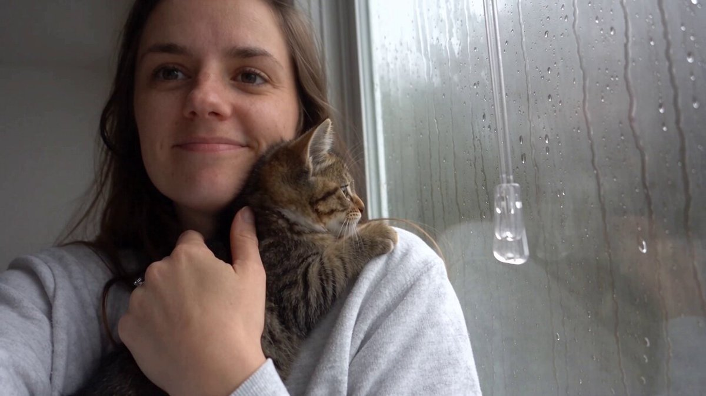

<a name="prompt-2098625551833669826"></a>

### 30秒手持自拍视频提示词，展现一位女子和一只虎斑小猫在雨天窗边玩耍百叶窗拉绳的情景。

作者：[@itxabdullaa](https://x.com/itxabdullaa) · [查看 X 原帖](https://x.com/itxabdullaa/status/2098625551833669826)

人像 / 自拍 · 角色 · 已推流

**概括:** 30秒手持自拍视频提示词，展现一位女子和一只虎斑小猫在雨天窗边玩耍百叶窗拉绳的情景。



**提示词**

```text
参考与主体 使用“@<image1”作为该女性的确切视觉参考。在整个片段中保持她的身份、面容、发型、服装、皮肤纹理、身材比例和自然外貌。恰好一只小虎斑幼猫。同一只小猫在整段视频中始终保持连贯。不得出现其他动物，不得复制小猫。

格式 30秒竖屏 9:16 手持前置摄像头自拍。雨天的室内窗边房间。柔和的灰色自然日光透过玻璃照射进来。非常微弱的窗户倒影和逼真的室内环境音。无调色，无电影感照明，无美颜滤镜。

---

0–5秒 — 温馨的雨天时刻

女子站在窗边，把小猫抱在胸前。雨滴在她身后的玻璃上缓缓滑落。她看着手机，然后轻轻挠了挠小猫的下巴。小猫平静地看向窗外。她微微一笑，随口说道：“Such a cozy day, huh?”手机保持着略带瑕疵且自然的手持感。

---

5–10秒 — 动静吸引

百叶窗的一点微小动静吸引了小猫的注意。它的耳朵突然向前竖起。女子注意到小猫越过她的肩膀注视着什么。她一边稳稳托住小猫，一边微微转向窗户。小猫伸出一只爪子抓向悬挂的百叶窗拉绳。她轻声笑着说：“What are you looking at?”

---

10–15秒 — 攻击百叶窗拉绳

小猫突然用双爪抓住了百叶窗拉绳。女子露出惊讶的神情，轻轻试图把拉绳移开。小猫不肯放手，并把拉绳往自己怀里拉。她笑着，手中的手机微微晃动。她说：“Hey, leave that alone.”小猫继续拍打着拉绳。

---

15–20秒 — 混乱嬉戏

小猫兴奋地在她胸前扭动，试图抓住晃动的拉绳。她用一只手稳稳托住它的身体，另一只手轻轻挡住它的爪子。小猫转过身又抓了一次。她笑得更厉害了，说道：“You're getting way too curious.”几缕松散的发丝自然地散落在她的脸颊旁。

---

20–25秒 — 小猫往上爬

小猫突然朝她的肩膀爬去，目光仍集中在窗户上。它的爪子抓着她上衣的面料。她发出轻微惊讶的叫声，紧接着笑了起来。随着她努力让自己和小猫都保持在画面中，她拿着手机的手微微抬高。镜头短暂失衡，随后自然地重新居中。

---

25–30秒 — 意外自拍

小猫爬到了她的肩膀上，突然从窗户转向手机。它把脸凑近镜头，好奇地嗅着。她一边大笑一边向后仰。小猫朝着摄像头抬起一只爪子。她刚开口：“Oh, now you want—”随后忍不住大笑起来。爪子几乎碰到了镜头。手机自然地下沉。片段在笑声中结束。

音频 穿透窗户的雨声环境音、百叶窗轻微的晃动声、织物摩擦声、小猫活动的动静、一声细小的喵叫、女子自然的声音、呼吸声、嗤笑声和爽朗的笑声。无背景音乐。无字幕。无文字。无徽标。无水印。无剪辑切镜。无缩放。恰好一只小猫。
```
