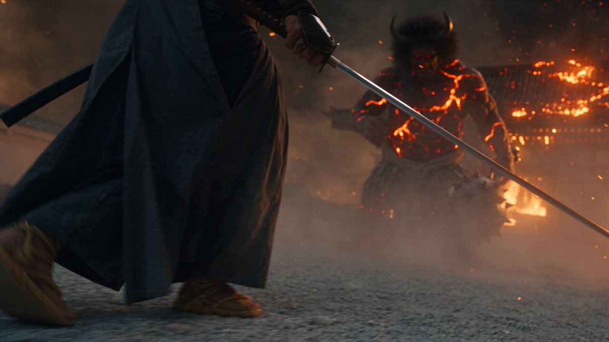

<a name="prompt-2098625650852815257"></a>

### 关于剑客与鬼在燃烧的寺庙庭院中决战的30秒6镜头详细电影感提示词。

作者：[@bmx\_ai13](https://x.com/bmx_ai13) · [查看 X 原帖](https://x.com/bmx_ai13/status/2098625650852815257)

电影 / 电影剧照 · 已推流

**概括:** 关于剑客与鬼在燃烧的寺庙庭院中决战的30秒6镜头详细电影感提示词。



**提示词**

```text
6个镜头，总计30秒：0.0-5.0秒、5.0-10.0秒、10.0-15.0秒、15.0-20.0秒、20.0-25.0秒、25.0-30.0秒。硬切，无叠化。全程正常速度，无慢动作，无变速。

拍摄节奏关键要求：原生24fps，真正的180度快门，每帧真实的1/48秒曝光。流畅、连续的动态模糊。绝不卡顿，绝无抖动感。无插帧，无重影，无数字视频质感。

画面无文字关键要求：画面任何地方都绝无任何形式的文字。无说明文字、字幕、标题、演职员名单、水印、标志、时间码、UI覆层。

画面无其他人员关键要求：无僧侣、村民或群演。自始至终仅有剑客、鬼和一只乌鸦可见。

火焰关键要求：燃烧的寺庙余烬在每一帧中飘散并闪耀，偶尔剧烈闪烁并以频闪光照亮某个节拍。任何被照亮时刻的阶梯式质感完全来自余烬的闪烁，绝非来自掉帧——摄像机的运动自始至终保持平滑。落灰从屏幕左侧向右侧呈对角线倾泻。

主体锁定 剑客：精瘦饱经风霜的身材，利落紧贴头皮的夹杂白发，刚毅的下颚，满是烟灰的皮肤，面容干净，无纹身。炭灰色袴和一件烧焦的靛蓝色羽织，一个单侧钢制肩甲，草鞋。双手握持一把有弧度的日本刀。穿过燃烧的寺庙庭院向鬼逼近，每一次挥砍姿态均保持低沉且受控。

主体锁定 鬼：高耸的角魔，无可见毛孔的龟裂黑曜石红皮肤，沿断层线散发熔融橙光，长獠牙的下颚，蓬乱的黑色鬃毛。携带着一根布满尖刺的沉重铁金棒。以沉重震地的步伐前进，绝不奔跑。

世界环境：夜间燃烧的寺庙庭院——破碎的石制鸟居，坍塌并掉落瓦片的宝塔屋顶，散落着破碎灯笼的宽阔碎石院落，寺庙围墙外远方燃烧的屋顶。没有其他完整的建筑。

氛围关键要求，仅限纵深：高浓度的浓重烟霭——近处的剑客清晰锐利，中距离的鬼柔和弱化，远处的燃烧屋顶几乎被隐没。仅限浓稠的烟雾空气感，绝非烟雾机的效果。

镜头 1 0.0-5.0秒。推进。碎石地面的低机位，倾斜15°，向前跟拍剑客。剑客在飘荡的余烬中迈步前行，举起日本刀，鬼在前方逼近。剑客在屏幕左侧推进，鬼在屏幕右侧占据整个庭院。画内音。

镜头 2 5.0-10.0秒。交锋。摄像机在胸口高度紧贴环绕，倾斜在15-35°之间摇摆，绝不正位。日本刀撞击在铁金棒上火花四溅，剑客被震退一步。两人居中，碎石飞溅。画内音。

镜头 3 10.0-15.0秒。预兆。切至一只乌鸦随着瓦片雨倾泻而从坍塌的宝塔屋顶猛然惊飞。它急转避开下落的碎片。乌鸦居中，背景是燃烧的屋顶轮廓。画内音。

镜头 4 15.0-20.0秒。坍塌。庭院中的低位固定摄像机，随着宝塔屋顶坍塌快速向上摇摄。屋顶的一部分被撕裂砸落进庭院；剑客在碎石和灰烬中翻滚脱身。屋顶横梁斜跨画面，剑客在底端中心出现。画内音。

镜头 5 20.0-25.0秒。冲刺。摄像机降至地面高度，如火箭般向前穿过一条在火光闪烁中被照亮的飘散余烬通道。剑客低身疾冲，日本刀拖曳出火花，向鬼的侧翼逼近。剑客在屏幕左侧向右冲杀。画内音。

镜头 6 25.0-30.0秒。余波。摄像机拉回至庭院的静态全景画幅，余烬沉降，风渐止息。剑客独自伫立，日本刀垂下，胸口起伏，与此同时鬼身上发光的断层线黯淡归于黑暗，并倾倒出画面。剑客小巧居中，身后是暗黑燃烧的宝塔。画内音。

跨镜头规则：剑客的羽织、肩甲和草鞋绝不改变。鬼的断层线光芒在镜头6之前绝不完全消退。唯有剑客、鬼和乌鸦始终可见。落灰方向保持恒定。宝塔在出现的任何地方都保持相同的剪影。余烬强光闪烁仅在镜头1、2和5中出现。任何时候都不引入配乐。

最后一帧：剑客独自站在庭院中，日本刀垂下，余烬在他周围飘落，鬼倒下的黑暗身影位于画面边缘，宝塔破碎的剪影在身后低低燃烧。无屏幕文字，无标志，无水印。

声音背景：仅限画内音——噼啪作响的烈火、掉落的瓦片、日本刀撞击铁器的脆响、鬼低沉的喉音咆哮、脚下碎石的嘎吱声、乌鸦尖锐的鸣叫。无配乐，无字幕。

摄像机与拍摄真实感：约32mm/68°视场角，复古2倍变形镜头呈现椭圆散景及火光产生的条纹光斑，浅景深，彩色负片质感，细腻胶片颗粒。剧烈手持运镜——倾斜在15-45°之间摇摆，快速推进与猛烈回拉，每一帧都处于运动中但在其自身的行进中保持平滑，绝不锁定，绝无云台滑轨感。无CGI质感，无AI平滑感，无视频游戏HUD，无动态平滑补偿。
```
